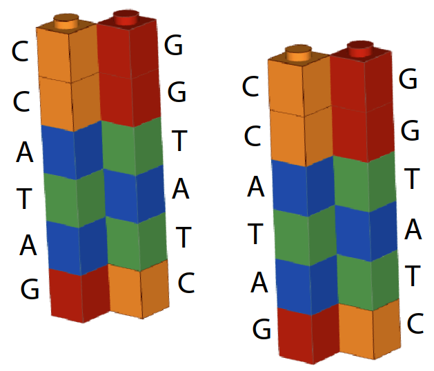

# DNA 与字符串

2025-04-10 ⭐
@author Jiawei Mao
***

## 测序技术的演变


测序成本持续降低：


## DNA


https://en.wikipedia.org/wiki/DNA

### DNA 复制

下面用另一种形式表示 DNA（将碱基看作乐高）：


在 DNA 复制开始，DNA 双链分为两部分，两条链互补：


两条链作为模板，在 DNA 聚合酶的作用下，合成新的互补链：


最后得到两条 DNA 双链：




### 第二代测序

第二代测序，又称为 Sequencing by synthesis。采用 DNA 复制机制进行测序，基本步骤：

- 从样本提取 DNA，并将双链打开
- 将 DNA 切成许多小碎片
- 将碎片固定到 slide 上


Slide 图示：


- 添加 DNA 聚合酶和碱基（A,T,C,G）


- Terminator

添加的碱基带有 terminator，DNA 聚合酶添加一个碱基之后，就无法继续合成：


- snap

快照：添加的碱基带有荧光基团，根据荧光颜色记录芯片上不同位置的碱基类型


- remove terminators

移除 terminator，DNA 聚合酶就可以继续添加碱基。


- 重复

按以上步骤重复进行，得到许多快照:


- 识别序列

根据荧光颜色与碱基的对应关系，以及碱基互补配对原则，就可以获得模板的序列：


### Base calling and sequencing errors

第二代测序在添加碱基和 DNA 聚合酶之前，要先对 DNA 片段进行扩增，否则光信号太弱，无法检测。扩增的序列在原序列的周围：


- 测序过程中，某个碱基意外没有终止

DNA 聚合酶又添加了另一个碱基：


此时快照会看到两种颜色：


随着循环的进行，会得到越来越多出错的情况：


根据图片识别碱基有专门的软件，称为 basecaller，basecaller 需要识别上面的情况。

basecaller 会输出一个打分值，表示碱基错误的概率：

- Q, base quality
- p, probability that base call is incorrect

$$
Q=-10\cdot\log_{10}p
$$

- Q=10，碱基有 1/10 概率是错的
- Q=20，碱基有 1/100 概率是错的
- Q=30，碱基有 1/1000 概率是错的

那么，basecaller 如何计算 `q` 值？如下图所示：


大部分颜色为 orange，对应 C，我们认为 `C` 是正确碱基。那么：
$$
p=\frac{\text{non-orange light}}{\text{total light}}=\frac{3\text{ green}}{9}=1/3
$$

$$
Q=-10\log_{10}1/3=4.77
$$

basecaller 的算法可能更复杂，不过基本原理大致如此。

## FASTQ

FASTQ 格式如下：


base-quality 与 sequence 一一对应，是 ASCII 编码的 $Q=-\log_{10}p$ 值。

```
AGCTCTGGTGACCCATGGGCAGCTGCTAGGGA 
|||||||||||||||||||||||||||||||| 
HHHHHHHHHHHHHHHGCGC5FEFFFGHHHHHH
```

ASCII 编码如下，其中包含字符到整数的映射关系，例如 H 表示 48：


但是，base quality 不一定是整数，所以需要进行处理。通常采用 Phred+33 方式进行转换：

```python
def QtoPhred33(Q): 
  """ Turn Q into Phred+33 ASCII-encoded quality """ 
  return chr(int(round(Q)) + 33)

def phred33ToQ(qual): 
  """ Turn Phred+33 ASCII-encoded quality into Q """ 
  return ord(qual)-33
```

## Reads

DNA 测序，获得许多短的 DNA 片段序列，称为 Read：

- Read 通常原小于 Genome 的长度


直接从 reads 无法得到有用的信息，所以需要将它们连起来，组成完成的基因组。那么，如何从测序得到的 reads 推测 genome 序列：


两个无关联人的基因组相似度在 99.8-99.9% 之间，即 1000 个碱基对，只有 1 到 2 个有差别。因此，虽然我和你的基因组不同，你依然能以我的或其他人的基因组为模板，对你基因组的测序结果进行组装。

**read alignment 问题**: 给定测序得到的 read，以及参考基因组，找到 read 在参考基因组中最佳匹配位置。

如果没有参考基因组，就只能根据 reads 之间的 overlap 进行拼接，此时就不是 read alignment 问题，而是**组装（assembly）问题**，组装比 read alignment 要难许多。

## Alignment

read 与 reference 的 alignment：

- 第二代测序，会输出 billions read
- reference 通常在 million 水平

执行 billions 次数的匹配操作，需要专门的算法以提高效率。

Read 与 reference 匹配差的原因：

1. 测序错误
2. 参考基因组与 read 来源样本相差较大
3. DNA 为双链，应该考虑正反匹配两种情形

## 参考

- https://www.youtube.com/playlist?list=PL2mpR0RYFQsBiCWVJSvVAO3OJ2t7DzoHA
- https://commons.wikimedia.org/wiki/File:ASCII-Table-wide.svg