# 字符串匹配

## String

字符串为有限字符序列。字符从字母表（alphabet）$\sum$ 抽取，对 DNA 序列：
$$
\sum=\{A,C,G,T\}
$$

- 子字符串

`S` 的子字符串（substring）指 `S` 内部的字符串：

```python
>>> s = 'AACCGGTT' 
>>> s[2:6] 
'CCGG' # substring of seq
```

如果存在字符串 `u` 和 `v`，满足 $T=uSv$，那么 $S$ 就是 $T$ 的子字符串（`u` 或 `v` 可以为空）。

- 前缀

`S` 的前缀（prefix）是从 $S$ 开头开始的子字符串。

```python
>>> s = 'AACCGGTT' 
>>> s[0:6] 
'AACCGG' # prefix 
>>> s[:6] # same as above 
'AACCGG'
```

- 后缀

`S` 的后缀（suffix）是到 `S` 末尾的子字符串。

```python
>>> s = 'AACCGGTT' 
>>> s[4:8] 
'GGTT' # suffix 
>>> s[4:] # like s[4:len(s)] 
'GGTT'  
>>> s[-4:] # like s[len(s)-4:len(s)] 
'GGTT'
```

## naïve 算法

查找 pattern $P$ 在文本 $T$ 中出现的位置。每个出现的位置称为一个匹配（match）。

令，$n=|P|$, $m=|T|$, $n\le m$。

尝试所有位置，检查是否匹配，称为 **naïve 算法**。

naïve 算法很简单，Python 实现如下：

- p, Pattern
- t, text

```python
def naive(p, t): 
    occurrences = [] 
    for i in range(len(t) - len(p) + 1):  # loop over alignments 
        match = True 
        for j in range(len(p)):           # loop over characters 
            if t[i+j] != p[j]:            # compare characters 
                match = False             # mismatch; reject alignment 
                break 
        if match: 
          occurrences.append(i)           # all chars matched; record 
    return occurrences
```

`naive` 可以直接采用 java 自带的 `String.indexOf` 实现。

- 可能的匹配个数

$$
m-n+1
$$

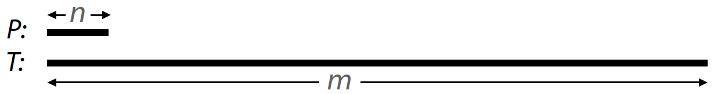

- 字符匹配最大可能次数：若次都正确匹配，对应长度 $n$，则匹配次数最多

$$
n(m-n+1)
$$

- 字符匹配最小可能次数：第一次就失败

$$
(m-n+1)
$$


## 预处理

**定义**：对 $i>1$, $Z_i>0$ 的任意位置，$\text{z-box}_i$ 定义为从 $i$ 开始到 $i+Z_i-1$ 的区间（以位置计算，两边均 inclusive）。

**定义**：对任意 $i>1$，$r_i$ 指起点位置不超过 $i$ 的所有 z-boxes 的最右侧位置。换言之，对所有 $Z_j>0$ 的 $1<j\le i$，$r_i$ 是 $j+Z_j-1$ 的最大值。

使用 $l_i$ 表示上述定义中的 $j$。即 $\text{z-box}_i$ 的左侧位置为 $l_i$，右侧位置为 $r_i$。当有多个 z-box 结尾位置在 $r_i$，则取任意 z-box 的 $l_i$ 。例如，假设 $S = aabaabcaxaabaabcy$，那么：

- $Z_{10}=7$，(aabaabcy...aabaabca)
- $r_{15}=16$，对应 $Z_{10}$ 终点
- $l_{15}=10$，即 $Z_{10}$ 起点

在线性时间内计算 $Z$ 值是所有预处理 $P$ 的经典线性时间匹配算法的基本任务。

下面介绍如何在线性时间内计算所有 $Z_i$ 值。如果直接根据上述定义计算所有 $Z_i$，时间复杂度为 $O(|S|^2)$，而 Z 算法能在 $O(|S|)$ 时间内完成。

预处理算法计算 $i\ge 2$ 的所有 $Z_i$, $r_i$ 和 $l_i$。算法会记录所有 $Z$ 值，但是在迭代 $i$ 时，该算法只需要 $r_j$ 和 $l_j$，$j=i-1$，不需要更靠前的 $r_j$ 和 $l_j$。因此该算法只需要一个变量 $r$ 表示最新计算的 $r_j$ 值，同样也只需要一个 $l$。因此，每次迭代 $i$，如果算法发现从 $i$ 开始的 一个新的 z-box，变量 $r$ 会更新到该 z-box 最右侧，即目前为止发现的所有 z-box 的最右侧位置。

算法从计算 $Z_2$ 开始：从左向右对比 $S[2..|S|]$ 与 $S[1..|S|]$，直到 mismatch，$Z_2$ 是匹配字符串的长度：

- 如果 $Z_2>0$，则 $r=r_2=Z_2+1$, $l=l_2=2$
- 否则 $r=0$, $l=0$

这一步初始化变量 $r$ 和 $l$。

假设已经计算 $Z_{k-1}$，其中 $k-1>1$，且已知 $r_{k-1}$ 和 $l_{k-1}$，下一步是计算 $Z_k$, $r=r_k$ 和 $l=l_k$。

算法的核心思想利用已经计算的 $Z_{k-1}$ 来加速 $Z_k$ 的计算。在某些情况，不需要任何字符比较就可以从 $Z_{k-1}$ 推导出 $Z_k$。例如，假设 $k=121$，已经计算 $Z_2$ 到 $Z_{120}$，且 $r_{120}=130$, $l_{120}=100$。这表示从 100 开始长度为 31 的子串与 $S$ 前缀匹配，即 ($S_{100-130}=S_{1-31}$)。那么，$S_{121-130}=S_{22-31}$，因此，$Z_{22}$ 对计算 $Z_{121}$ 肯定有帮助，如果 $Z_{22}=3$，$Z_{121}$ 必然也是 3。Z algorithm 对这类情况进行了论证。

### Z algorithm

对 $1<i\le k-1$，给定 $Z_i$ 以及当前 $r$ 和 $l$ 值，$Z_k$ 以及 $r$，$l$ 的更新值按如下方式计算：

1. 如果 $k>r$，则从 $k$ 开始与 $S$ 前缀比较，直到 mismatch。匹配的长度为 $Z_k$。如果 $Z_k>0$，则将 $r$ 设置为 $k+Z_k-1$，将 $l$ 设置为 $k$
2. 如果 $k\le r$，表明已有 z-box 包含 $S(k)$，记为 $S[l..r]$ (称为 $\alpha$)，$\alpha$ 与 $S$ 的一个前缀匹配。显然，字符 $S(k)$ 还出现在 $k'=k-l+1$。同理，子串 $S[k..r]$ (称为 β) 与子串 $S[k'..Z_l]$ 匹配。由此可见，从位置 $k$ 开始的子串。如下图所示

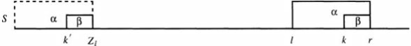

此时可以分两种情况讨论：

- 如果 $Z_{k'}<|β|$，则 $Z_k=Z_{k'}$，$r$ 和 $l$ 保持不变，如下图：

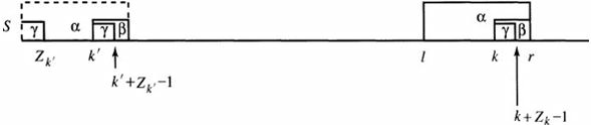

- 如果 $Z_{k'}\ge|β|$，那么整个 $S[k..r]$ 子串都是 $S$ 的前缀，并且 $Z_k\ge|β|=r-k+1$。但是 $Z_k$ 可能大于 $|β|$，因此需要继续比较 $r+1$ 与 $|β|+1$ 字符直到 mismatch。假设 mismatch 发生在 $q\ge r+1$ 位置。那么将 $Z_k$ 设置为 $q-k$，$r$ 设置为 $q-1$，$l$ 设置为 $k$，如下图所示：

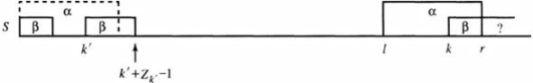

**定理**：使用 Z 算法，可以正确计算 $Z_k$ 并且变量 $r$ 和 $l$ 可以正确更新。

## Boyer-Moore

Boyer-Moore 与 Naive-exact-matching 类似，但是会跳过不必要的匹配，从而提高速度。

Boyer-Moore 算法被认为是最有效的自然语言字符串匹配算法。其性能至少是其它算法的两倍。

例如：

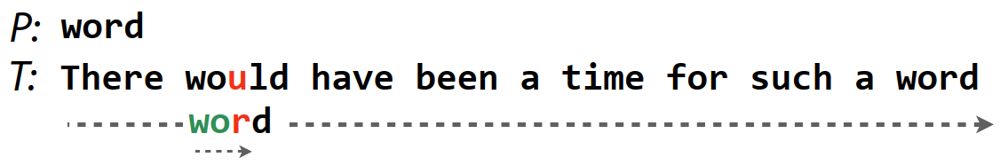

由于 $P$ 中没有 $u$，因此可以跳过接下来的两个匹配。

Boyer-Moore 匹配规则：

1. Bad character rule：当字符不匹配，可以跳过多少字符
2. Good suffix rule：使用匹配的字符来确定可以跳过多少字符，当 bad character rule 跳过字符太少时应用
3. 从左向右匹配，但是从右向左进行字符比较

*good suffix rule* 比较难理解，有些简化算法直接将其简化为向后移动一位字符。


### Bad character rule

对 mismatch，向后移动 $P$ 直到：

a. mismatch 变为 match，对 Step1，T 与 C 不匹配，需要将 $P$ 向后移动 3 位，才能匹配到 `C`

b. G 与 A 不匹配，但是 $P$ 没有 A，所以移动 $P$，直到跳过 A

c. 如果完整匹配，则不跳过字符

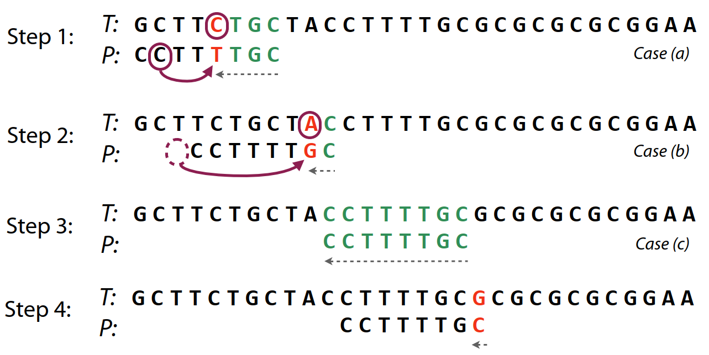

**定义**：对 alphabet 的每个字符 $x$，令 $R(x)$ 为字符 $x$ 在 $P$ 中最右边出现的位置。如果 $P$ 不包含 $x$，则 $R(x)$ 定义为 0.

按如下方式使用 $R$ 值：对 $P$ 和 $T$ 的特定 alignment，$P$ 最右边的 $n-i$ 个字符与 $T$ 中对应字符匹配，但左侧下一个字符 $P(i)$ 不匹配，假设对应 T 的第 $k$ 个字符。bad-character-rule 规定，$P$ 应向右移动 $max(1,i-R(T(k)))$ 位。即，如果字符 $T(k)$ 在 $P$ 出现的左右侧位置 $j<i$（包括 $j=0$ 的情形），则移动 $P$ 使得字符 $j$ 位于 $T$ 中字符 $k$ 的下方。否则，移动 $P$ 一位。

对 $P$ 进行预处理，可以加快 bad-character 的处理。预处理针对 $P$ 中每个位置 $i$ 以及字母表中的每个字符 $x$，找出 $x$ 在 $P$ 中距离 $i$ 左侧最近出现的位置。最简单的方法是使用一个大小为 $n\times |\sum|$ 的二维数组来保存该信息。当 $P$ 中位置 $i$ 出现 mismatch，且 $T$ 中不匹配的字符为 $x$，在数组中查询 $(i,x)$ 项。假设 $P=TCGC$，对 **bad character** 规则：

- 横向为 pattern $P$
- 纵向为字母表 $\sum$

|      | T    | C    | G    | C    |
| ---- | ---- | ---- | ---- | ---- |
| A    | 0    | 1    | 2    | 3    |
| C    | 0    | -    | 0    | -    |
| G    | 0    | 1    | -    | 0    |
| T    | -    | 0    | 1    | 2    |

例如，$P$ 的 G 与 文本 T 不匹配，查表值为 1，所以可以跳过 1 位，即后移 2 位：

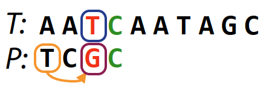

查找步骤很快，但是数组可能很大，构建时间也长。下面提供了一个更好的折中方案。

**预处理**：从右向左扫描 $P$，收集字母表中每个字符 $x$ 的位置。因为是从右向左扫描，因此每个 list 按降序排列。例如，如果 $P=abacbabc$，那么字符 $a$ 的 list 为 [6,3,1]。这些 lists 在 $O(n)$ 时间就可以收集完成。只占用 $O(n)$ 空间。在 Boyer-Moore 算法的搜索阶段，如果 $P$ 中位置 $i$ mismatch，且 $T$ 中不匹配字符为 $x$，则从尾部开始扫描 $x$ list，直到第一个小于 $i$ 的数字，或者不存在该数组：

- 如果不存在，则表示在 $i$ 之前没有 $x$，因此移动 $P$ 到 $x$ 后面
- 否则，找出 $x$ 的期望位置

当 $P$ 的位置 $i$ 不匹配，扫描 list 的时间最多为 $n-i$，大致等于匹配的字符数。因此，在最坏情况，这种方法会使 Boyer-Moore 算法的运行时间增加一倍。然而，在大多数问题中，增加的时间远少于两倍。在必要的情况下，还可以对 list 进行 binary-search。

**定义**：给定字符串 $S$ 和位置 $i>1$，$Z_i(S)$ 是从 $i$ 开始与 $S$ 前缀匹配的 $S$ 的最长子字符串，下面用 $Z_i$ 表示 $Z_i(S)$。

例如，当 $S=aabcaabxaaz$：

- $Z_5$=3 (aabx...aabc)
- $Z_6=1$ (ab...aa)
- $Z_7=0$ (bx..aa)
- $Z_8=0$ (xa..aa)
- $Z_9=2$ (aaz..aab)

如下图所示：

- 每个 solid-box 代表一个与 $S$ 前缀匹配的 $S$ 的子字符串，称为 z-box
- 用 $r_i$ 表示所有 z-box 最右侧的位置
- 用 $\alpha$ 表示以 $r_i$ 结尾的 z-box 的子字符串
- 用 $l_i$ 表示 $\alpha$ 左侧位置
- 虚线框是与 $\alpha$ 匹配的前缀

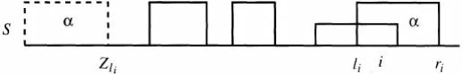

### Good suffix rule

bad-character-rule 在实践中非常有效，尤其是对英文文本，但是对 alphabet 削的文本效果较差。因此又引入了 good-suffix-rule。

good-suffix-rule 如下：对 $P$ 和 $T$ 的 alignment，$T$ 的子串 $t$ 与 $P$ 的一个后缀匹配，但在左侧下一个字符 mismatch：

- 假设 $t'$ 为 $P$ 中与 $t$ 相同最靠近 $t$ 的子串，$t'$ 不是 $P$ 的后缀，并且 $t'$ 左侧字符与 $t$ 左侧字符不同。移动 $P$，使得 $P$ 的子串 $t'$ 位于 $T$ 的子串 $t$ 下面，如下图

- 如果 $t'$ 不存在，移动 $P$ 的左侧使其超过 $T$ 中 $t$ 的左侧，使得 $P$ 的一个前缀与 $T$ 中 $t$ 的一个后缀匹配
  - 如果没有 $P$ 的前缀与 $T$ 中 $t$ 的后缀匹配的情况，则将 $P$ 向右移动 n 位
- 如果发现 $P$ 的匹配，则向右移动 $P$，移动后 $P$ 的前缀与 $T$ 中与 $P$ 对应的后缀匹配。
  - 如果没有这种匹配，则将 $P$ 向后移动 n 位

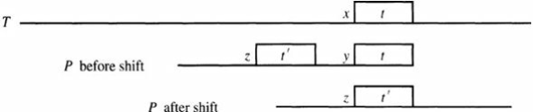

a. $P$ 和 $t$ 之间没有匹配

b. 或者 $P$ 超过了 $t$

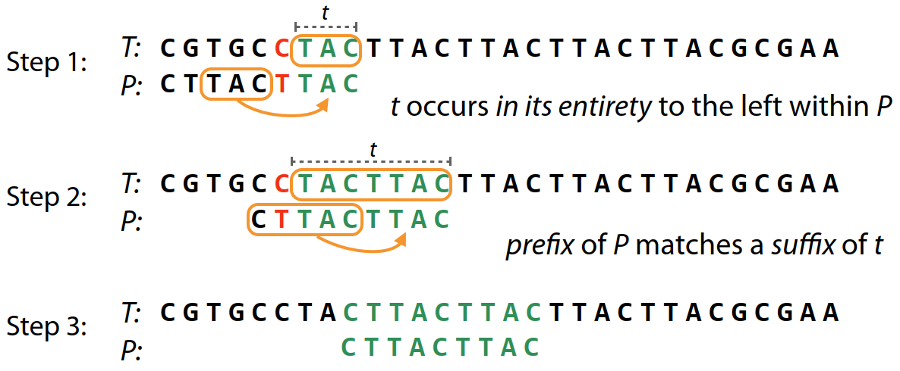

同时应用 bad character 和 good suffix 规则：

1. 没有匹配，应用 bad character 规则
2. 匹配 3 个字符，采用 bad character 规则可以后移动 1 位，即跳过 0 位；采用 good suffix 规则可以后移 3 位，即跳过 2 位
3. 匹配 6 个字符，采用 bad character 规则可以后移 3 位，即跳过 2 位；采用 good suffix 规则可以后移 8 位，即跳过 7 位

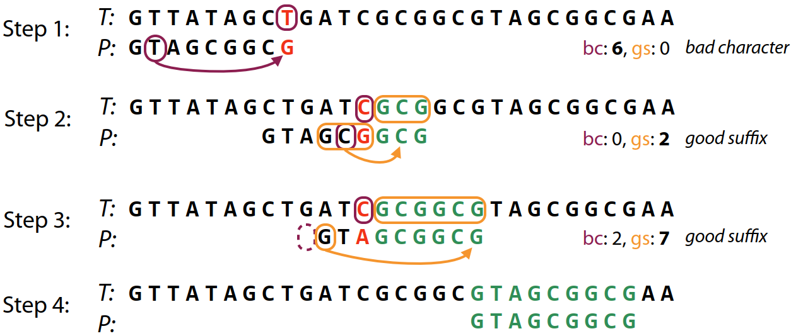

good-suffix-rule 预处理

**定义**：

- 对每个 $i$，$L(i)$ 是使得 $P[i..n]$ 与 $P[1..L(i)]$ 后缀匹配的最大位置。如果没有位置满足该条件，$L(i)$ 为 0。
- 对每个 $i$，$L'(i)$ 是使得 $P[i..n]$ 与 $P[1..L'(i)]$ 后缀匹配的最大位置，且字符 $P(i-1)$ 与后缀的前一个字符不等，如果没有 $i$ 满足该条件，$L'(i)$ 定义为 0.

简而言之，就是找到 $P$ 内部与 $P$ 后缀匹配的所有子串中，最右边的那个。

例如，如果 $P=cabdabdab$，那么：

- $L(8)=6$: $P[8..n]=ab$, 最后一个 $ab$ 出现在 5，末尾位置为 6
- $L'(8)=3$：$P[8..n]=ab$，最后一个 $ab$ 出现在 5，但其前一个字符与后缀的前一个字符都是 $d$，所以跳过，取第一个 ab，其末尾位置为 3

$L(i)$ 给出与 $P[i..n]$ 匹配的最右侧子串位置，而 $L'(i)$ 加强了 $L(i)$ 条件，还要求前一个字符不相等。因为，在加强版 Boyer-Moore 算法中，如果 $P$ 中字符 $i-1$ mismatch，同时 $L'(i)>0$，那么 $P$ 右移 $n-L'(i)$ 个位置。如果移动之前 $P$ 的右侧与 $T$ 的位置 k 对齐，那么移动之后 $L'(i)$ 与位置 $k$ 对齐。

在预处理阶段，将针对 $P$ 的每个位置 $i$ 计算 $L'(i)$。根据以下定义，该过程可以在 $O(n)$  时间内完成。

**定义**：对字符串 $P$，$N_j(P)$ 是 $P[1...j]$ 的后缀与 $P$ 后缀匹配的最长长度。

例如，如果 $P=cabdabdab$：

- $N_3(P)=2$ ，$P[1..3]=cab$，其后缀与 $P$ 的最长公共后缀为 2 (cab..dab)
- $N_6(P)=5$，$P[1..6]=cabdab$，(cabdab..dabdab)

在 Z 算法中，$Z_i(S)$ 是 $S$ 中从 $i$ 开始与 $S$ 前缀匹配的最长子串的长度。显然，$N$ 与 $Z$ 相反，即，如果 $P^r$ 表示与 $P$ 相反的序列，那么 $N_j(P)=Z_{n-j+1}(P^r)$。因此，通过 $P^r$ 上的 Z 算法可以在 $O(n)$ 时间内得到 $N_j(P)$。

### 基于 Z 算法的 Boyer-Moore

```
for i=1-n do L'(i)=0;
for j=1-(n-1) do
	begin
	i = n-N_j(P)+1;
	L'(i)=j;
	end;
```

其中 $L(i)$ 可以通过如下代码获得：

```
L(2) = L'(2)
for i=3 to n do L(i)=max(L(i-1, L'(i)));
```


## 参考

- https://en.wikipedia.org/wiki/Boyer%E2%80%93Moore_string-search_algorithm
- Boyer, RS and Moore, JS. "A fast string searching algorithm." Communications of the ACM 20.10 (1977): 762-772.
- https://www.cs.emory.edu/~cheung/Courses/253/Syllabus/Text/Matching-Boyer-Moore1.html#:~:text=The%20Boyer%2DMoore%20algorithm%20is,as%20the%20other%20algorithms%20tested.
- 《Algorithms on Strings, Trees and Sequences: Computer Science and Computational Biology》,Dan Gusfield


