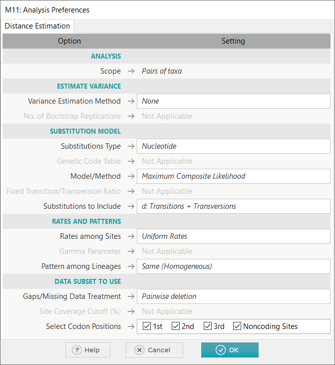

# 进化距离

2022-04-08, 14:32
****

## 使用 Pairwise Distance 计算进化距离

MEGA 可以通过计算每对序列之间的核苷酸差异的比例来估计序列之间的进化距离。例如：

- 打开 `Drosophila_Adh.meg` 文件
- 选择 `Distance | Compute Pairwise Distance`

- 在窗口中，将 `Substitutions Type` 设置为 `Nucleotide`
- 将 `Model/Method` 设置为 `p-distance`
- 点击 `OK` 开始计算，计算结果如下

## 使用其它 Models/Methods 计算和比较距离

MEGA 支持许多计算进化距离的模型。下面比较不同模型计算的进化距离。

- 和上面相同的操作，但是将 `Model/Method` 设置为 `Jukes/Cantor model`；
- 再次重复上面操作，模型设置为 `Tamura-Nei model`
- 然后就可以查看不同模型计算结果的差异。

## 计算氨基酸差异的比例

也可以根据氨基酸比例的差异计算进化距离。

> MEGA 会使用选择的密码子表将核苷酸序列转换为氨基酸序列。密码子表可以在 `Data | Select Genetic Code Table` 编辑。

示例：

- 主窗口 `Distance | Compute Pairwise Distances`
- `Substitutions Type` 设置为 `Amino Acid`
- `Model/Method` 设置为 `p-distance`
