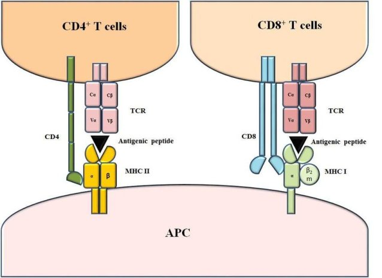
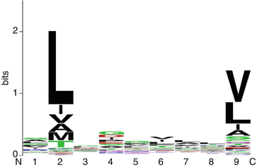
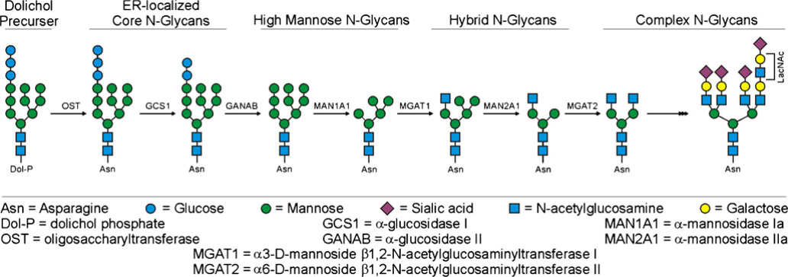

# 表位预测

- [表位预测](#表位预测)
  - [MHC-I](#mhc-i)
  - [定义](#定义)
  - [概述](#概述)
  - [MHC-I 结合肽段预测](#mhc-i-结合肽段预测)
  - [MHC-II 结合肽段预测](#mhc-ii-结合肽段预测)
  - [MHC 结合肽段预测的难点](#mhc-结合肽段预测的难点)
  - [MHC-糖基化](#mhc-糖基化)
  - [糖基化对T细胞表位长度和结构的影响](#糖基化对t细胞表位长度和结构的影响)
  - [参考](#参考)

2021-06-16, 10:48
@author Jiawei Mao
***

## MHC-I

- [MHCflurry](mhcflurry.md)

## 定义

主要组织相容性复合体（major histocompatibility complex, MHC）结合物是指与MHC分子结合的短的线性肽段。MHC 分子是一种膜蛋白，其胞外结构域形成一个沟槽可以和肽段结合。T 细胞将细胞表面和 MHC 分子结合的肽段识别为非自身抗原。MHC 主要有两种：

1. MHC-I 分子，结合由蛋白酶体中泛素化的胞质蛋白质降解而来的胞内短肽，并将其呈递到细胞表面供带有 CD8 受体的 T 细胞识别；
2. MHC-II 分子，结合细胞外肽段，并将其呈递到细胞表面，供带有 CD4 受体的T细胞识别。

MHC-I 和 MHC-II 结合肽段主要差别在肽段长度。MHC-I 结合肽段一般在 8-11 个氨基酸，而 MHC-II 结合肽段长度通常在 11-30 个氨基酸。从 MHC 分子的结合沟槽可以看出这一点，MHC-I 分子的沟槽在末端是封闭的，而 MHC-II 分子的是开放式的，使得 MHC-II 的结合肽段的末端可以延伸到沟槽之外。一般只有 9 个氨基酸处于 MHC-II 沟槽内，负责将肽段固定在 MHC-II 分子上。

## 概述

识别与 MHC 结合的肽段多样理解疾病发病机制、识别潜在的自身抗原、设计疫苗以及基于免疫的癌症治疗至关重要。MHC 分子与加工过的短肽结合，并将它们呈递到细胞表面以被 TCR 识别。如果免疫细胞识别出该肽段为外源，它就杀死被感染的细胞以及其它表面包含该肽段的被感染的细胞。因此，MHC-peptide 结合是启动细胞对抗原免疫应答的先决条件。由于 MHC 分子必须抵御各种各样的抗原蛋白，所以编码 MHC 蛋白的基因也必须是多种多样的。因此，MHC基因是大多数生物体中都具有高度多态性。MHC 的多态性直接影响 MHC 对肽段结合的特异性以及免疫细胞对 MHC-peptide 的识别。T 细胞只能被具有相同 MHC 等位基因的额抗原呈递细胞（APC）激活，因此 TCR 的结合和识别特异性是由 peptide 和 MHC 共同决定的。

开发 MHC 结合肽段预测工具是免疫信息学和计算免疫学的重要挑战。虽然已有几种预测 MHC 结合肽的工具，但这些工具的可靠性依然有待提高，特别是 MHC-II 结合肽段的预测。MHC 结合肽预测（MHC binding peptide prediction, MBPP）可以根据 MHC 分子类型分为 MHC-I 和 MHC-II 两种类型。

MHC-I 预测方法预测结合等位基因特异性的 MHC-I分子的肽段，MHC-I 结合肽段一般在 8-11 个氨基酸残基，首先根据等位基因和肽段长度对肽段分组，然后为每个 MHC 等位基因每个肽段长度构建预测模型。

MHC-II 结合肽段长度从 11-30 个氨基酸残基不等，其特征是存在一个9-mer 聚体核心。几种 MHC-II 结合肽段预测方法侧重于识别一个假定的 9-mer 核心。

MBPP 方法根据使用的算法可以分为两种：基于打分矩阵的方法和基于机器学习的方法。

- 基于打分矩阵的 MBPP 使用位置特异性的打分矩阵（position-specific scoring matrix, PSSM）表示每个长度和等位基因的分组。对给定肽段，根据 PSSM 对肽段打分。
- 基于机器学习的MBPP可以生成预测模型，该模型可以捕获组成肽段的各氨基酸之间的复杂的非线性相互作用，比 PSSM 更强大。

或者按照模型数分类：

- 对每个 MHC 分子构建一个模型
- 对所有 MHC 分子构建一个模型

## MHC-I 结合肽段预测

预测 MHC-I 结合肽段的工具已有许多，早期的预测方法依赖于序列 motif 预测基因特异性的MHC-I 结合肽段。通常，每个 MHC-I 等位基因特异性的 motif 都有一些锚点固定为某些氨基酸，如下所示：

这些锚点位置有助于区分MHC-I 结合肽段和非结合肽段。

给定一组长度为 L 的等位基因特异性的 MHC-I 结合肽段，基于打分矩阵的方法使用 LX20 的矩阵表示这组肽段。并假定沿着肽段序列，每个氨基酸对与 MHC-I 的结合贡献部分结合能，不同位置对结合能的贡献互相独立，通过加和所有残基的结合能获得肽段和 MHC-I 的结合能。

## MHC-II 结合肽段预测

MHC-II 结合肽段长度变化更大，结合核心 9-mer 在肽段中的具体位置也是未知的，因此预测 MHC-II 结合肽段比预测 MHC-I 结合肽段更难。

## MHC 结合肽段预测的难点

MHC-I 结合肽段预测的主要调整在于 MHC-I 分子的等位基因十分多。

## MHC-糖基化

主要组织相容性复合体(major histocompatibility complex, MHC)是哺乳动物基因组中约 3.6 Mb 的基因簇，负责编码部分免疫系统。MHC 于1930 年代首次在小鼠中发现，被称为组织相容性 2（H2）复合体，后来在人类和许多其它物种中也发现了，在人类中也称作人类白细胞抗原（HLA）复合体。MHC 分子除了在介导对抗疾病和病原体感染的细胞、体液免疫中发挥核心作用外，还在胸腺 T 细胞发育和维持免疫稳定性方面发挥着作用。

MHC 家族成员包括经典的高度多态性的 I 类（MHCIa）和 II 类（MHC-II）糖蛋白分子，它们是将抗原呈递给 T 细胞的支持结构。几乎所有有核细胞都表达 MHCIa 分子，负责将来自细胞质的抗原呈递给 CD8+ T 细胞。MHC-II 分子由专门的抗原呈递细胞表达，包括树突状细胞、巨噬细胞、B 细胞、胸腺上皮细胞等。MHC-II 分子通过内吞作用将外源性抗原呈递给 CD4+ T 细胞。在小鼠中，MHCIa 分子由 K 和 D 区编码，而 MHC-II 分子由 IA 和 IE 区编码。而人类 HLA MHCIa 由 A、B 和 C 区编码，MHC-II 分子由  DP、DQ 和 DR 区编码。人类 HLA-DQ 和 HLA-DR 分子分别与小鼠的 H2-A 和 H2-E 分子十分相似。和大多数分泌、细胞表面和免疫相关的分析一样，这些蛋白质包含的糖基化翻译后修饰在内质网（ER）中启动。O-糖已证实在免疫相关分子中发挥着重要作用，但在 MHC 分子上发现的主要是N-糖。实时上，基本上所有 MHC 家族成员都保留了 Asn-X-Thr/Ser N-糖基化 motif，该 motf 在物种间高度保守。

除了经典的 MHCIa 和 MHCII 分子外，最近对非经典的 MHC I 类分子 MHCIb 的表征也证明它们在细胞免疫中发挥着重要作用。一般来说，MHCIb  分子相对 Ia 分子多态性更低，但是功能更多样化。

MHC 糖蛋白家族，也称为人类白细胞抗原，具有将内源性以及外源性抗原呈递给 T 淋巴细胞进行识别和响应的生物学功能。MHC 分子在免疫系统中区分本我和非我发挥着核心作用，它是免疫系统针对病原体感染和疾病的免疫保护的基础，同时也是器官移植的难点所在。目前所有已知的 MHC 家族成员，包括大多数的分泌蛋白、膜蛋白以及其它免疫相关的蛋白分子，都带有 N-糖基化修饰。免疫系统在高级生物中进化出越来越复杂的蛋白质糖基化模式，该模式极可能有助于免疫功能。MHC 家族成员在进化过程中肽段序列的糖基化位点 motif 高度保守，进一步说明糖基化的重要性，但是这些多糖的功能还不是很清楚。

糖基化是一种非模版驱动的酶促过程，由糖苷酶和糖基转移酶协作完成，主要但不局限于高尔基体。如下图所示：

> 哺乳动物细胞 N-糖基化的路径。

## 糖基化对T细胞表位长度和结构的影响

https://www.neueve.com/content/5/1/4

## 参考

- [Encyclopedia of Systems Biology](https://link.springer.com/referencework/10.1007/978-1-4419-9863-7)
- Ryan, S. O. & Cobb, B. A. Roles for major histocompatibility complex glycosylation in immune function. Semin Immunopathol 34, 425–441 (2012).
