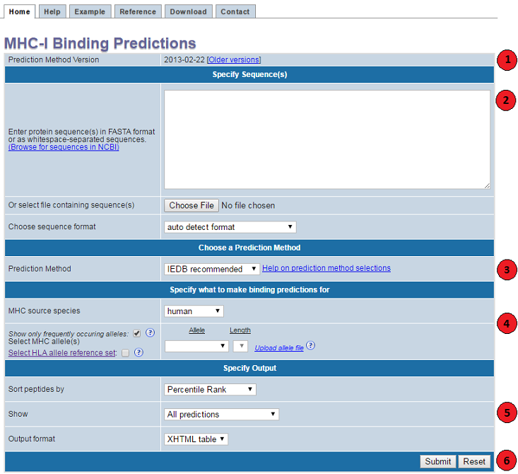

# IEDB

- [IEDB](#iedb)
  - [MHC-I](#mhc-i)
    - [输出格式](#输出格式)
    - [HLA 等位基因频率和参考集](#hla-等位基因频率和参考集)

## MHC-I

提供预测 MHC-I 结合肽段的预测功能。下图列出了预测所需的步骤。

1. 指定方法版本

日期为工具发布的时间。

2. 指定序列

可以直接在 "Specify Sequence(s)" 中输入序列，也可以通过 "Choose File" 选择包含序列的 fasta 文件。每次查询序列个数不要超过 200个，文件大小小于 10 MB。

序列格式：
- 空格分隔的序列
- 单个序列
- FASTA 格式

3. 选择预测方法

有多个 MHC-I 预测方法可供选择：

- 人工神经网络（Artificial neural network, ANN）
- 稳定矩阵（Stabilized matrix method, SMM）
- MHC 结合能协方差矩阵（SMMPMBEC）
- Consensus
- NetMHCpan
- NetMHCcons
- PickPoket
- NetMHCstabpan

NetMHCpan 同时对结合亲和力和洗脱配体数据进行训练。

4. 选择预测对象

预测不局限于一个特定长度肽段结合一个特定的等位基因，可以通过提交多个等位基因、长度对。对一些等位基因-长度组合，因为试验数据太少而没有预测工具存在。

- Frequently occurring alleles

默认 "Show only frequently occurring alleles" 是勾选的。表示只选择至少发生在 1% 的人类中，或者等位基金的频率至少为 1%。不勾选时，可以选择特定物种的所有等位基因和对应的肽段长度。

### 输出格式

### HLA 等位基因频率和参考集

https://help.iedb.org/hc/en-us/articles/114094151851

在特定人群中，某些 HLA 等位基因比其它等位基金出现更频繁（http://www.allelefrequencies.net/ ）。