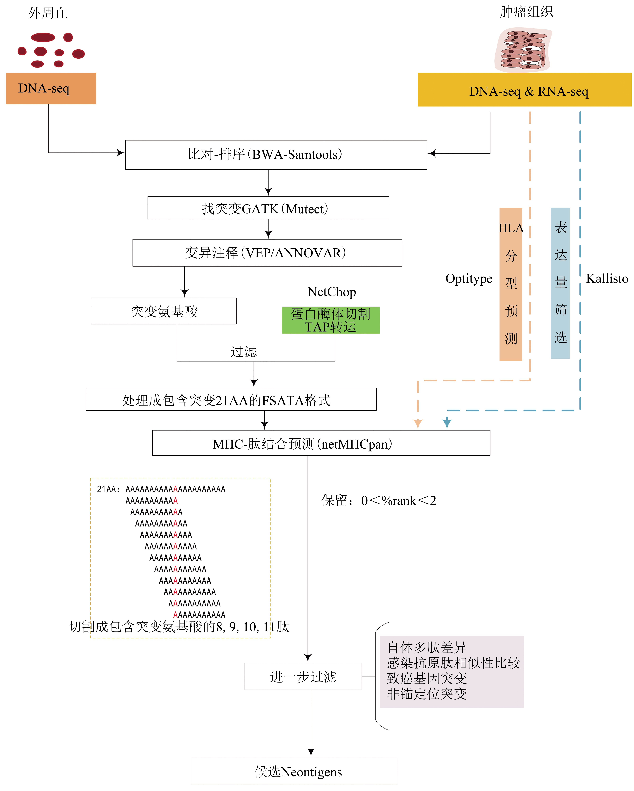
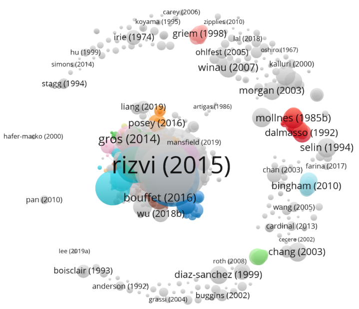
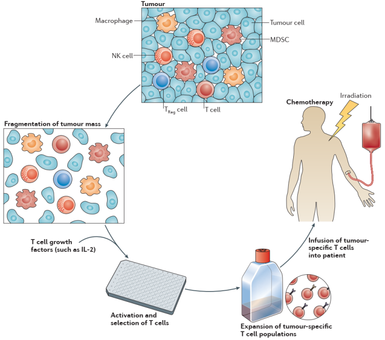
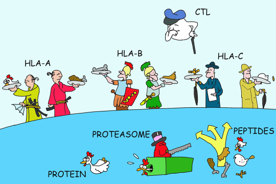

# 肿瘤新抗原

- [肿瘤新抗原](#肿瘤新抗原)
  - [简介](#简介)
  - [抗原的提呈](#抗原的提呈)
  - [肿瘤新抗原研究常用的软件](#肿瘤新抗原研究常用的软件)
  - [新抗原肽筛选流程及常用的管道](#新抗原肽筛选流程及常用的管道)
    - [基于MHC-多肽结合预测的新抗原筛选流程](#基于mhc-多肽结合预测的新抗原筛选流程)
  - [基于MHC结合肽的质朴新抗原筛选](#基于mhc结合肽的质朴新抗原筛选)
  - [调研](#调研)
  - [基于T细胞的肿瘤免疫治疗](#基于t细胞的肿瘤免疫治疗)
  - [新抗原预测](#新抗原预测)
  - [Synapse](#synapse)
  - [癌症抗原数据库](#癌症抗原数据库)
  - [术语](#术语)
  - [参考](#参考)

2021-06-02, 13:19
***

## 简介

疫苗因能够激活免疫系统以预防或治疗感染和一些其他疾病而对人类健康有着重要的影响 ，然而预防性的癌症疫苗目前仅对病毒来源的癌症有效，如人类乳头瘤病毒介导的宫颈癌。 Sipuleucel-T 疫苗是美国食品药品管理局（FDA）批准的首个治疗性的癌症疫苗，对前列腺癌的治疗也有一定的效果。与其他的免疫疗法，如免疫检查点抑制（immune checkpoint blockade，CPB）、过继T细胞疗法（adoptive cell transfer，ACT）以及抗原嵌合受体疗法（chimeric antigen receptors，CARs）相比，大多数疫苗都不能产生显著的临床效果. 新抗原疫苗是最近开发出的一种有效的癌症疫苗，也是目前最前沿的抗肿瘤疫苗技术之一，接种新抗原疫苗既可以扩大已有的新抗原特异性T细胞群，又可以在癌症患者中诱导更广泛的新型T细胞特异性，增强肿瘤抑制，同时新抗原疫苗与其他免疫疗法如PD-1/PD-L1联合治疗效果更显著.

传统上，癌症疫苗被设计针对肿瘤中那些过表达的肿瘤相关抗原（tumor associated antigens，TAAs）或胚胎抗原（carcinoembryonic antigen，CTAs），然而由于 TAAs 来源于人体正常组织，经过胸腺发育的阴性选择，因而可能引发中央和外周免疫耐受机制，从而导致疫苗接种的低效率以及产生自体免疫。肿瘤特异性抗原（tumor-specific antigen，TSAs）又称“新抗原”，是由肿瘤内部体细胞随机突变产生的，不同于正常组织，可以引发有效、安全和高度特异性的抗肿瘤免疫反应. 2017年，Ott 和Sahin 团队均证实，筛选自黑色素瘤中的“新抗原”制成的多肽以及RNA疫苗，均可刺激CD8+以及CD4+T细胞的增殖从而导致肿瘤的消退. 值得注意的是，本来针对CD8+T细胞设计的疫苗，却介导了更多的CD4+T细胞的增多，这引发了人们对主要组织相容性复合物MHC-Ⅱ类分子抗肿瘤作用的思考. 个性化肿瘤新抗原疫苗正受到越来越多肿瘤患者的关注. 虽然个性化新抗原疫苗目前被认为是一种极其有效且安全的免疫治疗，但是其制备复杂耗时、专业性高，尤其是疫苗制备的第一步新抗原的筛选尤其困难. 

## 抗原的提呈

新抗原产生于自体，属于内源性抗原亦称肿瘤特异性抗原（TSAs）。准确理解抗原的提呈对精准预测新抗原是至关重要的. 抗原的呈递是抗原识别中最具选择性的一步，新抗原亦不例外，抗原多肽只有高亲和结合到MHC分子继而被提呈到肿瘤细胞的表面，T细胞才有可能与之接触识别。

抗原处理和提呈的步骤包括：内源性蛋白质被多催化蛋白酶体降解成肽段群，在胞浆中被其他蛋白酶进一步修剪，其中一部分被抗原处理复合体转运子（transporter associated with antigen processing，TAP）选择性地转运到内质网，在那里被内质网氨基肽酶进一步修剪。最后肽段在一系列蛋白质集合下被绑定到MHC分子，MHC-肽复合体最终由高尔基体输出至肿瘤细胞表面，经TCR判断是否开启免疫应答。

## 肿瘤新抗原研究常用的软件

洗脱实验发现，无论Ⅰ类还是Ⅱ类 MHC 分子，都有固定的抗原肽氨基酸残基序列——称为 “common motif”，即锚定位点。MHC分子在人类中被叫做人白细胞抗原(human leucocyte antigen,HLA),主要向CD4+T细胞提呈外源性抗原，其肽结合凹槽两端呈开放状态，能够容纳约10~30个较长肽段氨基酸残基，同时有着更复杂的结合基序. 由于新抗原是内源性的，且MHC-Ⅰ分子结合的多肽长度比较固定，常为8~11肽，加上基序较之MHC-Ⅱ分子相对简单，目前的研究大都集中在MHC-Ⅰ分子提呈多肽的预测. 但随着新抗原疫苗临床实验证实很多的CD4+T细胞被同样介导而增殖，人们也开始越来越关注MHC-Ⅱ分子的提呈作用. 基于这些锚定位点信息，结合机器学习算法，国际上已开发出多种预测表位肽与MHC结合的软件工具，常用的MHC-肽结合工具见下表.

|软件/模型|发表/更新时间|pMHC-Ⅰ类结合|pMHC-Ⅱ类结合|预测算法|
|---|---|---|---|---|
|NetMHC|2008.08.|√||神经网络|
|PSSMHCpan|2017.05.|√||位置特异性打分矩阵|
|NetMHCpan|2017.10.|√||神经网络|
|MHCflurry|2018.07.|√||神经网络|
|PROPRED|2001.12.||√|打分矩阵|
|CONSENSUS|2010.11.||√|打分矩阵|
|NetMHCIIpan|2018.02.||√|神经网络|
|BOTA|2018.10.||√|深度神经网络|

NetMHCpan-4.0 利用人工神经网络（ANN）预测肽与已知序列的MHC-Ⅰ分子结合，该方法在超过 180,000 个定量结合数据和MS衍生的 MHC 洗脱配体的组合上进行训练. 结合亲和力数据涵盖来自人（HLA-A，B，C，E）、小鼠（H-2）、牛（BoLA）、灵长类动物（Patr，Mamu，Gogo）和猪（SLA）的172个 MHC分子. MS 洗脱的配体数据涵盖 55 个HLA和小鼠等位基因，用NetMHCpan软件算法进行肿瘤新抗原预测，计算 MHC-Ⅰ类分子与预测肽的结合力. 预测的结果中，若 %rank<0.5,认为该短肽是MHC-Ⅰ类分子的强结合；0.5<%rank<2，认为该短肽是MHC-Ⅰ类分子的弱结合；%rank>2，认为该肽不能与MHC-Ⅰ分子结合. 若被预测的肽段与MHC-Ⅰ类分子的结合力越强，其成为新抗原表位的可能性越大. 

NetMHCIIpan是典型的MHC-Ⅱ类分子结合肽预测工具，类似于NetMHCpan,可用于预测人的MHC-Ⅱ类HLA-DR、HLA-DP和HLA-DQ，以及小鼠分子（H-2）结合肽的预测，阈值在2<%rank<10. 即便NetMHCpan是目前广泛认可的MHC-肽结合预测软件，其预测结果中依然存在着大量的假阳性候选新抗原多肽，仅仅约1%的预测结合肽能被TCR识别产生免疫原性. 因为预测出的绑定多肽可能不被蛋白酶体水解产生，或者不能有效地刺激CD8+T. 此外免疫表位数据库（the immune epitope database，IEDB）整合了目前比较常用的一些新抗原筛选的可用预测软件，涉及有蛋白酶体切割NetChop、TAP转运、MHC结合预测等. 相关的软件还有 HLA 亚型预测：例如HLAminer、Athlates、Polysolver、Optitype、seq2HLA等. 基于WGS/WES测序数据预测患者的HLA分型，其预测精度可达 90%~99% 不等.

## 新抗原肽筛选流程及常用的管道

### 基于MHC-多肽结合预测的新抗原筛选流程

目前的个性化新抗原多肽筛选流程总体可分为4步：

1. 对病人外周血单核细胞和自身肿瘤组织进行全外显子组（whole exome sequencing，WES）测序找出肿瘤特异性突变多肽，利用外周血细胞 RNA-seq 或者 DNA-seq 分析患者HLA分型. 
2. MHC-肽结合预测软件预测 MHC 呈递的多肽. 
3. 进一步筛选可信度高的新抗原，降低阳性肽条目. 
4. 人工合成新抗原多肽，进行体外T细胞识别验证实验. 常规的新抗原预测流程见下图.

准确鉴定患者的新抗原是困难的，目前主流的新生抗原预测的主要依赖体细胞错义突变来源的多肽，例如 SNV 和 indel，由于这些方法没有考虑当两个基因在基因组中重排异常转录产生的融合基因，相关研究者也开发了关于融合基因的新抗原预测流程INTEGRATE-neo，详细的基于MHC-肽结合预测的新抗原筛选管道见下表.

|软件|发表时间|突变来源|特点|HLA分型预测|MHC-多肽结合预测|
|---|---|---|---|---|---|
|pVAC-seq|2016.12.|SNV，indel|整合肿瘤突变和表达数据|HLAminer/Athlates|NetMHC3.4|
|TSNAD|2017.04.|SNV，indel|增加了膜蛋白的胞外突变|SOAP-HLA2.2|NetMHCpan2.8|
|Cloud-Neo|2017.06.|SNV，indel|首款云计算工作流管道|HLAminer/Polysolver|NetMHCpan3.0|
|TIminer|2017.10.|SNV，indel|免疫浸润+新抗原分析|Optitype|NetMHCpan2.8|
|Neopepsee|2018.04.|SNV，indel|基于机器学习|-|Netmhcpan|
|INTEGRATE-neo|2016.10.|SV|从融合基因中预测新抗原|HLAminer|NetMHC3.4|

## 基于MHC结合肽的质朴新抗原筛选

基于HLA结合肽免疫纯化的质谱数据新抗原预测，能极大提高预测准确率[37,38,39]，因为基于质谱(MS)的方法可以精准捕获大量已加工肽和已呈递肽的描述，从而避免了抗原呈递预测所导致的误差. 基于质谱策略的新抗原筛选步骤主要包括：a. HLA结合肽的免疫纯化；b. 液相串联质谱鉴定（LC-MS/MS）；c. 用户自定义蛋白质数据库构建（SNP-calling突变蛋白序列以及相应的Uniport人类标准蛋白质序列）；d. 使用蛋白质组的定性定量分析工具，如Peaks[40]、MaxQuant[41]、Mascot[42]、SEQUEST[43]，对MS数据进行搜库来鉴定真实MHC结合的突变多肽；e. 筛选候选新抗原，体外验证免疫原性.

目前质谱策略存在的一个困难是患者多个HLA等位基因的共同表达使得鉴定到的多肽难以区分HLA亚型. 幸运的是， Wu研究小组[38]通过使用表达单个HLA分型的细胞系很好地解决了这一难题，并用自开发的MSIntrinsicEC神经网络算法基于质谱多肽数据联合基因的表达量筛选，其预测到的新抗原能够达到50%以上，被认为是新抗原预测的极佳流程. 其研究于2017年发表在Immunity，但相关的算法并未公开. 最近Bulik-Sullivan等[39]利用74例肿瘤患者HLA质谱数据构建的深度学习模型EDGE同样取得了惊人的效果，使用该模型分析9例经过PD-1 或 PD-L1治疗的转移性非小细胞肺癌患者，取预测排名前20的新抗原与T细胞体外培养2 w，结果5/9（56%）患者识别到新抗原特异性T细胞反应.

## 调研

在 Web of Science 检索 neoantigen，获得 1,632 条检索结果，导出结果为 txt 进行处理。

从中挑选引用较高的文章。

## 基于T细胞的肿瘤免疫治疗

Restifo, Nicholas P., Mark E. Dudley, and Steven A. Rosenberg. “Adoptive Immunotherapy for Cancer: Harnessing the T Cell Response.” _Nature Reviews Immunology_ 12, no. 4 (April 2012): 269–81. [https://doi.org/10.1038/nri3191](https://doi.org/10.1038/nri3191).

T 细胞在组织中移动，寻找可以特异性激活其 T 细胞受体（T cell receptor, TCR）的 MHC-peptide 复合物。肿瘤特异性T细胞可能通过与肿瘤相关的抗原相互作用而被激活，肿瘤相关抗原由特定的抗原呈递细胞（antigen-presenting cell, APC）呈递，如树突细胞（dendritic cell, DC）。活化的 T 细胞能够直接识别肿瘤细胞表面的抗原。基于活体成像的技术表明，肿瘤特异性 T 细胞在遇到同源抗原时其迁移迅速受阻。

在黑色素瘤患者中，肿瘤浸润淋巴细胞（tumor-infiltrating lymphocyte, TIL）

> **肿瘤浸润淋巴细胞的分离和肿瘤特异性T细胞的扩增。**
肿瘤通常是包含多种细胞类型的复杂肿块。这些肿块可以通过手术切除、破碎，然后将细胞放在孔中，并添加 T 细胞生长因子，如白细胞介素（interleukin-2, IL-2）。选择包含所需 T 细胞受体的 T 细胞进行扩增，然后过继转移（adoptive transfer）到癌症患者体内。在过继转移之前，可以通过化疗（chemotherapy）或化疗与全身照射组合来耗尽免疫。MDSC，myeloid-derived suppressor cell，髓系衍生抑制细胞；NK，natural killer，自然杀伤细胞；T> ，调节性 T 细胞。

## 新抗原预测

“The Problem with Neoantigen Prediction.” _Nature Biotechnology_ 35, no. 2 (February 2017): 97–97. [https://doi.org/10.1038/nbt.3800](https://doi.org/10.1038/nbt.3800).

**新抗原**，指在正常组织中不表达，仅在肿瘤组织表达的抗原，包括致瘤病毒整合进基因组产生的抗原和突变蛋白产生的抗原。新生抗原不仅具有高特异性，而且因其未经胸腺阴性筛选 还具有强免疫原性。由于病毒介导的肿瘤仅占所有 瘤种的一小部分，所以突变来源的新抗原成为免疫 治疗最理想的靶标。

个性化免疫治疗风靡一时，但是肿瘤新抗原的发现和验证仍然很困难。2016 年 12 月，新成立的 Parker 癌症免疫疗法研究所和著名的东海岸癌症研究所一起宣布成立肿瘤新抗原筛选联盟（Tumor Neoantigen Selection Alliance）。来自30 所大学、非盈利机构和公司的研究人员参与了该计划，旨在开发能**从患者肿瘤 DNA 中预测突变相关的肿瘤抗原**（也称为新抗原 neuantigen）。就目前而言，通过计算机预测能够在患者体内引发有效抗肿瘤反应的新抗原仍然是一件碰运气的事。

传统癌症疫苗针对肿瘤相关的自身抗原，即可能在癌细胞中异常表达的蛋白。而最近人们更关注新抗原，这些肽段对免疫系统来说是新的，在正常组织中没有发现。与肿瘤相关的自身抗原相比，新抗原引起的 T 细胞反应不受胸腺内宿主耐受性的影响，对非恶性细胞的自身免疫反应引起的毒性也较少。

识别病人的候选新抗原从癌症活检和正常组织的外显子测序开始，以确定肿瘤表达蛋白质中发生的错义突变。转录组数据一般也添加进来，以确定抗原的丰度。

发现新表位的关键问题是哪些突变的蛋白质被蛋白酶体加工成 8-11 个残基的肽段，然后被抗原处理相关的转运器转移到内质网，并被加载到新合成的主要组织相容性复合体 I （MHC-I）上，从而被 CD8 T 细胞识别。

虽然有一些计算方法预测抗原处理（NetChop）和肽段转运（NetCTL），但大多数预测工具集中在肽段与 MHC-I 分子结合方面进行建模。如基于神经网络的 NetMHC 预测与病人 MHC-I 分子结合的抗原表位。

太多的影响因素可能导致上面的预测出错。测序有扩增偏差（amplification biases）。人类有大概 5000 个编码 MHC-I 的等位基因，一个病人表达的 MHC-I 可能多大 6 个，具有不同的表位亲和力，在建立表位处理和呈递模型时必须考虑这些。像 NetMHC 这样的方法，通常需要对一个特定的等位基因基因 50-100 次实验测定肽段结合力，才能建立一个具有足够准确性的模型。但是许多 MHC 等位基因缺乏这样的数据，泛特异性方法（pan-specific）使用类似的 MHC 等位基因是否具有类似的特异性来预测结合抗原。

目前已经有大量预测 MHC 结合抗原的工具，这些工具各有优缺点，很难确定哪些工具在特定情况下最有效。

更多 MHC 分子与肽段结合的实验数据可以提高算法的准确性。目前大多数新表位研究会发现数以千计的体细胞突变，并预测上百个 MHC 结合物，但使用 MS 测试时，绝大多数在肿瘤中没有，而能引起 T 细胞反应的更是少之又少。

原因之一是评价新表位免疫原性的方法不够完善，依赖于 TIL 的 MHC-肽段四聚体染色。另外，可以分离出的 TIL 很少，有些肿瘤中还缺乏 TILs，这意味需要在体外扩增淋巴细胞，而扩增又可能会改变 T 细胞的特异性。

另一个问题是，大多数计算工具关注 MHC-I 结合物，而忽略了 MHC-II 结合（CD4 T 细胞对抗肿瘤反应很重要），MHC-II 结合表位更杂乱，长度更长，变化更大，需要更多的数据构建模型。

目前的情况是，新表位预测算法产生大量候选抗原肽，而其中只有极少数能在病人身上引发抗肿瘤反应。

## Synapse

[https://www.synapse.org/](https://www.synapse.org/)
Synapse 是一套 Web 服务和工具，方便科研人员组织、分析和共享科学数据、代码和意见。
Synapse 平台促进了癌症新表位结合数据的贡献。

## 癌症抗原数据库

[https://caped.icp.ucl.ac.be/](https://caped.icp.ucl.ac.be/)

## 术语

**肿瘤浸润淋巴细胞（tumour-infiltrating lymphocyte）**
TIL，在肿瘤中发现的一种异质性 T 细胞。TIL 具有表型、抗原特异性、亲和力和功能特性的多样性。TIL 可以在体外激活和扩增，并重新注入肿瘤的宿主。

**白细胞介素-2（Interleukin-2）**
IL-2，一种T细胞生长因子，能够触发效应 T 细胞和调节性T细胞的扩增。IL-2 被用来治疗黑色素瘤患者，并作为某些基于 ACT 的治疗方案的一部分。

**过继细胞转移（adoptive cell transfer）**
ACT，在淋巴耗竭（lymphodepleting）准备方案之后，基于肿瘤特异性的淋巴细胞（从病人（自体）或捐赠者（异体）获得）。

**淋巴耗竭（lymphodepletion）**
使用全身辐射或者细胞毒性药物来耗尽患者的淋巴区。

**骨髓源性抑制细胞（myeloid-derived suppressor cells）**
MDSCs，响应各种肿瘤衍生的细胞因子而产生的一组不成熟的 CD11bGR1 细胞（包括巨噬细胞、粒细胞、树突状细胞和髓样细胞的前体）。这些细胞已证明可诱导肿瘤相关的 CD8 T 细胞耐受。

**交叉致敏（cross-priming）**
某些抗原呈递细胞将外源性抗原肽加载到 MHC-I 分子的能力称为**交叉致敏**。这种特性是非典型的，因为大多数细胞仅将内源蛋白的肽段呈递给 MHC-I 分子。

## 参考

- 王广志, 李雨雨, & 谢鹭. 个性化肿瘤新抗原疫苗中抗原肽预测研究进展. 生物化学与生物物理进展 46, 441–448 (2019).
