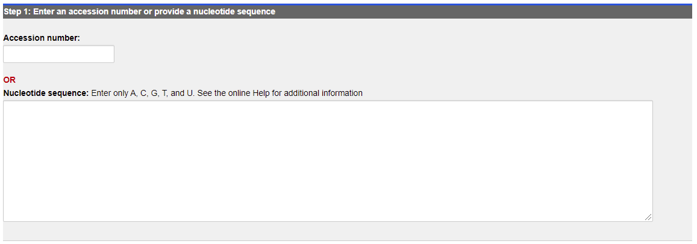
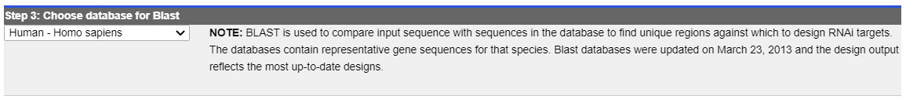
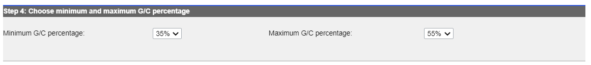
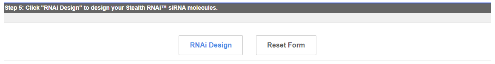
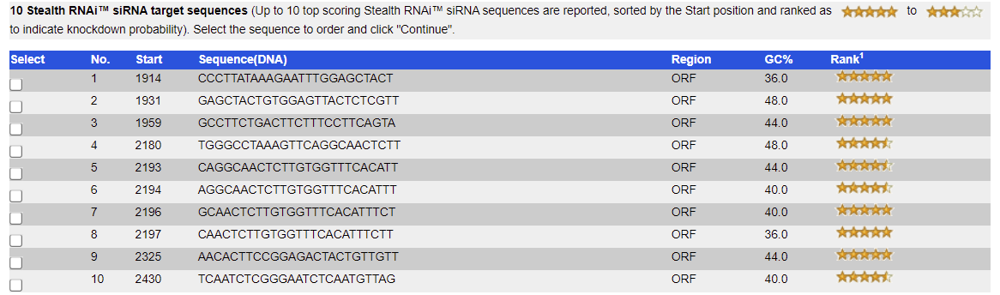

# BLOCK-iT RNAi Designer

- [BLOCK-iT RNAi Designer](#block-it-rnai-designer)
  - [简介](#简介)
  - [siRNA 设计](#sirna-设计)
    - [1. 选择靶序列](#1-选择靶序列)
    - [2. 选择靶向区域](#2-选择靶向区域)
    - [3. 选择BLAST数据库](#3-选择blast数据库)
    - [4. 选择最小和最大 GC 百分比](#4-选择最小和最大-gc-百分比)
    - [5. 运行](#5-运行)
  - [结果解释](#结果解释)
  - [参考](#参考)

2021-11-08, 12:13
***

## 简介

BLOCK-iT RNAi Designer 是一个 Web 工具，功能是从目标核苷酸序列出发设计和定制合成 siRNA、Stealth RNAi siRNA、shRNA以及 miR RNAi 寡核苷酸序列。也可以将 siRNA 序列转换为 Stealth RNAi siRNA 或 shRNA 插入序列。

输入目标序列和设计参数后，Designer 生成按敲除基因概率排序的 RNAi 设计。设计完成后，可以进去定制页面在其中选择寡核苷酸合成选项。

主页：https://rnaidesigner.thermofisher.com/rnaiexpress/

## siRNA 设计

BLOCK-iT RNAi Designer 可以设计合成特定于感兴趣的核苷酸序列的 19-mer 短干扰RNA（siRNA）序列。

其使用流程如下。

### 1. 选择靶序列

如下图所示：

可以直接将靶核苷酸序列复制到 **Nucleotide sequence** 中，或者在 **Accession number** 中输入靶序列的数据库编号。

**Accession number**

如果输入 accession number，Designer 会搜索 NCBI 数据库，包括 GenBank 和 OMIM 数据库，将和 accession number 关联的序列下载到 Designer。

RefSeq 的 accession number 格式为：两个字母+下划线+6个数字，如 NT_123456。

GenBank accession number 一般由字母和数字组成，如单字母+5数字（U12345）或双字母+6数字（AF123456）。

如果输入 RefSeq 格式的 accession number，Designer 会检查已知的单核苷酸多态性（single-nucleotide polymorphisms, SNPs）序列，排除包含 SNPs 的设计序列。如果是粘贴序列或输入 GenBank 格式的 accession number，则不会识别 SNP。

**Nucleotide sequence** 

在其中输入单链靶序列，支持的序列类型包括：纯文本、FASTA以及 GenBank。

输入序列顺序必须为 5'->3'，且只包含碱基缩写：A、T、C、G，不区分大小写，在设计序列时，包含未知碱基（如 N）或其它字母的区域被跳过。如果序列中包含序列 N 或其它字母，Designer 会提示重新输入徐磊。序列中的空白和数字被忽略。

### 2. 选择靶向区域

如果上一步输入的是 accession number，这一步就可以选择设计 siRNA 分子的序列区域。大多情况默认的开放阅读框（Open Reading Frame, ORF）即可以，如果使用 ORF 无法获得期望的结果，则可以勾选 5' UTR 或 3' UTR 重新设计分子。

### 3. 选择BLAST数据库

选择特定物种的数据库执行 BLAST，以从靶序列中识别 unique 区域。BLAST 检索同源的序列被筛除，以确保 siRNA 序列的高度特异性。

BLAST 针对 UniGene 数据库的非冗余版本执行，该数据库包含物种的代表性基因序列，即只包含每个基因的一种表示，不包含剪接变体。

> [UniGene 数据库从 2019 年7月开始不再更新维护](https://ncbiinsights.ncbi.nlm.nih.gov/2019/07/30/the-unigene-web-pages-are-now-retired/)，因此不推荐使用 Designer 自带的 BLAST，而是使用 reference genome 自定义 BLAST。

### 4. 选择最小和最大 GC 百分比

**Minimum GC Percentage** 和 **Maximum GC Percentage** 用于设置 siRNA 允许的最小和最大 GC 百分比。对大多数序列来说，默认范围足够大，足以产生多种 siRNA 设计序列。

如果产生的 siRNA 序列不足，或者你确定所需的 siRNA 序列的 GC 比例在此范围之外，则可以手动修改该法芙娜为。超出范围的序列被 Designer 筛掉。

### 5. 运行

## 结果解释

Designer 输出了 10 条得分最高的 siRNA 设计序列。

## 参考

- https://rnaidesigner.thermofisher.com/rnaiexpress/
- https://ncbiinsights.ncbi.nlm.nih.gov/2019/02/01/ncbi-to-retire-the-unigene-database/
