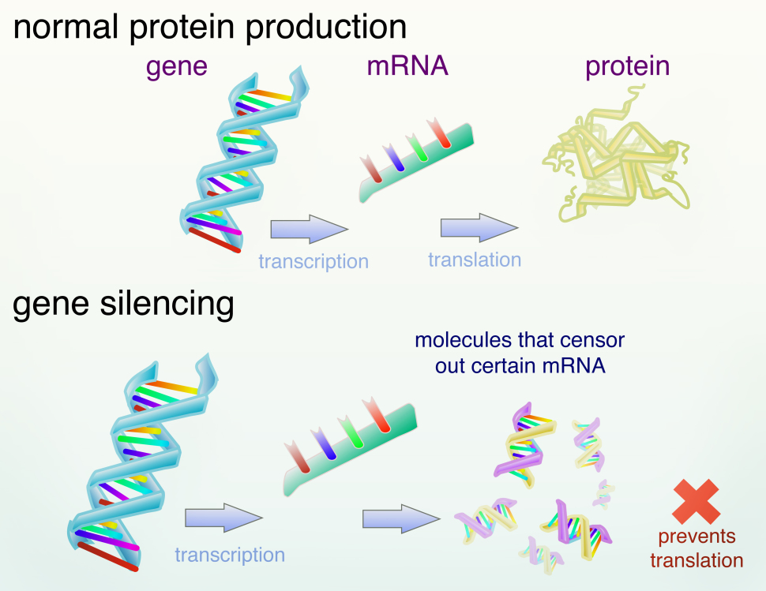
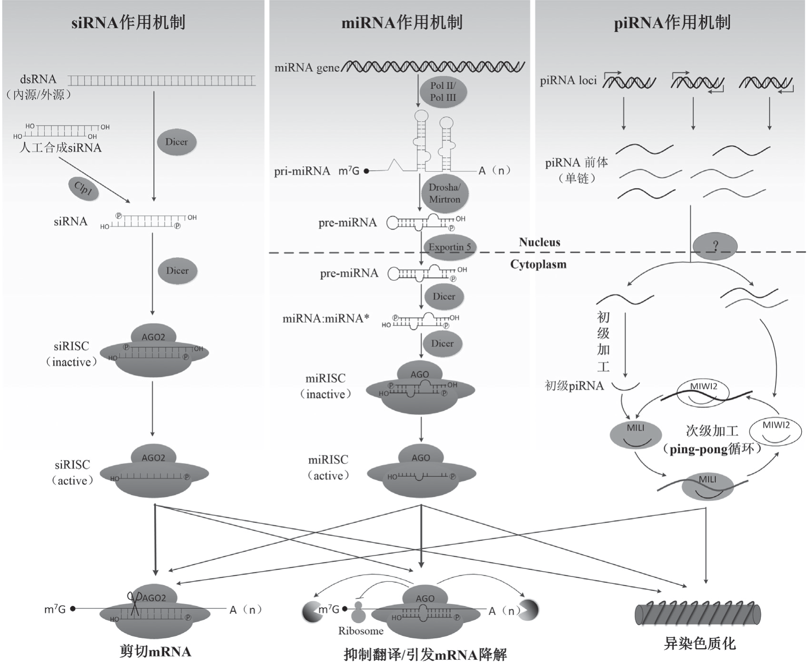
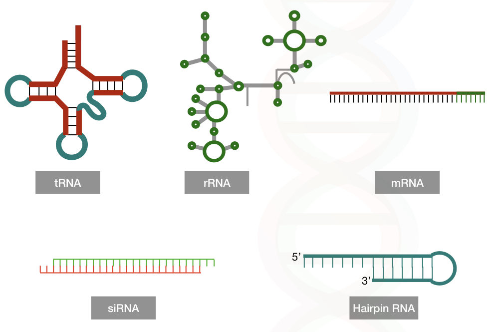
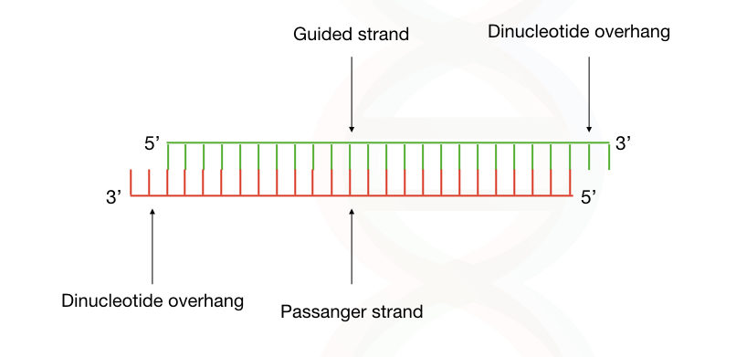
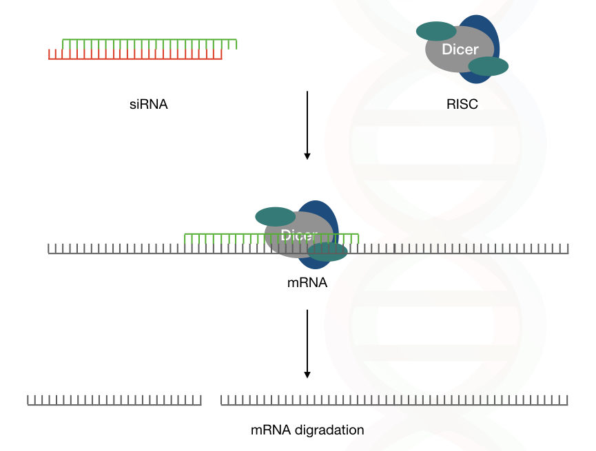
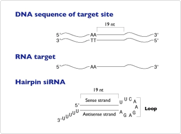
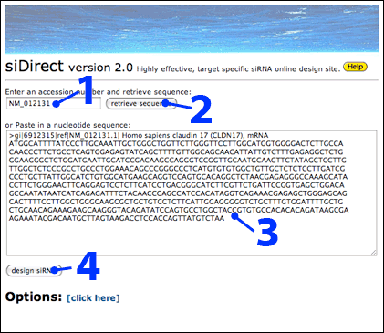
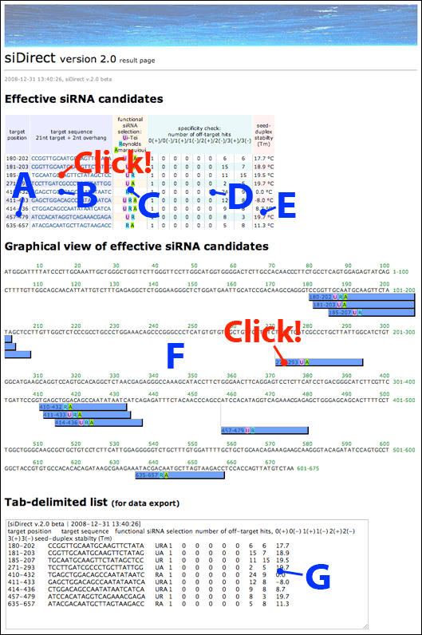
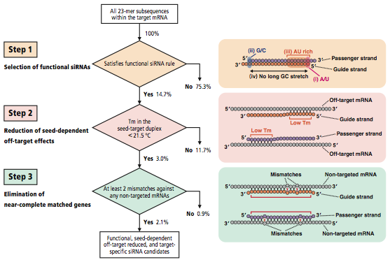

# RNAi

- [RNAi](#rnai)
  - [基因沉默](#基因沉默)
  - [RNA 干扰](#rna-干扰)
  - [RNAi 的作用机制](#rnai-的作用机制)
    - [siRNA 作用机制](#sirna-作用机制)
      - [siRNA 结构](#sirna-结构)
      - [siRNA 作用机理详解](#sirna-作用机理详解)
    - [miRNA 的作用机制](#mirna-的作用机制)
    - [piRNA 的作用机制](#pirna-的作用机制)
  - [反义核酸](#反义核酸)
  - [序列设计](#序列设计)
    - [基本准则](#基本准则)
      - [靶点选择](#靶点选择)
      - [siRNA 长度](#sirna-长度)
    - [发卡结构设计](#发卡结构设计)
    - [脱靶效应](#脱靶效应)
  - [设计软件](#设计软件)
    - [siDirect](#sidirect)
      - [siDirect 操作](#sidirect-操作)
      - [siDirect 流程](#sidirect-流程)
    - [siRNA Wizard](#sirna-wizard)
  - [参考](#参考)

2021-06-02, 19:20
@author Jiawei Mao
***

## 基因沉默

基因沉默（gene sliencing）是一种减少或消除相应基因产生某种蛋白质的技术。基因是包含制造蛋白质指令的 DNA 片段。基因按照中心发展过程指导蛋白质合成，即基因首先转录为 mRNA，mRNA 离开细胞核到达细胞质，通过翻译过程合成蛋白质。

如下图所示，基因沉默的关键是阻止 mRNA 的翻译：

目前有多种基因沉默方法，它们的差别主要在分子结构和 mRNA 分解的方式。

## RNA 干扰

**狭义的 RNA 干扰**（RNA interference，RNAi），是指由双链 RNA（double-stranded RNA，dsRNA）产生的小 RNA 介导序列特异性的 mRNA 降解，进而引发基因沉默的现象。**广义的 RNAi**，是指由小非编码 RNA（Small non-coding RNA，sncRNA）诱导mRNA 降解、抑制翻译或促使异染色质形成等，进而引发基因沉默的现象。

1998 年，Fire 和 Mello 等在线虫（Caenorhabditis elegans）的研究中首次描述了 RNAi 现象。他们在研究反义 RNA 作用的过程中发现，正义 RNA 和反义 RNA 的混合物，即 dsRNA 对基因的沉默作用远远强于任一单链 RNA，并将 dsRNA（实际是由 dsRNA产生的小 RNA）引起的基因沉默现象称为 **RNAi**。

RNAi 是真核生物独有的基因沉默现象，普遍存在于真核生物中，是真核生物调控内源基因表达及抵御外源核酸入侵的高效自我保护系统。

## RNAi 的作用机制

RNAi 由长度为 20-30 nt 的 sncRNA 触发，根据 sncRNA 生物合成和作用机制的不同，可将其分为siRNA（small interfering RNA）、miRNA（microRNA）和 piRNA（PIWI-interacting RNA）3 种。

miRNA 是一种单链 RNA，具有茎环结构，和 mRNA 不完全结合。基于该特性，miRNA 可以降解许多类似的 mRNA，从而产生毒性。

shRNA 有一个紧密的发卡结构，使得它比其它 RNAi 疗法更复杂。它需要启动子在细胞核中表达和定位才能起作用。

最后，siRNA 是一种短、双链 RNA，可以降解互补的 mRNA。siRNA 转染效率高、最适合于 RNAi 疗法。

|RNAi 类型|RNAi 疗法沉默特征|
|---|---|
|miRNA|

### siRNA 作用机制

#### siRNA 结构

siRNA (small interfering RNA)是 22-25 个碱基对长的小 RNA 分子，在 3' 末端具有2个核苷酸突出端。siRNA 通过阻断翻译来干扰蛋白质的合成。

我们体内主要的三种 RNA 是单链的，在人体内找不到 dsRNA ，因为我们的遗传物质是 DNA 而不是 RNA，dsRNA 是一种逆转录病毒的遗传物质。

因此，如果发现了 dsRNA，往往意味着感染。

> 核糖体 DNA 包含一定量的 dsRNA 和一些 hairpin RNA。

除逆转录病毒外，DNA 是所有真核生物和原核生物的遗传物质。RNA 是一种核糖核酸，细胞中存在 tRNA、rRNA和 mRNA 三种不同类型的 RNA。

通俗来讲，siRNA 是 mRNA 杀手，通过破坏 mRNA 达到调节基因表达的功能。siRNA 也称为小干扰RNA或沉默 RNA，是一种阻止基因表达的分子。通过 siRNA 实现基因沉默的过程称为 RNA 干扰或 siRNA knockdown。

#### siRNA 作用机理详解

由于 RNA 病毒入侵、基因组中反向重复序列转录、转座子转录、自退火转录或实验转染等原因，使得细胞中出现内源性或外源性的 dsRNA，核酸内切酶 Dicer 识别dsRNA，并将其剪切成长度为 21-25 nt、5' 端含有一个磷酸基团、3' 端含有一个羟基并且突出 2 nt 的siRNA。如下图所示：

> siRNA 的两条链，其中一条称为引导链（guid strand）或正义链，另一条称为反义链（antisense strand）。

siRNA 的这一结构对于 RNAi 是必要的，缺乏 5' 端磷酸化的 siRNA 或平端 siRNA 在细胞内外都无法启动 RNAi。人工导入的 siRNA 需要经过细胞质中的激酶 Clp1 加工成 5' 端磷酸化的 siRNA 才能参与诱导靶基因沉默。

具有一定结构的 siRNA 随后在 Dicer 的帮助下与 AGO2 等结合， 构成 siRNA 诱导沉默复合体（siRNA-induced silencing complex，siRISC），siRISC 中的 siRNA 经 AGO2 作用分解成两条单链，正义链释放出去，反义链则留在 siRISC 中。仅含反义链的 siRISC 被激活，在反义链的引导下通过碱基互补配对原则与靶基因结合，进而诱导靶基因的沉默。沉默发生后，靶基因被释放，使得 siRISC 能与另一个靶基因结合，开始诱导新一轮的基因沉默。

siRISC 诱导基因沉默的具体方式包括以下 3 种：

1. 反义 siRNA 与靶 mRNA 完全互补配对（一般发生在 mRNA 的编码区或开放阅读框中）

siRISC 中具有核酸内切酶活性的 AGO2 剪切靶 mRNA，启动靶 mRNA 的降解，一旦最初降解形成，细胞中的核酸外切酶就会攻击剩余片段以完成整个降解过程，从而导致靶基因沉默，这是 siRISC 的**主要作用方式**。

2. 反义 siRNA 与靶 mRNA 不完全配对（一般发生在 mRNA 的 3' 非编码区）

此时的 siRISC 将抑制靶 mRNA 的翻译或引发靶 mRNA 的降解。siRISC 通过与翻译起始复合物竞争 mRNA 的 5' 帽子结构、影响核糖体大小亚基的聚合等作用在翻译的起始阶段抑制翻译，或者通过减缓核糖体在翻译中的移动速度、促进核糖体的提早解离等作用在翻译的其他阶段抑制翻译。siRISC 还可以促进脱帽酶切除 mRNA 的 5' 帽子结构，脱腺苷酶切除 mRNA 的 3'端 poly（A）尾巴，使 mRNA 失去 5' 和 3' 端的保护而被核酸外切酶攻击，最终导致 mRNA 的降解。

3. 除了作用于 mRNA 在转录后水平调控基因表达外，siRISC 也可作用于 DNA 在转录水平调控基因的表达

siRISC 通过激活甲基化酶或抑制去甲基化酶的作用，引发 DNA 的甲基化，DNA 的甲基化进一步导致染色质蛋白的甲基化、乙酰化、磷酸化和泛素化等，从而促进异染色质的形成，引发基因沉默。

双链 siRNA 进入 siRISC 后，经 AGO2 作用解开成两条单链，反义链留在 siRISC 中引导 siRISC 沉默靶基因，正义链被释放出去。被释放的正义链可能很快被降解，也可能作为引物，在 RNA 依赖的 RNA 聚合酶（RNA-dependent RNA polymerase，RdRP）的催化下以靶 mRNA 为模板扩增得到 dsRNA，dsRNA又被 Dicer 降解成 siRNA 进入 RNAi 循环，从而使得RNAi 的效果级联放大。

### miRNA 的作用机制

与 siRNA 主要来自外源性 dsRNA 不同，miRNA 主要源于生物自身的基因组。细胞核内编码 miRNA 的基因在 RNA 聚合酶 II 或聚合酶 III（polymerase II/ polymerase III，Pol II/Pol III）的作用下转录得到 pri-miRNA，pri-miRNA 是一个具有帽子结构、poly（A）尾巴、一个或多个茎环结构的大分子 RNA，长度从数百到数万个碱基不等。pri-miRNA 经 Drosha（一种核糖核酸 III 酶） 或 Mirtron 作用，去除帽子结构和 poly（A）尾巴，得到长度约为 70 nt 的 pre-miRNA，pre-miRNA 通常具有茎环结构，且其 3' 端突出 2 nt。

pre-miRNA 被转运蛋白 Exportin 5 转运到细胞质中，在细胞质中被 Dicer 剪切成长度约为 22 nt 的`miRNA:miRNA*` 双链。这种双链 miRNA 的分子结构与 siRNA 相似，同样是 5' 端具有磷酸基团，3' 端具有羟基且突出 2 nt，不同的是 siRNA 的两条链完全互补配对，而 miRNA 的两条链只是部分互补配对。`miRNA:miRNA*` 双链很快与 AGO（AGO1-4，主要是 AGO1）等结合形成 miRNA 诱导沉默复合体（miRNA-induced silencing complex，miRISC），随后 `miRNA:miRNA*` 双链中 5' 端碱基配对稳定性较强的正义链 miRNA* 迅速被降解，5' 端碱基配对稳定性较弱的反义链 miRNA 则保留在 miRISC 中。仅含反义链的 miRISC 被激活，在反义链 miRNA 的引导下通过碱基互补配对原则识别靶基因，诱导靶基因沉默。

siRNA 主要通过完全互补配对的方式与靶基因结合，并通过直接剪切作用诱发靶基因的降解，从而保护体内基因组不受转座子活动或病毒感染等外源性因素的影响。与之不同，miRNA 主要通过不完全配对的方式与靶 mRNA 结合，抑制靶 mRNA 的翻译或引发靶 mRNA 的降解，从而内源性的调控体内基因的表达。miRNA 与靶 mRNA 不完全配对时的具体作用机制与 siRNA 与靶 mRNA 不完全配对时的具体作用机制类似，亦是通过与翻译起始复合物竞争 5' 帽子结构或影响核糖体的正常功能等作用抑制靶 mRNA 的翻译，以及通过促进相应酶切除 mRNA 的 5' 和 3' 端保护结构等作用诱发靶基因的降解。与 siRNA 一致，miRNA 也可以与靶基因完全互补配对，通过直接剪切作用诱发靶基因的降解。此外，miRNA 也能作用于 DNA，通过诱导 DNA 甲基化，促进异染色质的形成，从而在转录水平调控基因的表达。

### piRNA 的作用机制

RNAi 过程中，3 种 sncRNA 均与 Argonaute 蛋白家族结合，Argonaute 蛋白家族包括 AGO 和 PIWI两类亚家族，siRNA 和 miRNA 与 AGO 亚家族结合，而 piRNA 则与 PIWI 亚家族结合。piRNA 途径是动物特有的，主要存在于动物的生殖细胞中。piRNA 的具体作用机制尚未阐明，目前对 piRNA 的
认识尚处于初级阶段。

基因间的重复序列、活跃的转座子基因或 piRNA 基因簇转录得到的单链 piRNA 前体，经具有核酸酶活性的 PIWI 蛋白加工，得到长度约为 24-32 nt 的 piRNA。与 siRNA 和 miRNA 不同，piRNA 的生成不需要 Dicer 的参与。piRNA 的生物合成涉及初级加工和次级加工两条途径。初级加工途径产生初级 piRNA，初级 piRNA 经次级加工途径（亦称 ping-pong 循环）扩增。初级加工及初级 piRNA与 PIWI 蛋白的结合发生在细胞质中，但初级加工过程所需的因子尚未清楚。在 ping-pong 循环中，初级 piRNA 依次被 PIWI 蛋 白 MILI 和 MIWI2（ 即PIWIL2 和 PIWIL4）剪切其 5' 端，由此决定 piRNA的 5' 端结构，决定 piRNA 3' 端结构的核酸酶目前未知。piRNA 可以通过直接剪切靶 mRNA 或者促进异染色质的形成等方式诱导基因沉默，从而在转录后水平或转录水平调控基因的表达。

## 反义核酸

反义核苷酸（antisense oligonucleotide, ASO）

## 序列设计

制备siRNA有多种方法，比如化学合成、体外转录、siRNA表达载体以及PCR表达组件等。但无论使用哪种方法，设计siRNA的第一步都是评估要沉默的目标基因，选择合适的siRNA靶点。

### 基本准则

#### 靶点选择

首先排除单核苷酸多态性（SNP）位点作为 siRNA 设计的目标位点，因为它们可能导致不同 SNP 的细胞系沉默效率差异。

根据 Elbashir 等的研究，最好避开内含子、5'-UTR 以及 3'-UTR 作为 siRNA 设计的位点。UTR 和靠近起始密码子的序列更容易受调节蛋白的影响，从而干扰 RISC 复合物及其沉默效果。

在目标基因的开放阅读框中，起始密码子下游 50-100 个核苷酸区域是被沉默的最佳靶点位置。经验表明，靠近起始密码子的 siRNA 往往比远的 siRNA 更有效。

靶点的 accessibility 也很重要，RNAxs（http://rna.tbi.univie.ac.at/cgi-bin/RNAxs/RNAxs.cgi ）是一个 siRNA 设计工具，主要基于 mRNA 目标位点的可及性。

1. 在靶向mRNA序列中找到一段 21 nt 以AA二核苷酸起始的序列

从转录本的AUG起始密码子开始，扫描 AA 二核苷酸序列。记录每个AA及之后3’相邻的19个核苷酸作为潜在的siRNA靶向位点。

这种选择方式是基于Elbashir等人的研究，他们发现 3' 端带有 **UU** 二核苷酸悬臂的 siRNA 最有效。这与使用 RNA pol III 转录发卡 siRNA 相符，因为 RNA pol III 会在 4-6 个核苷酸poly(T)处终止转录，从而得到带有短 poly(U) 尾的RNA。

在 Elbashir 的论文及后续发表的论文中，带有其他 3' 端终止双核苷酸突出的 siRNA 已被证明可以有效诱导 RNAi。若需要，还可以对这种靶向位点选择方式进行修改，以设计带有其他双核苷酸突出的siRNA，不过一般建议避免选择GG突出末端，因为 siRNA 在单链 G 残基处可能被 RNase 剪切。

2. 选择 2-4 个靶序列

通常随机设计的 siRNA 超过一半可以降低靶向 mRNA 水平 50% 以上，约 1/4 的 siRNA 则会降低 75-95%。按照如下步骤对上一步鉴定到的序列进行靶向选择：

- GC 含量在 30-50% 的siRNA 比G/C含量更高的siRNA活性高；
- 由于 4-6 个核苷酸 poly(T)会成为 RNA pol III 的终止信号，如果需要用RNA pol III启动子进行表达，请避免4个以上 T或A 连续出现在目标序列中；
- 由于 mRNA 的部分区域可能具有较复杂的结构或与调控蛋白质相结合，因此通常会在基因序列的不同位置选择 siRNA 靶点。不过并未观察到 mRNA 上靶点的位置与 siRNA 效能之间的相关性；
- 将潜在的靶向位点与相应的基因组数据库（人、小鼠、大鼠等）进行对比，如果靶向序列与其他基因编码序列具有超过 16-17 个连续碱基对同源性，就不能选择这样的序列。我们建议使用 BLAST（www.ncbi.nlm.nih.gov/BLAST ）进行比对。

3. 设计恰当的对照

完整的siRNA实验应当包含一系列对照，以确保数据的有效性。Nature Cell Biology的编辑推荐了几种对照。其中2种对照为：

- 阴性对照siRNA，与目标 siRNA 具有相同的核苷酸成分，但与基因组无明显的序列同源性。 要设计阴性对照siRNA，可以将基因特异性siRNA的核苷酸序列打乱，然后进行搜索以确保其与任意基因均不具有同源性。
- 靶向相同 mRNA 的其他siRNA序列。确保 RNAi 数据可信度的最佳方法可能就是每次使用一条单独siRNA，对同一条基因使用两条或更多不同siRNA进行实验。在这些实验之前，需要对每条siRNA进行测试以确保它们能够将目标基因的表达水平降到比较接近的水平。

#### siRNA 长度

关于 siRNA 的长度存在争议，大部分人都采用 19 个核苷酸，并且可以获得很好的结果，但也有人使用 21-29 个核苷酸。尽管短的 siRNA 可能导致非特异性结合，但是其沉默效率与 19-25 个核苷酸的 siRNA 一致。不过短的 siRNA 

### 发卡结构设计

最初使用 siRNA 表达载体诱导 RNAi 的研究人员对编码表达 siRNA 的插入片段有不同的设计准则。大多数设计均具有两段反向的重复序列，之间由短间隔序列隔开，然后以一系列T作为结尾用于转录终止。这些设计得到的RNA转录本预计会折叠为如图1所示的短发卡结构siRNA。siRNA靶向序列的选择、编码发卡结构的茎（stem）既反向重复序列的长度、反向重复序列的顺序、编码发卡结构的环（loop）的间隔序列的长度及组成，以及是否带有5’端突出等设计要点，在不同报告中有着很大不同（3-11）。

> 图 1 .由siRNA表达载体或siRNA表达组件所得到的典型发卡siRNA及其与RNA靶向序列的关系示意图。

### 脱靶效应

由种子区（seed region) 介导的siRNA 脱靶

## 设计软件

|编号|软件|链接|
|---|---|---|
|1|siDirect|http://sidirect2.rnai.jp/|
|2|siRNA Wizard|https://www.invivogen.com/sirnawizard/|

### siDirect

siDirect 是一款在线工具，为哺乳动物 RNAi 提供高效、靶向的 siRNA 设计。

#### siDirect 操作

下面以设计人 claudin 17 (CLDN17) 的 siRNA 为例解释如何使用：

1. 输入人 claudin 17 (NM_012131) 的序列号；
2. 点击 "retrieve sequence" 从 GenBank 获取序列；
3. 也可以直接粘贴核苷酸序列到图示窗口中，接收 FASTA 类型序列或 10 kbp 以内的核算序列；
4. 点击 “design siRNA".

5. 结果

输出格式如下所示：

A. siRNA target positions；
B. siRNA target sequences (21nt + 2nt overhang)；
C. siRNA 效果预测。U, R, A 分别表示满足 siRNA 设计算法  **U**i-Tei et al., **R**eynolds et al. and **A**marzguioui et al.
D. 对人类 mRNA 的同源性检索。显示完全匹配（如 19/19 匹配）、一个不匹配（18/19 匹配）、两个不匹配（17/19 匹配）的数目。0(+) 列的数字 "1" 表示和预期靶向 mRNA 完全匹配；
E. siRNA seed 区域的 Tm。选择 seed Tm 较低的 siRNA 可以减小脱靶效应；
F. 设计的 siRNA 可视化显示。点击 siRNA 可以显示脱靶列表。
G. TSV 格式的 siRNA 列表。

#### siDirect 流程

**Step1: 高功能 siRNA 筛选**

首先，根据算法选择具有高度功能的 siRNA。siDirect 团队发现同事满足以下三个条件的 siRNA 可以有效地诱导 RNAi:

- 引导链的 5' 端带有 A/U；
- 反义链的 5' 端带有 G/C；
- 引导链的 5' 端 7bp 中至少有 4 A/U 残基。

**Step2: 减少 seed 依赖的脱靶效应**

脱靶效应和 seed-靶链的热力学稳定性或 Tm 高度相关，

### siRNA Wizard

siRNA Wizard 以一款帮助选择靶向特定基因的 siRNA/shRNA 序列软件。该程序选择符合 RNAi 研究发现的 siRNA/shRNA 序列规则的序列，并且在 psiRNA 载体中具有最佳表达。

siRNA Wizard 包含三部分：

1. 检索 siRNA/shRNA 序列

可以执行两种检索模式：

- 标准检索（Standard search）使用默认参数分析基因序列，并提供沉默该基因表达所需的最佳序列。
- 高级检索（Advanced search）可以手动设置规则，以选择靶向目标基因的序列。

2. 设计发卡

使用所选的 siRNA/shRNA 序列设计两个互补的寡核苷酸。

3. 打乱 siRNA/shRNA

打乱 siRNA/shRNA，以生成阴性对照序列。

## 参考

- 冯小艳，张树珍. RNAi作用机制及应用研究进展. 生物技术通报 33, 1–8 (2017).
- https://hopes.stanford.edu/gene-silencing/
- https://www.thermofisher.cn/cn/zh/home/references/ambion-tech-support/rnai-sirna/general-articles/-sirna-design-guidelines.html
- https://www.thermofisher.cn/cn/zh/home/references/ambion-tech-support/rnai-sirna.html
- https://www.invivogen.com/sirnawizard/guidelines.php
- Fakhr, E., Zare, F. & Teimoori-Toolabi, L. Precise and efficient siRNA design: a key point in competent gene silencing. Cancer Gene Therapy 23, 73–82 (2016).
