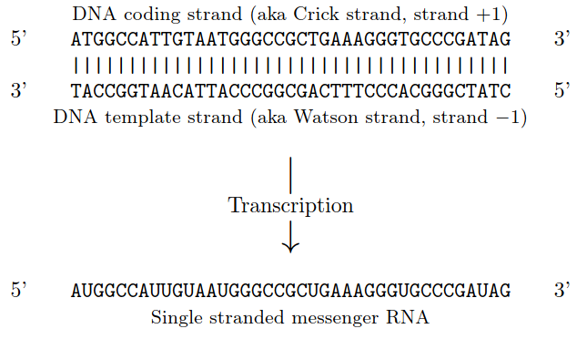

# Seq 对象

- [Seq 对象](#seq-对象)
  - [转录](#转录)

## 转录

如下所示，转录的生物学过程从模板链（template）开始，以反向互补（TCAG -> CUGA）的方式生成 mRNA。不过在生信中一般直接从编码链（coding strand）开始，这样直接将 T 替换成 U，就获得了 mRNA 序列。Bioipython 也是采用这种方法。



> NOTE： 核酸序列都是按 5' -> 3' 顺序读取，因此上图中的模板链其实是反的。

下面在 Biopython 中进行转录操作，首先创建 DNA 编码链和模板链：

```py
coding_dna = Seq('ATGGCCATTGTAATGGGCCGCTGAAAGGGTGCCCGATAG')
template_dna = coding_dna.reverse_complement()
assert str(template_dna) == 'CTATCGGGCACCCTTTCAGCGGCCCATTACAATGGCCAT'
```

然后将 DNA 编码链转录为 mRNA：

```py
message_rna = coding_dna.transcribe()
assert str(message_rna) == 'AUGGCCAUUGUAAUGGGCCGCUGAAAGGGUGCCCGAUAG'
```

可以看到，只是将编码 DNA 序列的 T 替换为 U。

如果想从模板链出发进行真正的生物转录，就需要用 `reverse_complement_rna()` 方法：

```py
message_rna3 = template_dna.reverse_complement_rna()
assert message_rna3 == message_rna
```

所以对一条 DNA 链：

- 如果它是编码链，则使用 `transcribe()` 转录获得 RNA 序列；
- 如果它是模板链，则使用 `reverse_complement_rna` 获得 RNA 序列。

`Seq` 对象还包含从 mRNA 反转录到 DNA 序列的方法，即将 U 替换为 T：

```py
message_rns = Seq('AUGGCCAUUGUAAUGGGCCGCUGAAAGGGUGCCCGAUAG')
dna_seq = message_rns.translate()
assert str(dna_seq) == 'ATGGCCATTGTAATGGGCCGCTGAAAGGGTGCCCGATAG'
```
