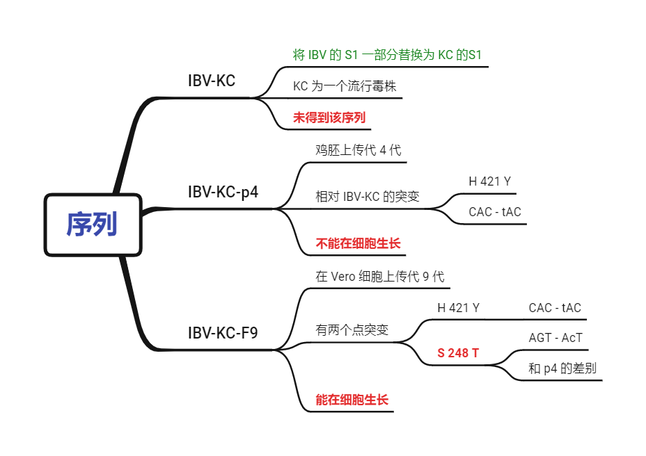

# 分析流程

- [分析流程](#分析流程)
  - [任务描述](#任务描述)
  - [任务进度](#任务进度)
  - [了解 IBV](#了解-ibv)
  - [序列数据](#序列数据)
  - [IBV S蛋白结构预测](#ibv-s蛋白结构预测)
    - [S1 预测](#s1-预测)
      - [IBV-Beaudette-S1](#ibv-beaudette-s1)
      - [IBV-KC-p4-S1](#ibv-kc-p4-s1)
      - [IBV-KC-F9-S1](#ibv-kc-f9-s1)
    - [S 预测](#s-预测)
      - [IBV-Beaudette-S](#ibv-beaudette-s)
      - [IBV-KC-p4-S](#ibv-kc-p4-s)
      - [IBV-KC-F9-S](#ibv-kc-f9-s)

2022-01-12, 11:26
***

## 任务描述

rIBV-Beaudette-KC(S1) 将 IBV-Beaudette 菌株 S1 的一部分序列换成了 KC 流行毒株的 S1 的序列。KC 是分离的一个流行毒株。

rIBV-Beaudette-KC(S1) F9 能在细胞生长，p4 则不能在细胞生长。F9 和 p4 序列差异为 F9 比 p4 多了一个突变位点 `S 248 T` (`AGT` 突变成 `AcT`）。需求：

- [x] 分析该突变位点对 S 蛋白结构的影响；
- 是否会影响病毒与宿主细胞结合和入侵？
- [x] 是否会影响其免疫原性（免疫效果）？

> p 指在鸡胚上传代，第一代次毒为 p1，第二代次毒为 p2。
> F 指将鸡胚上传代收获的毒转到 Vero 上传代，第一代次毒为 F1，第二代次毒为 F2。 F9 就是在 Vero 细胞传至第 9 代的毒。
> 任务 1 和 3 从理论角度是可以解决的，任务 2 无法实现。建议从实验角度考虑。

图示如下：



## 任务进度

**2022-01-12, 10:03**

收到熊挺的 DNA 序列数据。

**2022-01-13, 16:55**

开始相关的调研分析，了解数据。

收到熊挺的蛋白质序列数据。

**2022-01-14, 16:55**

学习 AlphaFold2，用于结构预测。

AlphaFold2 对硬件要求太高，没有满足要求的电脑配置，无法部署使用，放弃。

**2022-01-17, 16:56**

使用 ColabFold 预测蛋白结构。

## 了解 IBV

传染性支气管炎病毒（infectious bronchitis virus, IBV）Beaudette 菌株是一种冠状病毒，其刺突糖蛋白（S）由两个亚基组成（S1 和 S2）。

鸡的 IBV-Beaudette 株的蛋白质组：https://www.uniprot.org/proteomes/UP000006717

IBV-Beaudette 株 共有 10 个蛋白质：

|Accession|Entry name|Protein namees|Gene names|Length|
|---|---|---|---|---|
|[P11223](https://www.uniprot.org/uniprot/P11223)|SPIKE_IBVB|Spike glycoprotein|S 2|1,162|
|[P0C6Y1](https://www.uniprot.org/uniprot/P0C6Y1)|R1AB_IBVB|Replicase polyprotein 1ab|rep 1a-1b|6,629|
|[P0C6V3](https://www.uniprot.org/uniprot/P0C6V3)|R1A_IBVB|Replicase polyprotein 1a|1a|3,951|
|[P69596](https://www.uniprot.org/uniprot/P69596)|NCAP_IBVB|Nucleoprotein|N 6|409|
|[Q89894](https://www.uniprot.org/uniprot/Q89894)|VEMP_IBVB|Envelope small membrane protein|E sM, 3c|108|
|[P69601](https://www.uniprot.org/uniprot/P69601)|VME1_IBVB|Membrane protein|M|225|
|[P30237](https://www.uniprot.org/uniprot/P30237)|NS3A_IBVB|Non-structural protein 3a|3a|57|
|[Q89786](https://www.uniprot.org/uniprot/Q89786)|NS5B_IBVB|Host translation inhibitor 5b|5b|82|
|[Q89613](https://www.uniprot.org/uniprot/Q89613)|NS5A_IBVB|Non-structural protein 5a|5a|65|
|[P30241](https://www.uniprot.org/uniprot/P30241)|NS3B_IBVB|Non-structural protein 3b|3b|64|

## 序列数据

- IBV-Beaudette S1 基因序列

```fasta
CTAATGAGACCATAGATGTTACATCTGCAGGTGTTTATTTTAAAGCTGGTGGACCTATAACTTATAAAGTTATGAGAGAAGTTAAAGCCCTGGCTTATTTTGTTAATGGTACTGCACAAGATGTTATTTTGTGTGATGGATCACCTAGAGGCTTGTTAGCATGCCAGTATAATACTGGCAATTTTTCAGATGGCTTTTATCCTTTTACTAATAGTAGTTTAGTTAAGCAGAAGTTTATTGTCTATCGTGAAAATAGTGTTAATACTACTTGTACGTTACACAATTTCATTTTTCATAATGAGACTGGCGCCAACCCTAATCCTAGTGGTGTTCAGAATATTCAAACTTACCAAACAAAAACAGCTCAGAGTGGTTATTATAATTTTAATTTTTCCTTTCTGAGTAGTTTTGTTTATAAGGAGTCTAATTTTATGTATGGATCTTATCACCCAAGTTGTAAGTTTAGACTAGAAACTATTAATAATGGCTTGTGGTTTAATTCACTTTCAGTTTCAATTGCTTACGGTCCTCTTCAAGGTGGTTGCAAGCAATCTGTCTTTAGAGGTAGAGCAACTTGTTGTTATGCTTATTCATATGGAGGTCCTTCGCTGTGTAAAGGTGTTTATTCAGGTGAGTTAGATCATAATTTTGAATGTGGACTGTTAGTTTATGTTACTAAGAGCGATGGCTCTCGTATACAAACAGCCACTGAACCGCCAGTTATAACTCAACACAATTATAATAATATTACTTTAAATACTTGTGTTGATTATAATATATATGGCAGAACTGGCCAAGGTTTTATTACTAATGTAACCGACTCAGCTGTTAGTTATAATTATCTAGCAGACGCAGGTTTGGCTATTTTAGATACATCTGGTTCCATAGACATCTTTGTTGTACAAGGTGAATATGGTCTTAATTATTATAAGGTTAACCCTTGCGAAGATGTCAACCAGCAGTTTGTAGTTTCTGGTGGTAAATTAGTAGGTATTCTTACTTCACGTAATGAGACTGGTTCTCAGCTTCTTGAGAACCAGTTTTACATCAAAATCACTAATGGAACACGTCGTTTTAGACGTTCT
```

- KC S1 基因序列

```fasta
ATGTTGGGGAAGTCACTGTTTTTAGTGACCATTTTGTGTGCACTATGTAGTGCAAATTTGTTTGATCCTGCTAATACTTATGTGTACTACTACCAAAGTGCCTTTAGGCCTCCAAATGGATGGCATCTACAGGGGGGTGCTTATGCAGTAGTCAATTCAACTAATTATACTAATAATGCCGGTTCTGCAAACGATTGCACTGTTGGTGTTATTAAGGATGTCTATAATCAAAGTGCGGCTTCCATAGCTATGACAGCACCTCTTCAGGGTATGGCTTGGTCCAAGTCACAATTTTGTAGTGCACACTGTAACTTTTCTGAAATTACAGTTTTTGTCACACATTGTTATAGTAGTGGTAGCGGGTCTTGTCCTATAACAGGCATGATTCCACGTGATCATATTCGTATTTCTGCAATGAAAAATGGTACTTTATTTTATAATTTAACAGTTAGCGTATCTAAATACCCTAATTTTAAATCTTTTCAATGCGTTAACAACCTCACATCTGTTTATCTAAATGGTGATCTTGTTTTTACTTCCAACAAAACTACTGATGTTACGTCAGCAGGTGTGTATTTTAAAGCAGGTGGACCTGTAAATTATAGTATTATGAAAGAATTTAAGGTTCTTGCTTACTTTGTTAATGGTACAGCACAAGATGTAATTTTGTGCGACAATTCCCCTAAGGGTTTGTTAGCTTGTCAATATAATACTGGCAATTTTTCAGATGGATTTTATCCTTTTACTAATATTACTTTAGTTAGGGAAAAGTTCATCGTATATCGCGAAAGTAGTGTTAATACTACTTTGGCGTTAACTAATTTCACTTTTTCTAATGTAAGTAATGCACAGCCTAATAGTGGTGGTGTTAATACTTTTCATTTATATCAAACACAAACAGCTCAGAGTGGTTATTATAATTTTAATTTGTCATTTCTGAGTCAGTTTGTGTATAAGGCAAGTGATTTTATGTATGGGTCCTATCACCCTAGTTGTTCTTTTAGACCAGAAACCATTAATAGTGGTTTGTGGTTTAATTCCTTGTCAGTTTCTCTAGCTTATGGACCACTTCAAGGTGGGTGTAAGCAGTCAGTTTTTAGTGGTAGGGCAACGTGTTGCTATGCCTACTCTTACAATGGCCCGGTAGCCTGTAAAGGTGTTTATTCAGGCGAATTACAGACTAATTTTGAATGTGGGTTGCTGATTTATGTTACTAAGAGTGATGGCTCTCGTATACAGACTAGAACAGAGCCCTTAGTATTAACGCAACACAATTATAATAATATTACTTTATATAAGTGTGTTGACTATAATATATATGGCAGAGTAGGCCAAGGTTTTATTACTAATGTGACTGATTCTGCTGCTAATTTTAGTTATTTAGCAGATGGTGGGTTAGCTATTTTAGATACTTCCGGTGCCATAGATGTTTTTGTTGTACAGGGCAGCTATGGTCTTAATTATTACAAGGTCAATCCTTGTGAAGATGTTAATCAACAGTTTGTAGTGTCTGGTGGCAATATAGTTGGCATTCTTACTTCTAGAAATGAAACAGGTTCTGAACGGGTTGAGAACCAGTTTTATGTTAAGTTAACCAATAGCTCACATCGTCGTAGGCGT
```

- 设计的 IBV-KC 的 S 基因序列

```fasta
ATGTTGGTAACACCTCTTTTACTAGTGACTCTTTTGTGTGCACTATGTAGTGCTGTTTTGTATGACAGTAGTTCTTACGTTTACTACTACCAAAGTGCCTTCAGACCACCTAGTGGTTGGCATTTACAAGGGGGTGCTTATGCGGTAGTTAACATTTCTAGCGAATTTAATAATGCAGGCTCTTCATCAGGGTGTACTGTTGGTATTATTCATGGTGGTCGTGTTGTTAATGCTTCTTCTATAGCTATGACGGCACCGTCATCAGGTATGGCTTGGTCTAGCAGTCAGTTTTGTACTGCACACTGTAATTTTTCAGATACTACAGTGTTTGTTACACATTGTTATAAACATGGTGGGTGTCCTATAACTGGCATGCTTCAACAGAATTTTATACGTGTTTCTGCTATGAAAAATGGCCAGCTTTTCTATAATTTAACAGTTAGTGTAGCTAAGTACCCTACTTTTAGATCATTTCAGTGTGTTAATAATTTAACATCCGTATATTTAAATGGTGATCTTGTTTACACCTCTAATGAGACCATAGATGTTACATCTGCAGGTGTTTATTTTAAAGCTGGTGGACCTATAACTTATAAAGTTATGAGAGAAGTTAAAGCCCTGGCTTATTTTGTTAATGGTACTGCACAAGATGTTATTTTGTGTGATGGATCACCTAGAGGCTTGTTAGCATGCCAGTATAATACTGGCAATTTTTCAGATGGCTTTTATCCTTTTACTAATAGTAGTTTAGTTAAGCAGAAGTTTATTGTCTATCGTGAAAATAGTGTTAATACTACTTGTACGTTACACAATTTCATTTTTCATAATGAGACTGGCGCCAACCCTAATCCTAGTGGTGTTCAGAATATTCAAACTTACCAAACAAAAACAGCTCAGAGTGGTTATTATAATTTTAATTTGTCATTTCTGAGTCAGTTTGTGTATAAGGCAAGTGATTTTATGTATGGGTCCTATCACCCTAGTTGTTCTTTTAGACCAGAAACCATTAATAGTGGTTTGTGGTTTAATTCCTTGTCAGTTTCTCTAGCTTATGGACCACTTCAAGGTGGGTGTAAGCAGTCAGTTTTTAGTGGTAGGGCAACGTGTTGCTATGCCTACTCTTACAATGGCCCGGTAGCCTGTAAAGGTGTTTATTCAGGCGAATTACAGACTAATTTTGAATGTGGGTTGCTGATTTATGTTACTAAGAGTGATGGCTCTCGTATACAGACTAGAACAGAGCCCTTAGTATTAACGCAACACAATTATAATAATATTACTTTATATAAGTGTGTTGACTATAATATATATGGCAGAGTAGGCCAAGGTTTTATTACTAATGTGACTGATTCTGCTGCTAATTTTAGTTATTTAGCAGATGGTGGGTTAGCTATTTTAGATACTTCCGGTGCCATAGATGTTTTTGTTGTACAGGGCAGCTATGGTCTTAATTATTACAAGGTCAATCCTTGTGAAGATGTTAATCAACAGTTTGTAGTGTCTGGTGGCAATATAGTTGGCATTCTTACTTCTAGAAATGAAACAGGTTCTGAACGGGTTGAGAACCAGTTTTATGTTAAGTTAACCAATAGCTCACGTCGTTTTAGACGTTCTATTACTGAAAATGTTGCAAATTGCCCTTATGTTAGTTATGGTAAGTTTTGTATAAAACCTGATGGCTCAATTGCCACAATAGTACCAAAACAATTGGAACAGTTTGTGGCACCTTTATTTAATGTTACTGAAAATGTGCTCATACCTAACAGTTTCAACTTAACTGTTACAGATGAGTACATACAAACGCGTATGGATAAGGTCCAAATTAATTGCCTGCAGTATGTTTGTGGCAGTTCTCTGGATTGTAGAAATTTGTTTCAACAATATGGGCCTGTTTGCGACAACATATTGTCTGTAGTAAATAGTGTTGGTCAAAAAGAAGATATGGAACTTTTGAATTTCTATTCTTCTACTAAACCGGCTGGTTTTAATACACCAGTTCTTAGTAATGTTAGCACTGGTGAGTTTAATATTTCTCTTCTGTTAACAACTCCTAGTAGTCGTAGAAGGCGTTCTGTTATTGAAGACCTTCTATTTACAAGCGTTGAATCTGTTGGACTACCAACAGATGACGCATATAAAAATTGCACTGCAGGACCTTTAGGCTTTCTTAAGGACCTTGCGTGTGCTCGTGAATATAATGGTTTGCTTGTGTTGCCTCCTATTATAACAGCAGAAATGCAAGCTTTGTATACTAGTTCTCTAGTAGCTTCTATGGCTTTTGGTGGTATTACTGCAGCTGGTGCTATACCTTTTGCCACACAACTGCAGGCTAGAATTAATCACTTGGGTATTACCCAGTCACTTTTGTTGAAGAATCAAGAAAAAATTGCTGCTTCCTTTAATAAGGCCATTGGTCATATGCAGGAAGGTTTTAGAAGTACATCTCTAGCATTACAACAAATTCAAGATGTTGTTAGTAAACAGAGTGCTATTCTTACTGAGACTATGGCATCACTTAATAAAAATTTTGGTGCTATTTCTTCTGTGATTCAAGAAATCTACCAGCAATTTGACGCCATACAAGCAAATGCTCAAGTGGATCGTCTTATAACTGGTAGATTGTCATCACTTTCTGTTTTAGCATCTGCTAAGCAGGCGGAGTATATTAGAGTGTCACAACAGCGTGAGTTAGCTACTCAGAAAATTAATGAGTGTGTTAAGTCACAGTCTATTAGGTACTCCTTTTGTGGTAATGGACGACATGTTCTAACCATACCGCAAAATGCACCTAATGGTATAGTGTTTATACACTTTTCTTATACTCCAGATAGTTTTGTTAATGTTACTGCAATAGTGGGTTTTTGTGTAAAGCCAGCTAATGCTAGTCAGTATGCAATAGTGCCCGCTAATGGTAGGGGTATTTTTATACAAGTTAATGGTAGTTACTACATCACTGCACGAGATATGTATATGCCAAGAGCTATTACTGCAGGAGATGTAGTTACGCTTACTTCTTGTCAAGCAAATTATGTAATTGTAAATAAGACCGTCATTACTACATTCGTAGACAATGATGATTTTGATTTTAATGACGAATTGTCAAAATGGTGGAATGATACTAAGCATGAGCTACCAGACTTTGACAAATTCAATTACACAGTACCTATACTTGACATTGATAGTGAAATTGATCGTATTCAAGGCGTTATACAGGGTCTTAATGACTCTCTAATAGACCTTGAAAAACTTTCAATACTCAAAACTTATATTAAGTGGCCTTGGTATGTGTGGTTAGCCATAGCTTTTGCCACTATTATCTTCATCTTAATACTAGGATGGGTTTTCTTCATGACTGGATGTTGTGGTTGTTGTTGTGGATGCTTTGGCATTATGCCTCTAATGAGTAAGTGTGGTAAGAAATCTTCTTATTACACGACTTTTGATAACGATGTGGTAACTGAACAATACAGACCCAAAAAGTCTGTTTGA
```

> 经验证，这个序列就是 CoDing Sequence (CDS)，最后的 TGA 为终止密码子。

S 蛋白序列：

```fasta
MLVTPLLLVTLLCALCSAVLYDSSSYVYYYQSAFRPPSGWHLQGGAYAVVNISSEFNNAGSSSGCTVGIIHGGRVVNASSIAMTAPSSGMAWSSSQFCTAHCNFSDTTVFVTHCYKHGGCPITGMLQQNFIRVSAMKNGQLFYNLTVSVAKYPTFRSFQCVNNLTSVYLNGDLVYTSNETIDVTSAGVYFKAGGPITYKVMREVKALAYFVNGTAQDVILCDGSPRGLLACQYNTGNFSDGFYPFTNSSLVKQKFIVYRENSVNTTCTLHNFIFHNETGANPNPSGVQNIQTYQTKTAQSGYYNFNLSFLSQFVYKASDFMYGSYHPSCSFRPETINSGLWFNSLSVSLAYGPLQGGCKQSVFSGRATCCYAYSYNGPVACKGVYSGELQTNFECGLLIYVTKSDGSRIQTRTEPLVLTQHNYNNITLYKCVDYNIYGRVGQGFITNVTDSAANFSYLADGGLAILDTSGAIDVFVVQGSYGLNYYKVNPCEDVNQQFVVSGGNIVGILTSRNETGSERVENQFYVKLTNSSRRFRRSITENVANCPYVSYGKFCIKPDGSIATIVPKQLEQFVAPLFNVTENVLIPNSFNLTVTDEYIQTRMDKVQINCLQYVCGSSLDCRNLFQQYGPVCDNILSVVNSVGQKEDMELLNFYSSTKPAGFNTPVLSNVSTGEFNISLLLTTPSSRRRRSVIEDLLFTSVESVGLPTDDAYKNCTAGPLGFLKDLACAREYNGLLVLPPIITAEMQALYTSSLVASMAFGGITAAGAIPFATQLQARINHLGITQSLLLKNQEKIAASFNKAIGHMQEGFRSTSLALQQIQDVVSKQSAILTETMASLNKNFGAISSVIQEIYQQFDAIQANAQVDRLITGRLSSLSVLASAKQAEYIRVSQQRELATQKINECVKSQSIRYSFCGNGRHVLTIPQNAPNGIVFIHFSYTPDSFVNVTAIVGFCVKPANASQYAIVPANGRGIFIQVNGSYYITARDMYMPRAITAGDVVTLTSCQANYVIVNKTVITTFVDNDDFDFNDELSKWWNDTKHELPDFDKFNYTVPILDIDSEIDRIQGVIQGLNDSLIDLEKLSILKTYIKWPWYVWLAIAFATIIFILILGWVFFMTGCCGCCCGCFGIMPLMSKCGKKSSYYTTFDNDVVTEQYRPKKSV
```

对应的 S1 序列：

```fasta
ATGTTGGTAACACCTCTTTTACTAGTGACTCTTTTGTGTGCACTATGTAGTGCTGTTTTGTATGACAGTAGTTCTTACGTTTACTACTACCAAAGTGCCTTCAGACCACCTAGTGGTTGGCATTTACAAGGGGGTGCTTATGCGGTAGTTAACATTTCTAGCGAATTTAATAATGCAGGCTCTTCATCAGGGTGTACTGTTGGTATTATTCATGGTGGTCGTGTTGTTAATGCTTCTTCTATAGCTATGACGGCACCGTCATCAGGTATGGCTTGGTCTAGCAGTCAGTTTTGTACTGCACACTGTAATTTTTCAGATACTACAGTGTTTGTTACACATTGTTATAAACATGGTGGGTGTCCTATAACTGGCATGCTTCAACAGAATTTTATACGTGTTTCTGCTATGAAAAATGGCCAGCTTTTCTATAATTTAACAGTTAGTGTAGCTAAGTACCCTACTTTTAGATCATTTCAGTGTGTTAATAATTTAACATCCGTATATTTAAATGGTGATCTTGTTTACACCTCTAATGAGACCATAGATGTTACATCTGCAGGTGTTTATTTTAAAGCTGGTGGACCTATAACTTATAAAGTTATGAGAGAAGTTAAAGCCCTGGCTTATTTTGTTAATGGTACTGCACAAGATGTTATTTTGTGTGATGGATCACCTAGAGGCTTGTTAGCATGCCAGTATAATACTGGCAATTTTTCAGATGGCTTTTATCCTTTTACTAATAGTAGTTTAGTTAAGCAGAAGTTTATTGTCTATCGTGAAAATAGTGTTAATACTACTTGTACGTTACACAATTTCATTTTTCATAATGAGACTGGCGCCAACCCTAATCCTAGTGGTGTTCAGAATATTCAAACTTACCAAACAAAAACAGCTCAGAGTGGTTATTATAATTTTAATTTGTCATTTCTGAGTCAGTTTGTGTATAAGGCAAGTGATTTTATGTATGGGTCCTATCACCCTAGTTGTTCTTTTAGACCAGAAACCATTAATAGTGGTTTGTGGTTTAATTCCTTGTCAGTTTCTCTAGCTTATGGACCACTTCAAGGTGGGTGTAAGCAGTCAGTTTTTAGTGGTAGGGCAACGTGTTGCTATGCCTACTCTTACAATGGCCCGGTAGCCTGTAAAGGTGTTTATTCAGGCGAATTACAGACTAATTTTGAATGTGGGTTGCTGATTTATGTTACTAAGAGTGATGGCTCTCGTATACAGACTAGAACAGAGCCCTTAGTATTAACGCAACACAATTATAATAATATTACTTTATATAAGTGTGTTGACTATAATATATATGGCAGAGTAGGCCAAGGTTTTATTACTAATGTGACTGATTCTGCTGCTAATTTTAGTTATTTAGCAGATGGTGGGTTAGCTATTTTAGATACTTCCGGTGCCATAGATGTTTTTGTTGTACAGGGCAGCTATGGTCTTAATTATTACAAGGTCAATCCTTGTGAAGATGTTAATCAACAGTTTGTAGTGTCTGGTGGCAATATAGTTGGCATTCTTACTTCTAGAAATGAAACAGGTTCTGAACGGGTTGAGAACCAGTTTTATGTTAAGTTAACCAATAGCTCACGTCGTTTTAGACGTTCT
```

S1 蛋白序列：

```fasta
MLVTPLLLVTLLCALCSAVLYDSSSYVYYYQSAFRPPSGWHLQGGAYAVVNISSEFNNAGSSSGCTVGIIHGGRVVNASSIAMTAPSSGMAWSSSQFCTAHCNFSDTTVFVTHCYKHGGCPITGMLQQNFIRVSAMKNGQLFYNLTVSVAKYPTFRSFQCVNNLTSVYLNGDLVYTSNETIDVTSAGVYFKAGGPITYKVMREVKALAYFVNGTAQDVILCDGSPRGLLACQYNTGNFSDGFYPFTNSSLVKQKFIVYRENSVNTTCTLHNFIFHNETGANPNPSGVQNIQTYQTKTAQSGYYNFNLSFLSQFVYKASDFMYGSYHPSCSFRPETINSGLWFNSLSVSLAYGPLQGGCKQSVFSGRATCCYAYSYNGPVACKGVYSGELQTNFECGLLIYVTKSDGSRIQTRTEPLVLTQHNYNNITLYKCVDYNIYGRVGQGFITNVTDSAANFSYLADGGLAILDTSGAIDVFVVQGSYGLNYYKVNPCEDVNQQFVVSGGNIVGILTSRNETGSERVENQFYVKLTNSSRRFRRS
```

- 实际获得 **p4** S 蛋白的基因序列

```fasta
ATGTTGGTAACACCTCTTTTACTAGTGACTCTTTTGTGTGCACTATGTAGTGCTGTTTTGTATGACAGTAGTTCTTACGTTTACTACTACCAAAGTGCCTTCAGACCACCTAGTGGTTGGCATTTACAAGGGGGTGCTTATGCGGTAGTTAACATTTCTAGCGAATTTAATAATGCAGGCTCTTCATCAGGGTGTACTGTTGGTATTATTCATGGTGGTCGTGTTGTTAATGCTTCTTCTATAGCTATGACGGCACCGTCATCAGGTATGGCTTGGTCTAGCAGTCAGTTTTGTACTGCACACTGTAATTTTTCAGATACTACAGTGTTTGTTACACATTGTTATAAACATGGTGGGTGTCCTATAACTGGCATGCTTCAACAGAATTTTATACGTGTTTCTGCTATGAAAAATGGCCAGCTTTTCTATAATTTAACAGTTAGTGTAGCTAAGTACCCTACTTTTAGATCATTTCAGTGTGTTAATAATTTAACATCCGTATATTTAAATGGTGATCTTGTTTACACCTCTAATGAGACCATAGATGTTACATCTGCAGGTGTTTATTTTAAAGCTGGTGGACCTATAACTTATAAAGTTATGAGAGAAGTTAAAGCCCTGGCTTATTTTGTTAATGGTACTGCACAAGATGTTATTTTGTGTGATGGATCACCTAGAGGCTTGTTAGCATGCCAGTATAATACTGGCAATTTTTCAGATGGCTTTTATCCTTTTACTAATAGTAGTTTAGTTAAGCAGAAGTTTATTGTCTATCGTGAAAATAGTGTTAATACTACTTGTACGTTACACAATTTCATTTTTCATAATGAGACTGGCGCCAACCCTAATCCTAGTGGTGTTCAGAATATTCAAACTTACCAAACAAAAACAGCTCAGAGTGGTTATTATAATTTTAATTTGTCATTTCTGAGTCAGTTTGTGTATAAGGCAAGTGATTTTATGTATGGGTCCTATCACCCTAGTTGTTCTTTTAGACCAGAAACCATTAATAGTGGTTTGTGGTTTAATTCCTTGTCAGTTTCTCTAGCTTATGGACCACTTCAAGGTGGGTGTAAGCAGTCAGTTTTTAGTGGTAGGGCAACGTGTTGCTATGCCTACTCTTACAATGGCCCGGTAGCCTGTAAAGGTGTTTATTCAGGCGAATTACAGACTAATTTTGAATGTGGGTTGCTGATTTATGTTACTAAGAGTGATGGCTCTCGTATACAGACTAGAACAGAGCCCTTAGTATTAACGCAAtACAATTATAATAATATTACTTTATATAAGTGTGTTGACTATAATATATATGGCAGAGTAGGCCAAGGTTTTATTACTAATGTGACTGATTCTGCTGCTAATTTTAGTTATTTAGCAGATGGTGGGTTAGCTATTTTAGATACTTCCGGTGCCATAGATGTTTTTGTTGTACAGGGCAGCTATGGTCTTAATTATTACAAGGTCAATCCTTGTGAAGATGTTAATCAACAGTTTGTAGTGTCTGGTGGCAATATAGTTGGCATTCTTACTTCTAGAAATGAAACAGGTTCTGAACGGGTTGAGAACCAGTTTTATGTTAAGTTAACCAATAGCTCACGTCGTTTTAGACGTTCTATTACTGAAAATGTTGCAAATTGCCCTTATGTTAGTTATGGTAAGTTTTGTATAAAACCTGATGGCTCAATTGCCACAATAGTACCAAAACAATTGGAACAGTTTGTGGCACCTTTATTTAATGTTACTGAAAATGTGCTCATACCTAACAGTTTCAACTTAACTGTTACAGATGAGTACATACAAACGCGTATGGATAAGGTCCAAATTAATTGCCTGCAGTATGTTTGTGGCAGTTCTCTGGATTGTAGAAATTTGTTTCAACAATATGGGCCTGTTTGCGACAACATATTGTCTGTAGTAAATAGTGTTGGTCAAAAAGAAGATATGGAACTTTTGAATTTCTATTCTTCTACTAAACCGGCTGGTTTTAATACACCAGTTCTTAGTAATGTTAGCACTGGTGAGTTTAATATTTCTCTTCTGTTAACAACTCCTAGTAGTCGTAGAAGGCGTTCTGTTATTGAAGACCTTCTATTTACAAGCGTTGAATCTGTTGGACTACCAACAGATGACGCATATAAAAATTGCACTGCAGGACCTTTAGGCTTTCTTAAGGACCTTGCGTGTGCTCGTGAATATAATGGTTTGCTTGTGTTGCCTCCTATTATAACAGCAGAAATGCAAGCTTTGTATACTAGTTCTCTAGTAGCTTCTATGGCTTTTGGTGGTATTACTGCAGCTGGTGCTATACCTTTTGCCACACAACTGCAGGCTAGAATTAATCACTTGGGTATTACCCAGTCACTTTTGTTGAAGAATCAAGAAAAAATTGCTGCTTCCTTTAATAAGGCCATTGGTCATATGCAGGAAGGTTTTAGAAGTACATCTCTAGCATTACAACAAATTCAAGATGTTGTTAGTAAACAGAGTGCTATTCTTACTGAGACTATGGCATCACTTAATAAAAATTTTGGTGCTATTTCTTCTGTGATTCAAGAAATCTACCAGCAATTTGACGCCATACAAGCAAATGCTCAAGTGGATCGTCTTATAACTGGTAGATTGTCATCACTTTCTGTTTTAGCATCTGCTAAGCAGGCGGAGTATATTAGAGTGTCACAACAGCGTGAGTTAGCTACTCAGAAAATTAATGAGTGTGTTAAGTCACAGTCTATTAGGTACTCCTTTTGTGGTAATGGACGACATGTTCTAACCATACCGCAAAATGCACCTAATGGTATAGTGTTTATACACTTTTCTTATACTCCAGATAGTTTTGTTAATGTTACTGCAATAGTGGGTTTTTGTGTAAAGCCAGCTAATGCTAGTCAGTATGCAATAGTGCCCGCTAATGGTAGGGGTATTTTTATACAAGTTAATGGTAGTTACTACATCACTGCACGAGATATGTATATGCCAAGAGCTATTACTGCAGGAGATGTAGTTACGCTTACTTCTTGTCAAGCAAATTATGTAATTGTAAATAAGACCGTCATTACTACATTCGTAGACAATGATGATTTTGATTTTAATGACGAATTGTCAAAATGGTGGAATGATACTAAGCATGAGCTACCAGACTTTGACAAATTCAATTACACAGTACCTATACTTGACATTGATAGTGAAATTGATCGTATTCAAGGCGTTATACAGGGTCTTAATGACTCTCTAATAGACCTTGAAAAACTTTCAATACTCAAAACTTATATTAAGTGGCCTTGGTATGTGTGGTTAGCCATAGCTTTTGCCACTATTATCTTCATCTTAATACTAGGATGGGTTTTCTTCATGACTGGATGTTGTGGTTGTTGTTGTGGATGCTTTGGCATTATGCCTCTAATGAGTAAGTGTGGTAAGAAATCTTCTTATTACACGACTTTTGATAACGATGTGGTAACTGAACAATACAGACCCAAAAAGTCTGTTTGA
```

S 蛋白序列：

```fasta
MLVTPLLLVTLLCALCSAVLYDSSSYVYYYQSAFRPPSGWHLQGGAYAVVNISSEFNNAGSSSGCTVGIIHGGRVVNASSIAMTAPSSGMAWSSSQFCTAHCNFSDTTVFVTHCYKHGGCPITGMLQQNFIRVSAMKNGQLFYNLTVSVAKYPTFRSFQCVNNLTSVYLNGDLVYTSNETIDVTSAGVYFKAGGPITYKVMREVKALAYFVNGTAQDVILCDGSPRGLLACQYNTGNFSDGFYPFTNSSLVKQKFIVYRENSVNTTCTLHNFIFHNETGANPNPSGVQNIQTYQTKTAQSGYYNFNLSFLSQFVYKASDFMYGSYHPSCSFRPETINSGLWFNSLSVSLAYGPLQGGCKQSVFSGRATCCYAYSYNGPVACKGVYSGELQTNFECGLLIYVTKSDGSRIQTRTEPLVLTQYNYNNITLYKCVDYNIYGRVGQGFITNVTDSAANFSYLADGGLAILDTSGAIDVFVVQGSYGLNYYKVNPCEDVNQQFVVSGGNIVGILTSRNETGSERVENQFYVKLTNSSRRFRRSITENVANCPYVSYGKFCIKPDGSIATIVPKQLEQFVAPLFNVTENVLIPNSFNLTVTDEYIQTRMDKVQINCLQYVCGSSLDCRNLFQQYGPVCDNILSVVNSVGQKEDMELLNFYSSTKPAGFNTPVLSNVSTGEFNISLLLTTPSSRRRRSVIEDLLFTSVESVGLPTDDAYKNCTAGPLGFLKDLACAREYNGLLVLPPIITAEMQALYTSSLVASMAFGGITAAGAIPFATQLQARINHLGITQSLLLKNQEKIAASFNKAIGHMQEGFRSTSLALQQIQDVVSKQSAILTETMASLNKNFGAISSVIQEIYQQFDAIQANAQVDRLITGRLSSLSVLASAKQAEYIRVSQQRELATQKINECVKSQSIRYSFCGNGRHVLTIPQNAPNGIVFIHFSYTPDSFVNVTAIVGFCVKPANASQYAIVPANGRGIFIQVNGSYYITARDMYMPRAITAGDVVTLTSCQANYVIVNKTVITTFVDNDDFDFNDELSKWWNDTKHELPDFDKFNYTVPILDIDSEIDRIQGVIQGLNDSLIDLEKLSILKTYIKWPWYVWLAIAFATIIFILILGWVFFMTGCCGCCCGCFGIMPLMSKCGKKSSYYTTFDNDVVTEQYRPKKSV
```

对应的 S1：

```fasta
ATGTTGGTAACACCTCTTTTACTAGTGACTCTTTTGTGTGCACTATGTAGTGCTGTTTTGTATGACAGTAGTTCTTACGTTTACTACTACCAAAGTGCCTTCAGACCACCTAGTGGTTGGCATTTACAAGGGGGTGCTTATGCGGTAGTTAACATTTCTAGCGAATTTAATAATGCAGGCTCTTCATCAGGGTGTACTGTTGGTATTATTCATGGTGGTCGTGTTGTTAATGCTTCTTCTATAGCTATGACGGCACCGTCATCAGGTATGGCTTGGTCTAGCAGTCAGTTTTGTACTGCACACTGTAATTTTTCAGATACTACAGTGTTTGTTACACATTGTTATAAACATGGTGGGTGTCCTATAACTGGCATGCTTCAACAGAATTTTATACGTGTTTCTGCTATGAAAAATGGCCAGCTTTTCTATAATTTAACAGTTAGTGTAGCTAAGTACCCTACTTTTAGATCATTTCAGTGTGTTAATAATTTAACATCCGTATATTTAAATGGTGATCTTGTTTACACCTCTAATGAGACCATAGATGTTACATCTGCAGGTGTTTATTTTAAAGCTGGTGGACCTATAACTTATAAAGTTATGAGAGAAGTTAAAGCCCTGGCTTATTTTGTTAATGGTACTGCACAAGATGTTATTTTGTGTGATGGATCACCTAGAGGCTTGTTAGCATGCCAGTATAATACTGGCAATTTTTCAGATGGCTTTTATCCTTTTACTAATAGTAGTTTAGTTAAGCAGAAGTTTATTGTCTATCGTGAAAATAGTGTTAATACTACTTGTACGTTACACAATTTCATTTTTCATAATGAGACTGGCGCCAACCCTAATCCTAGTGGTGTTCAGAATATTCAAACTTACCAAACAAAAACAGCTCAGAGTGGTTATTATAATTTTAATTTGTCATTTCTGAGTCAGTTTGTGTATAAGGCAAGTGATTTTATGTATGGGTCCTATCACCCTAGTTGTTCTTTTAGACCAGAAACCATTAATAGTGGTTTGTGGTTTAATTCCTTGTCAGTTTCTCTAGCTTATGGACCACTTCAAGGTGGGTGTAAGCAGTCAGTTTTTAGTGGTAGGGCAACGTGTTGCTATGCCTACTCTTACAATGGCCCGGTAGCCTGTAAAGGTGTTTATTCAGGCGAATTACAGACTAATTTTGAATGTGGGTTGCTGATTTATGTTACTAAGAGTGATGGCTCTCGTATACAGACTAGAACAGAGCCCTTAGTATTAACGCAAtACAATTATAATAATATTACTTTATATAAGTGTGTTGACTATAATATATATGGCAGAGTAGGCCAAGGTTTTATTACTAATGTGACTGATTCTGCTGCTAATTTTAGTTATTTAGCAGATGGTGGGTTAGCTATTTTAGATACTTCCGGTGCCATAGATGTTTTTGTTGTACAGGGCAGCTATGGTCTTAATTATTACAAGGTCAATCCTTGTGAAGATGTTAATCAACAGTTTGTAGTGTCTGGTGGCAATATAGTTGGCATTCTTACTTCTAGAAATGAAACAGGTTCTGAACGGGTTGAGAACCAGTTTTATGTTAAGTTAACCAATAGCTCACGTCGTTTTAGACGTTCT
```

S1 蛋白序列：

```fasta
MLVTPLLLVTLLCALCSAVLYDSSSYVYYYQSAFRPPSGWHLQGGAYAVVNISSEFNNAGSSSGCTVGIIHGGRVVNASSIAMTAPSSGMAWSSSQFCTAHCNFSDTTVFVTHCYKHGGCPITGMLQQNFIRVSAMKNGQLFYNLTVSVAKYPTFRSFQCVNNLTSVYLNGDLVYTSNETIDVTSAGVYFKAGGPITYKVMREVKALAYFVNGTAQDVILCDGSPRGLLACQYNTGNFSDGFYPFTNSSLVKQKFIVYRENSVNTTCTLHNFIFHNETGANPNPSGVQNIQTYQTKTAQSGYYNFNLSFLSQFVYKASDFMYGSYHPSCSFRPETINSGLWFNSLSVSLAYGPLQGGCKQSVFSGRATCCYAYSYNGPVACKGVYSGELQTNFECGLLIYVTKSDGSRIQTRTEPLVLTQYNYNNITLYKCVDYNIYGRVGQGFITNVTDSAANFSYLADGGLAILDTSGAIDVFVVQGSYGLNYYKVNPCEDVNQQFVVSGGNIVGILTSRNETGSERVENQFYVKLTNSSRRFRRS
```

- 获得适应性突变的 F9 的 S 蛋白的基因序列

```fasta
ATGTTGGTAACACCTCTTTTACTAGTGACTCTTTTGTGTGCACTATGTAGTGCTGTTTTGTATGACAGTAGTTCTTACGTTTACTACTACCAAAGTGCCTTCAGACCACCTAGTGGTTGGCATTTACAAGGGGGTGCTTATGCGGTAGTTAACATTTCTAGCGAATTTAATAATGCAGGCTCTTCATCAGGGTGTACTGTTGGTATTATTCATGGTGGTCGTGTTGTTAATGCTTCTTCTATAGCTATGACGGCACCGTCATCAGGTATGGCTTGGTCTAGCAGTCAGTTTTGTACTGCACACTGTAATTTTTCAGATACTACAGTGTTTGTTACACATTGTTATAAACATGGTGGGTGTCCTATAACTGGCATGCTTCAACAGAATTTTATACGTGTTTCTGCTATGAAAAATGGCCAGCTTTTCTATAATTTAACAGTTAGTGTAGCTAAGTACCCTACTTTTAGATCATTTCAGTGTGTTAATAATTTAACATCCGTATATTTAAATGGTGATCTTGTTTACACCTCTAATGAGACCATAGATGTTACATCTGCAGGTGTTTATTTTAAAGCTGGTGGACCTATAACTTATAAAGTTATGAGAGAAGTTAAAGCCCTGGCTTATTTTGTTAATGGTACTGCACAAGATGTTATTTTGTGTGATGGATCACCTAGAGGCTTGTTAGCATGCCAGTATAATACTGGCAATTTTTCAGATGGCTTTTATCCTTTTACTAATAcTAGTTTAGTTAAGCAGAAGTTTATTGTCTATCGTGAAAATAGTGTTAATACTACTTGTACGTTACACAATTTCATTTTTCATAATGAGACTGGCGCCAACCCTAATCCTAGTGGTGTTCAGAATATTCAAACTTACCAAACAAAAACAGCTCAGAGTGGTTATTATAATTTTAATTTGTCATTTCTGAGTCAGTTTGTGTATAAGGCAAGTGATTTTATGTATGGGTCCTATCACCCTAGTTGTTCTTTTAGACCAGAAACCATTAATAGTGGTTTGTGGTTTAATTCCTTGTCAGTTTCTCTAGCTTATGGACCACTTCAAGGTGGGTGTAAGCAGTCAGTTTTTAGTGGTAGGGCAACGTGTTGCTATGCCTACTCTTACAATGGCCCGGTAGCCTGTAAAGGTGTTTATTCAGGCGAATTACAGACTAATTTTGAATGTGGGTTGCTGATTTATGTTACTAAGAGTGATGGCTCTCGTATACAGACTAGAACAGAGCCCTTAGTATTAACGCAAtACAATTATAATAATATTACTTTATATAAGTGTGTTGACTATAATATATATGGCAGAGTAGGCCAAGGTTTTATTACTAATGTGACTGATTCTGCTGCTAATTTTAGTTATTTAGCAGATGGTGGGTTAGCTATTTTAGATACTTCCGGTGCCATAGATGTTTTTGTTGTACAGGGCAGCTATGGTCTTAATTATTACAAGGTCAATCCTTGTGAAGATGTTAATCAACAGTTTGTAGTGTCTGGTGGCAATATAGTTGGCATTCTTACTTCTAGAAATGAAACAGGTTCTGAACGGGTTGAGAACCAGTTTTATGTTAAGTTAACCAATAGCTCACGTCGTTTTAGACGTTCTATTACTGAAAATGTTGCAAATTGCCCTTATGTTAGTTATGGTAAGTTTTGTATAAAACCTGATGGCTCAATTGCCACAATAGTACCAAAACAATTGGAACAGTTTGTGGCACCTTTATTTAATGTTACTGAAAATGTGCTCATACCTAACAGTTTCAACTTAACTGTTACAGATGAGTACATACAAACGCGTATGGATAAGGTCCAAATTAATTGCCTGCAGTATGTTTGTGGCAGTTCTCTGGATTGTAGAAATTTGTTTCAACAATATGGGCCTGTTTGCGACAACATATTGTCTGTAGTAAATAGTGTTGGTCAAAAAGAAGATATGGAACTTTTGAATTTCTATTCTTCTACTAAACCGGCTGGTTTTAATACACCAGTTCTTAGTAATGTTAGCACTGGTGAGTTTAATATTTCTCTTCTGTTAACAACTCCTAGTAGTCGTAGAAGGCGTTCTGTTATTGAAGACCTTCTATTTACAAGCGTTGAATCTGTTGGACTACCAACAGATGACGCATATAAAAATTGCACTGCAGGACCTTTAGGCTTTCTTAAGGACCTTGCGTGTGCTCGTGAATATAATGGTTTGCTTGTGTTGCCTCCTATTATAACAGCAGAAATGCAAGCTTTGTATACTAGTTCTCTAGTAGCTTCTATGGCTTTTGGTGGTATTACTGCAGCTGGTGCTATACCTTTTGCCACACAACTGCAGGCTAGAATTAATCACTTGGGTATTACCCAGTCACTTTTGTTGAAGAATCAAGAAAAAATTGCTGCTTCCTTTAATAAGGCCATTGGTCATATGCAGGAAGGTTTTAGAAGTACATCTCTAGCATTACAACAAATTCAAGATGTTGTTAGTAAACAGAGTGCTATTCTTACTGAGACTATGGCATCACTTAATAAAAATTTTGGTGCTATTTCTTCTGTGATTCAAGAAATCTACCAGCAATTTGACGCCATACAAGCAAATGCTCAAGTGGATCGTCTTATAACTGGTAGATTGTCATCACTTTCTGTTTTAGCATCTGCTAAGCAGGCGGAGTATATTAGAGTGTCACAACAGCGTGAGTTAGCTACTCAGAAAATTAATGAGTGTGTTAAGTCACAGTCTATTAGGTACTCCTTTTGTGGTAATGGACGACATGTTCTAACCATACCGCAAAATGCACCTAATGGTATAGTGTTTATACACTTTTCTTATACTCCAGATAGTTTTGTTAATGTTACTGCAATAGTGGGTTTTTGTGTAAAGCCAGCTAATGCTAGTCAGTATGCAATAGTGCCCGCTAATGGTAGGGGTATTTTTATACAAGTTAATGGTAGTTACTACATCACTGCACGAGATATGTATATGCCAAGAGCTATTACTGCAGGAGATGTAGTTACGCTTACTTCTTGTCAAGCAAATTATGTAATTGTAAATAAGACCGTCATTACTACATTCGTAGACAATGATGATTTTGATTTTAATGACGAATTGTCAAAATGGTGGAATGATACTAAGCATGAGCTACCAGACTTTGACAAATTCAATTACACAGTACCTATACTTGACATTGATAGTGAAATTGATCGTATTCAAGGCGTTATACAGGGTCTTAATGACTCTCTAATAGACCTTGAAAAACTTTCAATACTCAAAACTTATATTAAGTGGCCTTGGTATGTGTGGTTAGCCATAGCTTTTGCCACTATTATCTTCATCTTAATACTAGGATGGGTTTTCTTCATGACTGGATGTTGTGGTTGTTGTTGTGGATGCTTTGGCATTATGCCTCTAATGAGTAAGTGTGGTAAGAAATCTTCTTATTACACGACTTTTGATAACGATGTGGTAACTGAACAATACAGACCCAAAAAGTCTGTTTGA
```

蛋白序列：

```fasta
MLVTPLLLVTLLCALCSAVLYDSSSYVYYYQSAFRPPSGWHLQGGAYAVVNISSEFNNAGSSSGCTVGIIHGGRVVNASSIAMTAPSSGMAWSSSQFCTAHCNFSDTTVFVTHCYKHGGCPITGMLQQNFIRVSAMKNGQLFYNLTVSVAKYPTFRSFQCVNNLTSVYLNGDLVYTSNETIDVTSAGVYFKAGGPITYKVMREVKALAYFVNGTAQDVILCDGSPRGLLACQYNTGNFSDGFYPFTNTSLVKQKFIVYRENSVNTTCTLHNFIFHNETGANPNPSGVQNIQTYQTKTAQSGYYNFNLSFLSQFVYKASDFMYGSYHPSCSFRPETINSGLWFNSLSVSLAYGPLQGGCKQSVFSGRATCCYAYSYNGPVACKGVYSGELQTNFECGLLIYVTKSDGSRIQTRTEPLVLTQYNYNNITLYKCVDYNIYGRVGQGFITNVTDSAANFSYLADGGLAILDTSGAIDVFVVQGSYGLNYYKVNPCEDVNQQFVVSGGNIVGILTSRNETGSERVENQFYVKLTNSSRRFRRSITENVANCPYVSYGKFCIKPDGSIATIVPKQLEQFVAPLFNVTENVLIPNSFNLTVTDEYIQTRMDKVQINCLQYVCGSSLDCRNLFQQYGPVCDNILSVVNSVGQKEDMELLNFYSSTKPAGFNTPVLSNVSTGEFNISLLLTTPSSRRRRSVIEDLLFTSVESVGLPTDDAYKNCTAGPLGFLKDLACAREYNGLLVLPPIITAEMQALYTSSLVASMAFGGITAAGAIPFATQLQARINHLGITQSLLLKNQEKIAASFNKAIGHMQEGFRSTSLALQQIQDVVSKQSAILTETMASLNKNFGAISSVIQEIYQQFDAIQANAQVDRLITGRLSSLSVLASAKQAEYIRVSQQRELATQKINECVKSQSIRYSFCGNGRHVLTIPQNAPNGIVFIHFSYTPDSFVNVTAIVGFCVKPANASQYAIVPANGRGIFIQVNGSYYITARDMYMPRAITAGDVVTLTSCQANYVIVNKTVITTFVDNDDFDFNDELSKWWNDTKHELPDFDKFNYTVPILDIDSEIDRIQGVIQGLNDSLIDLEKLSILKTYIKWPWYVWLAIAFATIIFILILGWVFFMTGCCGCCCGCFGIMPLMSKCGKKSSYYTTFDNDVVTEQYRPKKSV
```

对应的 S1 序列：

```fasta
ATGTTGGTAACACCTCTTTTACTAGTGACTCTTTTGTGTGCACTATGTAGTGCTGTTTTGTATGACAGTAGTTCTTACGTTTACTACTACCAAAGTGCCTTCAGACCACCTAGTGGTTGGCATTTACAAGGGGGTGCTTATGCGGTAGTTAACATTTCTAGCGAATTTAATAATGCAGGCTCTTCATCAGGGTGTACTGTTGGTATTATTCATGGTGGTCGTGTTGTTAATGCTTCTTCTATAGCTATGACGGCACCGTCATCAGGTATGGCTTGGTCTAGCAGTCAGTTTTGTACTGCACACTGTAATTTTTCAGATACTACAGTGTTTGTTACACATTGTTATAAACATGGTGGGTGTCCTATAACTGGCATGCTTCAACAGAATTTTATACGTGTTTCTGCTATGAAAAATGGCCAGCTTTTCTATAATTTAACAGTTAGTGTAGCTAAGTACCCTACTTTTAGATCATTTCAGTGTGTTAATAATTTAACATCCGTATATTTAAATGGTGATCTTGTTTACACCTCTAATGAGACCATAGATGTTACATCTGCAGGTGTTTATTTTAAAGCTGGTGGACCTATAACTTATAAAGTTATGAGAGAAGTTAAAGCCCTGGCTTATTTTGTTAATGGTACTGCACAAGATGTTATTTTGTGTGATGGATCACCTAGAGGCTTGTTAGCATGCCAGTATAATACTGGCAATTTTTCAGATGGCTTTTATCCTTTTACTAATAcTAGTTTAGTTAAGCAGAAGTTTATTGTCTATCGTGAAAATAGTGTTAATACTACTTGTACGTTACACAATTTCATTTTTCATAATGAGACTGGCGCCAACCCTAATCCTAGTGGTGTTCAGAATATTCAAACTTACCAAACAAAAACAGCTCAGAGTGGTTATTATAATTTTAATTTGTCATTTCTGAGTCAGTTTGTGTATAAGGCAAGTGATTTTATGTATGGGTCCTATCACCCTAGTTGTTCTTTTAGACCAGAAACCATTAATAGTGGTTTGTGGTTTAATTCCTTGTCAGTTTCTCTAGCTTATGGACCACTTCAAGGTGGGTGTAAGCAGTCAGTTTTTAGTGGTAGGGCAACGTGTTGCTATGCCTACTCTTACAATGGCCCGGTAGCCTGTAAAGGTGTTTATTCAGGCGAATTACAGACTAATTTTGAATGTGGGTTGCTGATTTATGTTACTAAGAGTGATGGCTCTCGTATACAGACTAGAACAGAGCCCTTAGTATTAACGCAAtACAATTATAATAATATTACTTTATATAAGTGTGTTGACTATAATATATATGGCAGAGTAGGCCAAGGTTTTATTACTAATGTGACTGATTCTGCTGCTAATTTTAGTTATTTAGCAGATGGTGGGTTAGCTATTTTAGATACTTCCGGTGCCATAGATGTTTTTGTTGTACAGGGCAGCTATGGTCTTAATTATTACAAGGTCAATCCTTGTGAAGATGTTAATCAACAGTTTGTAGTGTCTGGTGGCAATATAGTTGGCATTCTTACTTCTAGAAATGAAACAGGTTCTGAACGGGTTGAGAACCAGTTTTATGTTAAGTTAACCAATAGCTCACGTCGTTTTAGACGTTCT
```

S1 蛋白序列：

```fasta
MLVTPLLLVTLLCALCSAVLYDSSSYVYYYQSAFRPPSGWHLQGGAYAVVNISSEFNNAGSSSGCTVGIIHGGRVVNASSIAMTAPSSGMAWSSSQFCTAHCNFSDTTVFVTHCYKHGGCPITGMLQQNFIRVSAMKNGQLFYNLTVSVAKYPTFRSFQCVNNLTSVYLNGDLVYTSNETIDVTSAGVYFKAGGPITYKVMREVKALAYFVNGTAQDVILCDGSPRGLLACQYNTGNFSDGFYPFTNTSLVKQKFIVYRENSVNTTCTLHNFIFHNETGANPNPSGVQNIQTYQTKTAQSGYYNFNLSFLSQFVYKASDFMYGSYHPSCSFRPETINSGLWFNSLSVSLAYGPLQGGCKQSVFSGRATCCYAYSYNGPVACKGVYSGELQTNFECGLLIYVTKSDGSRIQTRTEPLVLTQYNYNNITLYKCVDYNIYGRVGQGFITNVTDSAANFSYLADGGLAILDTSGAIDVFVVQGSYGLNYYKVNPCEDVNQQFVVSGGNIVGILTSRNETGSERVENQFYVKLTNSSRRFRRS
```

## IBV S蛋白结构预测

版本：ColabFold v1.2.0

使用 ColabFold 集成的 AlphaFold2 预测蛋白结构。

### S1 预测

#### IBV-Beaudette-S1

基因序列：

```fasta
CTAATGAGACCATAGATGTTACATCTGCAGGTGTTTATTTTAAAGCTGGTGGACCTATAACTTATAAAGTTATGAGAGAAGTTAAAGCCCTGGCTTATTTTGTTAATGGTACTGCACAAGATGTTATTTTGTGTGATGGATCACCTAGAGGCTTGTTAGCATGCCAGTATAATACTGGCAATTTTTCAGATGGCTTTTATCCTTTTACTAATAGTAGTTTAGTTAAGCAGAAGTTTATTGTCTATCGTGAAAATAGTGTTAATACTACTTGTACGTTACACAATTTCATTTTTCATAATGAGACTGGCGCCAACCCTAATCCTAGTGGTGTTCAGAATATTCAAACTTACCAAACAAAAACAGCTCAGAGTGGTTATTATAATTTTAATTTTTCCTTTCTGAGTAGTTTTGTTTATAAGGAGTCTAATTTTATGTATGGATCTTATCACCCAAGTTGTAAGTTTAGACTAGAAACTATTAATAATGGCTTGTGGTTTAATTCACTTTCAGTTTCAATTGCTTACGGTCCTCTTCAAGGTGGTTGCAAGCAATCTGTCTTTAGAGGTAGAGCAACTTGTTGTTATGCTTATTCATATGGAGGTCCTTCGCTGTGTAAAGGTGTTTATTCAGGTGAGTTAGATCATAATTTTGAATGTGGACTGTTAGTTTATGTTACTAAGAGCGATGGCTCTCGTATACAAACAGCCACTGAACCGCCAGTTATAACTCAACACAATTATAATAATATTACTTTAAATACTTGTGTTGATTATAATATATATGGCAGAACTGGCCAAGGTTTTATTACTAATGTAACCGACTCAGCTGTTAGTTATAATTATCTAGCAGACGCAGGTTTGGCTATTTTAGATACATCTGGTTCCATAGACATCTTTGTTGTACAAGGTGAATATGGTCTTAATTATTATAAGGTTAACCCTTGCGAAGATGTCAACCAGCAGTTTGTAGTTTCTGGTGGTAAATTAGTAGGTATTCTTACTTCACGTAATGAGACTGGTTCTCAGCTTCTTGAGAACCAGTTTTACATCAAAATCACTAATGGAACACGTCGTTTTAGACGTTCT
```

> 😔 这个序列不对，找熊挺

下面这条序列才是正确的 IBV-Beaudette-S1 的 CDS 序列。

长度：1614

```fasta
ATGTTGGTAACACCTCTTTTACTAGTGACTCTTTTGTGTGCACTATGTAGTGCTGTTTTGTATGACAGTAGTTCTTACGTTTACTACTACCAAAGTGCCTTCAGACCACCTAGTGGTTGGCATTTACAAGGGGGTGCTTATGCGGTAGTTAACATTTCTAGCGAATTTAATAATGCAGGCTCTTCATCAGGGTGTACTGTTGGTATTATTCATGGTGGTCGTGTTGTTAATGCTTCTTCTATAGCTATGACGGCACCGTCATCAGGTATGGCTTGGTCTAGCAGTCAGTTTTGTACTGCACACTGTAATTTTTCAGATACTACAGTGTTTGTTACACATTGTTATAAACATGGTGGGTGTCCTATAACTGGCATGCTTCAACAGAATTTTATACGTGTTTCTGCTATGAAAAATGGCCAGCTTTTCTATAATTTAACAGTTAGTGTAGCTAAGTACCCTACTTTTAGATCATTTCAGTGTGTTAATAATTTAACATCCGTATATTTAAATGGTGATCTTGTTTACACCTCTAATGAGACCATAGATGTTACATCTGCAGGTGTTTATTTTAAAGCTGGTGGACCTATAACTTATAAAGTTATGAGAGAAGTTAAAGCCCTGGCTTATTTTGTTAATGGTACTGCACAAGATGTTATTTTGTGTGATGGATCACCTAGAGGCTTGTTAGCATGCCAGTATAATACTGGCAATTTTTCAGATGGCTTTTATCCTTTTACTAATAGTAGTTTAGTTAAGCAGAAGTTTATTGTCTATCGTGAAAATAGTGTTAATACTACTTGTACGTTACACAATTTCATTTTTCATAATGAGACTGGCGCCAACCCTAATCCTAGTGGTGTTCAGAATATTCAAACTTACCAAACAAAAACAGCTCAGAGTGGTTATTATAATTTTAATTTTTCCTTTCTGAGTAGTTTTGTTTATAAGGAGTCTAATTTTATGTATGGATCTTATCACCCAAGTTGTAAGTTTAGACTAGAAACTATTAATAATGGCTTGTGGTTTAATTCACTTTCAGTTTCAATTGCTTACGGTCCTCTTCAAGGTGGTTGCAAGCAATCTGTCTTTAGAGGTAGAGCAACTTGTTGTTATGCTTATTCATATGGAGGTCCTTCGCTGTGTAAAGGTGTTTATTCAGGTGAGTTAGATCATAATTTTGAATGTGGACTGTTAGTTTATGTTACTAAGAGCGATGGCTCTCGTATACAAACAGCCACTGAACCGCCAGTTATAACTCAACACAATTATAATAATATTACTTTAAATACTTGTGTTGATTATAATATATATGGCAGAACTGGCCAAGGTTTTATTACTAATGTAACCGACTCAGCTGTTAGTTATAATTATCTAGCAGACGCAGGTTTGGCTATTTTAGATACATCTGGTTCCATAGACATCTTTGTTGTACAAGGTGAATATGGTCTTAATTATTATAAGGTTAACCCTTGCGAAGATGTCAACCAGCAGTTTGTAGTTTCTGGTGGTAAATTAGTAGGTATTCTTACTTCACGTAATGAGACTGGTTCTCAGCTTCTTGAGAACCAGTTTTACATCAAAATCACTAATGGAACACGTCGTTTTAGACGTTCT
```

对应的蛋白质序列：

长度：538

```fasta
MLVTPLLLVTLLCALCSAVLYDSSSYVYYYQSAFRPPSGWHLQGGAYAVVNISSEFNNAGSSSGCTVGIIHGGRVVNASSIAMTAPSSGMAWSSSQFCTAHCNFSDTTVFVTHCYKHGGCPITGMLQQNFIRVSAMKNGQLFYNLTVSVAKYPTFRSFQCVNNLTSVYLNGDLVYTSNETIDVTSAGVYFKAGGPITYKVMREVKALAYFVNGTAQDVILCDGSPRGLLACQYNTGNFSDGFYPFTNSSLVKQKFIVYRENSVNTTCTLHNFIFHNETGANPNPSGVQNIQTYQTKTAQSGYYNFNFSFLSSFVYKESNFMYGSYHPSCKFRLETINNGLWFNSLSVSIAYGPLQGGCKQSVFRGRATCCYAYSYGGPSLCKGVYSGELDHNFECGLLVYVTKSDGSRIQTATEPPVITQHNYNNITLNTCVDYNIYGRTGQGFITNVTDSAVSYNYLADAGLAILDTSGSIDIFVVQGEYGLNYYKVNPCEDVNQQFVVSGGKLVGILTSRNETGSQLLENQFYIKITNGTRRFRRS
```

> 感觉还是不对，这个长度和插入 KC 之后的长度一样。

#### IBV-KC-p4-S1

序列：

```fasta
MLVTPLLLVTLLCALCSAVLYDSSSYVYYYQSAFRPPSGWHLQGGAYAVVNISSEFNNAGSSSGCTVGIIHGGRVVNASSIAMTAPSSGMAWSSSQFCTAHCNFSDTTVFVTHCYKHGGCPITGMLQQNFIRVSAMKNGQLFYNLTVSVAKYPTFRSFQCVNNLTSVYLNGDLVYTSNETIDVTSAGVYFKAGGPITYKVMREVKALAYFVNGTAQDVILCDGSPRGLLACQYNTGNFSDGFYPFTNSSLVKQKFIVYRENSVNTTCTLHNFIFHNETGANPNPSGVQNIQTYQTKTAQSGYYNFNLSFLSQFVYKASDFMYGSYHPSCSFRPETINSGLWFNSLSVSLAYGPLQGGCKQSVFSGRATCCYAYSYNGPVACKGVYSGELQTNFECGLLIYVTKSDGSRIQTRTEPLVLTQYNYNNITLYKCVDYNIYGRVGQGFITNVTDSAANFSYLADGGLAILDTSGAIDVFVVQGSYGLNYYKVNPCEDVNQQFVVSGGNIVGILTSRNETGSERVENQFYVKLTNSSRRFRRS
```

长度：538

#### IBV-KC-F9-S1

序列：

```fasta
MLVTPLLLVTLLCALCSAVLYDSSSYVYYYQSAFRPPSGWHLQGGAYAVVNISSEFNNAGSSSGCTVGIIHGGRVVNASSIAMTAPSSGMAWSSSQFCTAHCNFSDTTVFVTHCYKHGGCPITGMLQQNFIRVSAMKNGQLFYNLTVSVAKYPTFRSFQCVNNLTSVYLNGDLVYTSNETIDVTSAGVYFKAGGPITYKVMREVKALAYFVNGTAQDVILCDGSPRGLLACQYNTGNFSDGFYPFTNTSLVKQKFIVYRENSVNTTCTLHNFIFHNETGANPNPSGVQNIQTYQTKTAQSGYYNFNLSFLSQFVYKASDFMYGSYHPSCSFRPETINSGLWFNSLSVSLAYGPLQGGCKQSVFSGRATCCYAYSYNGPVACKGVYSGELQTNFECGLLIYVTKSDGSRIQTRTEPLVLTQYNYNNITLYKCVDYNIYGRVGQGFITNVTDSAANFSYLADGGLAILDTSGAIDVFVVQGSYGLNYYKVNPCEDVNQQFVVSGGNIVGILTSRNETGSERVENQFYVKLTNSSRRFRRS
```

长度：538

F9 相对 p4，包含一个 S248T 突变。

### S 预测

#### IBV-Beaudette-S

#### IBV-KC-p4-S

#### IBV-KC-F9-S
