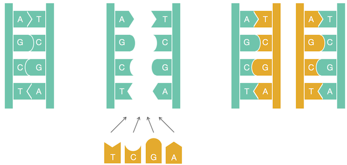
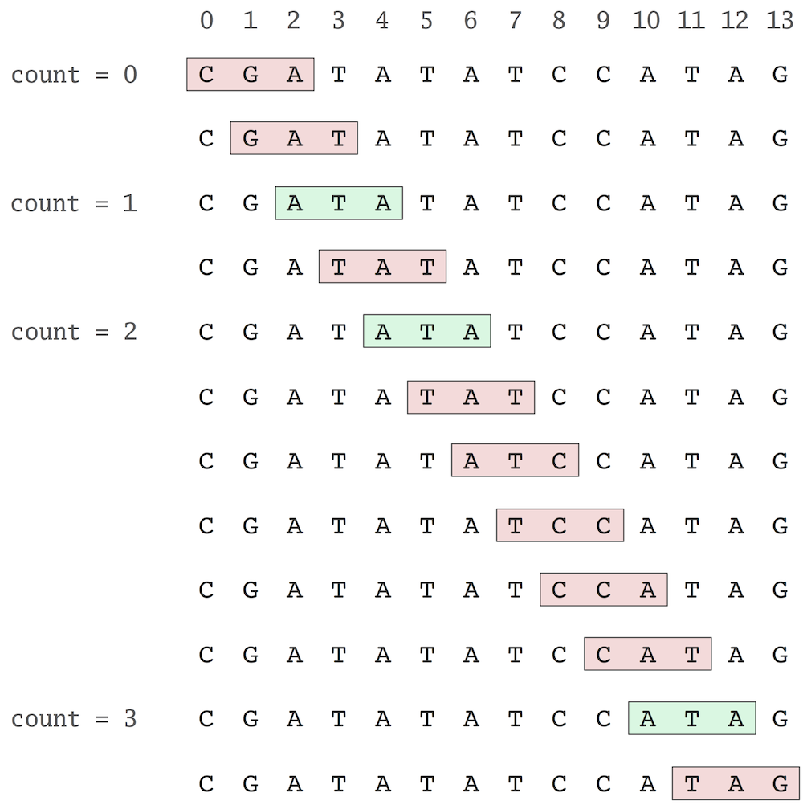
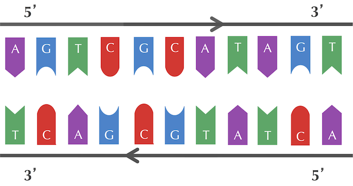

# DNA 复制从哪里开始

- [DNA 复制从哪里开始](#dna-复制从哪里开始)
  - [千里之行始于足下](#千里之行始于足下)
  - [复制起点中的隐藏信息](#复制起点中的隐藏信息)
    - [DnaA box](#dnaa-box)
    - [计数](#计数)
    - [最高频单词](#最高频单词)
  - [进一步筛选](#进一步筛选)

2021-12-24, 11:43
***

## 千里之行始于足下

基因组复制（genome replication）是细胞中最重要的任务之一。在细胞分裂之前，需要先复制自己的基因组，这样两个子细胞才能继承完整的基因组。1953 年，James Watson 和 Francis Crick 完整了他们具有里程碑意义的 DNA 双螺旋结构论文，其中有一句话非常著名：

> "It has not escaped our notice that the specific pairing we have postulated immediately suggests a possible copying mechanism for the genetic material."

基本意思是：DNA 双螺旋假设的配对暗含了遗传物质可能的复制机制。

他们推测，在复制过程中，亲本 DNA 分子的两条链会打开（unwind），然后两个亲本链（parent strand）都充当新链合成的模板。因此，复制过程以一堆互补链开始，以两对互补链结束。如下图所示：



> DNA 复制的简单图示。腺嘌呤（adenine, A）和胸腺嘧啶（thymine, T）互补，胞嘧啶（cytosine, C）和鸟嘌呤（guanine, G）互补。互补的核苷酸在 DNA 中互相结合。

上图展示的 DNA 复制过程很简单，而实际的 DNA 复制过程比 Watson 和 Crick 想象得要复杂很多。下面我们会看到，有大量的分参与了 DNA 复制过程。

DNA 复制从一个称为**复制起点**（replication origin，简称 `ori`）的基因组区域开始，并由分子复制机器 DNA 聚合酶（polymerase）负责执行。定位 `ori`  对了解细胞如何复制、解决各种各种生物医学问题都非常重要。例如，一些基因疗法使用转基因（genetically engineered） mini 基因组，也称为**病毒载体**（viral vector），因为它们像病毒一样可以穿过细胞壁（cell walls）。携带人工基因的病毒载体已广泛应用于农业，如转基因的抗冻番茄，抗杀虫剂的玉米等。1990 年，基因疗法首次成功地应用在人身上，挽救了一名患有免疫缺陷症的 4 岁女孩的生命，患有免疫缺陷的人很容易受到感染，只能在无菌的环境中生活。

基因疗法的基本思想是，将含有编码治疗性蛋白质的人工基因放到病毒载体中，再用病毒载体去感染缺乏该关键基因的患者。载体进入细胞后就开始复制，并最终表达许多治疗性的蛋白质分析，从而治疗病人疾病。为了确保载体在细胞内能够复制，就必须知道 `ori` 在载体基因组里的位置，并确保插入人工基因不会影响到它。

在下面的问题种，我们假设一个基因组只有一个 `ori`，DNA 序列由包含四个碱基 `{A, C, G, T}` 的字符串组成。

所以，**寻找复制起点的问题**可以总结为：

- 输入：包含基因组的 DNA 字符串
- 输出：`ori` 在基因组中的位置

这是一个合理的生物学问题，但是并不是一个定义明确的计算问题。生物学家可能会计划使用实验来定位 `ori`，例如，从基因组中删除各种短片段，并最终找到一个片段，将其删除会使复制停止。而单纯从计算科学家的角度则无法解决该问题，需要更多信息。

之所以要关注计算科学家的想法？因为现代生物学中许多问题唯有计算方法才能解决。首先，这些方法比实验方法更快；其次，没有计算分析，许多实验结果无法解释。另外，现有的 `ori` 预测实验方法都相当耗时，只有少数几个物种的 `ori` 是用实验方法确定的。如果能设计一种计算方法确定 `ori`，就可以节省大量时间和金钱。

## 复制起点中的隐藏信息

细菌的基因组相对简单，大多数细菌基因组为单个环形染色体。下面我们将重点关注如何在细菌基因组中发现 `ori` 这个相对容易的情况。

### DnaA box

研究表明，细菌基因组编码 `ori` 的区域通常只有几百个核苷酸的长度。我们进化从一个已知 `ori` 的细菌开始，确定 `ori` 基因组区域有什么特殊之处，以便设计一个在其它细菌中发现 `ori` 的计算方法。我们以引起霍乱的霍乱弧菌（Vibrio cholerae）为例，下面是霍乱弧菌 `ori` 序列：

```txt
atcaatgatcaacgtaagcttctaagcatgatcaaggtgctcacacagtttatccacaac 
ctgagtggatgacatcaagataggtcgttgtatctccttcctctcgtactctcatgacca 
cggaaagatgatcaagagaggatgatttcttggccatatcgcaatgaatacttgtgactt 
gtgcttccaattgacatcttcagcgccatattgcgctggccaaggtgacggagcgggatt 
acgaaagcatgatcatggctgttgttctgtttatcttgttttgactgagacttgttagga 
tagacggtttttcatcactgactagccaaagccttactctgcctgacatcgaccgtaaat 
tgataatgaatttacatgcttccgcgacgatttacctcttgatcatcgatccgattgaag 
atcttcaattgttaattctcttgcctcgactcatagccatgatgagctcttgatcatgtt 
tccttaaccctctattttttacggaagaatgatcaagctgctgctcttgatcatcgtttc
```

霍乱弧菌的染色体包含一百多万个核苷酸，细菌的细胞是如何知道在这个长度为 540 的区域开始复制的呢？因此在 `ori` 区域一定带有某些隐藏信息，命令细胞从这里开始复制。事实上我们知道复制是由 **DnaA** 介导的。DnaA 是一种蛋白质，它和 `ori` 中一个称为 **DnaA box** 的短片段结合。你可以把 DnaA box 想象成 DNA 序列中的一条信息，告诉 DnaA：就在这里结合。问题是如何在事先不知道的DnaA box 序列的情况下找到这个隐藏的信息。

**隐藏信息问题**：找到复制起点中的隐藏信息。

- 输入：一段序列（一条字符串）
- 输出：字符串中隐藏的信息

### 计数

尽管隐藏信息问题是一个合理问题，但从计算角度来说，它仍然毫无意义，因为**隐藏信息**的概念并没有得到精确定义。

在各种生物过程中，某些核苷酸片段经常出现在基因组的某个区域。这通常是因为某些蛋白质只在特定的核苷酸链存在的情况才能与 DNA 结合，如果这个片段出现多次，那么这种结合就可能发生。

例如，"ACA**ACTAT**GCAT**ACTAT**CGGGA**ACTAT**CCT" 就多次出现 "ACTAT"。如果我们将长度为 k 的字符串定义为 k-mer，并将 `PatternCount(Pattern, Text)` 定义为 `Pattern` 在 `Text` 中出现的次数，则有：

```python
PatternCount("ACTAT", "ACAACTATGCATACTATCGGGAACTATCCT") = 3
```

需要注意的是 `PatternCount("ATA", "CGATATATCCATAG")=3` 而不是2，要考虑重叠的情况。

在找高频 k-mer 之前，我们要计算 `PatternCount(Pattern, Text)`。其思路如下图所示：



即将 `Text` 所有长度为 `k` 的子序列和 `Pattern` 进行匹配。下面使用 Python 实现该功能：

```python
def PatternCount(Text, Pattern):
    count = 0
    for i in range(len(Text) - len(Pattern) + 1):
        if Text[i:i + len(Pattern)] == Pattern:
            count = count + 1
    return count
```

### 最高频单词

如果 `Pattern` 在 `Text` 所有 k-mer 中出现最频繁，即满足 `PatternCount(Pattern, Text)` 在所有 k-mer 中值最大，则称其为最高频 k-mer。比如，**"ACTAT"** 是 Text = "ACAACTATGCATACTATCGGGAACTATCCT" 的最高品 5-mer，**"ATA"** 是 Text = "CGATATATCCATAG" 的最高频 3-mer。

现在我们总算有一个严格定义的计算问题，即在复制起点查找高频 k-mer。

高频 k-mer 问题：找到字符串中出现次数最多的 k-mer：

- **输入：** 字符串 Text 和整数 k
- **输出：** Text 中所有最高频 k-mers

要在字符串 `Text` 中找到最高频 k-mer，我们需要创建 k-mer 到出现次数的映射关系，例如对 Text = "CGATATATCCATAG"， k=3，映射关系如下：

```txt
ATA --> 3
ATC --> 1
CAT --> 1
CCA --> 1
CGA --> 1
GAT --> 1
TAT --> 2
TCC --> 1
TAG --> 1
```

我们称这个结构为 **frequency map** (简称 fmap)。当为文本 `Text` 和 `k` 创建频率表后，可以很容易找到出现次数最多的 k-mer。

使用 Python 的字典可以很容易地实现 fmap:

```python
def FrequencyMap(Text, k):
    freq = {}
    n = len(Text)
    for i in range(n - k + 1):
        Pattern = Text[i:i + k]
        freq[Pattern] = 0
    for i in range(n - k + 1):
        Pattern = Text[i:i + k]
        freq[Pattern] = freq[Pattern] + 1
    return freq
```

下一步，我们要从 fmap 中找到最大值，并返回最大值对应的键。我们以函数 `FrequentWords(Text, k)` 表示该功能。

例如，对文本 Text = "CGATATATCGAT" 和 k=3，我们有如下的 fmap，希望返回一个 list，包含最大值 2 对应的 keys.

```txt
ATA --> 2
ATC --> 1
CGA --> 1
GAT --> 2
TAT --> 2
```

先创建一个空 list，用来保存所有的最高频 k-mer：

```python
words = []
```

然后，生成 `Text` 和 `k` 的 fmap：

```python
freq = FrequencyMap(Text, k)
```

dict 的 `values()` 返回字典的所有值的列表，而 Python 内置函数 `max()` 可以找到列表中的最大值。因此我们可以按如下方式找到 fmap 中的最大值：

```python
m = max(freq.values())
```

最后，找到 fmap 中和最大值 `m` 相等的每个 key。此时需要用到循环：

```python
for key in freq:
```

完整的 `FrequentWords` 函数如下：

```python
def FrequentWords(Text, k):
    words = []
    freq = FrequencyMap(Text, k)
    m = max(freq.values())
    for key in freq:
        # add each key to words whose corresponding frequency value is equal to m
    return words
```

实验表明，细菌 DnaA boxes 通常包含 9 个核苷酸。霍乱弧菌的 `ori` 中 9-mer 如下：

atcaatgatcaacgtaagcttctaagc**ATGATCAAG**gtgctcacacagtttatccacaac
ctgagtggatgacatcaagataggtcgttgtatctccttcctctcgtactctcatgacca
cggaaag**ATGATCAAG**agaggatgatttcttggccatatcgcaatgaatacttgtgactt
gtgcttccaattgacatcttcagcgccatattgcgctggccaaggtgacggagcgggatt
acgaaagcatgatcatggctgttgttctgtttatcttgttttgactgagacttgttagga
tagacggtttttcatcactgactagccaaagccttactctgcctgacatcgaccgtaaat
tgataatgaatttacatgcttccgcgacgatttacctcttgatcatcgatccgattgaag
atcttcaattgttaattctcttgcctcgactcatagccatgatgagctcttgatcatgtt
tccttaaccctctattttttacggaaga**ATGATCAAG**ctgctgctcttgatcatcgtttc

一个 9-mer 在长度为 500 的随机 DNA 序列中随机出现三次或以上基本不可能。而上述区域中有 4 个不同的 9-mer 重复三次以上：

- "ATGATCAAG"
- "CTTGATCAT"
- "TCTTGATCA"
- "CTCTTGATC"

在霍乱弧菌的 `ori` 区，一个 9-mer 重复出现的概率很低，如果在一个短区域中重复出现了，就认为它是潜在的 DnaA box，会启动复制。但是这四个里是哪一个呢？

## 进一步筛选

核苷酸 A 和 T 互补，C 和 G 互补。如下图所示，是两条互补的 DNA 链：



可以将其想象成在模板链上合成一条互补链，模板链为 "AGTCGCATAGT"，互补链为 "ACTATGCGACT"。

这里需要注意的是，DNA 链的开始和结尾分别标记为 5' 和 3'，每条 DNA 链都是从 5'->3' 方向读取，互补链和模板链的方向相反。

DNA 