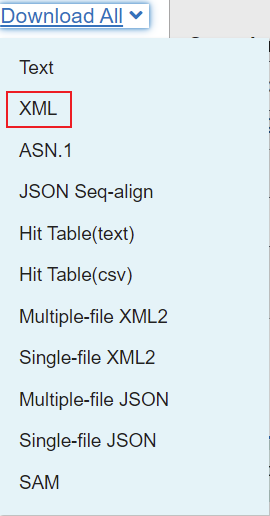
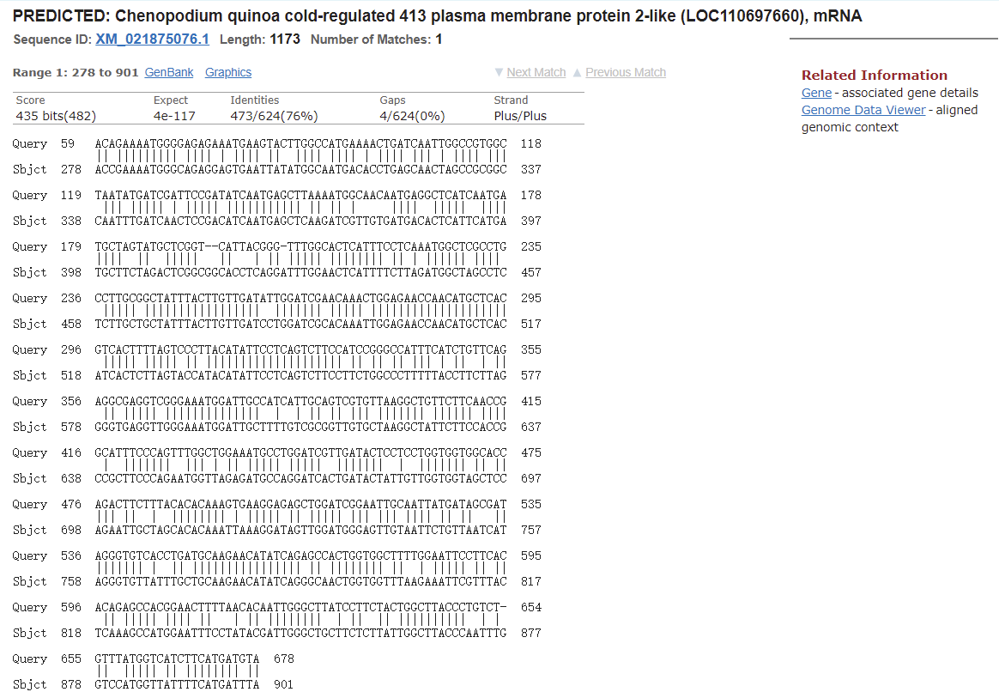

# BLAST

- [BLAST](#blast)
  - [简介](#简介)
  - [运行 NCBI-BLAST](#运行-ncbi-blast)
  - [本地运行 BLAST](#本地运行-blast)
    - [NCBI BLAST+](#ncbi-blast)
  - [BLAST 输出文件解析](#blast-输出文件解析)
    - [BLAST Record](#blast-record)
    - [Header](#header)
    - [Description](#description)
    - [Alignment](#alignment)
    - [HSP](#hsp)
  - [参考](#参考)

2021-10-12, 19:26
@author Jiawei Mao
***

## 简介

使用 biopython 处理 BLAST 可以分为两步：

1. 运行 BLAST，获得输出结果；
2. 解析 BLAST 输出文件，进一步分析。

## 运行 NCBI-BLAST

使用 `Bio.Blast.NCBIWWW` 模块中的 `qblast()` 函数调用在线的 BLAST。该函数签名如下：

```py
qblast(
    program,
    database,
    sequence,
    url_base=NCBI_BLAST_URL,
    auto_format=None,
    composition_based_statistics=None,
    db_genetic_code=None,
    endpoints=None,
    entrez_query="(none)",
    expect=10.0,
    filter=None,
    gapcosts=None,
    genetic_code=None,
    hitlist_size=50,
    i_thresh=None,
    layout=None,
    lcase_mask=None,
    matrix_name=None,
    nucl_penalty=None,
    nucl_reward=None,
    other_advanced=None,
    perc_ident=None,
    phi_pattern=None,
    query_file=None,
    query_believe_defline=None,
    query_from=None,
    query_to=None,
    searchsp_eff=None,
    service=None,
    threshold=None,
    ungapped_alignment=None,
    word_size=None,
    short_query=None,
    alignments=500,
    alignment_view=None,
    descriptions=500,
    entrez_links_new_window=None,
    expect_low=None,
    expect_high=None,
    format_entrez_query=None,
    format_object=None,
    format_type="XML",
    ncbi_gi=None,
    results_file=None,
    show_overview=None,
    megablast=None,
    template_type=None,
    template_length=None,
)
```

`qblast()` 函数需要三个必需参数：

1. `program` 参数是程序名称的小写形式。可用程序参考 [NCBI](https://blast.ncbi.nlm.nih.gov/Blast.cgi)，目前 qblast 支持 blastn, blastp, blastx, tbalst 和 tblastx；
2. `database` 指定待搜索的数据库，可用数据库可以参考 NCBI BLAST 页面；
3. `sequence` 指定待检索的序列，可以是序列本身，也可以是 fasta 文件，或者是序列的识别号。

`qblast` 函数还有很多其它的参数，和 BLAST 网页上的参数基本一致。

- `qblast` 函数返回的 BLAST 结果支持多种格式，可以通过 `format_type` 参数设置，包括："HTML", "Text", "ASN.1" 和 "XML"，默认为 XML。
- 参数 `expect` 设置期望阈值。

> 需要注意的是，NCBI BLAST 网站上 BLAST 的默认参数和 QBLAST 的默认参数不完全一样，使用前需仔细检查。

**例1**，使用 blastn 程序，即核酸对核酸数据库进行 BLAST：

```py
>>> from Bio.Blast import NCBIWWW
>>> result_handle = NCBIWWW.qblast('blastn', 'nt', '8332116')
```

说明：

- 'nt'是 Nucleotide collection 数据库，该数据库包含 GenBank+EMBL+DDBJ+PDB+RefSeq 的核酸序列；
- 8332116 是一条 mRNA 的 GI 号。

**例2**，直接提交 `Seq` 类型进行 BLAST：

```py
>>> from Bio.Blast import NCBIWWW
>>> from Bio import SeqIO
>>> record = SeqIO.read("m_cold.fasta", format="fasta")
>>> result_handle = NCBIWWW.qblast("blastn", "nt", record.seq)
```

上面 `record.seq` 是一个 `Seq` 类型，由于没有给出识别号，BLAST 会自动给该序列分配一个识别号。

**例3**，提交 FASTA 格式字符串：

```py
>>> from Bio.Blast import NCBIWWW
>>> from Bio import SeqIO
>>> record = SeqIO.read("m_cold.fasta", format="fasta")
>>> result_handle = NCBIWWW.qblast("blastn", "nt", record.format("fasta"))
```

如果序列是以 genbank 格式保存，使用该方法转换为 FASTA 进行 BLAST 比较合适。

**例4**，将 BLAST 结果输出到文件：

```py
>>> with open("my_blast.xml", "w") as out_handle:
... out_handle.write(result_handle.read())
...
>>> result_handle.close()
```

BLAST 完成后，默认返回 XML 格式的结果，使用 `result_handle.read()` 可以读取为字符串（注意，只能调用一次，再次调用返回空字符串）。

执行该操作后，BLAST 结果就保存到 'my_blast.xml' 文件中。

## 本地运行 BLAST

本地 BLAST 相对于网络 BLAST 至少有两个优势：

- 本地 BLAST 可能更快；
- 本地 BLAST 可以自定义搜索数据库。

另外对没有发表的数据，本地 BLAST 更安全。本地 BLAST 的缺点：

- 需要安装命令行工具；
- 需要配置数据库。

### NCBI BLAST+

NCBI BLAST+ 在 2009 年发布。

## BLAST 输出文件解析

Biopython 主要支持 BLAST 输出的 XML 格式。

在 NCBI-BLAST 结果页面选择 XML 格式下载：



首先打开该文件：

```py
>>> result_handle = open("my_blast.xml")
```

如果文件中只有一条序列的 BLAST 结果，则可以用 `NCBIXML.read` 函数读取该结果：

```py
>>> from Bio.Blast import NCBIXML
>>> blast_record = NCBIXML.read(result_handle)
```

如果 XML 文件中包含多条序列的BLAST 结果，则可以使用 `NCBIXML.parse` 函数：

```py
>>> from Bio.Blast import NCBIXML
>>> blast_records = NCBIXML.parse(result_handle)
```

这里 `blast_records` 是一个迭代器对象，可通过 for 循环依次访问不同序列的 BLAST 结果。

### BLAST Record

`Bio.Blast.Record` 类用于封装 BLAST 的输出结果。其包含的信息分为以下几部分：

- Header
- Description
- Alignment
- HSP
- MultipleAlignmeent
- DatabaseReport
- Parameters

### Header

Header 包含 NCBI-BLAST  结果页面上面的信息。

- `application` 属性为 BLAST 程序名称

对应 XML 文件中的 `<BlastOutput_program>` 元素值：

```py
>>> result_handle = open(r'my_blast.xml')
>>> from Bio.Blast import NCBIXML
>>> record = NCBIXML.read(result_handle)
>>> record.application
'BLASTN'
```

- `version` 为使用程序的版本

对应 XML 文件中 `<BlastOutput_version>` 元素值：

```py
>>> record.version
'2.12.0+'
```

- `date` 是生成该数据的日期

如果文件中不包含该信息，则返回空字符串：

```py
>>> record.date
''
```

- `reference` 是对 blast 的引用

对应 `<BlastOutput_reference>` 元素值：

```py
>>> record.reference
'Stephen F. Altschul, Thomas L. Madden, Alejandro A. Sch&auml;ffer, Jinghui Zhang, Zheng Zhang, Webb Miller, and David J. Lipman (1997), "Gapped BLAST and PSI-BLAST: a new generation of protein database search programs", Nucleic Acids Res. 25:3389-3402.'
```

- `query` 是检索序列名称

对应 XML 中`<BlastOutput_query-def>` 元素值，BLAST 页面中的 Description 字段值。

```py
>>> record.query
"MP14H09 MP Mesembryanthemum crystallinum cDNA 5' similar to cold acclimation protein, mRNA sequence"
```

- `query_letters` 表示序列长度

对应 `<BlastOutput_query-len>` 元素值，BLAST 页面中的 "Query Length" 字段。

```py
>>> record.query_letters
1111
```

- `database` 为数据库名称

对应 XML 文件中的 `<BlastOutput_db>` 元素值，BLAST 页面中的 "Database" 字段。

```py
>>> record.database
'nt'
```

- `database_sequences` 为数据库中序列的条数

对应 XML 中的 `<Statistics_db-num>` 元素值。

```py
>>> record.database_sequences
74668810
```

- `database_letters` 为数据库中字符个数

对应 XML 中的 `<Statistics_db-len>`。

```py
>>> record.database_letters
```

### Description

`Description` 保存单个 hit 的描述信息。一个 `Record` 包含多个 hit，每个 hit 对应一个 `Description`，均保存在 `descriptions` list 中。和 BLAST 页面中 "Descriptions" 对应。例如：

```py
>>> descriptions = record.descriptions
>>> type(descriptions)
<class 'list'>
>>> len(descriptions)
100
```

每条 `Description` 包含如下信息：

- `title` 为 hit 标题

对应 XML 文件中的 `<Hit_id>` 元素值。

```py
>>> description = descriptions[0]
>>> description.title
'gi|1219041180|ref|XM_021875076.1| PREDICTED: Chenopodium quinoa cold-regulated 413 plasma membrane protein 2-like (LOC110697660), mRNA'
```

- `accession` 为 hit 对应数据库中序列的识别号

对应 XML 文件中的 `<Hit_accession>` 元素值。

```py
>>> description.accession
'XM_021875076'
```

- `score`

高分片段对（High-scoring Segment Pair, HSP）打分，对应 `<Hsp_score>` 元素值。

```py
>>> description.score
482.0
```

- `bits` 为 bit-score 值

对应 XML 中的 `<Hsp_bit-score>`。

```py
>>> description.bits
435.898
```

- `e` 为 e-value

对应 XML 中的 `<Hsp_evalue>` 元素。

```py
>>> description.e
3.58027e-117
```

- `num_alignments`，同一个对象的对齐次数。

目前不理解其用途。

```py
>>> description.num_alignments
1
```

### Alignment

Alignment 表示比对的两条序列，也称为 hit。每个 hit 包含一个或多个 HSP。

所有的 alignment 保存在 `alignments` 列表中：

```py
>>> alignments = record.alignments
>>> len(alignments)
100
```

- `title` 是比对标题

对应 XML 文件中 `<Hit_id>` 和 `<Hit_def>` 的加和。

```py
>>> alignment = alignments[0]
>>> alignment.title
'gi|1219041180|ref|XM_021875076.1| PREDICTED: Chenopodium quinoa cold-regulated 413 plasma membrane protein 2-like (LOC110697660), mRNA'
```

- `accession` 是对应数据库中序列的 accession

对应 XML 文件中的 `<Hit_accession>`

```py
>>> alignment.accession
'XM_021875076'
```

- `hit_def` 即 hit 名称

对应 XML 文件中的 `<Hit_def>`

```py
>>> alignment.accession
'XM_021875076'
```

- `hit_id`

对应 XML 中的 `<Hit_id>`

```py
>>> alignment.hit_id
'gi|1219041180|ref|XM_021875076.1|'
```

- `length` 为数据库中序列长度

```py
>>> alignment.length
1173
```

### HSP

HSP 表示高分片段对（High-scoring Segment Pair, HSP），是输出结果中最重要的一部分。



```py
>>> hsps = alignment.hsps
>>> len(hsps)
1
>>> hsp = hsps[0]
```

- `score` 为原始打分

对应 XML 中的 `<Hsp_score>` 元素。

该打分会随着打分矩阵的变化而变化，因此不能用作不同搜索中的比较。

```py
>>> hsp.score
482.0
```

- `bits` 为 bit score

`score` 的标准化值，相对更有价值，可用在不同搜索中比较。

对应 XML 中的 `<Hsp_bit-score>`。

```py
>>> hsp.bits
435.898
```

- `expect` 期望值

`<Hsp_evalue>` 元素。

```py
>>> hsp.expect
3.58027e-117
```

- `identities`，相同残基数 

`<Hsp_identity>` 元素值。

```py
>>> hsp.identities
473
```

- `positives`，positive 匹配残基数。 

`<Hsp_positive>` 元素值。

```py
>>> hsp.positives
473
```

- `gaps` gap 数

`<Hsp_gaps>` 元素值。

```py
>>> hsp.gaps
4
```

- `align_length`，alignment 长度

`<Hsp_align-len>` 元素值。

```py
>>> hsp.align_length
624
```

- `strand`，匹配链

```py
>>> hsp.strand
('Plus', 'Plus')
```

- `frame`, frame shift 值 

```py
>>> hsp.frame
(1, 1)
```

- `query`，查询序列

```py
>>> hsp.query
'ACAGAAAATGGGGAGAGAAATGAAGTACTTGGCCATGAAAACTGATCAATTGGCCGTGGCTAATATGATCGATTCCGATATCAATGAGCTTAAAATGGCAACAATGAGGCTCATCAATGATGCTAGTATGCTCGGT--CATTACGGG-TTTGGCACTCATTTCCTCAAATGGCTCGCCTGCCTTGCGGCTATTTACTTGTTGATATTGGATCGAACAAACTGGAGAACCAACATGCTCACGTCACTTTTAGTCCCTTACATATTCCTCAGTCTTCCATCCGGGCCATTTCATCTGTTCAGAGGCGAGGTCGGGAAATGGATTGCCATCATTGCAGTCGTGTTAAGGCTGTTCTTCAACCGGCATTTCCCAGTTTGGCTGGAAATGCCTGGATCGTTGATACTCCTCCTGGTGGTGGCACCAGACTTCTTTACACACAAAGTGAAGGAGAGCTGGATCGGAATTGCAATTATGATAGCGATAGGGTGTCACCTGATGCAAGAACATATCAGAGCCACTGGTGGCTTTTGGAATTCCTTCACACAGAGCCACGGAACTTTTAACACAATTGGGCTTATCCTTCTACTGGCTTACCCTGTCT-GTTTATGGTCATCTTCATGATGTA'
```

- `query_start`，查询序列起始位置，1-based

```py
>>> hsp.query_start
59
```

- `query_end`，查询序列结束位置，1-based

```py
>>> hsp.query_end
678
```

- `match`, 匹配序列

```py
>>> hsp.match
'|| ||||||||| |||| | |||| ||  |||| |||| | |||| ||| | |||| ||| ||| ||||| | ||||| ||||||||||| || || |     ||||  |||||  ||||||||  ||  |||||   ||   | || ||||| |||||||| || | |||||| ||||  ||||| |||||||||||||||||  ||||||| ||||| |||||||||||||||||||| ||||| ||||| || |||||||||||||||||||| || || || ||| | ||  | || || ||||| ||||||||||||||  |  | || || ||| ||||||| |||||| |||| |  |||||||  ||| | || ||||| |||||  |||||||  |  ||||||| || ||||| ||  |  |||||||| | ||||| || ||||| ||| ||| |||| || ||   ||||||||| |  || |||||||||||||||| || |||||||| ||  | ||||| || || || ||||| |||| ||   | || ||||||||  | ||  || ||||||||||  | | ||  ||||| || |||||||| ||'
```

- `sbjct`，数据库序列

```py
>>> hsp.sbjct
'ACCGAAAATGGGCAGAGGAGTGAATTATATGGCAATGACACCTGAGCAACTAGCCGCGGCCAATTTGATCAACTCCGACATCAATGAGCTCAAGATCGTTGTGATGACACTCATTCATGATGCTTCTAGACTCGGCGGCACCTCAGGATTTGGAACTCATTTTCTTAGATGGCTAGCCTCTCTTGCTGCTATTTACTTGTTGATCCTGGATCGCACAAATTGGAGAACCAACATGCTCACATCACTCTTAGTACCATACATATTCCTCAGTCTTCCTTCTGGCCCTTTTTACCTTCTTAGGGGTGAGGTTGGGAAATGGATTGCTTTTGTCGCGGTTGTGCTAAGGCTATTCTTCCACCGCCGCTTCCCAGAATGGTTAGAGATGCCAGGATCACTGATACTATTGTTGGTGGTAGCTCCAGAATTGCTAGCACACAAATTAAAGGATAGTTGGATGGGAGTTGTAATTCTGTTAATCATAGGGTGTTATTTGCTGCAAGAACATATCAGGGCAACTGGTGGTTTAAGAAATTCGTTTACTCAAAGCCATGGAATTTCCTATACGATTGGGCTGCTTCTCTTATTGGCTTACCCAATTTGGTCCATGGTTATTTTCATGATTTA'
```

- `sbjct_start`，数据库序列起始位置

```py
>>> hsp.sbjct_start
278
```

- `sbjct_end`，数据库序列结束位置

```py
>>> hsp.sbjct_end
901
```

## 参考

- https://blast.ncbi.nlm.nih.gov/Blast.cgi
- https://biopython.org/
