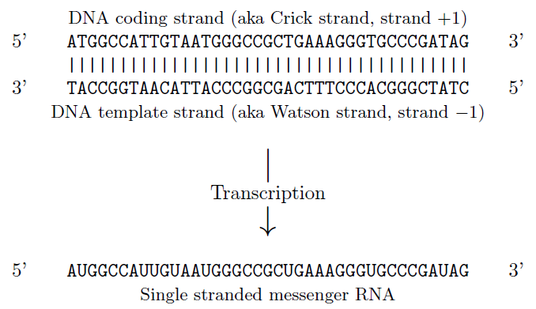

# Seq

- [Seq](#seq)
  - [简介](#简介)
  - [转换为字符串](#转换为字符串)
  - [转录](#转录)
  - [方法](#方法)
    - [find](#find)
    - [index](#index)

2021-11-05, 14:21
***

## 简介

Biopython 使用 `Seq` 对象包装序列。`SeqRecord` 在 `Seq` 的基础上添加了注释信息。

## 转换为字符串

在许多场景需要将 `Seq` 对象转换为字符串。使用 `str()` 内置方法即可：

```py
>>> from Bio.Seq import Seq
>>> my_rna = Seq("GUCAUGGCCAUUGUAAUGGGCCGCUGAAAGGGUGCCCGAUAGUUG")
>>> my_rna
Seq('GUCAUGGCCAUUGUAAUGGGCCGCUGAAAGGGUGCCCGAUAGUUG')
>>> str(my_rna)
'GUCAUGGCCAUUGUAAUGGGCCGCUGAAAGGGUGCCCGAUAGUUG'
```

## 转录

genbank 数据库保存的为 sense strand，也称为 coding strand。如下所示：




## 方法

### find

```py
def find(self, sub, start=None, end=None)
```

同 [index 方法](#index)。

### index

```py
def index(self, sub, start=None, end=None)
```

返回子序列 `sub` 第一次出现的位置。可选参数 `start` 和 `end` 用于指定查找的范围。

这个方法和 'find' 功能一样，只是在没有找到子序列 `sub` 时，`find` 方法返回 -1，而 `index` 抛出 `ValueError`。

**例1**，查找 'AUG' 第一次出现的位置：

```py
>>> from Bio.Seq import Seq
>>> my_rna = Seq("GUCAUGGCCAUUGUAAUGGGCCGCUGAAAGGGUGCCCGAUAGUUG")
>>> my_rna.index("AUG")
3
```

**例2**，指定 `start`，可以避开第一个，查找后面的 'AUG'：

```py
>>> my_rna.index("AUG", 4)
15
```

**例3**，抛出 `ValueError`：

```py
>>> my_rna.index("T")
Traceback (most recent call last):
  File "<stdin>", line 1, in <module>
  File "D:\Python\Python39\lib\site-packages\Bio\Seq.py", line 797, in index
    return self._data.index(sub, start, end)
ValueError: subsection not found
>>> my_rna.find("T")
-1
```
