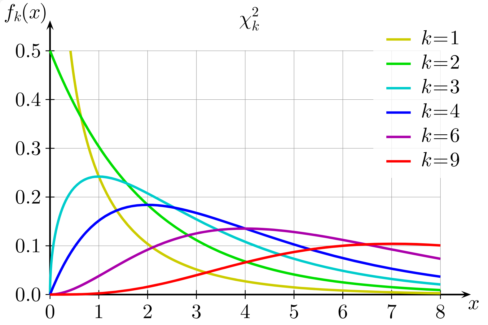

# 卡方分布

- [卡方分布](#卡方分布)
  - [简介](#简介)
  - [方差的检验](#方差的检验)
  - [卡方分布性质](#卡方分布性质)
  - [卡方分布到方差检验](#卡方分布到方差检验)

## 简介

卡方分布（$\chi^2$）可以用来检验总体方差。

- 观测量为 $x$ 的总体的 z 分布

$$
z=\frac{x-\mu}{\sigma}
$$

- 观测量为样本平均值 $\overline{x}$ 的总体的 z 分布

$$
z=\frac{\overline{x}-\mu}{\sigma/\sqrt{n}}
$$

- 用样本 $s$ 替代 $\sigma$，$z$ 分布变为 $t$ 分布

$$
t=\frac{\overline{x}-\mu}{s/\sqrt{n}}
$$

平均值很重要，方差也很重要（平均工资？）。比如，方差在品控中就非常重要，那么如何检验方差？

## 方差的检验

假设总体服从正态分布 $N(\mu,\sigma^2)$：

$$
X_1,\cdots,x_N
$$

随机抽一个样本：

$$
x_1,\cdots,x_n
$$

计算样本 $z^2$：

$$
(\frac{x_1-\mu}{\sigma})^2,\dots,(\frac{x_n-\mu}{\sigma})^2
$$

计算 $z^2$ 加和：

$$
\chi^2=\sum_{i=1}^n z_i^2
$$

反复抽样，得到所有样本大小为 $n$ 的样本的 $\chi^2$ 值，计算频率分布图，它会服从 $\chi^2$ 分布。就是所谓的卡方分布。

卡方分布图：

## 卡方分布性质

1. 不对称

范围 $[0,+\infty)$

2. $E(\chi^2)=n$

3. $\chi^2$ 加性

$$
\chi^2_3=\chi^2_1+\chi^2_2
$$

即两个 $\chi^2$ 分布加起来，还是 $\chi^2$ 分布。且自由度

$$
\nu_3=\nu_1+\nu_2
$$

## 卡方分布到方差检验

卡方分布为什么可以用来检验方差？

$$
\chi^2=\sum_{i=1}^n \frac{(x_i-\mu)^2}{\sigma^2}
$$

手头上只有样本，不知道总体 $\mu$ 和 $\sigma$。

