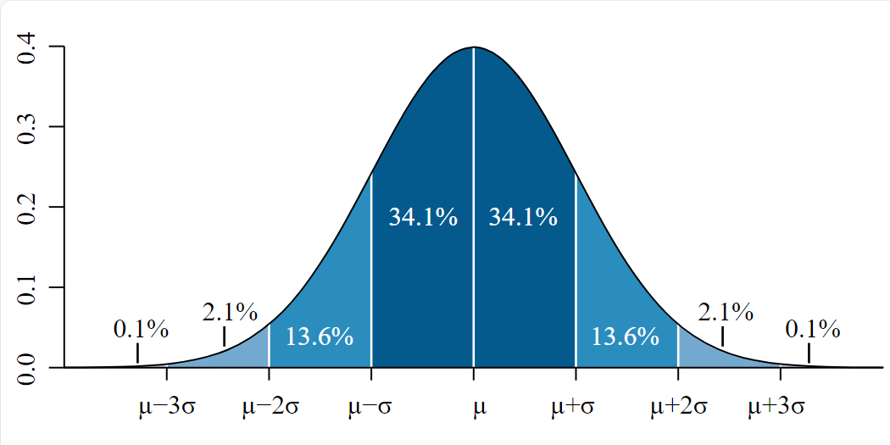
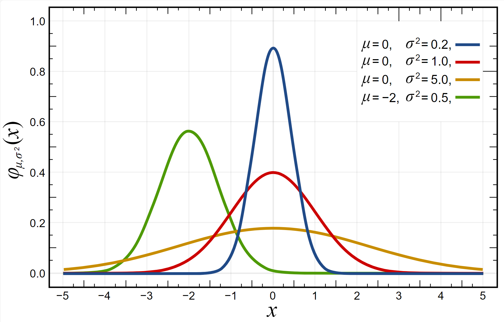

# 正态分布

- [正态分布](#正态分布)
  - [1. 简介](#1-简介)
  - [2. 标准正态分布](#2-标准正态分布)
  - [3. 标准正态分布表](#3-标准正态分布表)
  - [4. 中心极限定理](#4-中心极限定理)

2024-05-07 ⭐
@author Jiawei Mao
***

## 1. 简介

正态分布（normal distribution）：

特点：

- 钟形曲线（bell shape）；
- 中间为均值 $\mu$；
- 两侧对称；
- 积分面积为 1；

正态分布的概率密度函数为：

$$
f(x)=\frac{1}{\sigma\sqrt{2\pi}}e^{-\frac{1}{2}(\frac{x-\mu}{\sigma})^2}
$$

> 不需要背下来，有许多工具可辅助计算正态分布的概率。

正态分布有两个参数（parameter）：$\mu$ 和 $\sigma^2$。所有正态分布通常记为 $N(\mu,\sigma^2)$。不同参数的正态分布：

可以发现：

- 相同 $\mu$，不同 $\sigma$，$\sigma$ 越大，观测值越分散，正态分布曲线越扁；
- 相同 $\sigma^2$，不同 $\mu$，正态分布曲线水平移动。

## 2. 标准正态分布

每一组 $\mu$, $\sigma^2$ 值，对应一个正态分布，有无数个正态分布。当 $\mu=0$, $\sigma^2=1$，称为**标准正态分布**，记为 $N(0,1)$。

对正态分布 $N(\mu,\sigma^2)$：

$$
z_i=\frac{X_i-\mu}{\sigma}
$$

服从标准正态分布 $N(0,1)$。这个操作称为 **z-转换**（z-transformation）。

> 根据平均值和方差的定义，很容易理解为何 z 服从 $N(0,1)$ 分布。

将 $N(\mu,\sigma^2)$ 转换为 $N(0,1)$，便于概率计算。

## 3. 标准正态分布表

|Z |.00 |.01 |.02 |.03 |.04 |.05 |.06 |.07 |.08 |.09 |
|---|---|---|---|---|---|---|---|---|---|---|
|-3.9   |.00005 |.00005 |.00004 |.00004 |.00004 |.00004 |.00004 |.00004 |.00003 |.00003 |
|-3.8   |.00007 |.00007 |.00007 |.00006 |.00006 |.00006 |.00006 |.00005 |.00005 |.00005 |
|-3.7   |.00011 |.00010 |.00010 |.00010 |.00009 |.00009 |.00008 |.00008 |.00008 |.00008 |
|-3.6   |.00016 |.00015 |.00015 |.00014 |.00014 |.00013 |.00013 |.00012 |.00012 |.00011 |
|-3.5   |.00023 |.00022 |.00022 |.00021 |.00020 |.00019 |.00019 |.00018 |.00017 |.00017 |
|-3.4   |.00034 |.00032 |.00031 |.00030 |.00029 |.00028 |.00027 |.00026 |.00025 |.00024 |
|-3.3   |.00048 |.00047 |.00045 |.00043 |.00042 |.00040 |.00039 |.00038 |.00036 |.00035 |
|-3.2   |.00069 |.00066 |.00064 |.00062 |.00060 |.00058 |.00056 |.00054 |.00052 |.00050 |
|-3.1   |.00097 |.00094 |.00090 |.00087 |.00084 |.00082 |.00079 |.00076 |.00074 |.00071 |
|-3.0   |.00135 |.00131 |.00126 |.00122 |.00118 |.00114 |.00111 |.00107 |.00104 |.00100 |
|-2.9   |.00187 |.00181 |.00175 |.00169 |.00164 |.00159 |.00154 |.00149 |.00144 |.00139 |
|-2.8   |.00256 |.00248 |.00240 |.00233 |.00226 |.00219 |.00212 |.00205 |.00199 |.00193 |
|-2.7   |.00347 |.00336 |.00326 |.00317 |.00307 |.00298 |.00289 |.00280 |.00272 |.00264 |
|-2.6   |.00466 |.00453 |.00440 |.00427 |.00415 |.00402 |.00391 |.00379 |.00368 |.00357 |
|-2.5   |.00621 |.00604 |.00587 |.00570 |.00554 |.00539 |.00523 |.00508 |.00494 |.00480 |
|-2.4   |.00820 |.00798 |.00776 |.00755 |.00734 |.00714 |.00695 |.00676 |.00657 |.00639 |
|-2.3   |.01072 |.01044 |.01017 |.00990 |.00964 |.00939 |.00914 |.00889 |.00866 |.00842 |
|-2.2   |.01390 |.01355 |.01321 |.01287 |.01255 |.01222 |.01191 |.01160 |.01130 |.01101 |
|-2.1   |.01786 |.01743 |.01700 |.01659 |.01618 |.01578 |.01539 |.01500 |.01463 |.01426 |
|-2.0   |.02275 |.02222 |.02169 |.02118 |.02068 |.02018 |.01970 |.01923 |.01876 |.01831 |
|-1.9   |.02872 |.02807 |.02743 |.02680 |.02619 |.02559 |.02500 |.02442 |.02385 |.02330 |
|-1.8   |.03593 |.03515 |.03438 |.03362 |.03288 |.03216 |.03144 |.03074 |.03005 |.02938 |
|-1.7   |.04457 |.04363 |.04272 |.04182 |.04093 |.04006 |.03920 |.03836 |.03754 |.03673 |
|-1.6   |.05480 |.05370 |.05262 |.05155 |.05050 |.04947 |.04846 |.04746 |.04648 |.04551 |
|-1.5   |.06681 |.06552 |.06426 |.06301 |.06178 |.06057 |.05938 |.05821 |.05705 |.05592 |
|-1.4   |.08076 |.07927 |.07780 |.07636 |.07493 |.07353 |.07215 |.07078 |.06944 |.06811 |
|-1.3   |.09680 |.09510 |.09342 |.09176 |.09012 |.08851 |.08691 |.08534 |.08379 |.08226 |
|-1.2   |.11507 |.11314 |.11123 |.10935 |.10749 |.10565 |.10383 |.10204 |.10027 |.09853 |
|-1.1   |.13567 |.13350 |.13136 |.12924 |.12714 |.12507 |.12302 |.12100 |.11900 |.11702 |
|-1.0   |.15866 |.15625 |.15386 |.15151 |.14917 |.14686 |.14457 |.14231 |.14007 |.13786 |
|-0.9   |.18406 |.18141 |.17879 |.17619 |.17361 |.17106 |.16853 |.16602 |.16354 |.16109 |
|-0.8   |.21186 |.20897 |.20611 |.20327 |.20045 |.19766 |.19489 |.19215 |.18943 |.18673 |
|-0.7   |.24196 |.23885 |.23576 |.23270 |.22965 |.22663 |.22363 |.22065 |.21770 |.21476 |
|-0.6   |.27425 |.27093 |.26763 |.26435 |.26109 |.25785 |.25463 |.25143 |.24825 |.24510 |
|-0.5   |.30854 |.30503 |.30153 |.29806 |.29460 |.29116 |.28774 |.28434 |.28096 |.27760 |
|-0.4   |.34458 |.34090 |.33724 |.33360 |.32997 |.32636 |.32276 |.31918 |.31561 |.31207 |
|-0.3   |.38209 |.37828 |.37448 |.37070 |.36693 |.36317 |.35942 |.35569 |.35197 |.34827 |
|-0.2   |.42074 |.41683 |.41294 |.40905 |.40517 |.40129 |.39743 |.39358 |.38974 |.38591 |
|-0.1   |.46017 |.45620 |.45224 |.44828 |.44433 |.44038 |.43644 |.43251 |.42858 |.42465 |
|-0.0   |.50000 |.49601 |.49202 |.48803 |.48405 |.48006 |.47608 |.47210 |.46812 |.46414 |

如图所示：

- $z$ 就是横坐标对应的值；
- 表的 column-title 是 z 的小数 1 位值，row-title 是 z 的小数 2 位，两个连起来就是 z 的值；
- 表格的值为面积，即在 $N(0,1)$ 分布中 $z$ 左侧的面积，即 $(-\infty, z)$ 的面积。

## 4. 中心极限定理

中心极限定理（central limit theorem）：

- 对总体 $X_1,\cdots,X_N$ 多次抽样
  - $x_1,\cdots,x_n$
  - $x_1,\cdots,x_n$
  - $x_1,\cdots,x_n$
- 当 $n$ 足够大：
  - $\overline{X}$ 趋近于正态分布 $N(\mu_{\overline{X}}=\mu_X, \sigma_{\overline{X}}^2=\frac{\sigma_X^2}{n})$

> 这里不要求总体满足正态分布，只需要 $n\ge 30$；
> 如果总体满足正态分布，则不要求 $n \ge 30$。

根据中心极限定理，可以用样本估计非正态总体的均值和方差：

- $\mu_{\overline{X}}=\mu_X$
- $\sigma^2_{\overline{X}}=\frac{\sigma^2_x}{n}$

样本量 $n$ 越大，样本 $\sigma^2_{\overline{X}}$ 越小。

这个过程实际上是：

- 用样本平均值 $\overline{X}$ 来估计样本平均值的平均值 $\mu_{\overline{X}}$；
- 再用 $\mu_{\overline{X}}$ 来估计总体的在平均值 $\mu_X$;
- 用样本方差 $s^2_X$ 来估计平均值的方差 $s^2_{\overline{X}}=\frac{s^2_X}{n}$；
  - 所以平均值的标准偏差为 $s_{\overline{x}}=\frac{s_x}{\sqrt{n}}$
- 再用平均值的方差来计算总体方差 $\sigma^2_{\overline{X}}=\frac{\sigma^2_X}{n}$；

所以，中心极限定理以样本平均值的总体作为过度，提供从样本估计非正态总体的理论基础。

对 $N(\mu_{\overline{X}}=\mu_X, \sigma_{\overline{X}}^2=\frac{\sigma_X^2}{n})$ 进行 z-变换：

$$
z=\frac{\overline{X}-\mu_{\overline{X}}}{\sigma_{\overline{X}}}=\frac{\overline{X}-\mu_{\overline{X}}}{\sigma_X/\sqrt{n}}
$$

> 理解重点：变量从 $X$ 变成 $\overline{X}$，总体平均值不变，方差变小 $\sqrt{n}$ 倍。
