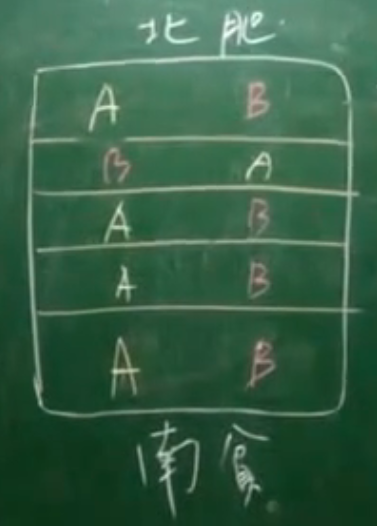

# paired-t test

- [paired-t test](#paired-t-test)
  - [1. 简介](#1-简介)
  - [2. 概念](#2-概念)
  - [3. 示例](#3-示例)
  - [总结](#总结)

2024-05-09 ⭐
@author Jiawei Mao
***
## 1. 简介

比较两个总体的平均值。提出假设：

$$
H_0: \mu_1=\mu_2
$$

或者更一般的形式：

$$
H_0: \mu_1-\mu_2=\delta
$$

$\delta$ 不用为 0，不过为 0 用的最普遍。

配对-t test (paired-t test) 是 $\mu_1=\mu_2$ 情况的一种特殊形式，或更简单形式。

## 2. 概念

paired-t 比较两个总体，假设：

- 总体 1：$N(\mu_1,\sigma_1^2)$，抽样 $n_1$，样本均值 $\overline{Y}_1$
- 总体 2：$N(\mu_2,\sigma_2^2)$，抽样 $n_2$，样本均值 $\overline{Y}_2$

假设有两种猪饲料，要看它们对猪增重的效果。观测值为增重。现在有 20 只小猪，饲料 A 和 B 各用来喂养 10 只小猪。喂养 2 个月，得到增重平均值分别为 $\overline{Y}_1$ 和 $\overline{Y}_2$。

将 20 只小猪随机分配给饲料 A 和 B 各 10 只，就是**常规 t-test**。

但是遗传因素对小猪体重增长影响很大，所以我们选 10 对小猪，每一对小猪的猪妈妈一样，就每一对小猪再随机拆分到两个饲料，这样就可以排除遗传因素的干扰。这就是 paired 的来源。

自由度：

$$
\text{df}=n-1
$$

对 paired-t test，$n$ 为 pair 数，所以 10 对小猪虽然有 20 只，但 $n=10$。

再举个例子，用两种不同的肥料 A 和 B 给果树施肥，通过收获的水果对比肥料效果。果树要种在地上，土壤的肥沃度从南到北不完全一样。为了排除土壤不同的干扰，此时就可以考虑用 paired-t test。如下图所示：

保证同一个 pair，只有 treatment 不同。

**什么情况下需要 paired-t?**

在分析数据时，两个 treatment 的数据是否必须在一起，顺序能够随意调整？如果必须在一起，那就需要 paired-t，否则就用一般的 t-test。

paired-t 从实验设计到数据分析，都需要满足成对的要求。

## 3. 示例

还是以饲料 A 和 B 喂猪为例，有 5 对小猪，增重情况如下：

|pair|A|B|
|---|---|---|
|1|41|35|
|2|45|40|
|3|39|40|
|4|46|41|
|5|44|39|

每一个 pair 的数据要放在一起，不能上下随意调整。计算差值：

|pair|A|B|$d=A-B$|
|---|---|---|---|
|1|41|35|6|
|2|45|40|5|
|3|39|40|-1|
|4|46|41|5|
|5|44|39|5|

开始假设检验步骤：

1. 提出假设

$$
H_0:\mu_A=\mu_B
$$

等价于：

$$
H_0:\mu_A-\mu_B=0
$$

等价于：

$$
H_0:\mu_d=0
$$

因此虽然是对比两个总体，paired-t test 实际上只需处理一个总体。

最终的假设为：

$$
H_0:\mu_d=0\\
H_a:\mu_d\ne0
$$

2. Assumption
   1. 小猪的增重是正态分布；
   2. 5 对小猪为随机抽样的。
3. $\alpha=0.05$
4. 计算拒绝域

这里用 t-test，双边检验，$\text{df}=4$，查表知：t=2.776。所以拒绝域为：

$$
t<-2.776 \text{ 或 } t>2.776
$$

5. 计算 t 值

样本 $\overline{d}=4$, $s^2=8$。

$$
\begin{aligned}
t&=\frac{\overline{d}-\mu_{\overline{d}}}{s/\sqrt{n}}\\
&=\frac{4-0}{\sqrt{8}/\sqrt{5}}\\
&=3.17
\end{aligned}
$$

6. 下结论

t 值落在拒绝域上，所以拒绝 $H_0$，接受 $H_a$，表示两种饲料养出来的小猪增重不同。有 5% 的概率犯 Type I error。

##  总结

paired-t 会对每组数据做差值或比例，转换为 t-test。所以可以认为 paired-t 是特殊样本的 t-test。

paired-t 中一定有一个 treatment 以外的关键因素，用常规的 t-test，这个因素会影响结果，导致实验不是单因素变量原则。