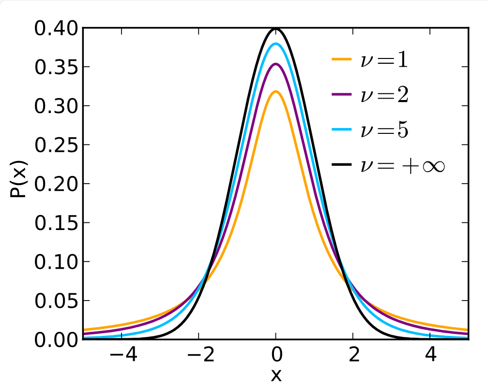
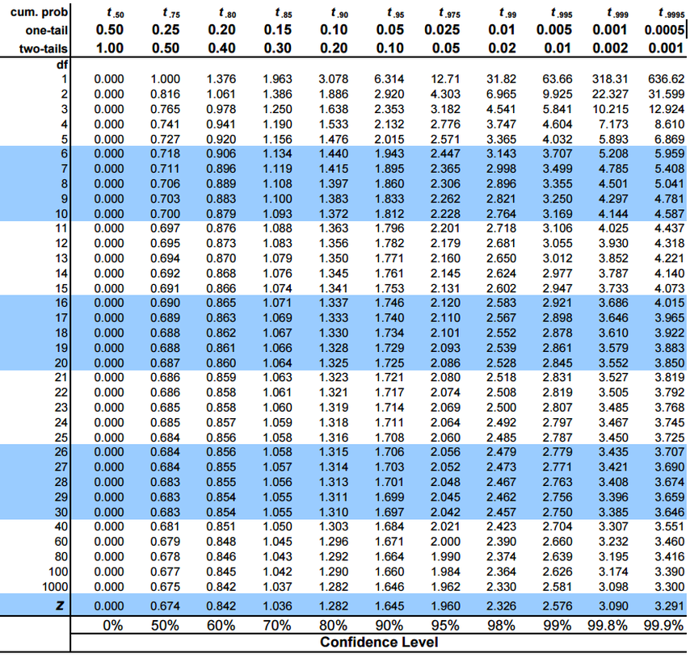

# t-test

- [t-test](#t-test)
  - [1. 简介](#1-简介)
  - [2. t-分布](#2-t-分布)
  - [3. t-table](#3-t-table)
  - [4. 示例](#4-示例)

2024-05-08 ⭐
@author Jiawei Mao
***

## 1. 简介

在介绍如何进行假设检验时，提到了三个前提假设：

1. $\overline{X}$ 为 normal distribution
2. 样本：random
3. $\sigma^2$ 已知

其中 $\sigma$ 在实际中基本不可能。所以用样本的 $s$ 来估计 $\sigma$。这样：

$$
z=\frac{\overline{X}-\mu_0}{\sigma/\sqrt{n}}
$$

就转换为：

$$
t=\frac{\overline{X}-\mu_0}{s/\sqrt{n}}
$$

余下假设检验步骤与 z-test 相同。

## 2. t-分布

总体观测值：

$$
Y_1,\cdots,Y_N
$$

服从正态分布 $N(\mu,\sigma^2)$。

抽样：

$$
Y_1,\cdots,Y_n
$$

计算样本统计量：$\overline{Y}$, $s^2$。

计算 t 值：

$$
t=\frac{\overline{Y}-\mu}{s/\sqrt{n}}
$$

重复抽样，计算 $t$ 值：

$$
t_1=\frac{\overline{Y}-\mu}{s/\sqrt{n}}
$$

获得所有可能的 $t$ 值，绘制频率分布图，得到 t-分布。t-分布的概率密度函数为：

$$
f(t)=\frac{\Gamma(\frac{\nu+1}{2})}{\sqrt{\pi \mu}\Gamma(\frac{\nu}{2})}(1+\frac{t^2}{2})^{-(\nu+1)/2}
$$

分布曲线如下所示：

其中 $\nu$ 就是自由度：

$$
\nu=\text{df}=n-1
$$

其中 $\Gamma$ 为 Gamma 函数。Gamma 函数是阶乘在实数与复数上的扩展。在实数上 Gamma 函数定义为：

$$
\Gamma(x)=\int_0^{+\infty}t^{x-1}e^{-t}dt, \quad(x>0)
$$

如果 $x$ 为正整数，就变为：

$$
\Gamma(x)=(x-1)!
$$

t-分布的特点：

1. 均值 $E(t)=0$，两侧对称；
2. 范围 $-\infty \le t \le \infty$；
3. 方差 $Var(t)\ge 1$，当 $n\rightarrow \infty$，$Var(t)=1$，$t \rightarrow z$。

## 3. t-table

t 表解释：

- column-header：$\alpha$ 值；
- row-header：自由度；
- 表格值：t 值，给的都是分布右侧的 t 值。

## 4. 示例

**例 1.** 一个新药会不会影响血压。随机找了 10 个人，测量吃药前后血压变化。

1. 声明假设

$$
H_0: \mu=0\\
H_a: \mu\ne 0
$$

2. 前提假设
   1. 血压的改变服从正态分布；
   2. 随机抽样;
3. $\alpha=0.01$;
4. 计算拒绝域
   1. $\nu=9$;
   2. 双边检验，查表得 $t=3.25$；
   3. 拒绝域为 $t<-3.25$ 或 $t>3.25$
5. 计算样本 t 值
   1. $\overline{Y}=0.8$
   2. $s^2=9.07$
   3. $s=3.01$

$$
t=\frac{\overline{Y}-\mu}{s/\sqrt{n}}=0.84
$$

6. 下结论

样本 $t$ 落在接受域内，所以无法拒绝 $H_0$。即新药对血压没有影响。该分析可能犯 Type II error。
