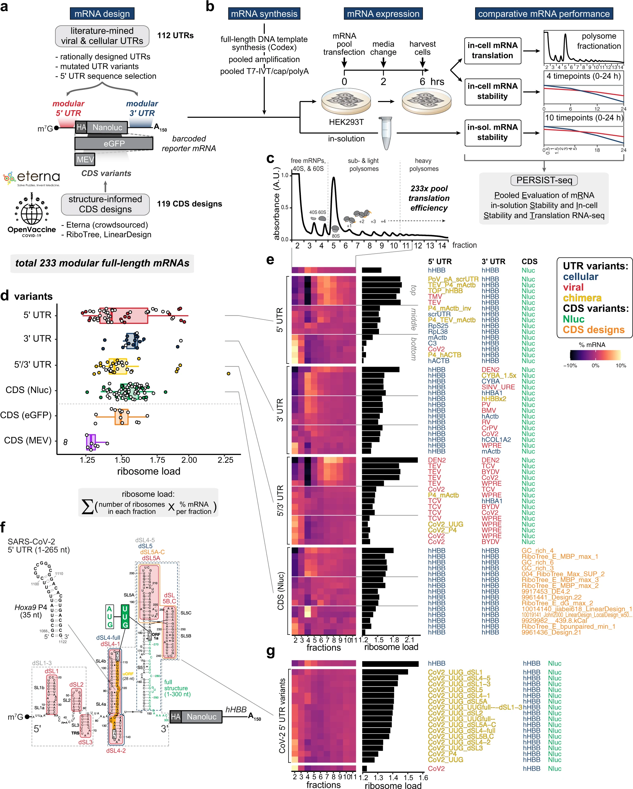

# RiboTree

## 简介

RiboTree 是斯坦福大学的研究人员开发的一个 Python 软件包，用于设计核酸序列，以便核酸序列在不同条件（例如，不同浓度的配体）下采用特定的二级结构。

### 应用

## 结果

### 发现 mRNA 设计规则的组合库

为了找到

## 参考

- https://github.com/philarevalo/RiboTree
- https://techfinder.stanford.edu/technology_detail.php?ID=43729
- https://daslab.stanford.edu/
- Leppek, K. et al. Combinatorial optimization of mRNA structure, stability, and translation for RNA-based therapeutics. Nat Commun 13, 1–22 (2022).
