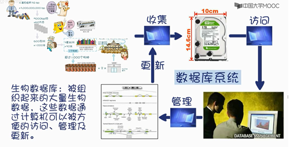
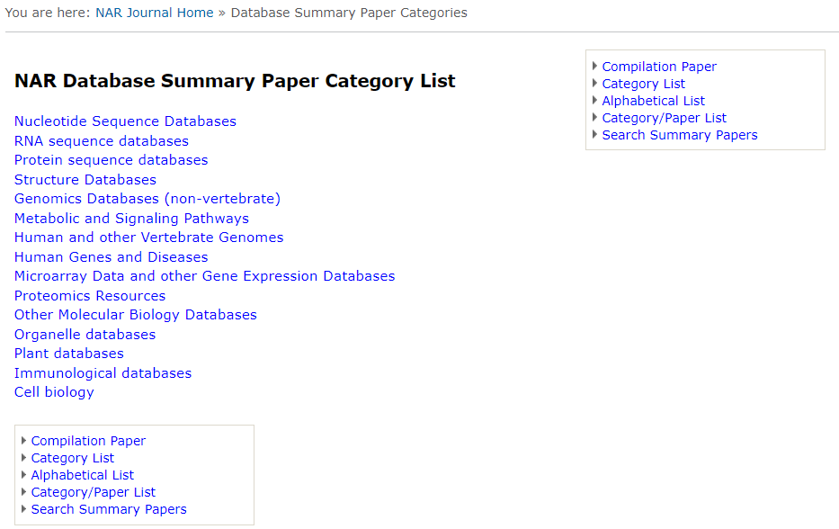
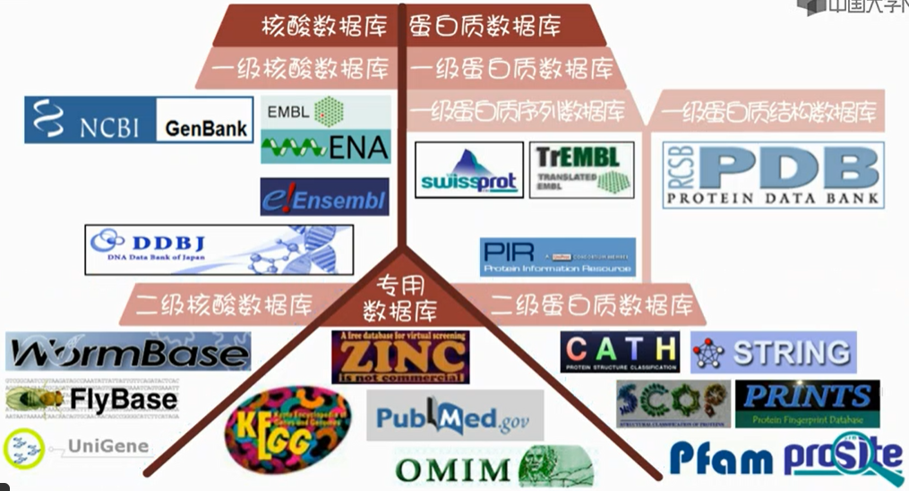
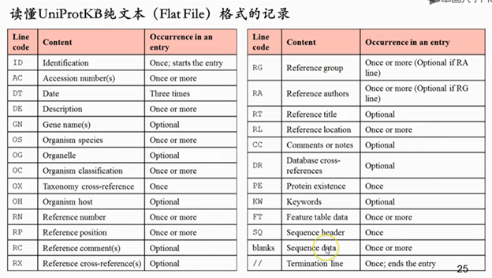
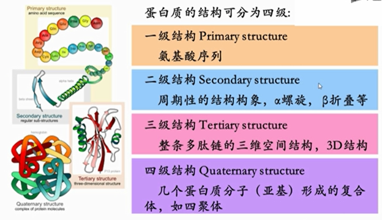
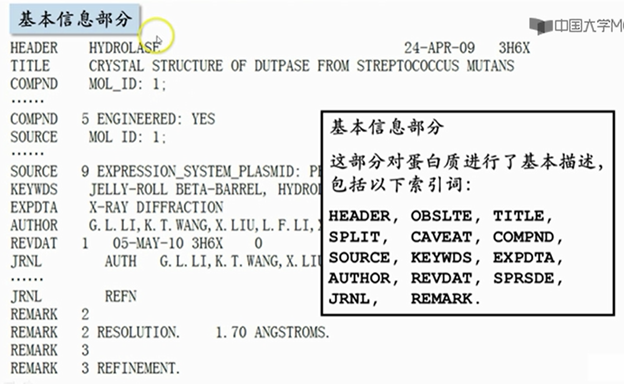
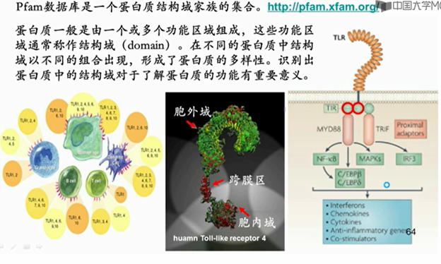
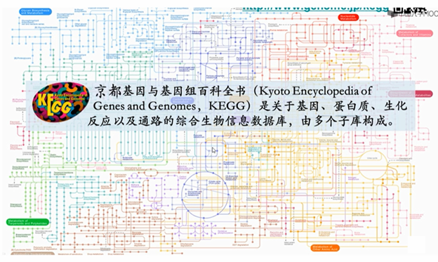

# 生物数据库概述

- [生物数据库概述](#生物数据库概述)
  - [为什么需要生物数据库](#为什么需要生物数据库)
  - [生物数据库分类](#生物数据库分类)
  - [二级核酸数据库](#二级核酸数据库)
  - [一级蛋白序列库](#一级蛋白序列库)
  - [一级蛋白质结构数据库](#一级蛋白质结构数据库)
    - [PDB 文件结构](#pdb-文件结构)
    - [结构可视化](#结构可视化)
  - [二级蛋白质数据库](#二级蛋白质数据库)
    - [Pfam](#pfam)
    - [CATH](#cath)
    - [结构分类数据库 SCOP2](#结构分类数据库-scop2)
    - [专用数据库 KEGG 和 OMIM](#专用数据库-kegg-和-omim)

## 为什么需要生物数据库

人基因组有31亿碱基，其中编码基因碱基占~2.9%。庞大的数据使得数据库的存在十分必要。

常见单位：

| 单位 | 英文  | 符号  | 数值       |
| ---- | ----- | ----- | ---------- |
| 尧   | yotta | Y     | $10^{24}$  |
| 泽   | zetta | Z     | $10^{21}$  |
| 艾   | exa   | E     | $10^{18}$  |
| 拍   | peta  | P     | $10^{15}$  |
| 太   | tera  | T     | $10^{12}$  |
| 吉   | giga  | G     | $10^{9}$   |
| 兆   | mega  | M     | $10^{6}$   |
| 千   | kilo  | k     | $10^{3}$   |
| 百   | hecto | h     | $10^{2}$   |
| 十   | deca  | da    | $10^{1}$   |
| 个   | mono  |       | $10^{0}$   |
| 分   | deci  | d     | $10^{-1}$  |
| 厘   | centi | c     | $10^{-2}$  |
| 毫   | milli | m     | $10^{-3}$  |
| 微   | micro | $\mu$ | $10^{-6}$  |
| 纳   | nano  | n     | $10^{-9}$  |
| 皮   | pico  | p     | $10^{-12}$ |
| 飞   | femto | f     | $10^{-15}$ |
| 阿   | atto  | a     | $10^{-18}$ |
|      | zepto | z     | $10^{-21}$ |
|      | yocto | y     | $10^{-24}$ |

## 生物数据库分类

著名学术期刊 [Nucleic Acids Research](http://www.oxfordjournals.org/nar/database/c/) 有一个生物数据库专刊，有点规模的数据库都争相在这里发表，包括 Genbank，PDB等。如下：

生物数据库要点：

- 大部分数据库在NAR发表
- 数据库个数超过2000
- 部分数据库死掉不再更新

数据库的主要类别：

- 核酸数据库顾名思义，是与核酸相关的数据库。
- 蛋白质数据库是与蛋白质相关的数据库。
- 而专用数据库是专门针对某一主题的数据库，或者是综合性的数据库，以及无法归入其他两类的数据库。

核酸数据库和蛋白质数据库又分为一级和二级。

- 一级数据库存储的是通过各种科学手段得到的最直接的基础数据。比如测序获得的核酸序列，或者 X 射线衍射法等获得的蛋白质三维结构。蛋白质的一级数据库还可以再具体分为蛋白质序列数据库和蛋白质结构数据库。
- 二级数据库是通过对一级数据库的资源进行分析、整理、归纳、注释而构建的具有特殊生物学意义和专门用途的数据库。比如从三大核酸数据库和基因组数据库中提取并加工出的果蝇和蠕虫数据库，再比如根据蛋白质三维结构数据库中的结构信息，分析统计出的蛋白质结构分类数据库 CATH 和 SCOP 等。

## 二级核酸数据库

RefSeq 数据库：参考序列数据库，是通过自动及人工精选出的非冗余数据库，包括基因组序列、转录序列和蛋白质序列。

dbEST 数据库：表达序列标签数据库，包含来源于不同物种的表达序列标签（EST）。

Gene 数据库：为用户提供基因序列注释和检索服务，收录了来自 5300 多个物种的 430 万条基因记录。

[ncRNAdb](http://biobases.ibch.poznan.pl/ncRNA/)：非编码 RNA 数据库，提供非编码 RNA 的序列和功能信息。包含来自 99 种细菌、古细菌和真核生物的3万多条序列。

[miRBase](http://www.mirbase.org/): 主要存放已发表的 microRNA 序列和注释。可以分析 microRNA 咋基因组中的定位和挖掘 microRNA 序列间的关系。

## 一级蛋白序列库

- SwissProt

swissprot 是一个人工注释的蛋白质序列数据库，拥有注释可信度高，冗余度小的优点。由欧洲生物信息学研究所（EMBL-EBI）与瑞士生物信息学研究所（SIB）共同管理。

- TrEMBL

TrEMBL (Translation from EMBL) 蛋白质序列数据库是一个计算机注释的蛋白质序列数据库，它包含 EMBL 核酸序列数据库中的为蛋白质编码的核酸序列（CDS）的所有翻译产物，并把已包含在 swissprot 中的序列剔除。可惜可信度低且冗余度大，也由 EMBL-EBI 和 SIB 管理。

- PIR

PIR 蛋白质信息资源数据库（Protein Information Resource, PIR）设在美国 Georgetown 大学医学中心（GUMC），是一个支持基因组学、蛋白质组学和系统生物学研究的总和公共生物信息学资源。

- UniProt

2002 年，SIB和EMBL-EBI 的 SwissProt+TrEMBL 管理组与Georgetown 大学医学中心（GUMC）及美国生物医学研究基金会（NBRF）的PIR管理组成立联合蛋白质数据库协作组，管理 UniProt 联合蛋白质序列数据库（Universal Protein Resource, UniProt）。

UniProt 三个层次数据库：

- UniParc, 收录所有 UniProt 数据库子库中的蛋白质序列，量大，粗糙。
- UniRef，收纳 UniProt 解主要数据库并将重复序列去除后的数据库。
- UniProtKB，有详细注释并与其它数据库有链接的数据库，分为 UniProtKB/Swiss-Prot 和 UniProtKB/TrEMBL。

## 一级蛋白质结构数据库

蛋白质结构数据库（Protein Data Bank, PDB）是全世界唯一存储生物大分子 3D 结构的数据库。这些生物大分子除了蛋白质以外还包括核酸及两者的复合物。只有通过实验方法获得的 3D 结构才会被收入其中。

PDB 于 1971 年由美国 Brookhaven 国家实验室创建，当时只存储了 7 个结构。1998 年，结构生物信息学合作研究协会（Research Collaboratory for Structural Bioinformatics, RCSB）成立，之后 PDB 的维护工作主要由该组织负责。目前 PDB 数据库每周更新一次，至今，PDB 收录的结构已超过十二万条，其中 90% 以上为蛋白质结构。

### PDB 文件结构

### 结构可视化

JSmol 是 Java 开发的蛋白质在线可视化工具。

## 二级蛋白质数据库

### Pfam

[Pfam](http://pfam.xfam.org/) 数据库是一个蛋白质结构域家族的集合。

### CATH

结构分类数据库 CATH 由伦敦大学于 1993 年开发和维护。该数据库的名字 CATH 分别是数据库中四个结构分类层次的首字母，即：

- 蛋白质的种类（class, **C**）

分为四类：全 α 型，全 β 型，α + β 型，低二级结构型。

- 蛋白质二级结构的架构（architecture, **A**）

螺旋和折叠形成的超二级结构排列方式，不考虑它们之间的链接关系。

- 蛋白质的拓扑结构（topology[fold], **T**）

二级结构的形状和二级结构间的联系。

- 蛋白质同源超家族（homologous superfamily, **H**）

先通过序列比较然后再用结构比较确定的同源性分类。

数据库的分类对象是 PDB 中存储的那些已测定的蛋白质结构域（doman），分类时既使用计算机程序，也进行人工检查。

### 结构分类数据库 [SCOP2](http://scop2.mrc-lmb.cam.ac.uk/)

英国医学研究委员会（Medical Research Council, MRC）的分子生物学实验室和蛋白质工程研究中心于 2014 年 2 月正式发布了蛋白质结构分类数据库 SCOP（structural classification of proteins）的全面升级版 SCOP2。

该数据库在搜集、整理、分析PDB数据中已知的蛋白质三维结构的基础上，详细描述了已知结构的蛋白质在结构、进化事件与功能类型三个方面的关系。数据库的构建除了使用计算机程序外，主要依赖于人工验证。SCOP2 把 SCOP 中仅基于蛋白质结构的树状等级分类系统发展成为单向非循环网状分类系统。

SCOP2 分类的主要级别：

- 族（Family）表示密切相关的蛋白质，具有明确的进化起源证据。大多时候，它们的关系通过序列比较方法监测，如BLAST, PSI-BLASE, HMMER 等。
- 超家族（Superfamily）将关系更远的相关蛋白质结构域放在一起。它们的相似性一般指常见的结构特征，如保守的活性位点或结合位点结构，类似的表明可能进化关系的寡聚（oligomerization）模式。

这两种关系有时可以跨越大小不同的结构区域。

### 专用数据库 KEGG 和 OMIM

