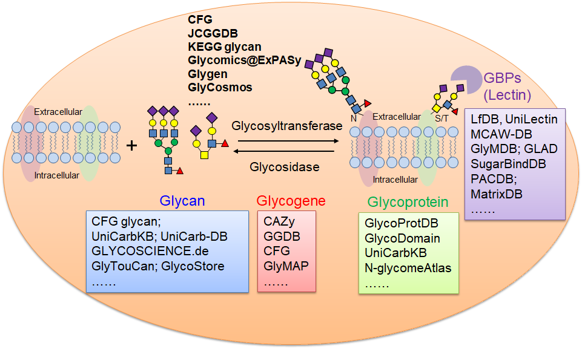
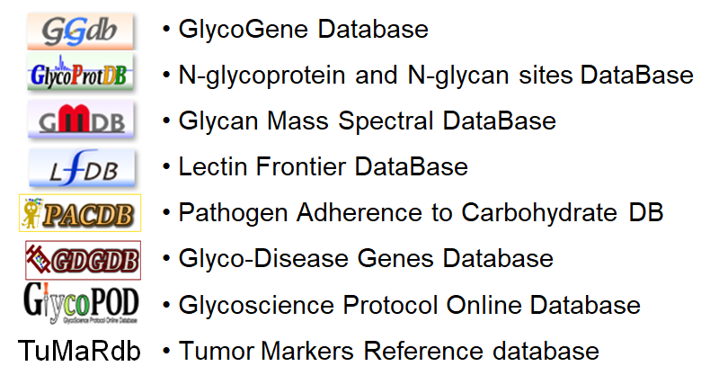

# 糖数据库

- [糖数据库](#糖数据库)
  - [概述](#概述)
  - [糖结构数据库](#糖结构数据库)
    - [MonosaccharideDB](#monosaccharidedb)
    - [CFG](#cfg)
    - [糖质谱数据库](#糖质谱数据库)
    - [UniCarbKB](#unicarbkb)
    - [KEGG](#kegg)
    - [GLYCOSCIENCE.de](#glycosciencede)
    - [UniCarb-DB](#unicarb-db)
    - [GlyTouCan](#glytoucan)
    - [GlycoStore](#glycostore)
  - [糖位点数据库](#糖位点数据库)
    - [OGP](#ogp)
  - [最新的糖科学门户](#最新的糖科学门户)
    - [Glycomics@ExPASy](#glycomicsexpasy)
    - [Glygen](#glygen)
  - [参考](#参考)

2021-05-20, 15:08
@Jiawei Mao
***

## 概述

糖基化是自然界中最普遍、最重要的翻译后修饰之一，据估计，超过 50% 的哺乳动物蛋白和 90% 的分泌蛋白及膜蛋白是糖基化的。糖基化参与了大量生物学过程，包括细胞信号转到、配体-受体相互作用、细胞间通讯、病原体-宿主识别以及免疫反应等，因此，糖基化涉及了许多人类疾病。

糖基化的不均一性：

- 宏观不均一性（macroheterogeneity, variable occupancy of different glycosylation sites）
- 微观不均一性（microheterogeneity, variable distribution of different glycans attached to a single glycosylation site）

Due to the different expression of glycogenes such as glycosyltransferase and glucosidase in different cells and tissues, the glycans attached to the same protein are cell-, tissue-, organism-, and physiological state-dependent. Furthermore, the same glycan structure on different proteins may have different functions. Therefore, the interpretation of the glycosylation sites, the attached glycan structure, the protein scaffolds, and related glycogenes are crucial for understanding the biological function of glycosylation.

在过去几十年，随着分离技术、基于质谱的分析技术等分析方法的发展，聚糖、糖基化位点、糖肽以及糖蛋白的定性和定量数据大大增加；此外，凝集素芯片、糖微阵列、糖基因芯片的广泛应用也大大增加了糖蛋白相互作用和糖基因组数据。

1980 年代后期出现第一个公开的糖结构数据库，即 CCSD（Comlex Carbohydrate Structural Database），也称为 CarbBank。随后出现越来越多的糖数据库，例如 GLYCOSCIENCE.de，KEGG 糖数据库（Kyoto Encyclopedia of Genes and Genomes GLYCAN database）。

在 2000 年初，功能糖组学联盟（Consortium for Functional Glycomics）项目以一个综合数据库开始，该数据库库包含糖结构、糖结合蛋白、糖基转移酶以及和糖相关的基因敲除小鼠信息；而日本的糖生物学和糖技术数据库联盟（Japan Consortium for Glycobiology and Glycotechnology DataBase, JCGGDB）收集相关质谱数据、糖基因以及凝集素和吡啶化糖的亲和力数据。

近年来，出现了越来越多的糖数据库和工具。其中值得重要关注的有新一代的中心化集成资源数据库，包括 GlyGen, Glycomics@ExPASy 和 GlyCosmos。除了这些综合数据库外，世界各地还有各种糖结构、唐基因、糖蛋白数据库。

> 以膜糖蛋白为例的代表性糖数据库。GBPs, glycan binding proteins。

## 糖结构数据库

CarbBank 是第一个糖结构数据库，到 1997 年停止维护时，CarbBank 已有 40,000 糖结构。这些数据目前存在多个数据库中，包括 CFG 糖数据库，KEGG 糖库，GLYCOSCIENCE.de 以及 CSDB（Carbohydrate Structure DataBase）。

### MonosaccharideDB

http://www.monosaccharidedb.org/notation.action?topic=schemes

MonosaccharideDB 的内部表达格式说明：

Basetype 和 substituent 和 GlycoCT 一样，除了 "anhydro" 和 "lactone" 修饰也包含在 basetype 中，而在 GlycoCT 中在定义为 substituent。

### CFG

链接：http://www.functionalglycomics.org/

功能糖组学联盟（Consortium for Functional Glycomics, CFG）是最大的糖组学资源平台之一。包含：

- Glycan Structures Database
- Glycosyltransferases
- Glycan Binding Proteins
- GLycan array data
- Glycan Profiling
- Glycogene microarray data
- Glycogene knockout mose

[CFG 糖结构数据库](http://www.functionalglycomics.org/glycomics/molecule/jsp/carbohydrate/carbMoleculeHome.jsp) 提供了上千种N-糖和O-糖的结构信息，包括合成糖、人和小鼠的组织及细胞源的糖。CFG 以前还提供MALSI-MS 和 ESI-MS 糖表征服务，不过该服务在 2011 年关闭了。

### 糖质谱数据库

JCGGDB 是一个元数据库，包括 15 个数据库的信息，如下所示：

JCGGDB 的[糖质谱数据库（GMDB）](https://jcggdb.jp/rcmg/glycodb/Ms_ResultSearch)是一个包含糖多级质谱数据的数据库，包含 N-糖、O-糖、糖酯等的 MS2，MS3以及 MS4 质谱图。N-糖和糖酯聚糖一般用 2-氨基吡啶标记，可在 HPLC中用荧光检测。更重要的是，该数据库还提供了质谱采集 protocol。

### UniCarbKB

链接：http://unicarbkb.org/

UniCarbKB 由 GlycoSuiteDB、GlycoBase和 EUROCarbDB组成，旨在构建信息存储和搜索平台。GlycoSuiteDB 收集了 1990 年到 2005 年发布的所有糖结构和糖基化位点信息。

UniCarbKB 还提供了一系列用于糖分析的生物信息学工具，例如 GlycoDigest 可以模拟糖苷外切酶对寡糖的酶解，UniCorn 是一个理论 N-糖结构数据库，可用于提高糖分析效率及糖结构验证。

### KEGG

KEGG 是一个综合数据库，包含分子信号网络、代谢途径等。[KEGG 糖库](https://www.genome.jp/kegg/glycan/)收集了实验验证过的糖结构，以及糖的生物合成路径和代谢途径。主要特征如下：

- Glycan Structures (DBGET search)
- Glycan biosynthesis and metabolism
- Glycans in Cancer Pathways
- Glycosyltransferases
- Glycan Binding Proteins

### GLYCOSCIENCE.de

链接：http://www.glycosciences.de/

GLYCOSCIENCE.de 是一个集成门户网站，包含糖组学分析所需的数据库和工具，不过它主要聚焦在糖的 3D 结构，3D 结构信息主要从 CarbBank，PDB 以及文献中提取。GLYCOSCIENCE.de 还提供了 3D 结构建模、检测和 PDB 糖结构验证等工具，并支持糖 MS/NMR 分析。例如，Sweet-II 可以将复杂的糖序列快速转换为 3D 分子模型，可用作分子动力学模拟和其它分析。

[Glycosciences.DB](http://www.glycosciences.de/database/) 是 GLYCOSCIENCE.de 的糖结构数据库。

### UniCarb-DB

链接：https://unicarb-db.expasy.org/

UniCarb-DB 是一个新兴的公共数据库，提供从糖蛋白释放的糖在质谱中碎裂产生的碎片信息。UniCarb-DB 提供了用户友好的搜索界面，可以通过 taxonomy, tissue, reference, mass, composition 以及 precursor mass 等进行检索。

UniCarb-DB 包含了1500 多种糖蛋白的N-糖和O-糖谱图，对应 13 个分类20种 tissues，目前已发展为最大的糖组学质谱数据库。

### GlyTouCan

链接：https://glytoucan.org/

GlyTouCan 是在 GlycomeDB 基础上开发的一个糖结构数据库。GlycomeDB 是为了整合不同来源（CFG，BCSDB，GLYCOSCIENCES.de，KEGG glycan, EUROCarbDB以及 CarbBank）的糖结构信息，并移除冗余项。GlyTouCan 中的糖结构可以通过文本、motif，或者使用 GlycanBuilder 绘制糖结构进行检索。

GlyTouCan 为每个糖结构分配了一个唯一的 ID，从而方便对糖结构的引用。

### GlycoStore

链接：https://www.glycostore.org/

GlycoStore 是基于公开试验数据集 GlycoBase 开发的糖保留时间性质的数据库。GlycoStore 包含超高效液相色谱（U/HPLC），反相色谱（RP-U/HPLC），多孔石墨化碳色谱、毛细管电泳等。

## 糖位点数据库

### OGP

http://www.oglyp.org/

O-糖位点数据库。

## 最新的糖科学门户

### Glycomics@ExPASy

Glycomics@ExPASy（https://www.expasy.org/glycomics）是 ExPASy 的糖组学部分，包含了糖信息学资源。该数据库的目的是促进糖信息学的研究，它包含了由 SIB 开发和维护的综合数据库和资源（如 GlyConnect, SugarBind 以及 UniCarb-DB）和外部资源（如 CAZy, CSDB, EPS-DB 和 Glyco3D 数据库）。

GlyConnect（https://glyconnect.expasy.org/ ）是 Glycomics@ExPASy 的糖数据平台，用于辅助表征蛋白质糖基化的分子组成。用户可以通过蛋白质名称、

### Glygen

链接：https://glygen.org/

GlyGen 是碳水化合物和糖结合物相关数据整合数据库。GlyGen 从 NCBI，UniProt，PDB，UniCarbKB以及GlyTouCan 等数据库中提取数据，然后进行标准化调整。

## 参考

- Li, X., Xu, Z., Hong, X., Zhang, Y. & Zou, X. Databases and Bioinformatic Tools for Glycobiology and Glycoproteomics. International Journal of Molecular Sciences 21, 6727 (2020)
