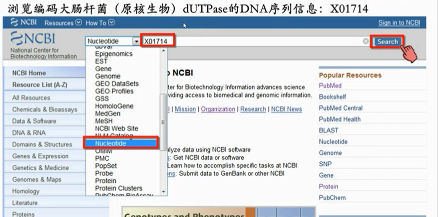
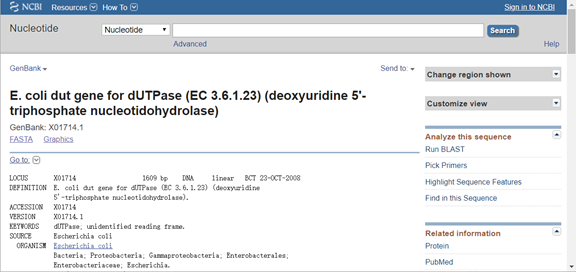
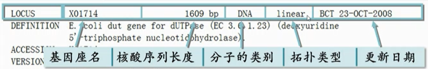
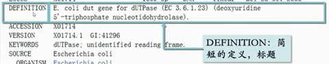
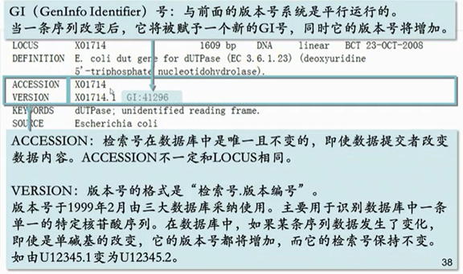
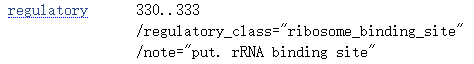
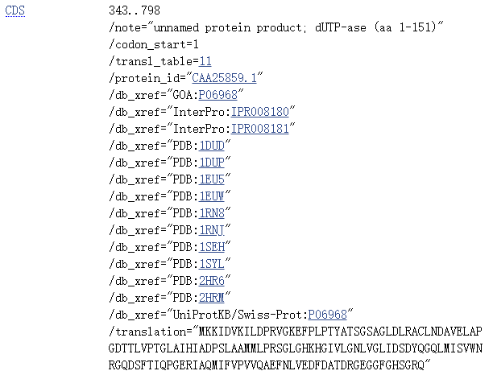
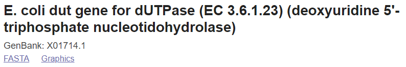
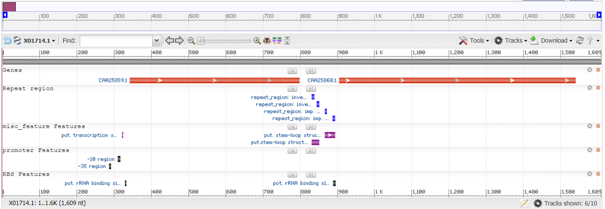
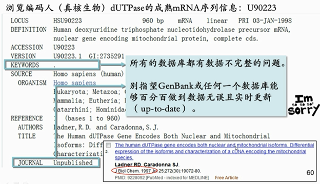

# GenBank

- [GenBank](#genbank)
  - [简介](#简介)
  - [数据格式](#数据格式)
    - [LOCUS](#locus)
      - [Locus Name](#locus-name)
      - [Sequence Length](#sequence-length)
      - [Molecule Type](#molecule-type)
      - [GenBank Division](#genbank-division)
      - [Modification Date](#modification-date)
    - [DEFINITION](#definition)
    - [ACCESSION](#accession)
    - [VERSION](#version)
    - [ORIGIN](#origin)
    - [序列](#序列)
  - [原核生物核酸序列](#原核生物核酸序列)
    - [LOCUS](#locus-1)
    - [DEFINITION](#definition-1)
    - [ACCESSION](#accession-1)
    - [VERSION](#version-1)
    - [KEYWORDS](#keywords)
    - [SOURCE](#source)
    - [REFERENCE](#reference)
    - [COMMENT](#comment)
    - [FEATURES](#features)
      - [source](#source-1)
      - [regulatory](#regulatory)
      - [misc_feature](#misc_feature)
      - [CDS](#cds)
    - [ORIGIN](#origin-1)
  - [FASTA](#fasta)
  - [真核生物核酸序列 mRNA](#真核生物核酸序列-mrna)
  - [参考](#参考)

2021-06-02, 13:04
***

## 简介

GenBank 是美国国立卫生研究员（NIH）创建的基因序列数据库，包含所有开放的DNA序列注释。GenBank 是国际核苷酸序列数据库协会（International Nucleotide Sequence Database Collaboration）的一部分，该协会包括日本 DNA 数据库(DNA DataBank of Japan, DDBJ)，欧洲核苷酸档案馆（European Nucleotide Archive, ENA）以及 NCBI 的 GenBank。这三大组织每天交换数据。

GenBank 每两个月发布一次，可以从 [ftp](https://ftp.ncbi.nih.gov/genbank/) 地址下载。GenBank 地址 [https://www.ncbi.nlm.nih.gov/genbank/](https://www.ncbi.nlm.nih.gov/genbank/)。

## 数据格式

下面通过酿酒酵母基因的注释数据了解 GenBank 纯文本格式：

```txt
LOCUS       SCU49845     5028 bp    DNA             PLN       21-JUN-1999
DEFINITION  Saccharomyces cerevisiae TCP1-beta gene, partial cds, and Axl2p
            (AXL2) and Rev7p (REV7) genes, complete cds.
ACCESSION   U49845
VERSION     U49845.1  GI:1293613
KEYWORDS    .
SOURCE      Saccharomyces cerevisiae (baker's yeast)
  ORGANISM  Saccharomyces cerevisiae
            Eukaryota; Fungi; Ascomycota; Saccharomycotina; Saccharomycetes;
            Saccharomycetales; Saccharomycetaceae; Saccharomyces.
REFERENCE   1  (bases 1 to 5028)
  AUTHORS   Torpey,L.E., Gibbs,P.E., Nelson,J. and Lawrence,C.W.
  TITLE     Cloning and sequence of REV7, a gene whose function is required for
            DNA damage-induced mutagenesis in Saccharomyces cerevisiae
  JOURNAL   Yeast 10 (11), 1503-1509 (1994)
  PUBMED    7871890
REFERENCE   2  (bases 1 to 5028)
  AUTHORS   Roemer,T., Madden,K., Chang,J. and Snyder,M.
  TITLE     Selection of axial growth sites in yeast requires Axl2p, a novel
            plasma membrane glycoprotein
  JOURNAL   Genes Dev. 10 (7), 777-793 (1996)
  PUBMED    8846915
REFERENCE   3  (bases 1 to 5028)
  AUTHORS   Roemer,T.
  TITLE     Direct Submission
  JOURNAL   Submitted (22-FEB-1996) Terry Roemer, Biology, Yale University, New
            Haven, CT, USA
FEATURES             Location/Qualifiers
     source          1..5028
                     /organism="Saccharomyces cerevisiae"
                     /db_xref="taxon:4932"
                     /chromosome="IX"
                     /map="9"
     CDS             <1..206
                     /codon_start=3
                     /product="TCP1-beta"
                     /protein_id="AAA98665.1"
                     /db_xref="GI:1293614"
                     /translation="SSIYNGISTSGLDLNNGTIADMRQLGIVESYKLKRAVVSSASEA
                     AEVLLRVDNIIRARPRTANRQHM"
     gene            687..3158
                     /gene="AXL2"
     CDS             687..3158
                     /gene="AXL2"
                     /note="plasma membrane glycoprotein"
                     /codon_start=1
                     /function="required for axial budding pattern of S.
                     cerevisiae"
                     /product="Axl2p"
                     /protein_id="AAA98666.1"
                     /db_xref="GI:1293615"
                     /translation="MTQLQISLLLTATISLLHLVVATPYEAYPIGKQYPPVARVNESF
                     TFQISNDTYKSSVDKTAQITYNCFDLPSWLSFDSSSRTFSGEPSSDLLSDANTTLYFN
                     VILEGTDSADSTSLNNTYQFVVTNRPSISLSSDFNLLALLKNYGYTNGKNALKLDPNE
                     VFNVTFDRSMFTNEESIVSYYGRSQLYNAPLPNWLFFDSGELKFTGTAPVINSAIAPE
                     TSYSFVIIATDIEGFSAVEVEFELVIGAHQLTTSIQNSLIINVTDTGNVSYDLPLNYV
                     YLDDDPISSDKLGSINLLDAPDWVALDNATISGSVPDELLGKNSNPANFSVSIYDTYG
                     DVIYFNFEVVSTTDLFAISSLPNINATRGEWFSYYFLPSQFTDYVNTNVSLEFTNSSQ
                     DHDWVKFQSSNLTLAGEVPKNFDKLSLGLKANQGSQSQELYFNIIGMDSKITHSNHSA
                     NATSTRSSHHSTSTSSYTSSTYTAKISSTSAAATSSAPAALPAANKTSSHNKKAVAIA
                     CGVAIPLGVILVALICFLIFWRRRRENPDDENLPHAISGPDLNNPANKPNQENATPLN
                     NPFDDDASSYDDTSIARRLAALNTLKLDNHSATESDISSVDEKRDSLSGMNTYNDQFQ
                     SQSKEELLAKPPVQPPESPFFDPQNRSSSVYMDSEPAVNKSWRYTGNLSPVSDIVRDS
                     YGSQKTVDTEKLFDLEAPEKEKRTSRDVTMSSLDPWNSNISPSPVRKSVTPSPYNVTK
                     HRNRHLQNIQDSQSGKNGITPTTMSTSSSDDFVPVKDGENFCWVHSMEPDRRPSKKRL
                     VDFSNKSNVNVGQVKDIHGRIPEML"
     gene            complement(3300..4037)
                     /gene="REV7"
     CDS             complement(3300..4037)
                     /gene="REV7"
                     /codon_start=1
                     /product="Rev7p"
                     /protein_id="AAA98667.1"
                     /db_xref="GI:1293616"
                     /translation="MNRWVEKWLRVYLKCYINLILFYRNVYPPQSFDYTTYQSFNLPQ
                     FVPINRHPALIDYIEELILDVLSKLTHVYRFSICIINKKNDLCIEKYVLDFSELQHVD
                     KDDQIITETEVFDEFRSSLNSLIMHLEKLPKVNDDTITFEAVINAIELELGHKLDRNR
                     RVDSLEEKAEIERDSNWVKCQEDENLPDNNGFQPPKIKLTSLVGSDVGPLIIHQFSEK
                     LISGDDKILNGVYSQYEEGESIFGSLF"
ORIGIN
        1 gatcctccat atacaacggt atctccacct caggtttaga tctcaacaac ggaaccattg
       61 ccgacatgag acagttaggt atcgtcgaga gttacaagct aaaacgagca gtagtcagct
      121 ctgcatctga agccgctgaa gttctactaa gggtggataa catcatccgt gcaagaccaa
      181 gaaccgccaa tagacaacat atgtaacata tttaggatat acctcgaaaa taataaaccg
      241 ccacactgtc attattataa ttagaaacag aacgcaaaaa ttatccacta tataattcaa
      301 agacgcgaaa aaaaaagaac aacgcgtcat agaacttttg gcaattcgcg tcacaaataa
      361 attttggcaa cttatgtttc ctcttcgagc agtactcgag ccctgtctca agaatgtaat
      421 aatacccatc gtaggtatgg ttaaagatag catctccaca acctcaaagc tccttgccga
      481 gagtcgccct cctttgtcga gtaattttca cttttcatat gagaacttat tttcttattc
      541 tttactctca catcctgtag tgattgacac tgcaacagcc accatcacta gaagaacaga
      601 acaattactt aatagaaaaa ttatatcttc ctcgaaacga tttcctgctt ccaacatcta
      661 cgtatatcaa gaagcattca cttaccatga cacagcttca gatttcatta ttgctgacag
      721 ctactatatc actactccat ctagtagtgg ccacgcccta tgaggcatat cctatcggaa
      781 aacaataccc cccagtggca agagtcaatg aatcgtttac atttcaaatt tccaatgata
      841 cctataaatc gtctgtagac aagacagctc aaataacata caattgcttc gacttaccga
      901 gctggctttc gtttgactct agttctagaa cgttctcagg tgaaccttct tctgacttac
      961 tatctgatgc gaacaccacg ttgtatttca atgtaatact cgagggtacg gactctgccg
     1021 acagcacgtc tttgaacaat acataccaat ttgttgttac aaaccgtcca tccatctcgc
     1081 tatcgtcaga tttcaatcta ttggcgttgt taaaaaacta tggttatact aacggcaaaa
     1141 acgctctgaa actagatcct aatgaagtct tcaacgtgac ttttgaccgt tcaatgttca
     1201 ctaacgaaga atccattgtg tcgtattacg gacgttctca gttgtataat gcgccgttac
     1261 ccaattggct gttcttcgat tctggcgagt tgaagtttac tgggacggca ccggtgataa
     1321 actcggcgat tgctccagaa acaagctaca gttttgtcat catcgctaca gacattgaag
     1381 gattttctgc cgttgaggta gaattcgaat tagtcatcgg ggctcaccag ttaactacct
     1441 ctattcaaaa tagtttgata atcaacgtta ctgacacagg taacgtttca tatgacttac
     1501 ctctaaacta tgtttatctc gatgacgatc ctatttcttc tgataaattg ggttctataa
     1561 acttattgga tgctccagac tgggtggcat tagataatgc taccatttcc gggtctgtcc
     1621 cagatgaatt actcggtaag aactccaatc ctgccaattt ttctgtgtcc atttatgata
     1681 cttatggtga tgtgatttat ttcaacttcg aagttgtctc cacaacggat ttgtttgcca
     1741 ttagttctct tcccaatatt aacgctacaa ggggtgaatg gttctcctac tattttttgc
     1801 cttctcagtt tacagactac gtgaatacaa acgtttcatt agagtttact aattcaagcc
     1861 aagaccatga ctgggtgaaa ttccaatcat ctaatttaac attagctgga gaagtgccca
     1921 agaatttcga caagctttca ttaggtttga aagcgaacca aggttcacaa tctcaagagc
     1981 tatattttaa catcattggc atggattcaa agataactca ctcaaaccac agtgcgaatg
     2041 caacgtccac aagaagttct caccactcca cctcaacaag ttcttacaca tcttctactt
     2101 acactgcaaa aatttcttct acctccgctg ctgctacttc ttctgctcca gcagcgctgc
     2161 cagcagccaa taaaacttca tctcacaata aaaaagcagt agcaattgcg tgcggtgttg
     2221 ctatcccatt aggcgttatc ctagtagctc tcatttgctt cctaatattc tggagacgca
     2281 gaagggaaaa tccagacgat gaaaacttac cgcatgctat tagtggacct gatttgaata
     2341 atcctgcaaa taaaccaaat caagaaaacg ctacaccttt gaacaacccc tttgatgatg
     2401 atgcttcctc gtacgatgat acttcaatag caagaagatt ggctgctttg aacactttga
     2461 aattggataa ccactctgcc actgaatctg atatttccag cgtggatgaa aagagagatt
     2521 ctctatcagg tatgaataca tacaatgatc agttccaatc ccaaagtaaa gaagaattat
     2581 tagcaaaacc cccagtacag cctccagaga gcccgttctt tgacccacag aataggtctt
     2641 cttctgtgta tatggatagt gaaccagcag taaataaatc ctggcgatat actggcaacc
     2701 tgtcaccagt ctctgatatt gtcagagaca gttacggatc acaaaaaact gttgatacag
     2761 aaaaactttt cgatttagaa gcaccagaga aggaaaaacg tacgtcaagg gatgtcacta
     2821 tgtcttcact ggacccttgg aacagcaata ttagcccttc tcccgtaaga aaatcagtaa
     2881 caccatcacc atataacgta acgaagcatc gtaaccgcca cttacaaaat attcaagact
     2941 ctcaaagcgg taaaaacgga atcactccca caacaatgtc aacttcatct tctgacgatt
     3001 ttgttccggt taaagatggt gaaaattttt gctgggtcca tagcatggaa ccagacagaa
     3061 gaccaagtaa gaaaaggtta gtagattttt caaataagag taatgtcaat gttggtcaag
     3121 ttaaggacat tcacggacgc atcccagaaa tgctgtgatt atacgcaacg atattttgct
     3181 taattttatt ttcctgtttt attttttatt agtggtttac agatacccta tattttattt
     3241 agtttttata cttagagaca tttaatttta attccattct tcaaatttca tttttgcact
     3301 taaaacaaag atccaaaaat gctctcgccc tcttcatatt gagaatacac tccattcaaa
     3361 attttgtcgt caccgctgat taatttttca ctaaactgat gaataatcaa aggccccacg
     3421 tcagaaccga ctaaagaagt gagttttatt ttaggaggtt gaaaaccatt attgtctggt
     3481 aaattttcat cttcttgaca tttaacccag tttgaatccc tttcaatttc tgctttttcc
     3541 tccaaactat cgaccctcct gtttctgtcc aacttatgtc ctagttccaa ttcgatcgca
     3601 ttaataactg cttcaaatgt tattgtgtca tcgttgactt taggtaattt ctccaaatgc
     3661 ataatcaaac tatttaagga agatcggaat tcgtcgaaca cttcagtttc cgtaatgatc
     3721 tgatcgtctt tatccacatg ttgtaattca ctaaaatcta aaacgtattt ttcaatgcat
     3781 aaatcgttct ttttattaat aatgcagatg gaaaatctgt aaacgtgcgt taatttagaa
     3841 agaacatcca gtataagttc ttctatatag tcaattaaag caggatgcct attaatggga
     3901 acgaactgcg gcaagttgaa tgactggtaa gtagtgtagt cgaatgactg aggtgggtat
     3961 acatttctat aaaataaaat caaattaatg tagcatttta agtataccct cagccacttc
     4021 tctacccatc tattcataaa gctgacgcaa cgattactat tttttttttc ttcttggatc
     4081 tcagtcgtcg caaaaacgta taccttcttt ttccgacctt ttttttagct ttctggaaaa
     4141 gtttatatta gttaaacagg gtctagtctt agtgtgaaag ctagtggttt cgattgactg
     4201 atattaagaa agtggaaatt aaattagtag tgtagacgta tatgcatatg tatttctcgc
     4261 ctgtttatgt ttctacgtac ttttgattta tagcaagggg aaaagaaata catactattt
     4321 tttggtaaag gtgaaagcat aatgtaaaag ctagaataaa atggacgaaa taaagagagg
     4381 cttagttcat cttttttcca aaaagcaccc aatgataata actaaaatga aaaggatttg
     4441 ccatctgtca gcaacatcag ttgtgtgagc aataataaaa tcatcacctc cgttgccttt
     4501 agcgcgtttg tcgtttgtat cttccgtaat tttagtctta tcaatgggaa tcataaattt
     4561 tccaatgaat tagcaatttc gtccaattct ttttgagctt cttcatattt gctttggaat
     4621 tcttcgcact tcttttccca ttcatctctt tcttcttcca aagcaacgat ccttctaccc
     4681 atttgctcag agttcaaatc ggcctctttc agtttatcca ttgcttcctt cagtttggct
     4741 tcactgtctt ctagctgttg ttctagatcc tggtttttct tggtgtagtt ctcattatta
     4801 gatctcaagt tattggagtc ttcagccaat tgctttgtat cagacaattg actctctaac
     4861 ttctccactt cactgtcgag ttgctcgttt ttagcggaca aagatttaat ctcgttttct
     4921 ttttcagtgt tagattgctc taattctttg agctgttctc tcagctcctc atatttttct
     4981 tgccatgact cagattctaa ttttaagcta ttcaatttct ctttgatc
//
```

|关键字|说明|
|---|---|
|LOCUS|

### LOCUS

LOCUS 字段包含许多数据，包括基因座（locus）名称、序列长度、分子类型，GenBank 划分以及修改日期。

#### Locus Name

在本例中，基因座名称为 `SCU49845` 。

基因座名称最初设计用来帮助区分相似序列的条目：

- 前三个字符通常表示物种
- 第4，5个字符用于显示其它类别名称，如基因产物
- 对分段序列，最后一个字符是连续整数中的一个

详细格式参考[GenBank Release Notes 3.4.4](https://ftp.ncbi.nih.gov/genbank/gbrel.txt)。

然而，基因座名称的 10 个字符已不足以包含原本打算包含的信息。所以现在对基因座名，只要求其唯一就行。

- 对有 6 个字符的 GenBank Entry，如 U12345，基因座名一般由基因第一个字母、种属名第一个字母以及 accession 编号组成。
- 对 8 字符基因座名，基因座名就是 accession 编号，如 AF123456。

[RefSeq](https://www.ncbi.nlm.nih.gov/refseq/)数据库的参考序列根据基因符号为每条记录分配一个正式的基因座名。RefSeq 和 GenBank 数据库是分开的，但包含对 GenBank 记录的引用。

在检索的时候建议使用 accession，因为 accession 是稳定的，而 locus 名称可能会变。

#### Sequence Length

序列包含的核苷酸碱基对数（或氨基酸残基数）。在上例中，序列长度为 5028 bp。

#### Molecule Type

分子类型。上例中为 `DNA` 。
每条 GenBank 记录只能包含来自单一分子类型的连续序列数据。支持的分子类型有：

- genomic DNA
- genomic RNA
- precursor RNA
- mRNA (cDNA)
- ribosomal RNA
- transfer RNA
- small nuclear RNA
- small cytoplasmic RNA

#### GenBank Division

记录所属的 GenBank 分类，用三个字母表示。上例中为 PLN。
GenBank 数据库分为 18 个划分：

| 编号 | 缩写 | 划分 |
| --- | --- | --- |
| 1 | PRI | primate sequences |
| 2 | ROD | rodent sequences |
| 3 | MAM | other mammalian sequences |
| 4 | VRT | other vertebrate sequences |
| 5 | INV |  invertebrate sequences |
| 6 | PLN | plant, fungal, and algal sequences |
| 7 | BCT | bacterial sequences |
| 8 | VRL | viral sequences |
| 9 | PHG |  bacteriophage sequences |
| 10 | SYN | synthetic sequences |
| 11 | UNA | unannotated sequences |
| 12 | EST | EST sequences (expressed sequence tags) |
| 13 | PAT | patent sequences |
| 14 | STS | STS sequences (sequence tagged sites) |
| 15 | GSS | GSS sequences (genome survey sequences) |
| 16 | HTG | HTG sequences (high-throughput genomic sequences) |
| 17 | HTC | unfinished high-throughput cDNA sequencing |
| 18 | ENV | environmental sampling sequences |

部分划分包含特定生物种群的序列，而其他分类（EST, GSS, HTG 等）则包含多种不同物种使用特定测序技术生成的数据。物种类划分是历史遗留，不能反映当前 NCBI 分类法，它们只是作为将 GenBank 划分为更小的方式，方便用户从 FTP 站点下载。来自特定物种的序列可能存在不同基于测序技术的划分汇总，如EST,  HTG 等，因此要检索特定生物的所有序列，推荐使用 [NCBI Taxnonmy Browser](https://www.ncbi.nlm.nih.gov/taxonomy/)。

#### Modification Date

最后一次修改日期，在上例中为 `21-JUN-1999` 。

### DEFINITION

序列的简要说明：包括如生物来源，基因名称/蛋白名称，序列功能描述等之类的信息。如果序列有一个编码区域（CDS），则可以在其后跟随完整性限定符，如 "complete cds"。

### ACCESSION

序列的唯一标识符。accession 适用于完整 record，通常由字母和数字组合，例如单个字母后跟 5 个数字，如 U12345，或两个字母后跟 6 个数字，如 AF123456。某些 accession 可能更长，取决于序列类型。

Accession 不会改变，即使序列包含的信息发生改变。有时候，原作者对序列进行了修改，或者提交了新的序列，则可能添加一个新的 accession，原 accession 靠后。

RefSeq 数据库的记录使用自己的 accession 格式，以两个字母开头，下划线，后跟 6 个或更多数字：

```txt
NT_123456   constructed genomic contigs
NM_123456   mRNAs
NP_123456   proteins
NC_123456   chromosomes
```


### VERSION

### ORIGIN

ORIGIN 可以空着，也可以为 "Unreported"。该信息仅存在于比较老的记录 中。

### 序列

序列数据紧跟 ORIGIN 的下一行出现。

## 原核生物核酸序列

Genbank由NCBI开发，Nucleotide 数据库就是Genbank 数据库，所以可以直接在NCBI 中[检索](https://www.ncbi.nlm.nih.gov/nuccore)。

下面检索编码大肠杆菌（原核生物）dUTPase的 DNA 序列信息：X01714。



检索结果如下：



从标题可知，dUTPase 是脱氧尿苷5'-三磷酸核苷酸水解酶，编码它的基因是 dut 基因，所属物种是大肠杆菌。下面逐条进行浏览解释。

### LOCUS

LOCUS 这一行包含如下内容：



拓扑类型：原核生物的基因拓扑类型都是线性的。

### DEFINITION

这是对这条序列的简单定义，也就是上面看到的标题。



### ACCESSION



检索号在序列在数据库中唯一且不变的标识，即使数据库提交者改变数据内容。要注意，ACCESSION 与 LOCUS 不一定相同。

这条记录里ACCESSION和LOCUS一样，是因为在录入这个基因之前并没有起名字，因此录入时将检索号作为了基因的名字。但是有些基因在录入数据库之前已有名字，那么其ACCESSION和LOCUS就不一样。

### VERSION

版本号，格式：“检索号.版本编号”。

### KEYWORDS

能够大致描述该条目的几个关键字，可用于数据库检索。

### SOURCE

基因序列所属物种的俗名。

ORGANISM：对所属物种更详细的定义，包括他的科学分类。

### REFERENCE

基因序列来源的科学文献（一条基因序列的不同片段可能来源于不同的文献）。文献具体分为作者、题目和刊物。刊物还包括 PubMed ID 作为其子条目。

### COMMENT

自由撰写内容，比如致谢或者无法归入前面几项的内容。

### FEATURES

描述核酸序列中各个已确定的片段区域，包含很多子条目，比如来源（source）、启动子（promoter）等。

#### source

说明核酸序列来源，据此可以分辨出该序列是来源于克隆载体还是基因组。

#### regulatory

列出启动子的位置等信息。如：


细菌有两个启动子区，一个 -35区（5'-TTGACA-3'）位置在 286-291 碱基，一个 -10 区（5'-TATAAT-3'）在 310-316 碱基。

或者：



Ribosome binding site，即核糖体结合位点。

#### misc_feature

列出了一些杂项。例如：


说明 322-324 碱基是推测的（putative）无实验证实的转录起始位置。

#### CDS



CDS（Coding Segment）记录一个一个ORF（open reading frame），从 343 碱基开始的 ATG（起始密码子）到798结束的TAA（终止密码子）。

除了第一行的位置信息，还包括翻译产物（蛋白质）的诸多信息。

如翻译产物蛋白的名字为 "dUTP-ase"，是该ORF编码的1-515个氨基酸。

`codon_start` 为翻译的起始位置；`trans1_table`是翻译使用的密码本。

最后的 `translation` 是根据核酸序列翻译出的蛋白质序列（不是实验获得的）。

中间内容 `protein_id`, `db_xref` 等是蛋白质序列在各种蛋白质数据库中的检索号。通过这些检索号可以轻松连接到其它数据库。

"X01714" 后面还有一个 CDS：

```cmd
CDS     905..1540
        /note="unnamed protein product; unidentified reading
        frame"
        /codon_start=1
        /transl_table=11
        /protein_id="CAA25860.1"
        /db_xref="GOA:P0C093"
        /db_xref="InterPro:IPR001647"
        /db_xref="InterPro:IPR009057"
        /db_xref="InterPro:IPR011075"
        /db_xref="InterPro:IPR015893"
        /db_xref="UniProtKB/Swiss-Prot:P0C093"
        /translation="MAEKQTAKRNRREEILQSLALMLESSDGSQRITTAKLAASVGVS
        EAALYRHFPSKTRMFDSLIEFIEDSLITRINLILKDEKDTTARLRLIVLLLLGFGERN
        PGLTRILTGHALMFEQDRLQGRINQLFERIEAQLRQVLREKRMREGEGYTTDETLLAS
        QILAFCEGMLSRFVRSEFKYRPTDDFDARWPLIAASCSNMTPDDFSSGEFL"
```

表示 X01714 这条核酸序列还包含第二个潜在的基因。

GenBank 里一条核酸包含多个基因的情况很常见。

### ORIGIN

记录核酸序列。

并以 "//" 作为整条序列的结束。

## FASTA



在顶部还可以查看 FASTA 格式和图形展示。



上面红色长条表示基因，表示有两条基因。

## 真核生物核酸序列 mRNA

真核生物核酸序列由于包含内含子，所以要复杂许多。有时候几条记录拼凑一起才能描述出一个完整的基因。

搜索人（真核生物）dUTPase的 成熟 mRNA 序列 U90223。成熟 mRNA 是已经剪切掉内含子，只剩外显子的序列，所以这条成熟 mRNA 序列和上面看到的原核生物的 DNA 序列从拓扑结构上看是几乎一样，都是线性的。检索结果如下：



## 参考

- https://www.ncbi.nlm.nih.gov/genbank/
