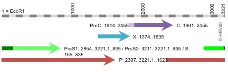
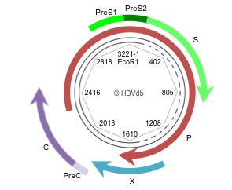
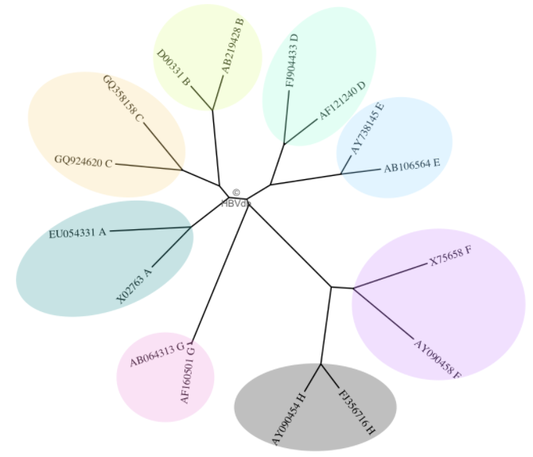
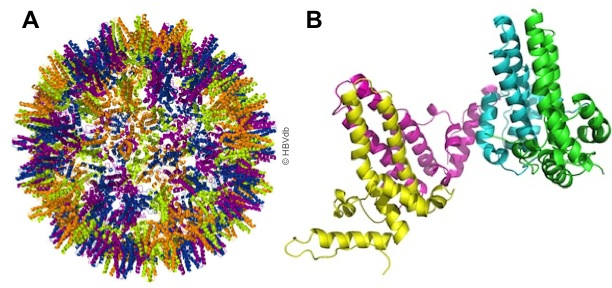
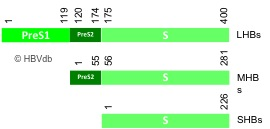

# HBV db

- [HBV db](#hbv-db)
  - [简介](#简介)
  - [HBV 基因组](#hbv-基因组)
    - [复制周期](#复制周期)
  - [基因型](#基因型)
  - [CDS](#cds)
    - [Core protein](#core-protein)
    - [HBe 抗原](#hbe-抗原)
    - [HBx](#hbx)
    - [Surface protein](#surface-protein)
    - [聚合酶蛋白](#聚合酶蛋白)
  - [编号](#编号)
  - [参考](#参考)

## 简介

乙型肝炎病毒（Hepatitis B Virus, HBV）数据库 HBVdb 方便研究人员调用病毒的遗传变异和病毒对治疗的耐药性。HBV 是世界范围内的一个主要健康问题，有 3.5 亿人受到慢性感染。治疗感染患者的主要药物是核苷酸类似物（逆转录酶抑制剂）。不幸的是，HBV 突变体会产生耐药，从而导致治疗失败。HBVdb 包含一组基于人工注释参考基因组的计算机注释序列，并提供了序列注释、基因分型和耐药性分析工具。

目前（2021-09-26）HBVdb 版本为 54.0，包含 101521 条序列，更新时间为 2021-06-15.

## HBV 基因组

HBV 会导致乙型肝炎，一种严重且常见的肝脏感染性疾病。慢性感染与严重肝病的风险增加有关，包括肝硬化和肝细胞癌症（hepatocellular carcinoma, HCC）。慢性 HBV 携带者发生 HCC 的风险是未感染个体的 100 倍。目前可用的抗乙肝病毒药物有局限性，干扰素 alpha 给药会有不良反应；核苷类似物具有抗病毒作用，但需要长期服用。

HBV 是一种包膜 DNA 病毒，属于肝病毒科（Hepadnaviridae）。它包含一个小的部分双链的、松弛环状 DNA（rcDNA）基因组，通过 RNA 中间体（即基因组前 RNA，pgRNA）的逆转录进行复制。根据基因型不同，其长度在 3182 ~ 3248 bp 之间，编码四个重叠的开放阅读框（ORFs），它们被翻译成病毒核心蛋白、表面蛋白、聚合酶/逆转录酶（RT）和 HBx。

### 复制周期

HBV 的生命周期开始于病毒附着于宿主细胞并内化。有研究表明，牛磺胆酸钠盐共转运多肽（sodium-taurocholate cotransporting polypeptide, NTCP）是 HBV 感染的一种功能受体。病毒粒子的 rcDNA 被转运到细胞核，被修复形成共价闭合环状 DNA（covalently closed-circular DNA, cccDNA）。cccDNA 作为 pgRNA 和其它病毒 mRNA 的转录模板，由宿主 RNA 聚合酶 II 催化。然后转录本被转移到细胞质进行翻译，产生病毒蛋白质。逆转录酶与 pgRNA 结合，触发核心蛋白组装成不成熟的含 RNA 的核衣壳，核衣壳经过一个成熟过程，pgRNA 逆转录生成成熟的 rcDNA。

成熟的含有 rcDNA 的核衣壳随后被病毒表面蛋白质包裹，随后以病毒粒子的形式分泌出去，或者回收到细胞核，进一步放大 cccDNA。cccDNA 在肝细胞内的持久性在病毒的持久性、抗病毒治疗终止后病毒复制的重新激活和抗治疗中均起着关键作用。

## 基因型

将基因组中大于 8% 的核苷酸变异定义为新的基因型，HBV 从 A-H 有8种基因型。感染黑猩猩、猩猩和长臂猿等灵长类动物的肝病毒非常相似，也可以认为是 HBV 的基因型。

HBV 的 8 种基因型具有明显的地域分布，如下图所示：

|基因型|序列号|长度|
|---|---|---|
|A|EU054331|3221|
|A|X02763|3221|
|B|AB219428|3215|
|B|D00331|3215|
|C|GQ924620|3215|
|C|GQ358158|3215|
|D|AF121240|3182|
|D|FJ904433|3182|
|E|AB106564|3212|
|E|AY738145|3212|
|F|AY090458|3215|
|F|X75658|3215|
|G|AB064313|3248|
|G|AF160501|3248|
|H|AY090454|3215|
|H|FJ356716|3215|

HBVdb 的建立得益于欧洲核苷酸档案馆（European Nucleotide Archive, ENA）的全自动注释程序。该自动注释过程使用上面列出的 8 中基因型的完整基因组作为参考。

## CDS

|CDS|蛋白|常用名|
|---|---|---|
|PreC|HBe|Precore, HBe antigen, PreC|
|C|HBc|Core, Capsid, HBc antigen, C|
|X|HBx|X protein, HBx, X|
|PreS1|LHBs|Long surface protein, PreS1|
|PreS2|MHBs|Middle surface protein, PreS2|
|S|SHBs|Small surface protein, S, HBs antigen|
|P|Pol|Polymerasee, Reverse Transcriptase|
|SP|HBSP|Hepatitis B Spliced Protein, HBSP|

### Core protein

对大多数基因型，HBc 抗原含有 183 或 185 个氨基酸，但是 G 型的 HBc 有一个额外的内部序列使其更长（195 个 aa）。N 端组装结构域（N-terminal assembly domain, NTD）参与核心离子组装（下图 A），C 端功能结构域（富含精氨酸）参与前基因组/逆转录酶复合物的包装。

### HBe 抗原

HBe 抗原（External core antigen, 外核心抗原）是从 C ORF 的第一个 ATG 翻译而来，因此N端含有一个 29 个氨基酸的延伸。这是一个疏水区域，形成一个信号肽，引导蛋白质进入内质网。然后，蛋白质通过高尔基体到达细胞表面。在转运过程中，信号肽和尾巴被移除，成熟的蛋白 HBeAg 作为单体蛋白分泌，在免疫逃逸中起作用。

### HBx

HBx 由最小的 HBV ORF 编码，大小为 154 个氨基酸。它是病毒体内感染所必须得。已有研究表明 HBx 是病毒复制和宿主细胞功能的关键调控因子，可以调节多种细胞功能，包括转录、细胞周期进展、DNA 损伤修复和凋亡。还有人认为 HBx 可激活多种病毒和细胞启动子。它的作用根据细胞环境的改变而变化。

### Surface protein

HBV 病毒粒子和亚病毒粒子含有三种共羧基末端的表面蛋白：大（LHBs）、中（MHBs）和小（SHBs）。HBV 表面蛋白石单个 ORF 的产物，通过三个结构域进行区分。如下图所示，HBV 中，只有 LHBs 包含 preS1 (108 到 119 个 aa，取决于基因型)，LHB 和 MHB 包含 PreS2 （55 个 aa），三者均含有 S (226 aa)。大部分基因型的大包膜蛋白（Large Envelope Protein, LHB）包含 399 或 400 个 aa，D 基因型包含 389 个 aa。

包膜蛋白在内质网中合成，并包含复杂的跨膜拓扑结构。

### 聚合酶蛋白

聚合酶（Pol）根据基因型不同包含 832 或 845个 aa。该酶具有 DNA 依赖的 DNA 聚合酶活性和 RNA 依赖的 DNA 聚合酶（逆转录酶）活性。它从一个前基因组 RNA 模板复制 HBV 基因组。

## 编号

HBV 中完整基因组的编号通常使用 EcoR1 限制性位点作为 +1.

## 参考

- https://hbvdb.lyon.inserm.fr/HBVdb/
- Hayer,J. et al. (2013) HBVdb: a knowledge database for Hepatitis B Virus. Nucleic Acids Research, 41, D566–D570.
