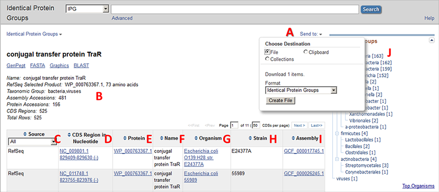

# Identical Protein Groups

## 背景

使用文本检索会返回大量结果，使得检索到所需蛋白质存在困难。Identical Protein Groups (IPG) 将蛋白质根据序列进行分组，每组代表一个特定的蛋白质序列。合并相同序列蛋白质后，数据库大大减小，使得检索更容易。IPG 报告页已作为蛋白质资源的替代显示，识别蛋白质 group 的成员，并包含相应的核苷酸编码序列区域、蛋白质名称以及物种名称。

IPG 检索页面：https://www.ncbi.nlm.nih.gov/ipg/

在 IPG 检索相对在 Protein (https://www.ncbi.nlm.nih.gov/protein) 检索的优势：

- 返回结果更少，因为每个独有的蛋白质序列只有一个结果。这样能够更快的发现所需结果。
- IPG 包含来自 GenBank, RefSeq, SwissProt, PDB 和其它资源的 protein accessions。蛋白 group 可以使用蛋白 accession 和文本检索，包括蛋白名或分类项。
- 可以对 GenBank 翻译蛋白质进行检索，包括来自注释 WGS 基因组的翻译，这些资源在 Protein 中没有。所有的 GenBank 蛋白质都可以在 IPG 中检索到。
- 每个 unique protein 都包含一个 lowest common taxonomic group name (如 mammals, g-proteobacteria)，可用来识别高度保守的蛋白质。
- 显示每个 group 中蛋白质数目
- IPG 报告页面包含一个可下载的表格，包含蛋白 accession, CDS 坐标，和分类信息。

## Record 信息

A. 检索结果可以下载为本地表格
B. 顶部显示 group 名称信息。下面是 group 的摘要：
- 在首选的 protein accession 中提取的名称
- 自动选择的首选蛋白质 accession 和蛋白长度
- 该 group 中最低常见分类节点
- 各种数目
  - assembly accessions 数
  - protein accessions 数
  - CDS regions 数
  - 总行数
  - 对 GenBank 和 RefSeq 蛋白，每个蛋白质作为核酸记录的注释，因此每个蛋白质都有相应的编码区。然而，IPG 不仅仅包含这些注释蛋白，还包括 SwissProt, PDB, 专利（PAT）等蛋白，这些蛋白没有核酸编码区。

C. 来源数据库。可能为 RefSeq, INSDC, SwissProt, PDB, PIR 或 Patent
D, E. 核苷酸 accession 和坐标（D）和蛋白 accession (E)
F. 蛋白名称

## 参考

- https://www.ncbi.nlm.nih.gov/ipg/docs/about/
