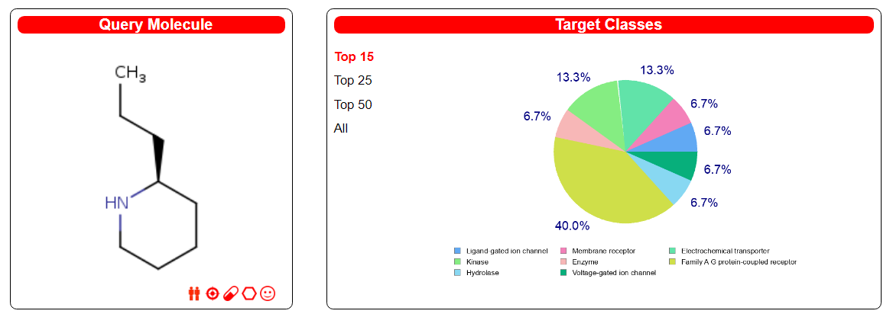
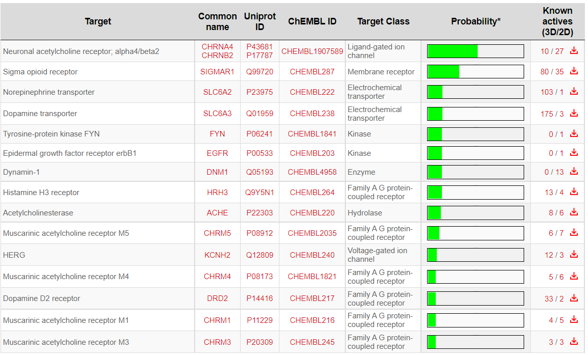
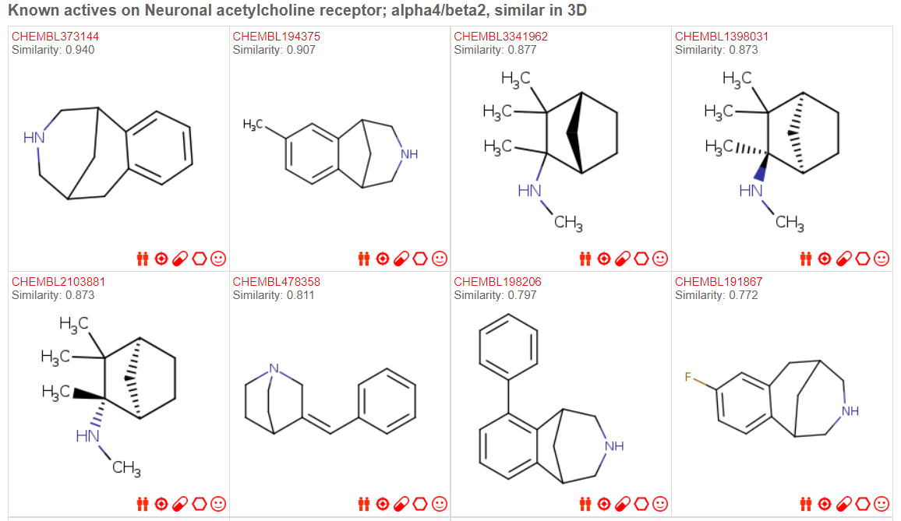

# SwissTargetPrediction

- [SwissTargetPrediction](#swisstargetprediction)
  - [简介](#简介)
  - [使用方法](#使用方法)
  - [预测结果](#预测结果)
    - [Known Actives](#known-actives)
  - [参考](#参考)

Last updated: 2022-09-20, 10:04
@author Jiawei Mao
****

## 简介

假设小分子具有生物和活性（bioactive），SwissTargetPrediction 用来预测该小分子最可能的大分子靶点。该预测基于已知化合物的二维和三维结构的相似性来预测化合物的靶标^[Daina,A. et al. (2019) SwissTargetPrediction: updated data and new features for efficient prediction of protein targets of small molecules. Nucleic Acids Res, 47, W357–W364.]。具体算法可以参考文献^[Gfeller,D. et al. (2013) Shaping the interaction landscape of bioactive molecules. Bioinformatics, 29, 3073–3079.]。

## 使用方法

1. 选择物种

2. 上传需要预测靶标的分子结构

可以直接输入 SMILES 格式的分子结构，也可以手动画，或者上传分子文件，比如 ChemDraw 画好的结构。

3. 点击 Predict targets 进行预测

## 预测结果

以毒芹碱（coniine）为例：

查询分子（Query Molecule）的结构，右下角的图标分别表示：

- Send to SwissSimilarity
- Send to SwissTargetPrediction
- Send to SwissADME
- Send to SwissBioisostere
- Get the SMILES

下方是分子预测靶点的表格。

|Column|说明|
|---|---|
|Target|靶点名称|
|Common name|靶点基因名，链接到 genecards 数据库|
|Uniprot ID|Uniprot ID，链接到 Uniprot 数据库|
|ChEMBL ID|链接到 ChEMBL 数据库|
|Target Class|靶点类别|
|Probability|该蛋白成为靶点的概率。1 通常表示该分子是已知的活性分子|
|Known actives (3D/2D)|该靶点上与查询分子相似的已知活性化合物（相似性 2D > 0.65, 3D>0.85）|

### Known Actives

点击表格的最后一列 "Known actives (3D/2D)" 可以查看针对该靶标已有的活性分子。这些化合物是经过实验验证与靶标具有生物活性，并且与查询分子具有高度相似性。每个化合物给出了它的 ChEMBLID 和查询分子的相似度。

## 参考

- http://swisstargetprediction.ch/
