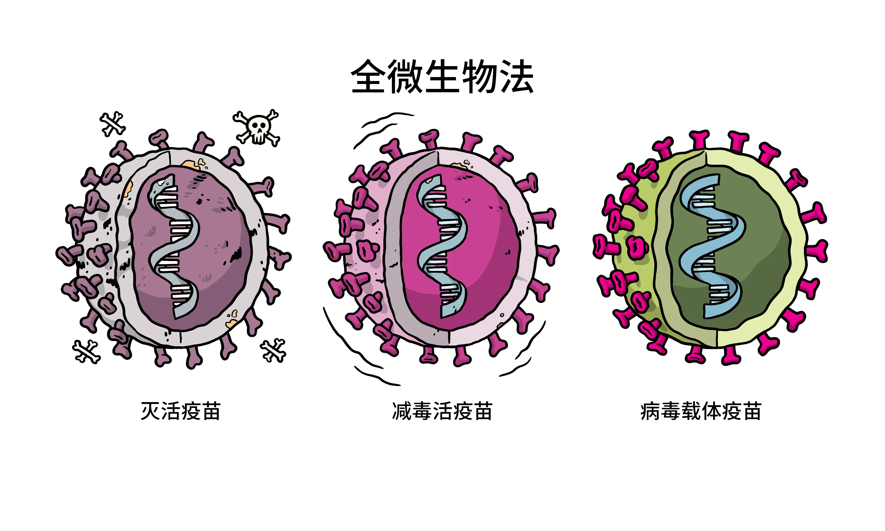
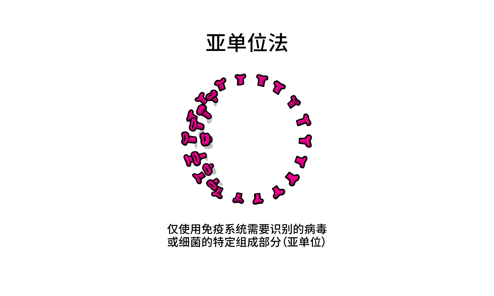
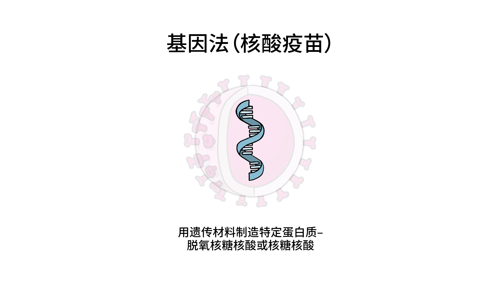
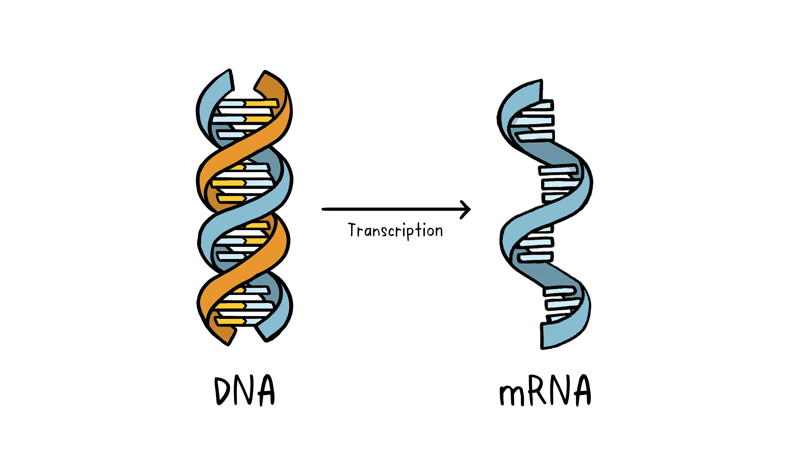

# 疫苗类别

- [疫苗类别](#疫苗类别)
  - [疫苗](#疫苗)
  - [全微生物法](#全微生物法)
    - [灭活疫苗（Inactivated vaccines）](#灭活疫苗inactivated-vaccines)
    - [减毒活疫苗（Live-attenuated vaccines）](#减毒活疫苗live-attenuated-vaccines)
    - [病毒载体疫苗（Viral vector vaccines）](#病毒载体疫苗viral-vector-vaccines)
  - [亚单位](#亚单位)
    - [亚单位疫苗](#亚单位疫苗)
    - [重组疫苗](#重组疫苗)
    - [结合疫苗](#结合疫苗)
    - [类毒素疫苗](#类毒素疫苗)
  - [核酸疫苗](#核酸疫苗)
    - [DNA 和重组载体疫苗](#dna-和重组载体疫苗)
    - [mRNA 疫苗](#mrna-疫苗)
  - [参考](#参考)

***

## 疫苗

凡具有抗原性接种于机体可产生特异的自动免疫力，可抵御传染病的发生或流行的制剂，称为疫苗。

习惯上，人们将由减毒或灭活的病原微生物制得的、具有刺激机体产生针对病原微生物的特异抗体或细胞免疫的生物制品统称为疫苗。不过，从具体的概念上讲，由细菌制得的生物制品称为细菌性疫苗（菌苗），而由病毒、螺旋体等制成的生物制品称为疫苗。

## 全微生物法

### 灭活疫苗（Inactivated vaccines）

选用免疫原性强的病原微生物经培养（或一种与之非常相似的病毒或细菌），使用化学品、加热或者辐射灭活或杀死，再经纯化制成。这种方法已被证明在人身上有效，可以合理规模生产疫苗，它是制造流感和脊灰疫苗的方法。

灭活疫苗是最早生产的疫苗类型，触发的免疫反应不像减毒活疫苗那么强。

灭活疫苗使用的毒种一般是强毒株，但使用减毒的弱毒株也有良好的免疫原性，如用萨宾（Sabin）减毒株生产的脊髓灰质炎灭活疫苗。灭活疫苗已失去对机体的感染力，但仍保持其免疫原性，可以刺激机体产生相应的免疫力，抵抗野毒株的感染。

灭活疫苗免疫效果良好，在2～8℃下一般可保存一年以上，没有毒力返祖的风险；但灭活疫苗进入人体后不能生长繁殖，对人体刺激时间短，要获得强而持久的免疫力，一般需要加入佐剂，且需多次、大剂量注射，并缺乏自然感染的局部免疫保护。即灭活疫苗不能提供终身免疫，随着时间的推移需要打加强针，但它们比减毒活疫苗的副作用更少。

然而，这种方法需要特殊的实验室设施来安全地生长病毒或细菌，需要相对较长的生产时间，并可能需要接种两剂或三剂。

灭活疫苗实例：

- 甲型肝炎（Hepatitis A）
- 流感（Flu）
- 脊髓灰质炎（Polio）
- 狂犬病（Rabies）

### 减毒活疫苗（Live-attenuated vaccines）

减毒活疫苗使用毒性减弱的活病毒或非常相似的病毒。麻疹、腮腺炎和风疹疫苗以及水痘和带状疱疹疫苗就是这类。这种方法使用类似灭活疫苗的技术，可以大规模生产。

减毒活疫苗可以对病毒或细菌产生免疫力，但更常用于病毒。这类疫苗的原理是让病毒或细菌充分繁殖，使身体产生记忆 B 细胞，从而能够识别和记忆病毒，并在最初反应后多年内对齐产生免疫反应。减毒活疫苗引发的免疫反应类似于自然感染的反应，但患者无法将病毒传播给他人，也不会因病毒引起疾病。

个体通常通过一两次减毒活疫苗注射就能获得终身免疫。

采用人工定向变异的方法，或从自然界筛选出毒力减弱或基本无毒的活的微生物制成的疫苗。减毒活疫苗接种后，在机体内有一定的生长繁殖能力，可**使机体发生类似隐性感染或轻度感染的反应，但不产生临床症状，免疫效果强而持久，一般只需接种一次，且用量较小**，除刺激机体产生细胞免疫和体液免疫外，尚能产生局部免疫保护。

然而，减毒活疫苗须在低温条件下保存及运输，有效期相对较短，存在毒力返祖的风险。由于这类疫苗是包含活的病毒或细菌，因此可能不适用于免疫系统受损或长期有健康问题的人。

减毒活疫苗实例：

- 麻疹（Measles）、腮腺炎（Mumps）和风疹（Rubella）（MMR 联合疫苗）
- 轮状病毒（Rotavirus）
- 天花（Smallpox）
- 水痘（Chickenpox）
- 黄热病（Yellow fever）

### 病毒载体疫苗（Viral vector vaccines）

这种类型的疫苗使用一种安全的病毒来传递目标微生物的特定组成部分，即蛋白，这样它就可以在不引起疾病的情况下触发免疫反应。

要做到这一点，需要将制造目标病原体特定部分的遗传信息插入到一种安全病毒中。然后，该安全病毒可以作为平台或载体将特定蛋白输送到人体内。这种蛋白随后触发免疫反应。埃博拉疫苗是一种病毒载体疫苗，这种类型的疫苗可以迅速开发。

## 亚单位

亚单位疫苗只使用免疫系统需要识别的病毒或细菌的特定部分（亚单位）。它不包含整个微生物，也不使用安全病毒作为载体。这些亚单位可能是蛋白或糖。儿童期接种的大多数疫苗是亚单位疫苗，用于保护人们免受百日咳、破伤风、白喉和脑膜炎球菌性脑膜炎等疾病的侵袭。

在大分子抗原携带的多种特异性的抗原决定簇中，只有少量抗原部位对保护性免疫应答起重要作用。通过化学分解或有控制性的蛋白质水解方法使天然蛋白质分离，提取细菌、病毒的特殊蛋白质结构，筛选出具有免疫活性的片段制成的疫苗，称为亚单位疫苗。

亚单位疫苗仅有几种主要表面蛋白质，因而能消除许多无关抗原诱发的抗体，从而减少疫苗的副反应和疫苗引起的相关疾病。A群脑膜炎球菌多糖疫苗、伤寒Vi多糖疫苗是比较早的亚单位疫苗，该类疫苗减少了全菌疫苗使用中所出现的不良反应；此外，流感裂解疫苗的免疫效果及安全性已在国内外的广泛应用中得到了肯定。亚单位疫苗的不足之处是免疫原性较低，需与佐剂合用才能产生好的免疫效果，所以，若全菌（病毒）疫苗不存在严重不良反应,仍应以全菌（病毒）疫苗为首选。

亚单位疫苗、重组疫苗、结合疫苗以及多糖疫苗使用细菌或病毒的特定部分。它们可以在体内引发强烈的免疫反应。虽然免疫反应强，但这类疫苗需要多次注射。比较适合免疫系统较弱以及具有长期健康问题的人群。

应用实例：

- 乙型流感嗜血杆菌（Hemophilus influenza type b, Hib）
- 乙型肝炎（Hepatitis B）
- 人乳头瘤病毒（Human papillomavirus, HPV）
- 百日咳（Whooping cough）
- 肺炎球菌病（Pneumococcal disease）
- 脑膜炎球菌病（Meningococcal disease）
- 带状疱疹（Shingles）

### 亚单位疫苗

细菌或病毒表面的抗原负责触发免疫反应。亚单位疫苗从细菌或病毒中分离出特定抗原用于疫苗，这些抗原一般根据免疫原性强度选择。

亚单位疫苗不会引起很多副作用，因为它们特异性较强。

### 重组疫苗

重组疫苗（Recombinant vaccines）通过基因工程制造。将编码细菌或病毒蛋白质的基因分离出来，放在另一个细胞的基因中。当该细胞繁殖时，会产生疫苗相关蛋白质，这意味着免疫系统可以识别该蛋白质，从而保护身体免受其影响。

### 结合疫苗

结合疫苗使用两个不同的组分。结合疫苗使用细菌或病毒

### 类毒素疫苗

将细胞外毒素经甲醛处理后失去毒性，仍保留免疫原性。常用的类毒素有白喉类毒素、破伤风类毒素等。类毒素在体内吸收慢，但能长时间刺激机体产生更多抗体，增强免疫效果。

## 核酸疫苗

与使用灭活或减毒活的完整微生物或部分微生物的疫苗方法不同，核酸疫苗只使用为特定蛋白质的遗传物质，而不是整个微生物。脱氧核糖核酸和核糖核酸是细胞用来生产蛋白质的指令。脱氧核糖核酸首先转化为信使核糖核酸，然后被用作制造特定蛋白质的蓝图。

核酸疫苗以 DNA 或 mRNA 的形式为细胞提供一组特定的指令，让细胞产生希望免疫系统识别并响应的特定蛋白质。

### DNA 和重组载体疫苗

DNA 疫苗包含从细菌产生特定抗原的 DNA。注射到人体后，细菌

### mRNA 疫苗

## 参考

- https://zhuanlan.zhihu.com/p/130847513
- https://sites.bu.edu/covid-corps/projects/science-communication/types-of-vaccines-infographics/
- https://www.who.int/zh/news-room/feature-stories/detail/the-race-for-a-covid-19-vaccine-explained
- https://www.nmpa.gov.cn/xxgk/kpzhsh/kpzhshyp/20180726230401163.html
