# VMware 安装 CentOS 7

## 安装流程

- 自定义

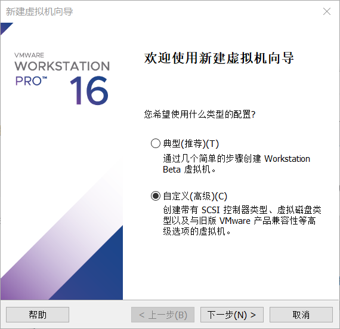

- 兼容性，默认选择

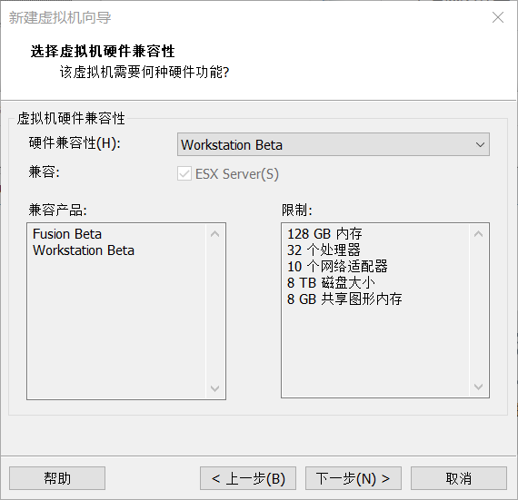

- 选择镜像文件

首先到官网下载 ISO 文件：

http://isoredirect.centos.org/centos/

转到阿里镜像下载：

http://mirrors.aliyun.com/centos/7.9.2009/isos/x86_64/

版本说明：

|安装包|说明|
|---|---|
|CentOS-7-x86_64-DVD-2009.iso|标准安装板（推荐）|
|CentOS-7-x86_64-Everything-2009.iso|完整版，集成所有软件|
|CentOS-7-x86_64-Minimal-2009.iso|精简版，自带软件最少|
|CentOS-7-x86_64-NetInstall-2009.iso|网络安装版，从网络安装|

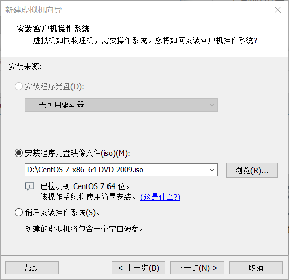

- 设置用户名和密码等信息

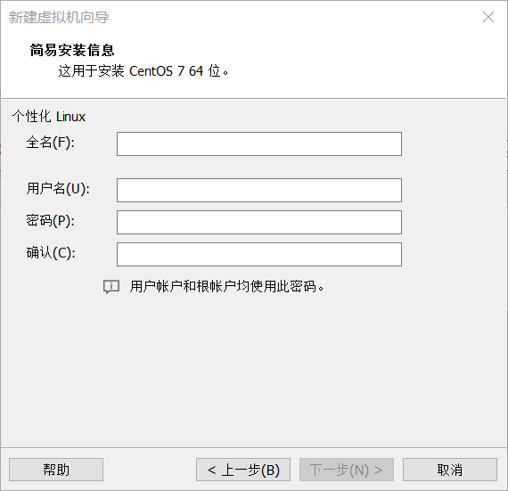

- 设置虚拟机名称和位置

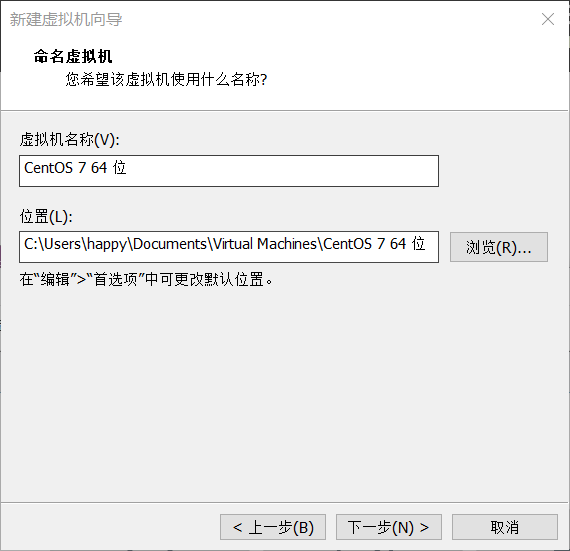

- 设置处理器

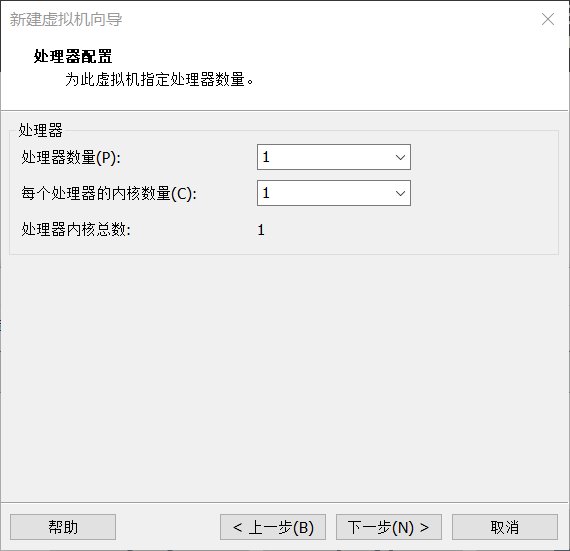

推荐配置：

|应用程序|建议的处理器数量|
|---|---|
|桌面应用程序|1 个处理器|
|服务器操作系统|2 个处理器|
|视频编码、建模和科学运算|4 个处理器|

- 设置内存

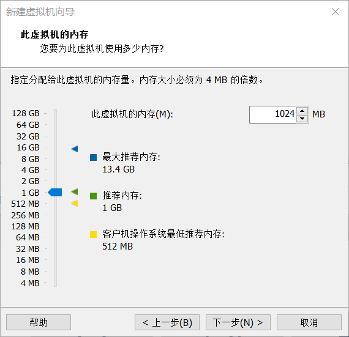

- 设置连接方法

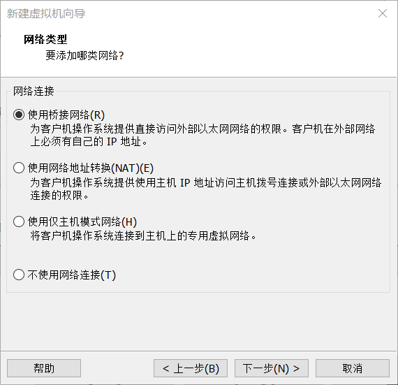

- 设置 I/O 控制器类型

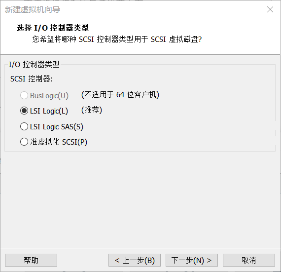

- 磁盘类型

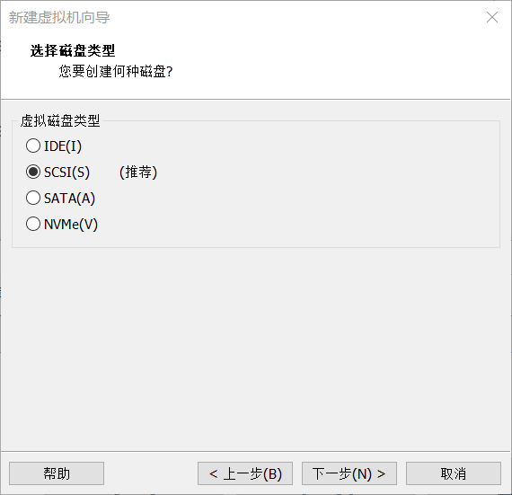

- 创建虚拟磁盘

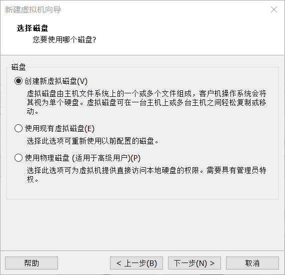

- 分配磁盘大小

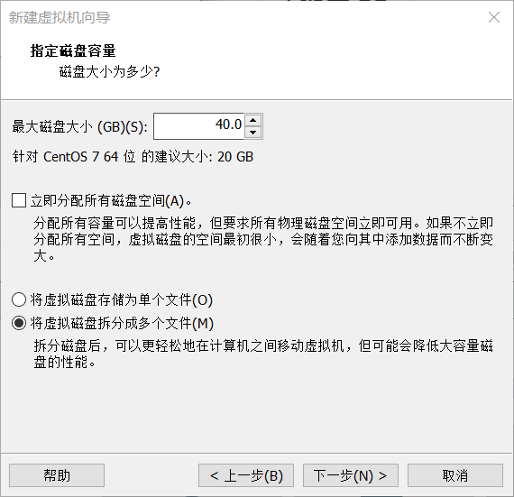

- 设置完成，开始安装

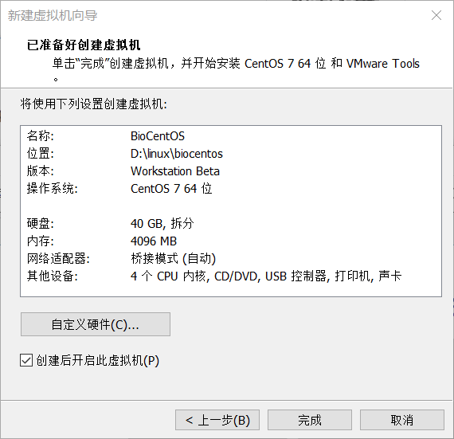

## 网络配置

```
TYPE=Ethernet
BOOTPROTO=static #修改成static
DEFROUTE=yes
IPV4_FAILURE_FATAL=no
IPV6INIT=yes
IPV6_AUTOCONF=yes
IPV6_DEFROUTE=yes
IPV6_FAILURE_FATAL=no
NAME=eno16777736
UUID=bf5337ab-c044-4af7-9143-12da0d493b89
DEVICE=eno16777736
ONBOOT=yes #修改成yes
PEERDNS=yes
PEERROUTES=yes
IPV6_PEERDNS=yes
IPV6_PEERROUTES=yes
IPADDR=192.168.0.200 # 自定义虚拟机的ip地址（主机是192.168.0.107），必须与主机在同一网段
NETMASK=255.255.255.0 #设置子网掩码，跟宿主一样
GATEWAY=192.168.0.1  #默认网关，跟宿主一样
DNS1=192.168.0.1 #DNS，跟宿主一样
```

https://blog.csdn.net/u013626215/article/details/88645003

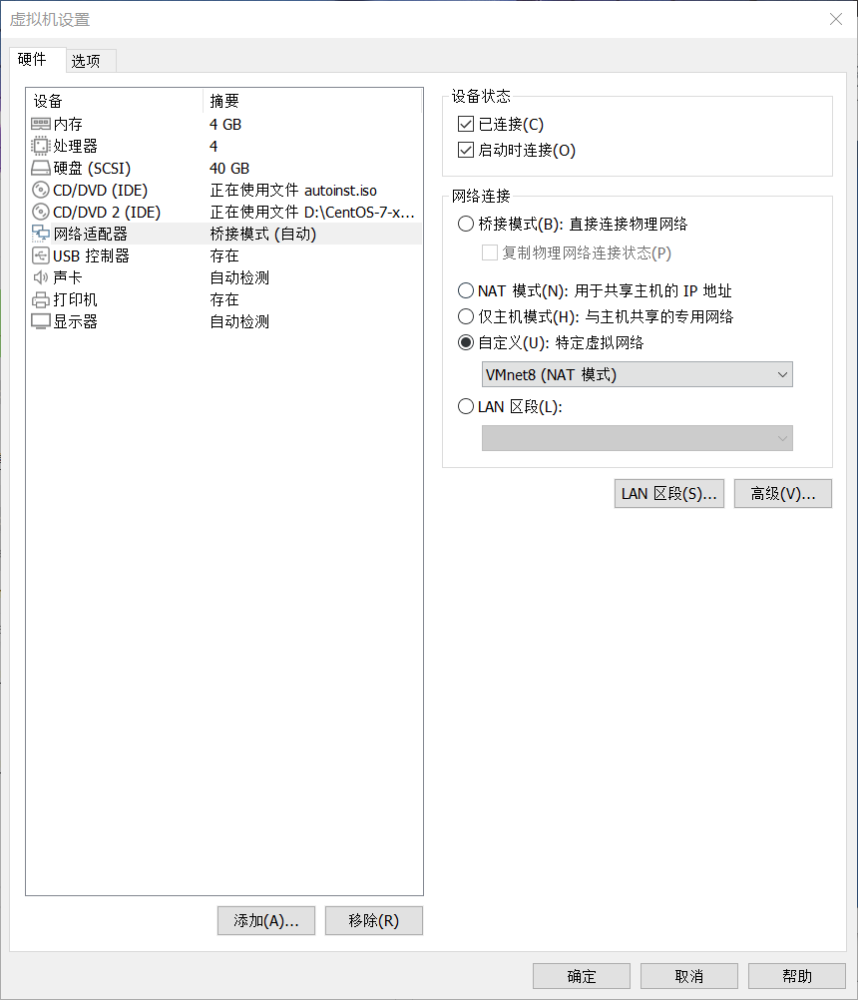
