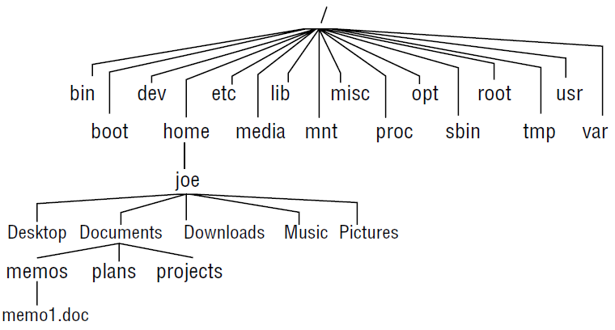

# Linux 文件系统

- [Linux 文件系统](#linux-文件系统)
  - [文件系统树](#文件系统树)
  - [文件系统命令](#文件系统命令)
  - [路径](#路径)
    - [绝对路径](#绝对路径)
    - [相对路径](#相对路径)
    - [通配符](#通配符)
    - [常用字符类](#常用字符类)
    - [通配符使用示例](#通配符使用示例)
  - [文件权限](#文件权限)
    - [修改权限（数字）](#修改权限数字)
    - [修改权限（字母）](#修改权限字母)
    - [默认权限](#默认权限)
  - [修改文件归属](#修改文件归属)
  - [注意事项](#注意事项)

2022-06-06, 12:13
****

## 文件系统树

Linux 以分层目录结构组织所有文件。在 GNU/Linux 和其它类 Unix 操作系统中，文件放在目录中。所有的文件和目录放在以 "/" 为根的树里。

文件名规则：

- 以 `.` 字符开头的文件名为隐藏文件。此时使用 `ls` 不会列出它们，但是用 `ls -a` 可以；
- 文件名大小写敏感；
- Linux 没有文件扩展名的概念；
- 文件名对标点符号只支持 `.`, `-` 和 `_`；
- 文件名不要使用空格。



| 目录 | 说明 |
|--|--|
| `/` | 根目录 |
| `/bin` | 包含系统启动和运行所需的二进制程序，以及常见 Linux 命令，如 `ls`, `sort`, `date`, `chmod` 等 |
| `/boot` | 包含 Linux 内核、初始 RAM 磁盘映射和启动加载程序 |
| `/dev` | 包含系统上设备的访问点文档，包括终端设备 `tty*`，硬盘（`hd*` 或 `sd*`），RAM（`ram*`）和 CD-ROMs（`cd*`）。用户可以直接通过这些设备文档访问设备，不过，应用程序对终端用户通常会隐藏实际的设备名称 |
| `/etc` | 包含所有系统层面的配置文件，这些文档大多是纯文本文件 |
| `/home` | 用户主目录 |
| `/lib` | 包含 `/bin` 和 `/sbin` 中核心系统程序启动所需的共享库 |
| `/media` | 包含可移动介质的挂载点，例如 USB 驱动器，CD-ROMs 等等，这些介质连接到计算机后，会自动挂载到这个目录下 |
| `/mnt` | 早期 Linux 系统中，该目录包含可移动介质的挂载点 |
| `/opt` | 用来安装可选软件。主要用来存储安装的商业软件 |
| `/proc` | 该目录比较特殊，从存储在硬盘上的文件来说，它不是真正的文件系统。相反，它是一个由 Linux 内核维护的虚拟文件系统。包含系统资源信息 |
| `/root` | root 账户的 home 目录，出于安全考虑，root 的 home 目录不在 `/home` 目录下 |
| `/sbin` | 包含系统二进制文件，通常是完成重大系统任务的程序，为超级用户保留 |
| `/tmp` | 存储由各种程序创建的临时文件。一些配置导致系统每次重新启动时，都会清空这个目录 |
| `/usr` | 在 Linux 系统中，`/usr` 目录可能是最大的一个，包含普通用户所需要的所有程序和文件 |
| `/usr/bin` | 包含系统安装的可执行程序，这个目录会包含许多程序 |
| `/usr/lib` | 包含由 `/usr/bin` 目录中的程序所用的共享库 |
| `/usr/local` | 是非系统发行版自带程序的安装目录。通常，由源码编译的程序会安装在 `/usr/local/bin` 目录下。新安装的 Linux 系统中会存在这个目录，并且在管理员安装程序之前，这个目录是空的 |
| `/usr/sbin` | 包含许多系统管理程序 |
| `/usr/share` | 包含许多由 `/usr/bin` 目录中的程序使用的共享数据。其中包含默认配置文件、图标、桌面背景、音频文件等等 |
| `/usr/share/doc` | 大多数安装在系统中的软件会包含一些文档，在该目录可以找到按照软件包分类的文档 |

## 文件系统命令

| 命令 | 功能 |
|--|--|
| [cd](../command/cd.md) | 切换目录 |
| [pwd](../command/pwd.md) | 打印当前工作目录名称 |
| [mkdir](../command/mkdir.md) | 创建目录 |
| [chmod](../command/chmod.md) | 修改文件或目录权限 |
| [ls](../command/ls.md) | 列出目录内容 |
[mv](../command/mv.md)|移动文件
cp|复制文件
rm|删除文件


## 路径

### 绝对路径

绝对路径从根目录开始。例如，大多数系统程序都安装在 `/usr/bin` 目录，以 `/` 开始，表明为根目录。

### 相对路径

相对路径从工作目录开始：

- `.` 指工作目录
- `..` 指工作目录的父目录

例如，我们先把工作目录切换到 `/usr/bin`：

```sh
$ cd /usr/bin
$ pwd
/usr/bin
```

然后，把工作目录转到 `/usr/bin` 的父目录 `/usr`。有两种实现方法，使用绝对路径：

```sh
$ cd /usr
$ pwd
/usr
```

或使用相对路径：

```sh
$ pwd
/usr/bin
$ cd ..
$ pwd
/usr
```

### 通配符

接受文件名为参数的任何命令，都可以使用通配符。

|通配符|含义|
|---|---|
|*|匹配任意多个字符|
|?|匹配任意一个字符|
|[characters]|匹配任意一个属于字符集的字符|
|[!characters]|匹配任意一个不属于字符集的字符|
|[:class]|匹配任意一个属于指定**字符类**的字符|

### 常用字符类

|字符类|含义|
|---|---|
|[:alnum:]|任意一个字母或数字|
|[:alpha:]|任意一个字母|
|[:digit:]|任意一个数字|
|[:lower:]|任意一个小写字母|
|[:upper:]|任意一个大写字母|

### 通配符使用示例

|模式|匹配对象|
|---|---|
|*|所有文件|
|g*|文件名以“g”开头的文件|
|b*.txt|以”b” 开头，中间有零个或任意多个字符，并以”.txt” 结尾的文件|
|Data???|以“Data”开头，其后紧接着 3 个字符的文件|
|[abc]*|文件名以”a”,”b”, 或”c” 开头的文件|
|BACKUP.[0-9][0-9][0-9]|以”BACKUP.” 开头，并紧接着 3 个数字的文件|
|[[:upper:]]*|以大写字母开头的文件|
|[![:digit:]]*|不以数字开头的文件|
|*[[:lower:]123]|文件名以小写字母结尾，或以“1”，“2”，或“3”结尾的文件|

## 文件权限

- 字符 1：文件类型

| 字符 | 说明 |
|--|--|
| `-` | 常规文件 |
| d | 目录 |
| l | 符号链接 |
| b | block device |
| c | character device |
| s | socket |
| p | named pipe |

- 字符 2-4：owner 权限
- 字符 5-7：group 权限
- 字符 8-10：其它用户权限

| 字符 | 权限 | 文件 | 目录 |
|--|--|--|--|
| r | 读 | 查看文件内容 | 查看目录包含的文件和子目录 |
| w | 写 | 修改文件内容、重命名、删除文件 | 从目录添加或删除文件/目录 |
| x | 执行 | 将文件作为程序运行 | 将该目录切换为当前目录、搜索，或从中执行一个程序。访问目录中文件的元数据（file size, time stamps 等） |
| `-` | 关闭以上权限 |

例如：

```bash
$ ls -ld ch3 test
-rw-rw-r-- 1 joe sales 4983 Jan 18 22:13 ch3
drwxr-xr-x 2 joe sales 1024 Jan 24 13:47 test
```

说明：

- 文件 `ch3` 具有读写权限（owner, group），其它用户只有读权限，即只能看，不能修改或删除
- 目录 `test` owner 具有读、写和执行权限，group 和其它用户只有读和执行权限。

> **NOTE**
> 对可执行文件，其 bit 值为 `s` 而不是 `x`。
> 当 owner 或/与 group 执行权限为 `s`，即 `-rwsrxr-x`, `-rwxr-sr-x` 或 `-rwsr-sr-x`，该程序可以被任何用户运行，但运行进程所有权归 user/group，而非运行命令的用户。该行为分别称为 `set UID` 和 `set GID` 程序。
> 例如，`mount` 命令（`/bin/mount`）权限为 `-rwsr-xr-x`，这样任何用户都能运行 mount 列出挂载的文件系统（大多时候，仍然需要 root 权限使用 mount 命令挂载文档系统）。

> **NOTE**
> 如果 `t` 出现在目录末尾，如 `drwxrwxr-t`，称为 `sticky bit`。
> 设置 `t` 表示允许其它 user 或 group 添加文件到目录，但不允许删除该目录其它用户的文件。
> 为目录设置 `set GID`，则目录中创建的所有文件与目录的 group 相同。
> 如果目录的执行 bit 设置为大写的 `S` 或 `T`，表示设置 `set GID` 和 `sticky bit`。

### 修改权限（数字）

使用 `chmod` 修改权限。每个权限对应一个数字：

- `r=4`
- `w=2`
- `x=1`

使用这些权限的加和来设置特定用户的权限。

例如：

- 对 owner 开放所有权限，设置为 7 (4+2+1)
- 对 group 和其它用户开发只读权限，设置为 4（4+0+0）

此时，最终的权限数字为 744。`file` 文件权限和设置方法：

| 权限 | 命令 |
|--|--|
| `rwxrwxrwx` | `$ chmod 777 file` |
| `rwxr-xr-x` | `$ chmod 755 file` |
| `rw-r--r--` | `$ chmod 644` |
| `---------` | `$ chmod 000 file` |

`chmod` 命令也可以递归使用。假设要将 `$HOME/myapps` 目录及其所含文件权限设置为 755 （`rwxr-xr-x`）。可以用 `-R` 选项：

```bash
$ chmod -R 755 $HOME/myapps
```

### 修改权限（字母）

权限归属字符：

- u: user
- g: group
- o: others
- a: all

使用 `+` 和 `-` 来开启或关闭权限。

例如，对权限全开的文件 `rwxrwxrwx` file，调整权限：

| 权限 | 命令 | 说明 |
|--|--|--|
| `r-xr-xr-x` | `$ chmod a-w file` | 关闭所有写权限 |
| `rwxrwxrw-` | `$ chmod o-x file` | 关闭 other 的执行权限 |
| `rwx------` | `$ chmod go-rwx file` | 关闭 group 和 other 的所有权限 |

例如，对权限全关的文件 `---------` file，调整权限：

| 权限 | 命令 | 说明 |
|--|--|--|
| `rw-------` | `$ chmod u+rw file` | 开启 owner 的读写权限 |
| `--x--x--x` | `$ chmod a+x file` | 开启所有执行权限 |
| `r-xr-x---` | `$ chmod ug+rx file` | 开启 owner 和 group 读、执行权限|

`chmod` 使用字母递归修改权限比使用数字效果更好，因为可以单独调整某个 bit。例如，要删除 other 的写入权限，而不更改其它权限：

```bash
$ chmod -R o-w $HOME/myapps
```

该命令递归删除 other 的写权限。如果使用 `644` 数字格式，会同时删除目录的执行权限，使用 `755` 则会打开常规文件的执行权限，使用 `o-w` 则不关闭一项，不影响其它 bits。

### 默认权限

| 用户 | 默认文件权限 | 默认目录权限 |
|--|--|--|
| 常规用户 | `rw-rw-r--` | `rwxrwxr-x` |
| root 用户 | `rw-r--r--` | `rwxr-xr-x` |

这些默认值由 `umask` 的值确定。`umask` 的默认值在 `pam_umask.so` 或 `/etc/profile` 文件中定义。

可以在 shell 配置文件 `~/.bashrc` 或 `~/.zshrc` 中修改当前用户的默认 umask 值。直接用 `umask` 命令可以修改当前 session 的值。

查看 `umask` 值：

```bash
$ umask
0022
```

`umask` 包含**不**会在新建文档或目录上设置的权限 bit。

例如，文档的默认创建权限为 `666`，目录的为 `777`。要计算新建文档的权限，从默认权限减去 `umask` 值。

例如，`umask 022`：

- 文件：`666 - 022 = 644`，所以新建文件的 owner 权限为读写（`6`）、group 和其它为只读 `44`。
- 目录：`777 - 022 = 755`，所以新建目录的 owner 权限全开放，对 group 和其它用户为读、执行，即可以切换到目录，查看其中文件和目录等。

使用 `-S` 选项可以查看 `umask` 的符号表示：

```bash
$ umask -S
u=rwx,g=rx,o=rx
```

## 修改文件归属

普通用户无法更改文档或目录的所有权，只能以 root 账户修改。例如，假设你以 root 用户在 joe 的 home 目录创建了文件 `memo.txt`，可以为 `joe` 分配所有权：

```bash
# chown joe /home/joe/memo.txt
# ls -l /home/joe/memo.txt
-rw-r--r--. 1 joe root 0 Dec 19 11:23 /home/joe/memo.txt
```

注意，`chown` 将用户更改为 `joe`，但 group 依然是 `root`。

将 user 和 group 同时修改为 `joe`：

```bash
# chown joe:joe /home/joe/memo.txt
# ls -l /home/joe/memo.txt
-rw-r--r--. 1 joe joe 0 Dec 19 11:23 /home/joe/memo.txt
```

`chown` 也可以递归使用。如将整个目录更改为特定用户，使用 `-R` 选项。例如，插入一个 USB 设备，挂载在 `/media/myusb` 目录，并且希望将该驱动的所有内容授予用户 joe 所有权，可以用如下操作：

```bash
# chown -R joe:joe /media/myusb
```

## 注意事项

1. 以 `.` 字符开头的文件名是隐藏文件。用 `ls` 命令不能列出它们，不过用 `ls -a` 就可以。
2. 文件名和命令名大小写铭感。
3. Linux 没有文件扩展名的概念。
4. 虽然 Linux 支持长文件名，可以包含空格和标点符号，不过标点符号仅限于 `.`, `-` 和下划线。且，不过在文件名中使用空格。

