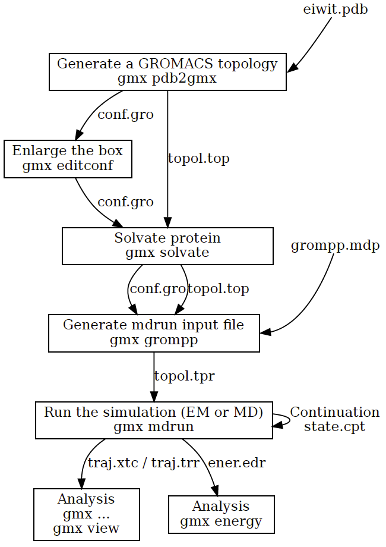

# 用户指南

- [用户指南](#用户指南)
  - [影响 GROMACS 使用的已知问题](#影响-gromacs-使用的已知问题)
    - [不能与 CUDA 11.3 编译](#不能与-cuda-113-编译)
  - [开始](#开始)
    - [流程图](#流程图)
    - [配置环境](#配置环境)
    - [重要文件格式](#重要文件格式)
      - [分子拓扑文件（Molecular Topoloogy file, `.top`）](#分子拓扑文件molecular-topoloogy-file-top)
      - [拓扑 #include 文件机制](#拓扑-include-文件机制)
      - [分子结构文件（Molecular Structure file, `.gro`, `.pdb`）](#分子结构文件molecular-structure-file-gro-pdb)
      - [分子动力学参数文件（Molecular Dynamics parameter file, `.mdp`）](#分子动力学参数文件molecular-dynamics-parameter-file-mdp)
      - [索引文件（Index file, `.ndx`）](#索引文件index-file-ndx)
      - [运行输入文件（Run input filee, `.tpr`）](#运行输入文件run-input-filee-tpr)

2022-05-25, 20:18
***

## 影响 GROMACS 使用的已知问题

### 不能与 CUDA 11.3 编译

由于 nvcc 编译器中的一个 bug，目前不能使用 CUDA 11.3 编译 NVIDIA GPU 加速的 GROMACS。推荐使用 CUDA 11.4 或更新的版本。

## 开始

### 流程图

下图是使用 GROMACS 模拟蛋白在水箱中的动力学行为的典型流程。



多步能量最小化经常是必要的，包括循环： `gmx grompp` -> `gmx mdrun`。

本章，我们假设读者熟悉分析动力学和 Unix，包括使用 `jot`, `emacs` 或 `vi`。此外，还假设已经正确安装 GROMACS。

### 配置环境

可以使用如下命令查看是否正确安装 GROMACS：

```sh
$ gmx --version
```

如果正确安装 GROMACS，会输出 GROMACS 版本信息。

GROMACS 默认安装在 `/usr/local/gromacs/bin` 目录。

### 重要文件格式

以下是在使用 GROMACS 中可能遇到的文件类型。

#### 分子拓扑文件（Molecular Topoloogy file, `.top`）

分子拓扑文件由程序 `gmx pdb2gmx` 生成。`gmx pdb2gmx` 将肽段或蛋白的 pdb 结构文件转换为分子拓扑文件，该拓扑文件包含肽段或蛋白质的所有相互作用的完整描述。

#### 拓扑 #include 文件机制

在 top 文件中构造系统拓扑时，GROMACS 使用内置的 C 预处理器 cpp 。cpp 解析如下行：

```c
#include "ions.itp"
```

在如下位置查找该文件：

- 当前目录
- `GMXLIB` 环境变量指定的 GROMACS top 目录
- mdp 文件中 `-I` 标签指定的运行参数

如果找不到该文件，GROMACS 会发出警告。在提供目录名称时，要使用 Unix 风格的 `/`。找到后，会直接使用文件内容，就像把文件内容复制进去一样。不过，不要自己复制，应为这个包含机制就是为了复用以前的工作。

此外，cpp 解析如下代码:

```c
#ifdef POSRES_WATER
; Position restraint for each water oxygen
[ position_restraints ]
; i funct fcx fcy fcz
1 1 1000 1000 1000
#endif
```

可以检测预处理器变量 `POSRES_WATER` 是否已定义。可以提前在 top 文件中定义，也可以在 `#include` 文件中定义，或者 `include` 运行参数的 `-D` flag 指定，或者 `cpp` 的命令参数。`-D` flag 的功能也是从 cpp 中借用的。`-D` 后面的字符串必须完全匹配，使用 `-DPOSRES` 不会触发 `#ifdef POSRE` 或 `#ifdef DPOSRES`。使用该机制可以通过修改 mdp 文件选择是否对溶剂进行位置约束，而不是 top 文件。需要注意的是，预处理器变量与环境变量不同。

#### 分子结构文件（Molecular Structure file, `.gro`, `.pdb`）

当使用 `gmx pdb2gmx` 生成拓扑文件时，同时将 pdb 结构文件转换为了 GROMOS 结构文件 gro。pdb 和 gro 的主要是格式差别，同时 gro 文件可以包含速度信息。不过，如果你不需要速度，在需要结构文件的地方直接使用 pdb 也可以。使用 `gmx solvate` 在肽段周围生成溶剂分子盒子。首先，`gmx editconf` 在分子周围定义一个合适大小的盒子，`gmx solvate` 将溶质分子（如肽段）溶解到溶剂（如水）中。`gmx solvate` 输出的是在水中溶解肽段的 gromos 结构文件。`gmx solvate` 同时改变了拓扑文件，把溶剂添加到了拓扑结构中。

#### 分子动力学参数文件（Molecular Dynamics parameter file, `.mdp`）

分子动力学参数文件 [mdp](../reference%20manual/5.7_file_formats.md#mdp) 包含关于分子动力学模拟的所有信息，如时间步、步数、温度、压力等。处理该文件的最简单方法是修改[一个 mdp 示例文件](../reference%20manual/5.7_file_formats.md#mdp)。

#### 索引文件（Index file, `.ndx`）

有时需要索引文件来指定一组原子的动作，如温度耦合、加速、冻结等。通常默认的索引就够了。

#### 运行输入文件（Run input filee, `.tpr`）

下一步是合并分子结构（[gro](../reference%20manual/5.7_file_formats.md#gro) 文件）、拓扑