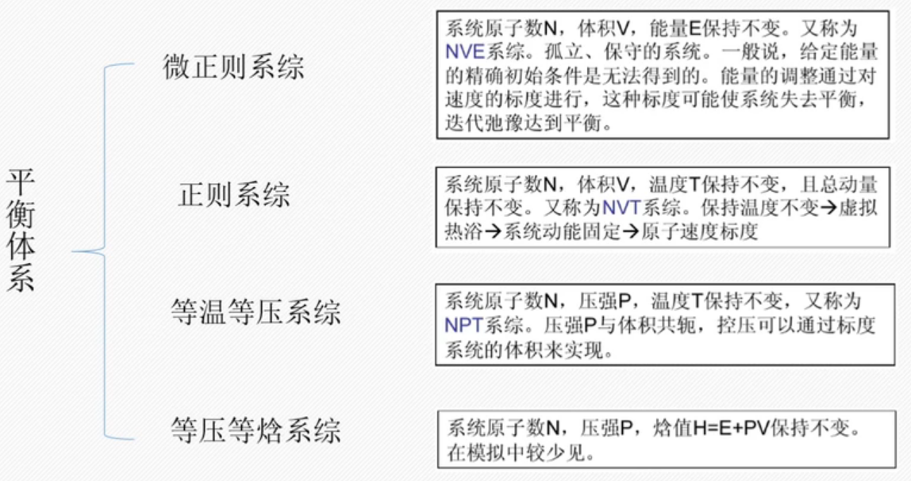

# 力场

## 力场参数化

分子力学力场的性能，即它的计算结果的准确性和可靠性主要取决于势能函数和结构参数。

实验数据的拟合：

- 拟合光谱数据（如红外、拉曼等）
- 晶体结构数据（多种相互作用的综合效果）

## 力场分类

**全原子力场**

精确定义每一个原子的参数。

**联合原子力场**

省略**非极性**氢原子，同时把其参数整合到与它们成键的相邻原子上（比如甲基，只由一个碳原子表示）。

**粗颗粒力场**

进一步精简分子结构的力场参数，种类比较多。比如有将蛋白侧链看作一个颗粒的力场，甚至将整个氨基酸残基看成一个颗粒的力场等等。

粗粒化：多个原子组合成一个粗粒化点。

## 常见力场

|力场|类别|说明|
|---|---|---|
|AMBER|全原子|使用比较广泛，适合处理较小的蛋白质、核酸、多糖等|
|CHARM|全原子|引用了大量的量子计算结果为依据|
|GROMOS|联合原子力场|适合生物大分子|
|OPLS|全原子和联合原子两个版本|
|MMX||适用于各种有机化合物、自由基、离子，考虑了许多交叉作用项|
|CVFF||生化分子为主，适用于氨基酸、水以及各种官能团|

## OPLS

OPLS（optimized potentials for liquid simulations），主要适用于液体体系、多肽、蛋白、核酸、有机溶剂等液体体系，一般和 TIP3P 或 TIP4P 的水模型搭配。

## 水模型

大多简单水分子模型由 3 到 6 个位点组成。

## 平衡体系

