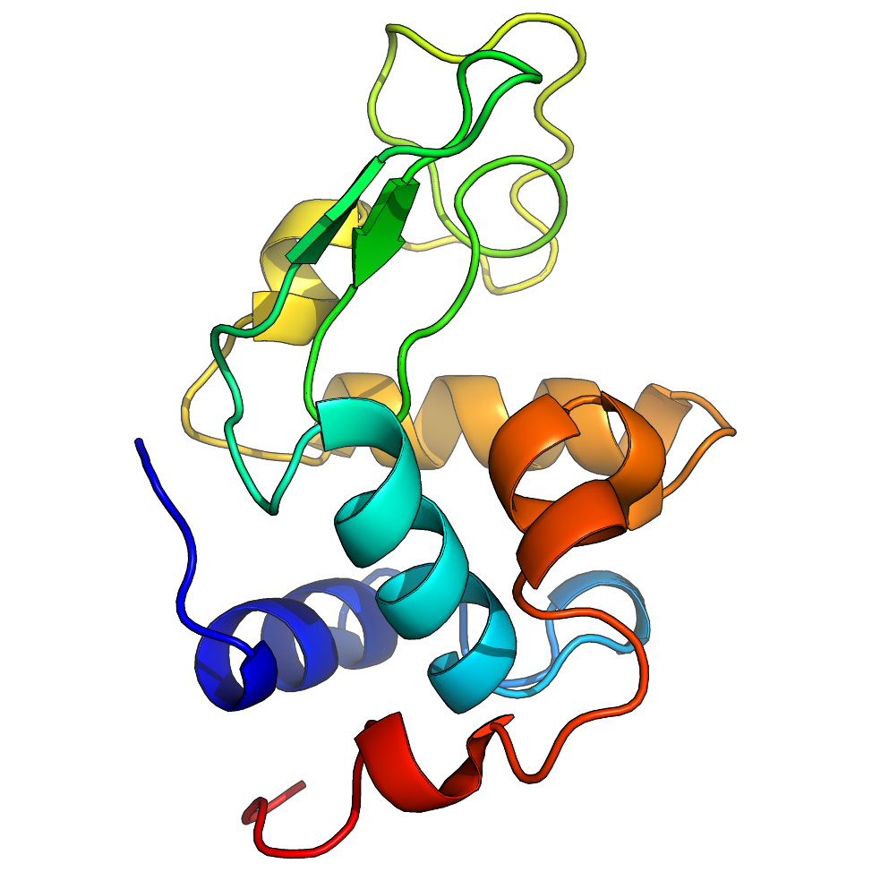

# 溶菌酶在水里的模拟

- [溶菌酶在水里的模拟](#溶菌酶在水里的模拟)
  - [简介](#简介)
  - [准备拓扑结构](#准备拓扑结构)
    - [GROMACS 常识](#gromacs-常识)
    - [生成溶菌酶的拓扑文件](#生成溶菌酶的拓扑文件)
    - [检查拓扑文件](#检查拓扑文件)
  - [参考](#参考)

2022-05-24, 17:16
***

## 简介



该教程模拟一个蛋白质（溶菌酶）在包含离子的水中行为。每个步骤详细解释了输入和输出，使用典型的设置。

## 准备拓扑结构


### GROMACS 常识

GROMACS 5.0 之后，所有 GROMACS 工具都成为 "gmx" 程序的模块。这与之前的版本有所不同，那时所有工具都作为单独的命令调用。在 5.0 中，这些工具仍然可以通过符号链接实现，但不推荐。可以调用如下命令查看 GROMACS 模块：

```sh
gmx help (module)
```

或者

```sh
gmx (module) -h
```

将 `(module)` 替换为具体的命令名称。然后相关信息就被输出，包括可用算法、选项、所需文件格式、已知的 bugs 和限制等。对 GROMACS 新用户来说，调用常用命令的 help 信息是一种很好的学习方式。

### 生成溶菌酶的拓扑文件

首先我们要下载溶菌酶（Lysozyme）的蛋白质结构文件。本教程我们使用鸡蛋清溶菌酶（PDB 1AKI）。到 [RCSB](https://www.rcsb.org/) 下载晶体结构的 PDB 文件。

下载结构后，可以使用 VMD, Chimera, PyMOL 等可视化结构。另外，还需要去掉上面的结晶水。可以用纯文本软件打开结构文件，删除 PDB 文件中的水分子（HOH 残基）。也可以使用 grep 

```sh
grep -v HOH 1aki.pdb > 1AKI_clean.pdb
```

也可以使用 PyMOL 载入 pdb 文件，然后用 `remove solvent` 命令移除水分子。

一定注意检查 pdb 文件中 MISSING 注释下的内容，因为这些是晶体结构中缺失的原子或残基。末端残基的缺失对动力学模拟可能没影响，但是内部缺失的原子或残基会导出 `pdb2gmx` 出错。可以使用其它软件包对这些缺失的原子/残基进行建模。

需要注意的是，`pdb2gmx` 不是魔法，它不能生成所有分子的拓扑结构，仅限于力场定义的残基（*.rtp 文件，通常包括蛋白质、核酸以及有限的辅助因子，如 NAD 和 ATP）。

现在已经移除了结晶水，并且已经确定所有必要的原子都存在，且 pdb 文件只包含蛋白质原子，将其作为 GROMACS 的第一个模块 `pdb2gmx` 的输入。`pdb2gmx` 用来生成三个文件：

1. 分子的拓扑结构
2. 位置约束文件
3. 后处理结构文件

拓扑结构文件（topol.top）包含模拟中定义分子所需的所有信息。该信息包括非键参数（原子类型和价态）和键参数（键、角度和二面角）。使用如下命令执行 `pdb2gmx`：

```sh
gmx pdb2gmx -f 1AKI_clean.pdb -o 1AKI_processed.gro -water spce
```

然后 gmx 会提示选择一个力场：

```sh
Select the Force Field:

From '/usr/local/share/gromacs/top':

 1: AMBER03 protein, nucleic AMBER94 (Duan et al., J. Comp. Chem. 24, 1999-2012, 2003)
 2: AMBER94 force field (Cornell et al., JACS 117, 5179-5197, 1995)
 3: AMBER96 protein, nucleic AMBER94 (Kollman et al., Acc. Chem. Res. 29, 461-469, 1996)
 4: AMBER99 protein, nucleic AMBER94 (Wang et al., J. Comp. Chem. 21, 1049-1074, 2000)
 5: AMBER99SB protein, nucleic AMBER94 (Hornak et al., Proteins 65, 712-725, 2006)
 6: AMBER99SB-ILDN protein, nucleic AMBER94 (Lindorff-Larsen et al., Proteins 78, 1950-58, 2010)
 7: AMBERGS force field (Garcia & Sanbonmatsu, PNAS 99, 2782-2787, 2002)
 8: CHARMM27 all-atom force field (CHARM22 plus CMAP for proteins)
 9: GROMOS96 43a1 force field
10: GROMOS96 43a2 force field (improved alkane dihedrals)
11: GROMOS96 45a3 force field (Schuler JCC 2001 22 1205)
12: GROMOS96 53a5 force field (JCC 2004 vol 25 pag 1656)
13: GROMOS96 53a6 force field (JCC 2004 vol 25 pag 1656)
14: GROMOS96 54a7 force field (Eur. Biophys. J. (2011), 40,, 843-856, DOI: 10.1007/s00249-011-0700-9)
15: OPLS-AA/L all-atom force field (2001 aminoacid dihedrals)
```

力场的选择非常重要。这里我们选择 all-atom OPLS 力场，因此输入 15，然后回车。`pdb2gmx` 有很多选项，常用的包括：

- `-ignh`：忽略 PDB 文件中的氢原子，对 NMR 结构特别有用。否则，如果有氢原子，则氢原子格式必须满足 GROMACS 力场。由于存在不同的惯例，因此处理 H 原子可能很令人头疼。如果需要保留初始 H 原子坐标，但需要重命名，则可以使用 Linux 的 `sed` 命令。
- `-ter`：以交互的方式为 N 端和 C 端分配电荷状态。
- `-inter`：以交互的方式为 Glu, Asp, Lys, Arg 和 His 分配电荷状态；选择与二硫键相关的 Cys。

运行后，会生成三个文件：1AKI_processed.gro，posre.itp 和 topol.top：

- 1AKI_processed.gro 是 GROMACS 格式的结构文件，包含力场中定义的所有原子；
- topol.top 是系统拓扑文件；
- posre.itp 包含用于限制重原子位置的信息。

最后说明一点，许多用户以为 .gro 文件是必须的，这不对。GROMACS 可以处理许多不同的文件格式，.gro 只是写入坐标文件命令的默认选项。.gro 格式非常紧凑，但精度有限。如果你喜欢用 PDB 格式，只需要将 .pdb 作为输出文件的扩展名。`pdb2gmx` 的目的是生成符合力场的拓扑文件，输出的结构文件只是其副产物。

### 检查拓扑文件

让我们看看输出的拓扑文件 `topl.top` 里面有什么。使用纯文本编辑器打开。跳过注释行（以 ; 开头），第一行为：

```txt
#include "oplsaa.ff/forcefield.itp"
```

这一行调用了 OPLS-AA 力场的参数。它在文件开头，表明后续所有参数都源自此力场。下一个重要的内容是 `[ moleculetype ]`，如下：

```txt
[ moleculetype ]
; Name            nrexcl
Protein_chain_A     3
```

其中：

- "Protein_chain_A" 为分子名称，说明这个蛋白在 PDB 文件中被标记为 chain A。
- 3 表示


## 参考

- http://www.mdtutorials.com/gmx/lysozyme/index.html
