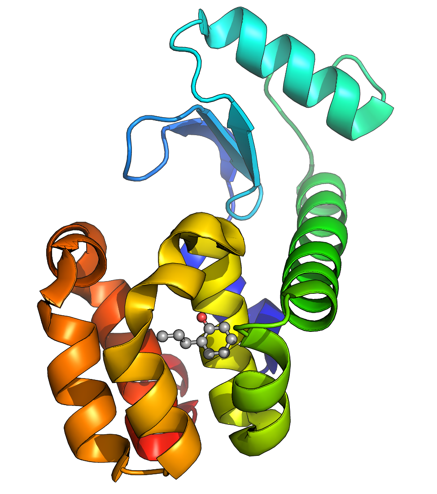
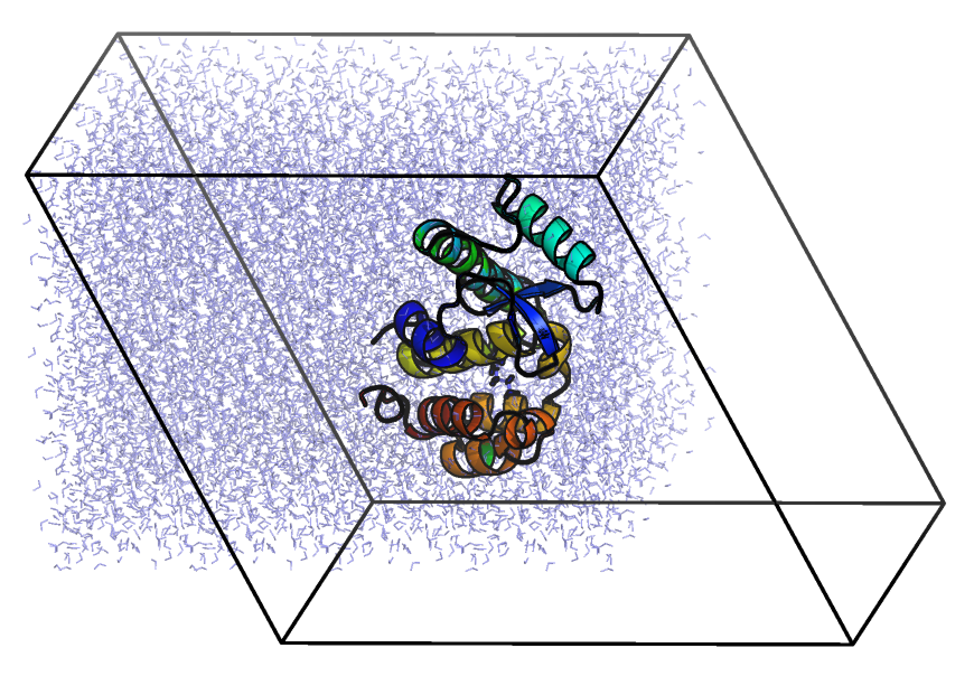

# 蛋白配体复合物

- [蛋白配体复合物](#蛋白配体复合物)
  - [简介](#简介)
  - [准备蛋白拓扑](#准备蛋白拓扑)
  - [准备配体拓扑](#准备配体拓扑)
    - [为 JZ4 添加氢原子](#为-jz4-添加氢原子)
    - [使用 CGenFF 生成 JZ4 拓扑](#使用-cgenff-生成-jz4-拓扑)
  - [定义溶剂盒子并添加水分子](#定义溶剂盒子并添加水分子)
  - [添加离子](#添加离子)
  - [参考](#参考)

2022-05-30, 13:46
@author Jiawei Mao
***



## 简介

这个教程指导新手建立一个蛋白质（T4 溶菌酶 L99A/M102Q）配体复合物的模拟体系。本教程假设用户已经熟悉 GROMACS 的基本操作和拓扑文件内容。对还不熟悉 GROMACS 操作的，可以参考[第一个教程](1_Lysozyme_in_water.md)。

## 准备蛋白拓扑

首先下载蛋白质的结构文件，T4 溶菌酶 L99A/M102Q 的 PDB 号为 3HTB。下载后，可以用 VMD, Chimera, PyMOL 等可视化软件查看结构。

在开始模拟前，需要移除结构中的结晶水、PO4 和 BME 等，注意这个过程非普遍适用，有些活性位点的水分子就不应该移除。对我们要进行的模拟，不需要结晶水和其它分子，只需要保留配体 "JZ4"，即 2-丙基苯酚。去除这些分子后，将其保存为文件 3HTB_clean.pdb。

我们现在面临的问题是，没有可以识别 JZ4 配体的 GROMACS 力场，因此 `pdb2gmx` 会报错。只有在力场的残基拓扑文件（.rtp, residue topology）中包含构建项，才能自动组成为拓扑。由于缺乏配体项，我们分两步来准备该体系的拓扑：

1. 使用 `pdb2gmx` 准备蛋白质拓扑
2. 使用外部工具准备配体拓扑

由于我们是分别准备这两个拓扑，因此需要将蛋白和 JZ4 配体保存为两个单独的 pdb 文件。保存 JZ4 坐标：

```sh
grep JZ4 3HTB_clean.pdb > jz4.pdb
```

然后，从 3HTB_clean.pdb 中删除包含 JZ4 的行。本教程使用 CHARMM36 力场，从 [MacKerell 实验室网站](http://mackerell.umaryland.edu/charmm_ff.shtml#gromacs) 下载。在这里，下载最新的 CHARMM36 力场压缩包和 "cgenff_charmm2gmx.py" 转换脚本。 

解压力场文件：

```sh
tar -zxvf charmm36-mar2019.ff.tgz
```

此时有了 "charmm36-mar2019.ff" 子目录。使用 `pdb2gmx` 输出 T4 溶菌酶的拓扑：

```sh
gmx pdb2gmx -f 3HTB_clean.pdb -o 3HTB_processed.gro
```

出现提示选择力场时：

```sh
Select the Force Field:
From current directory:
 1: CHARMM36 all-atom force field (July 2017)
From '/usr/local/gromacs/share/gromacs/top':
 2: AMBER03 protein, nucleic AMBER94 (Duan et al., J. Comp. Chem. 24, 1999-2012, 2003)
 3: AMBER94 force field (Cornell et al., JACS 117, 5179-5197, 1995)
 4: AMBER96 protein, nucleic AMBER94 (Kollman et al., Acc. Chem. Res. 29, 461-469, 1996)
 5: AMBER99 protein, nucleic AMBER94 (Wang et al., J. Comp. Chem. 21, 1049-1074, 2000)
 6: AMBER99SB protein, nucleic AMBER94 (Hornak et al., Proteins 65, 712-725, 2006)
 7: AMBER99SB-ILDN protein, nucleic AMBER94 (Lindorff-Larsen et al., Proteins 78, 1950-58, 2010)
 8: AMBERGS force field (Garcia & Sanbonmatsu, PNAS 99, 2782-2787, 2002)
 9: CHARMM27 all-atom force field (CHARM22 plus CMAP for proteins)
10: GROMOS96 43a1 force field
11: GROMOS96 43a2 force field (improved alkane dihedrals)
12: GROMOS96 45a3 force field (Schuler JCC 2001 22 1205)
13: GROMOS96 53a5 force field (JCC 2004 vol 25 pag 1656)
14: GROMOS96 53a6 force field (JCC 2004 vol 25 pag 1656)
15: GROMOS96 54a7 force field (Eur. Biophys. J. (2011), 40,, 843-856, DOI: 10.1007/s00249-011-0700-9)
16: OPLS-AA/L all-atom force field (2001 aminoacid dihedrals)
```

选择 CHARMM36 力场（1）。

对水模型，选择默认的（1）。

## 准备配体拓扑

现在开始处理配体。但是从哪里获取处理力场无法自动识别的分子的力场参数呢？处理配体是分子模拟中最具挑战性的任务之一。所用的力场是研究人员花费数年时间获得的自洽力场，在这个框架中引入一个新的物种并不容易。新物种的力场参数必须以与原始力场一致的方式进行推导和验证。对 OPLS、AMBER 和 CHARMM 力场，一般采用量子力学计算的方式推导。这些力场的相关文献一般描述了所需过程。对 GROMOS 力场，参数化方法不是很清楚，依赖于凝聚相行为的经验拟合。即，计算每种原子类型的初始电荷和 Lennard-Jones 参数，评估其准确性，并进行细化。虽然最终的结果令人满意，其流体行为与现实中相似，但其推导过程很费力。

出于这个原因，大家首选自动化工具。对每个力场，都有一些方法或软件声称能给出与力场兼容的参数。并不是所有都准确，下面是一些示例：

|力场|工具|说明|
|---|---|---|
|AMBER|[Antechamber](http://ambermd.org/#AmberTools) |使用 GAFF 参数化分子|
||[acpype](https://github.com/alanwilter/acpype) |Antechamber 的 Python 接口，输出 GROMACS 拓扑|
|CHARMM|[CGenFF](https://cgenff.umaryland.edu/) |官方的 CHARMM General Force Field server|
|GROMOS87/GROMOS96|[PRODRG 2.5](http://davapc1.bioch.dundee.ac.uk/cgi-bin/prodrg)|一个用于生成拓扑的自动化服务器|
||ATB|一个较新的生成拓扑服务器，使用 GROMOS96 54A7A|
|OPLS-AA|Topolbuild|将 Tripos .mol2 文件转换为拓扑|
||TopolGen|将包含全部原子的 pdb 文件转换为拓扑的 perl 脚本|
||LigParGen|Jorgensen 组生成 OPLS 拓扑的服务器|

### 为 JZ4 添加氢原子

在本教程，我们使用 CGenFF 服务器生成 JZ4 拓扑。点开上面的 CGenFF 链接，注册账户（免费）并激活。CGenFF 需要 Sybyl .mol2 文件作为输入，用于收集原子类型和键合连接信息。CHARMM 是一个全原子力场，意味着所有 H 原子都有显式表示。晶体结构通常不指定 H 坐标，因此需要内部构建。使用 [Avogadro](https://two.avogadro.cc/) 程序生成 .mol2 文件并添加 H 原子。用 Avogadro 打开 jz2.pdb 文件，在 "Build" 菜单，选择 "Add Hydrogens"，Avogadro 会自动在 JZ4 配体上构建所有 H 原子。保存为 .mol2 文件（File -> Save As..., choose Sybyl Mol2），命名为 jz2.mol2.

需要稍微修改 jz4.mol2 才能用。用文本编辑器打开 jz4.mol2 文件：

```sh
@<TRIPOS>MOLECULE
*****
 22 22 0 0 0
SMALL
GASTEIGER

@<TRIPOS>ATOM
      1 C4         24.2940  -24.1240   -0.0710 C.3   167  JZ4167     -0.0650
      2 C7         21.5530  -27.2140   -4.1120 C.ar  167  JZ4167     -0.0613
      3 C8         22.0680  -26.7470   -5.3310 C.ar  167  JZ4167     -0.0583
      4 C9         22.6710  -25.5120   -5.4480 C.ar  167  JZ4167     -0.0199
      5 C10        22.7690  -24.7300   -4.2950 C.ar  167  JZ4167      0.1200
      6 C11        21.6930  -26.4590   -2.9540 C.ar  167  JZ4167     -0.0551
      7 C12        22.2940  -25.1870   -3.0750 C.ar  167  JZ4167     -0.0060
      8 C13        22.4630  -24.4140   -1.8080 C.3   167  JZ4167     -0.0245
      9 C14        23.9250  -24.7040   -1.3940 C.3   167  JZ4167     -0.0518
     10 OAB        23.4120  -23.5360   -4.3420 O.3   167  JZ4167     -0.5065
     11 H          25.3133  -24.3619    0.1509 H       1  UNL1        0.0230
     12 H          23.6591  -24.5327    0.6872 H       1  UNL1        0.0230
     13 H          24.1744  -23.0611   -0.1016 H       1  UNL1        0.0230
     14 H          21.0673  -28.1238   -4.0754 H       1  UNL1        0.0618
     15 H          21.9931  -27.3472   -6.1672 H       1  UNL1        0.0619
     16 H          23.0361  -25.1783   -6.3537 H       1  UNL1        0.0654
     17 H          21.3701  -26.8143   -2.0405 H       1  UNL1        0.0621
     18 H          21.7794  -24.7551   -1.0588 H       1  UNL1        0.0314
     19 H          22.2659  -23.3694   -1.9301 H       1  UNL1        0.0314
     20 H          24.5755  -24.2929   -2.1375 H       1  UNL1        0.0266
     21 H          24.0241  -25.7662   -1.3110 H       1  UNL1        0.0266
     22 H          23.7394  -23.2120   -5.1580 H       1  UNL1        0.2921
@<TRIPOS>BOND
     1     4     3   ar
     2     4     5   ar
     3     3     2   ar
     4    10     5    1
     5     5     7   ar
     6     2     6   ar
     7     7     6   ar
     8     7     8    1
     9     8     9    1
    10     9     1    1
    11     1    11    1
    12     1    12    1
    13     1    13    1
    14     2    14    1
    15     3    15    1
    16     4    16    1
    17     6    17    1
    18     8    18    1
    19     8    19    1
    20     9    20    1
    21     9    21    1
    22    10    22    1
```

首先，修改标题，将 "****" 替换为 "JZ4"，例如：

```mol2
@<TRIPOS>MOLECULE
JZ4
```

然后，修改残基名称和编号，是它们一致。这个 .mol2 文件只包含一个分子，因此应该只有一个残基名称和编号。修改后，jz4.mol2 的 ATOM 部分如下：

```mol2
@<TRIPOS>ATOM
      1 C4         24.2940  -24.1240   -0.0710 C.3     1  JZ4        -0.0650
      2 C7         21.5530  -27.2140   -4.1120 C.ar    1  JZ4        -0.0613
      3 C8         22.0680  -26.7470   -5.3310 C.ar    1  JZ4        -0.0583
      4 C9         22.6710  -25.5120   -5.4480 C.ar    1  JZ4        -0.0199
      5 C10        22.7690  -24.7300   -4.2950 C.ar    1  JZ4         0.1200
      6 C11        21.6930  -26.4590   -2.9540 C.ar    1  JZ4        -0.0551
      7 C12        22.2940  -25.1870   -3.0750 C.ar    1  JZ4        -0.0060
      8 C13        22.4630  -24.4140   -1.8080 C.3     1  JZ4        -0.0245
      9 C14        23.9250  -24.7040   -1.3940 C.3     1  JZ4        -0.0518
     10 OAB        23.4120  -23.5360   -4.3420 O.3     1  JZ4        -0.5065
     11 H          25.3133  -24.3619    0.1509 H       1  JZ4         0.0230
     12 H          23.6591  -24.5327    0.6872 H       1  JZ4         0.0230
     13 H          24.1744  -23.0611   -0.1016 H       1  JZ4         0.0230
     14 H          21.0673  -28.1238   -4.0754 H       1  JZ4         0.0618
     15 H          21.9931  -27.3472   -6.1672 H       1  JZ4         0.0619
     16 H          23.0361  -25.1783   -6.3537 H       1  JZ4         0.0654
     17 H          21.3701  -26.8143   -2.0405 H       1  JZ4         0.0621
     18 H          21.7794  -24.7551   -1.0588 H       1  JZ4         0.0314
     19 H          22.2659  -23.3694   -1.9301 H       1  JZ4         0.0314
     20 H          24.5755  -24.2929   -2.1375 H       1  JZ4         0.0266
     21 H          24.0241  -25.7662   -1.3110 H       1  JZ4         0.0266
     22 H          23.7394  -23.2120   -5.1580 H       1  JZ4         0.2921
```

最后，注意 `@<TRIPOS>BOND` 部分奇怪的键顺序。所有程序似乎都有自己生成此列表的方法，但生成的列表并不一定相同。如果没有按升序列出化学键，则在构建拓扑时会有匹配问题。为了解决该问题，可以下载 [sort_mol2_bonds.pl](http://www.mdtutorials.com/gmx/complex/Files/sort_mol2_bonds.pl) 脚本并执行：

```sh
perl sort_mol2_bonds.pl jz4.mol2 jz4_fix.mol2
```

生成的 "jz4_fix.mol2" 用于下一步。

### 使用 CGenFF 生成 JZ4 拓扑

现在准备好 jz4_fix.mol2 文件用于生成拓扑。访问 CGenFF 服务器，登录后，点击 "Upload molecule" 上传文件。CGenFF 服务器会迅速生成 CHARMM "stream" 格式的（.str）的拓扑。将其保存为 "jz4.str" 文件，这里有一个[转好的文件](http://www.mdtutorials.com/gmx/complex/Files/jz4.str)。

CHARMM stream 文件包含所有的拓扑信息，原子类型、电荷和键合信息。它还包括针对其它键合参数的部分，用于力场未涵盖的其它内部相互作用。CGenFF 还为每个参数提供了惩罚参数，可用于评估参数的可靠性。低于 10 表示可靠，可直接使用；10-50 表示需要对拓扑进一步验证；大于 50 表示需要重新手动参数化。这个惩罚打分是 CGenFF 服务器最重要的功能之一。许多其它的服务器都是黑匣子，用户只能无条件信任。将你的研究项目压在一个不经过验证的自动化程序上是非常危险的。不好的配体拓扑会导致浪费大量时间获得不可靠的结果。应该验证新参数物种的拓扑，至少要对照力场中现有的部分，检查分配给配体的电荷和原子类型是否正确。

检查 jz4.str 的内容，查看电荷和新的二面角参数的惩罚值。所有这些值都很低，表明该拓扑质量很好，可直接用于我们的模拟。

使用下载的 cgenff_charmm2gmx.py 脚本将 CHARMM stream 格式转换为 GROMACS 格式。执行转换：

```sh
python cgenff_charmm2gmx.py JZ4 jz4_fix.mol2 jz4.str charmm36-mar2019.ff
```

## 定义溶剂盒子并添加水分子

这一步和其它 MD 模拟一样，定义盒子并填充水分子：

```sh
gmx editconf -f complex.gro -o newbox.gro -bt dodecahedron -d 1.0

gmx solvate -cp newbox.gro -cs spc216.gro -p topol.top -o solv.gro
```

如果你可视化 `solv.gro`，你会发现 `editconf` 没有生成所需的十二面体水盒子，生成的体系如下：



GROMACS 会始终使用坐标的最有效的数值表示，即将所有内容重新包装成三斜晶胞单元。`mdrun` 执行的物理计算可以在不同的坐标系下等效进行，因此推荐使用最有效的方法。在生成 tpr 文件后，可以恢复所需的晶胞形状。

## 添加离子

使用 `ion`


## 参考

- http://www.mdtutorials.com/gmx/complex/index.html
