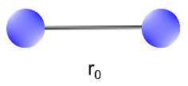
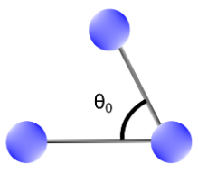
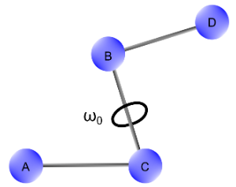
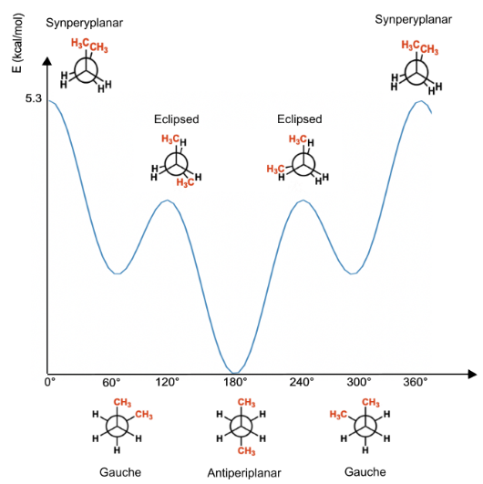

# 成键相互作用

- [成键相互作用](#成键相互作用)
  - [简介](#简介)
  - [拉伸项](#拉伸项)
  - [弯曲项](#弯曲项)
  - [扭转项](#扭转项)
  - [交叉项](#交叉项)
  - [参考](#参考)

***

## 简介

建立微观系统的分子动力学（MM）模型是现代计算化学的标准实践。该过程需要计算分子在指定构型 $R$ 下的势能。总的来说，能量为 $E_{bond}$ 和 $E_{non-bond}$ 的加和：

$$E_{MM}(R)=E_{bond}+E_{non-bond}$$

下面专门介绍成键相互作用。成键相互作用 $E_{bond}$ 是拉伸、弯曲、扭转和交叉四项加和：

$$E_{bond}=E_{str}+E_{bend}+E_{tors}+E_{cross}$$

## 拉伸项

拉伸项（Stretching）考虑了分子中所有 1-2 相互作用加和，即化学键，如下图所示：

> 图 1：拉伸项取决于原子间 1-2 相互作用（键长）。两个原子间的键以代表最稳定构型的平衡键长为特征。

在 MM 中，不同原子类型之间的键能可以表示为围绕平衡键长的泰勒展开：

$$E_{str}=\sum_i\frac{k_i}{2}(l_i-l_{i,0})^2$$

泰勒展开式在第一项截断，并对每个键 $i$ 求和。该方程包含参数和变量。

参数：

- $k_i$ 力常数（kcal/mol $\mathring A^2$），取决于原子类型
- $l_{i,0}$，平衡键长（$\mathring{A}$）

变量：

- $l_i$，两个原子之间的实际键长（$\mathring{A}$）。

因此，对键长为 $l_i$ 的第 $i$ 个原子，需要两个参数 $l_{i,0}$ 和 $k_i$。

结果表明，模型的势能可以通过谐振子来近似，该近似在最小值附近区域尤其有效，金近似为二次拟合。然而，当键长拉长远离平衡时，该近似就不准了。可以在泰勒展开式中加入其它项（三次、四次）来更精确地描述：

$$E_{str}=\sum_i\frac{k_1}{2}(l_i-l_{i,0})^2-\frac{k_2}{2}(l_i-l_{i,0})^3+\frac{k_3}{2}(l_i-l_{i,0})^4$$

这种方法不能描述分子的实际行为，因为函数在 $+\infty$ 不能收敛于解离能。

**Morse potential** 函数能正确描述双原子分子的解离。该曲线描述势能随键长变化的规律，如下所示：

$$E_{morse}=D_e[1-e^{(-\alpha(l_i-l_i^0))}]^2$$

其中 $D_e$ 为解离能，$\alpha$ 与力常数有关：

$$\alpha=\sqrt{(\frac{k}{2D_e})}$$

但是一般不使用 Morse potential，因为它有大量参数，计算量太大。

## 弯曲项

弯曲项（Bending）指分子中所有 1-3 相互作用的总和，即原子之间形成的角度（图 2）。与拉伸性类似，在 MM 中，弯曲一个角度所需的能量 $E_{bend}$ 是围绕平衡键角展开的泰勒级数，展开到第二项，系统通过谐振子近似建模。

> **图 2** 弯曲项取决于原子间的 1-3 相互作用（键角）。最稳定构型的平衡键角 以 $\theta _0$ 表示。 

$$E_{bend}=\sum_{angles}\frac{k_i}{2}(\theta_i - \theta_{i,0})^2$$

参数：

- $k_i$，力常数，(kcal/mol rad$^2$), 取决于原子类型
- $\theta_{i,0}$，平衡键角（rad）

变量：

- $\theta_i$，实际键角

虽然简单的谐振子适用于大多数应用，但某些情况可能需要更高的精度。此时就要添加更多的泰勒展开项：

$$E_{bend}=\sum_{angles}\frac{k_1}{2}(\theta_i - \theta_{i,0})^2+\frac{k_2}{2}(\theta_i-\theta_{i,0})^6$$

## 扭转项

扭转项（$E_{str}$）用来描述分子中由 1-4 相互作用引起的二面角变化导产生的势能。换句话说，对四个原子 $A-B-C-D$，扭转项指 $B-C$ 键旋转产生的势能。

> **图 4** 二面角（$\omega$）指 $A$ 和 $D$ 分别与 B,C 形成两个面的夹角。

扭转项势能表达式如下：

$$E_{tors}=\sum_{tors}\sum_{n}\frac{V_n}{2}(1+cos(n\omega-\gamma))$$

参数：

- $V_n$，围绕给定键旋转的能垒（energy barrier, kcal/mol）
- $\gamma$，相位偏移（rad）

变量：

- $\omega$，二面角（rad）

扭转项势能函数在角度 $\omega$ 是周期性的。即在 360° 旋转后，势能会回到它的初始值。 $n$ 描述函数的周期性：

- $n=1$，旋转周期为 360°
- $n=2$，旋转周期为 180°
- $n=3$，旋转周期为 120°
- ...

$n$ 的值取决于分子结构：

> **图 5** 乙烷扭转谁能图显示其旋转周期为 3.

在上例中，乙烷分子的势能随着二面角 $C-C$ 的变化而变化。可以看到旋转能垒 $V_n$ 约为 3.0 kcal/mol。$\omega =0$ 时，乙烷处于重叠构象，具有较高的空间位阻，势能最大。旋转 60° 的构象空间位阻最小，系统势能最小。旋转 120° 分子又回到重叠构象，势能最大。旋转 360° 相同的能量变化重复 3 次，即旋转周期为 3. 

乙烷中每个 `H` 是等价的，所以每个周期之间是等价的。如果将部分 H 取代为甲基，就不一样了，如下所示：

> **图 6** 丁烷的扭转势能图（$n=3$）

绕双键旋转 180° 必然是周期性的，因此旋转周期 $n=2$。另外，双键的旋转能垒 $V_n$ 要高得多。另外，取代双键的顺式和反式取代能量不同。此时需要在表达式中再引入一项。即用常量 $V_2$ 描述围绕 $C=C$ 键的 $n=2$ 周期性旋转，用 $V_1$ 描述顺式和反式异构体之间的能量差。

总的来说，扭转势能的前三项足以表达绝大多数有机分子。

## 交叉项

在复杂的力场中，还有一些额外贡献称为交叉项，由拉伸、弯曲和扭转之间的相互作用产生。事实上，在研究一个分子时，前面所有的运动都不是彼此孤立的。

例如，当我们研究一个简单的分子，如 $H_2O$，它的平衡键角 104.5°，键长 0.958 $\mathring{A}$。当键角减小时，平衡键长延长至 0.968 $\mathring{A}$。相反，当键角变宽时，平衡键长减小。

在势能的原始表达式中没有考虑这个效应。因此，为了包括键长和键角之间的耦合，需要引入一个交叉项，该项可以写成泰勒级数的乘积：

$$E_{str/bend}=k_{s/b}(\theta-\theta^0)[(l_1-l_1^0)(l_2-l_2^0)]$$

其中 $\theta$ 为角度，$l_1$ 和 $l_2$ 为两个键长。

同样，考虑不同分子运动之间的耦合，引入额外的交叉项。其中大多数涉及两个内部坐标，但有些力场可能涉及三个或更多。

## 参考

- https://www.compchems.com/molecular-dynamics-bonded-interactions/
