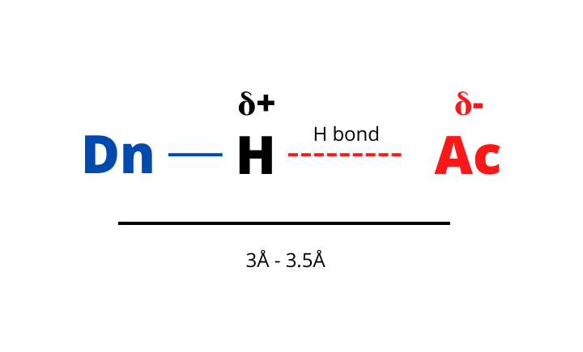
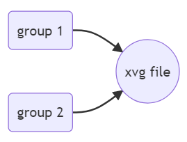
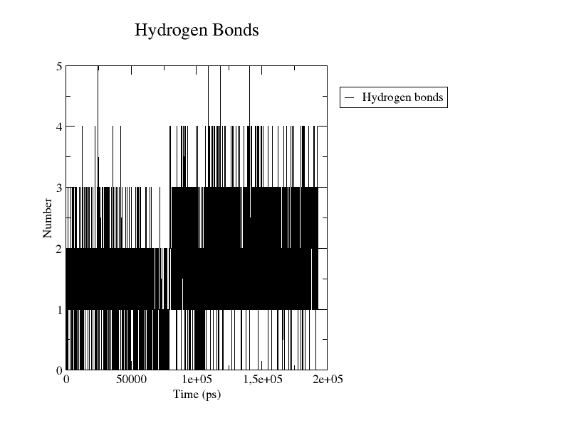

# 如何研究氢键

- [如何研究氢键](#如何研究氢键)
  - [简介](#简介)
  - [MD 模拟中的氢键](#md-模拟中的氢键)
  - [gmx hbond 模块](#gmx-hbond-模块)
  - [计算 group 之间的氢键](#计算-group-之间的氢键)
  - [参与氢键的原子](#参与氢键的原子)
  - [参考](#参考)

Last updated: 2022-11-24, 17:17
****

## 简介

氢键的分析在分子模拟领域有着重要地位，GROMACS 提供了 `gmx hbond` 模块专门用于氢键的分析。

## MD 模拟中的氢键

氢键的形成包含三部分：

1. 供体（Donor, Dn）：与 H 原子共价连接的电负性强的原子，如 F,O,N；
2. 受体（Acceptor, Ac）：另一个电负性很强的原子（F,N,O），不与 H 原子共价连接；
3. 氢原子（Hydrogen, H）：供体和受体共用的氢原子。



氢键是一种特殊的相互作用，虽然是一种弱相互作用，但是氢键在生物系统中发挥着重要作用。一方面，氢键可以稳定蛋白质的二级结构；另外，氢键在稳定蛋白质复合物方面也非常重要。

因此，氢键的表征在蛋白质配体复合物的动力学模拟中特别重要，在计算药物领域也很重要。

在模拟过程中，研究配体和蛋白质之间氢键相互作用的数量及持续时间通常有用。

研究氢键的工具很多，这里使用 GROMACS 的 `gmx hbond` 模块。

## gmx hbond 模块

该模块用于在模拟中计算和分析氢键。

`gmx hbond` 完全根据几何形状确定氢键。即根据以下两个条件确定氢键：

- 参与氢键的三个原子之间的夹角 **Ac-Dn-H**
- 参与相互作用的两个重原子之间的距离 **Ac-Dn**

当角度和距离低于某个阈值，就认为存在氢键相互作用。

可以通过特定选项来设置阈值，不过，默认阈值适用于大多数应该：

- 角度 30°
- 距离 0.35 nm

GROMACS 默认将与 H 原子共价连接的电负性原子（OH, NH）作为 donor，将 N 或 O 原子作为 acceptor。

## 计算 group 之间的氢键

`gmx hbond` 可以在模拟过程中计算每一帧的两个 group 之间的氢键数量，如两个残基之间，或蛋白和配体之间。

当需要确定在模拟过程中某个氢键相互作用的形成是否重要是，该方法很有用。例如，通过查看模拟过程中氢键形成的频率，可以分析配体和蛋白质之间某种相互作用的相关性。

通过 ndx 文件提供两个 group，GROMACS 根据阈值计算交互数，并写入 xvg 格式的输出文件：



第一步使用 `gmx make_ndx` 创建索引文件，包含所需的 groups。这一步是可选的，但是大多数时候需要 GROMACS 默认 group 以外的 group>

然后用 `gmx hbond`：

```bash
gmx hbond -f md.xtc -s md.tpr -n index.ndx -num hbnum.xvg
```

语法：

- `-f` 指定轨迹文件 `md.xtc`
- `-s` 提供 tpr 文件 `md.tpr`
- 通过 `-n` 提供包含两个特殊 group 的索引文件
- 使用 `-num` 指定输出 xvg 格式文件名称 `hbnum.xvg`

运行命令，提示选择要分析的两个 groups。输出为 xvg 格式的文件。

```bash
xmgrace hbnum.xvg
```

生成的图与下图类似：



可以看到在模拟的每一帧两个特定 group 之间的氢键数量。在上例中，两个选择的 group 之间的氢键数量在 1-3 之间。

也可以用 Python 绘图：

```python
import matplotlib.pyplot as plt
import numpy
t,hbond,pairs = numpy.loadtxt("hbnum.xvg", comments=["@", "#"], unpack=True)

fig = plt.figure(figsize=(10,5))
ax = fig.add_subplot(111)


ax.plot(t,hbond, color="black", linestyle="-")
ax.set_xlabel("time $t$ (ps)")
ax.set_ylabel("number of H bonds")

plt.savefig("hbnum.png", format="png", dpi=300)
plt.show()
```


## 参与氢键的原子

`gmx hbond` 还可以创建包含参与氢键相互作用的原子的索引文件。其思路与前面类似，仍需要通过一个索引文件提供要分析的两个 group，但是要输出另一个 ndx 文件。

```bash
gmx hbond -f md.xtc -s md.tpr -n index.ndx -hbn hbond.ndx
```

选择两个 group 后，GROMACS 会输出一个 `hbond.ndx` 索引文件。可以用文本编辑器打开看，也可以用 `gmx make_ndx` 模块查看：

```bash
gmx make_ndx -f md.gro -n hbond.ndx
```

假设有两个 group **A** 和 **B**，则输出的索引文件大概是如下样式：

```bash
  0 A             :  4382 atoms
  1 donors_hydrogens_A:   892 atoms
  2 acceptors_A   :   706 atoms
  3 B         : 256190 atoms
  4 donors_hydrogens_B: 211732 atoms
  5 acceptors_B: 57861 atoms
  6 hbonds_A-B: 32523 atoms
```

即包含 A 和 B donors 和 acceptors 原子的 groups。还列出了所有参与两个 group 氢键相互作用的原子 `hbonds_A-B`。

## 参考

- https://www.compchems.com/how-to-study-hydrogen-bonds-using-gromacs/
- https://manual.gromacs.org/current/onlinehelp/gmx-hbond.html
