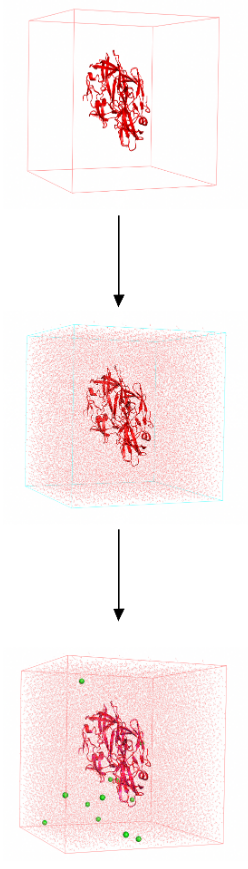
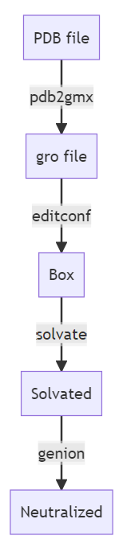
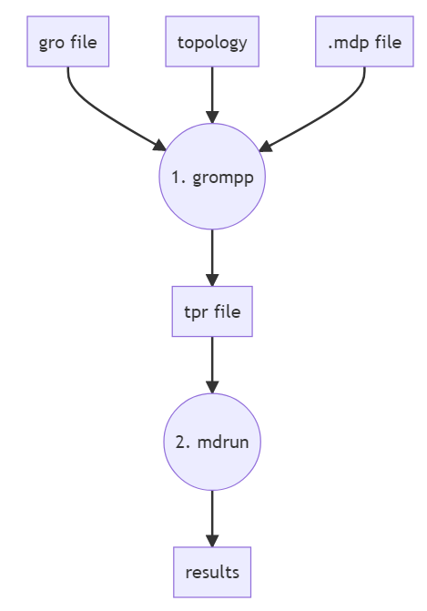

# 用 GROMACS 运行 MD 模拟

- [用 GROMACS 运行 MD 模拟](#用-gromacs-运行-md-模拟)
  - [流程](#流程)
  - [命令](#命令)
  - [准备系统](#准备系统)
    - [gmx pdb2gmx](#gmx-pdb2gmx)
    - [gmx editconf](#gmx-editconf)
    - [gmx solvate](#gmx-solvate)
    - [gmx genion](#gmx-genion)
  - [模拟](#模拟)
    - [gmx grompp](#gmx-grompp)
    - [gmx mdrun](#gmx-mdrun)
  - [参考](#参考)

Last updated: 2022-11-22, 19:26
****

## 流程

第一步是准备模拟系统。准备阶段包含三步：

1. 创建溶剂盒子
2. 溶剂化使用
3. 中和系统电荷



准备好系统后，开始模拟阶段：

1. 能量最小化
2. NVT 平衡
3. NPT 平衡
4. 生产运行

每一个步骤，都要使用特定的命令，需要准备特定的文件格式。

## 命令

一般来说，GROMACS 命令包含四个部分：

```bash
gmx module -flag option
```

- `gmx` 表示使用 GROMACS
- `module` 指定要执行的操作
- `-flag` 用于设置操作
- `option` 表示为 GROMACS 提供的选项，如文件路径等

> **WARNING**: 如果安装的 MPI 版本的 GROMACS，则用 `gmx_api` 替代 `gmx`。

对不同模块 `module`，包含不同的 flag 选项和文件格式。具体可参考 [GROMACS 文档](https://manual.gromacs.org/current/index.html)。

也可以使用如下命令查看每个模块的可选选项：

```bash
gmx module -h
```

## 准备系统

准备系统需要如下四个命令：

- pdb2gmx
- editconf
- solvate
- genion



### gmx pdb2gmx

将包含初始结构的 pdb 文件转换为 GROMACS 需要的文件格式。

`pdb2gmx` 会生成如下三个文件：

1. `topol.top`：拓扑文件，包含结构中每个原子的力场参数信息，如成键参数和非键参数。
2. `posre.itp`：位置约束文件，在平衡步骤要使用
3. `protein.gro`：gro 格式的蛋白结构。就是一个坐标文件，包含结构中每个原子的 x, y, z 坐标，可以看做更紧凑的 pdb 格式

使用示例：

```bash
gmx pdb2gmx -f protein.PDB -o protein.gro -water tip3p
```

语法：

- `gmx` 调用 GROMACS 程序
- 选择 `pdb2gmx` 模块
- `-f` 设置初始蛋白结构 `protein.PDB`
- `-o` 指定输出的 gro 格式蛋白结构文件位置
- `-water` 指定水模型

> **WARNING**: 如果提供的蛋白结构不完整，如有残基缺失，`pdb2gmx` 会报错。可以通过同源建模重建缺失残基。

运行命令，会提示选择力场：

```bash
Select the Force Field:
From '/usr/local/gromacs/share/gromacs/top':
 1: AMBER03 protein, nucleic AMBER94 (Duan et al., J. Comp. Chem. 24, 1999-2012, 2003)
 2: AMBER94 force field (Cornell et al., JACS 117, 5179-5197, 1995)
 3: AMBER96 protein, nucleic AMBER94 (Kollman et al., Acc. Chem. Res. 29, 461-469, 1996)
 4: AMBER99 protein, nucleic AMBER94 (Wang et al., J. Comp. Chem. 21, 1049-1074, 2000)
 5: AMBER99SB protein, nucleic AMBER94 (Hornak et al., Proteins 65, 712-725, 2006)
 6: AMBER99SB-ILDN protein, nucleic AMBER94 (Lindorff-Larsen et al., Proteins 78, 1950-58, 2010)
 7: AMBERGS force field (Garcia & Sanbonmatsu, PNAS 99, 2782-2787, 2002)
 8: CHARMM27 all-atom force field (CHARM22 plus CMAP for proteins)
 9: GROMOS96 43a1 force field
10: GROMOS96 43a2 force field (improved alkane dihedrals)
11: GROMOS96 45a3 force field (Schuler JCC 2001 22 1205)
12: GROMOS96 53a5 force field (JCC 2004 vol 25 pag 1656)
13: GROMOS96 53a6 force field (JCC 2004 vol 25 pag 1656)
14: GROMOS96 54a7 force field (Eur. Biophys. J. (2011), 40,, 843-856, DOI: 10.1007/s00249-011-0700-9)
15: OPLS-AA/L all-atom force field (2001 aminoacid dihedrals)
```

### gmx editconf

`editconf` 命令定义模拟盒子的大小和形状。

```bash
gmx editconf -f protein.gro -o protein_box.gro -c -d 1.0 -bt cubic
```

语法：

- `gmx` 调用 GROMACS 程序
- 选择 `editconf` 模块
- `-f` 选择初始结构 `protein.gro`
- `-o` 设置输出文件位置
- `-c` 将系统放在盒子中间
- `-d` 设置系统距离盒子边界的最小距离，这里为 1.0 nm
- `-bt` 设置模拟盒子形状

> **WARNING**: 盒子的大小要仔细选择。当使用周期性边界条件时，要确保满足最小镜像约定。

### gmx solvate

该命令给系统添加溶剂分子。

```bash
gmx solvate -cp protein_box.gro -cs spc216.gro -o protein_solv.gro -p topol.top
```

语法：

- `-cp` 设置初始结构
- `-cs` 指定溶剂，默认为简单点电荷（spc）水
- `-o` 指定输出结构文件 `protein_solv.gro`
- `-p` 指定之前生成的拓扑文件

### gmx genion

在准备系统的最后一步，使用 `genion` 命替换溶剂分子为离子，使得系统达到中性。

```bash
gmx genion -s ions.tpr -o system.gro -p topol.top -pname NA -nname CL -neutral
```

语法：

- `-s` 指定添加离子所需的 tpr 文件 `ions.tpr`
- `-o` 指定输出结构文件
- `-p` 指定拓扑文件
- `-pname` 指定阳离子名称
- `-nname` 指定阴离子名称
- `-neutral` 表示要中和系统电荷，使净电荷为零

> **WARNING**: 使用该命令需要先生成一个 tpr 文件，通过 `grompp` 命令完成。

运行该命令，会要求选择使用什么原子替换离子，这里当然是选择溶剂。

## 模拟

到这里，已经准备好模拟。

模拟也包含多步，一个典型的 MD 模拟实验包含在不同系综中进行的不同模拟组成。

不要想要运行哪种类型的模拟，都基于两个命令：

- **grompp**：生成 tpr 格式的输入文件
- **mdrun**：使用生成的 tpr 文件运行模拟



### gmx grompp

`grompp` 将以下三个文件组装起来：

- 坐标文件 `system.gro`
- 拓扑文件 `topol.top`
- 包含模拟参数的 mdp 文件 `simulation.mdp`

生成的 tpr 文件包含坐标、拓扑和运行模拟所需参数。

```bash
gmx grompp -f simulation.mdp -c system.gro -r system.gro -t system.cpt -p topol.top -o simulation.tpr
```

语法：

- `-f` 指定 mdp 参数文件 `simulation.mdp`
- `-c` 指定原子坐标文件
- `-r` 指定位置约束，主要在模拟平衡步骤使用
- 在某些情况，我们可能需要从前面一个模拟的结束位置开始模拟，可以用 `-t` 指定上一步生成的 cpt 文件
- `-p` 指定拓扑文件
- `-o` 指定输出 tpr 文件

### gmx mdrun

最后使用 `mdrun` 命令启动模拟。

```bash
gmx mdrun -v -deffnm simulation
```

语法：

- `-v` 表示 verbose，输出命令运行过程信息
- `-deffn` 指定要使用的 tpr 文件前缀，将生成具有相同前缀的多个文件。

完成后，生成如下 5 个文件：

- `simulation.log` 包含运行日志信息
- `simulation.gro` 系统最终结构
- `simulation.edr` 包含模拟过程收集的能量信息
- `simulation.xtc` 系统的轻量级轨迹信息，精度较低
- `simulation.trr` 包含高精度的轨迹信息，包括模拟过程中的位置、速度和力

可以使用这些文件执行各种不同的分析。

## 参考

- https://www.compchems.com/how-to-run-a-molecular-dynamics-simulation-using-gromacs/
