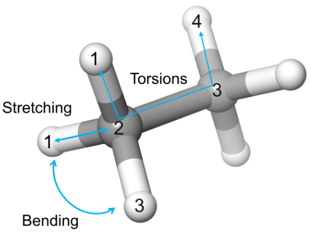

# 分子力学

- [分子力学](#分子力学)
  - [简介](#简介)
  - [能量项](#能量项)
  - [函数形式](#函数形式)
  - [参考](#参考)

Last updated: 2022-11-16, 14:18
****

## 简介

量子力学（Quantum Mechanics, **QM**）或从头计算（ab-initio）方法是非常强大的分子建模工具。QM 通过原子的量子特性构建分子的微观系统。

该方法的主要缺点是需要很长的计算时间，特别是分子较大时。将从头计算应用于大分子的困难导致了经典力学方法的发展，如分子力学（Molecular Mechanics, **MM**）或力场方法。

MM 技术可以显著加快计算速度，从而可以对包含大量原子的系统进行分析。在 MM 中，忽略了分子的量子力学性质，而简单地认为它们是由化学键连接起来的原子，即所谓的 “球-弹簧” 模型。

“球-弹簧” 模型对系统性质进行粗略的近似，但已经足以提供一些有意义的信息，包括大分子系统（如蛋白质）的一些行为。

## 能量项

MM 方法的主要思想是，忽略电子运动，将分子的能量表示为原子核坐标的函数。

对给定构象 $R$，分子系统的势能可以表示为不同贡献的加和：

$$E_{MM}(R)=E_{str}+E_{bend}+E_{tors}+E_{cross}+E_{el}+E_{vdW}$$

其中：

- 拉伸项 $E_{str}$ 表示键长变化
- 弯曲项 $E_{bend}$ 表示键角变化
- 扭转项 $E_{tors}$ 表示二面角变化
- 交叉项 $E_{cross}$ 表示以上三项的相互作用
- 范德华力 $E_{vdW}$ 表示原子之间的范德华相互作用
- 静电 $E_{el}$ 表示分子极化 

总的来说，以上贡献可以分为两类，成键项和非键项：

$$E_{bond}=E_{str}+E_{bend}+E_{tors}+E_{cross}$$

$$E_{non-bond}=E_{vdW}+E_{el}$$

成键项包含原子之间 1-2, 1-3 和 1-4 短程相互作用（图 1）。非键项则指距离更远的原子之间的相互作用。

> **图 1** 分子力学势能函数中成键项的简单说明。

成键项的数量与体系原子数 $N$ 成正比，而非键项与原子数的平方 $N^2$ 成正比。因此，分子建模中非键相互作用的计算最耗时。为了加快计算，往往会设置一个截止距离，当两个原子的距离半径超过该距离，就忽略它们之间的非键相互作用。

**MM 的基本思想**是，我们可以给每个分子构型分配一个能量值，能量越低的分子构型越稳定，反之亦然。因此，通过使分子的能量表达式最小化，可以预测分子平衡态的构象。

系统的分子力学表示通常是其它方法的起点，例如，可以使用 MM 的结果来执行分子动力学模拟。通过这种方式，不仅能够确定系统的稳定构象，还可以观察到系统随时间的演化。

还可以使用 MM 模型来构建同源模型、细化晶体结构，以及做分子对接实验等。

因为忽略了原子的量子力学特性，所以 MM 不适合于描述化学反应系统的电子结构变化，因此，如果要对化学反应过程进行更精确的描述，还是需要从头计算方法。

## 函数形式

上述方程的每一项的显式表达式（函数形式）以及其中包含的参数定义了所谓的 MM 力场（**Force Field**, FF）。力场的最基本的方程如下：

$$
\begin{aligned}
E_{MM}(R)&=\sum_{bonds}\frac{k_i}{2}(l_i-l_{i,0})^2+\sum_{angles}\frac{k_i}{2}(\theta_i-\theta_{i,0})^2+\sum_{torsions}\frac{V_n}{2}(1+cos(n\omega-\gamma))\\&+\sum_{i=1}\sum_{j=i+1}(4\epsilon_{ij}[(\frac{\sigma_{ij}}{r_{ij}})^{12}-(\frac{\sigma_{ij}}{r_{ij}})^6]+\frac{q_iq_j}{4\pi\epsilon_0r_{ij}})
\end{aligned}
$$

后面会对每一项分别进行说明。

从原则上来讲，对系统中的每个原子，我们应该计算方程中的每一项的每个参数，然而这不现实。

基于这个原因，MM 力场根据原子序数和它们所参与的化学键类型，将所有原子划分为不同类型，称为**原子类型**（atom types）。这样，属于同一原子类型的不同原子，采用相同的参数进行处理。

目前有许多不同的力场，其中 AMBER 力场是应用最广泛的力场之一，主要用于蛋白质和核酸的计算。

## 参考

- https://www.compchems.com/molecular-mechanics-mm/
