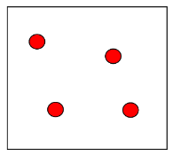
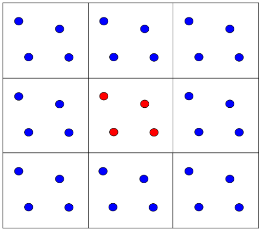
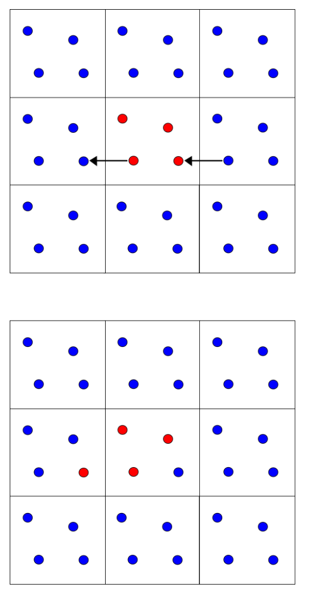
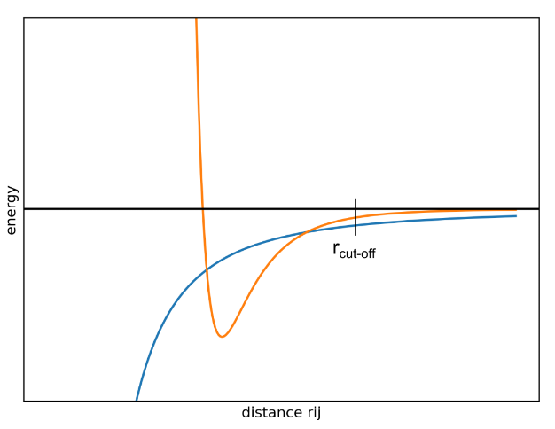

# 周期性边界条件

- [周期性边界条件](#周期性边界条件)
  - [系统模拟](#系统模拟)
  - [二维示例](#二维示例)
  - [最小镜像约定和截止半径](#最小镜像约定和截止半径)
  - [势能截断](#势能截断)
  - [参考](#参考)

Last updated: 2022-11-15, 18:27
****

## 系统模拟

虽然算力在不断增加，但依然远远不够模拟一个真正的宏观系统，一个宏观系统至少包含 $10^{23}$ 个原子。

现在，一个典型的 MD 模拟包含数千到上百万个原子。在这种情况下，大量原子处于模拟盒子的边界，不适合模拟系统的主体特性，因为大多数原子都受盒子壁的影响，这种现象称为**边界效应**（boundary effect）。

为了模拟主系统，需要实现周期边界条件（periodic boundary condition, **PBC**）。这种方法的基本思想是，通过初始有限系统的多次重复来模拟一个无限的系统。

这项技术利用统计力学概念遍历性：无限多个相同系统在某一时刻的平均值等于在无限时间观察的单个系统得到的平均值。

采用该技术，不需要考虑大量的分子，只需要足够长的时间尺度内研究单个分子。

## 二维示例

下面从实际的角度出发解释周期性边界条件是如何实现的。为了简单起见，考虑一个二维的例子。

MD 实验的第一步，构建包含系统的虚拟框框：

> 包含要模拟粒子的方框

在空间的每个方向上复制盒子，形成一个无限晶格。

> 中心的盒子在各个方向上复制，复制粒子用蓝色表示。

当中心盒子里的分子移动时，复制盒子里的分子也会以同样的方式移动。在模拟过程中，如果一个分子从中心盒子出来，另一边也会有一个分子进来，因此原子的数量是守恒的。通过这种方式，使粒子收到的力就像它们在一个溶液中一样。如下图所示：

那么，大量复制系统会不会增加问题规模，使得模拟更慢？假设有一个二维模拟盒子，里面装着分子 $A$，假设矩形盒子尺寸 $L$ 为：

$$L=(L_x, L_y)$$

知道分子 A 的坐标 $A=(x,y)$ 就等于知道了所有复制盒子里分子的位置，只需要按照盒子尺寸进行位移 $(x\plusmn n_xL_x, y\plusmn n_yL_y)$。

所以，复制的盒子里离子的行为完全复制中心盒子，除了盒子尺寸，不需要动力学相关的计算。

**周期性边界条件的主要有优点**：计算不同盒子的相同离子之间的距离，只需要知道盒子尺寸。

## 最小镜像约定和截止半径

静电和范德华力产生的非键相互作用对分子模拟非常重要。这些力的数量随着原子数的平方 $N^2$ 而增加，代表了分子模型中最耗时的部分。

在 PBC 中，某个原子可能与自身或另一个原子的多个副本相互作用。为了解决这个问题，引入了最小镜像约定（minimum image convention，**MIC**）。

MIC 假设每个粒子最多只能与系统中其它原子的一个镜像相互作用，即对短距离的非键相互作用，只考虑每个粒子最近的一个镜像。
 
处理非键相互作用的另一种常见做法是使用**截止半径** ($r_{cutoff}$)，超出这个半径的相互作用不考虑。这对加快计算速度非常重要。

截止半径不能超过盒子尺寸的一半，这样一个粒子就不会与自己的副本相互作用，也不会与相同的粒子作用两次。如下所示：

> 超过截止半径的相互作用设置为 0。

## 势能截断

设置的截止半径导致系统的势能截断，即超过给定半径的贡献没有被计算。对短程相互作用（如成键项）这不是问题，但是对长距离的非键相互作用有影响。

下图是非间相互作用随距离变化的曲线：

> 蓝色是静电相互作用，橙色是范德华力。

首先，截止半径在势能曲线中引入了不连续性，势能在接近 $r_{cut}$ 时突然变为零。我们希望获得一个曲线，平稳地减少到零。

其次，插入截止半径产生的误差对静电和范德华力的影响大小是不同的。这主要是因为它们对原子间距离的依赖性不同。对距离 $r_{ij}$的原子 $i$ 和 $j$：

- 范德华力：与 $r_{ij}^6$ 成反比，即随着距离的增大迅速变为零，因此截止半径产生的范德华力误差并不大。可以通过引入一些开关函数（switching function）进行调节。
- 静电力：与 $r_{ij}$ 成反比，减小缓慢，所以在较大距离对能量依然有显著贡献。需要复杂的方法来纠正由截止半径引入的静电力误差，使用最广泛的是 Ewald 亲和法。

## 参考

- https://www.compchems.com/molecular-dynamics-periodic-boundary-conditions-pbc/
- https://manual.gromacs.org/current/reference-manual/algorithms/periodic-boundary-conditions.html
