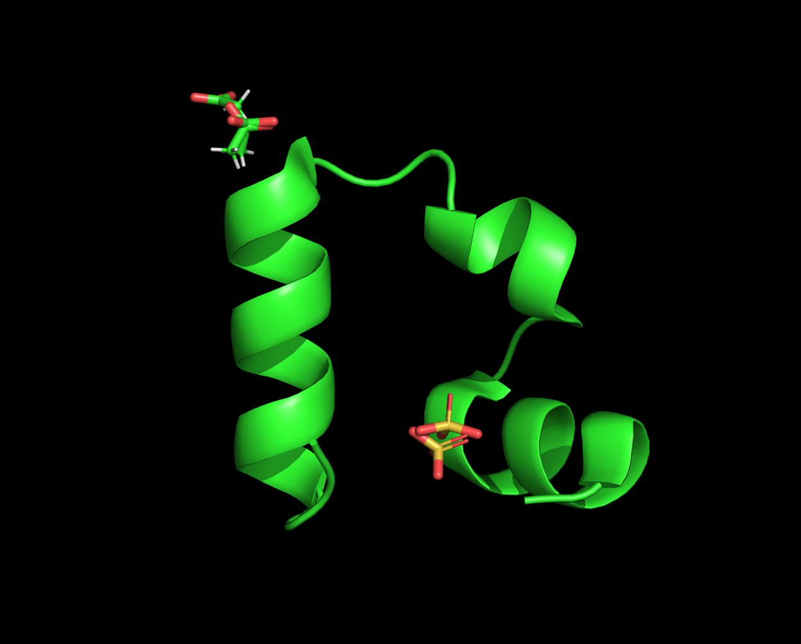
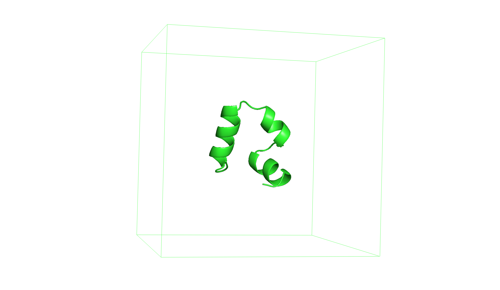
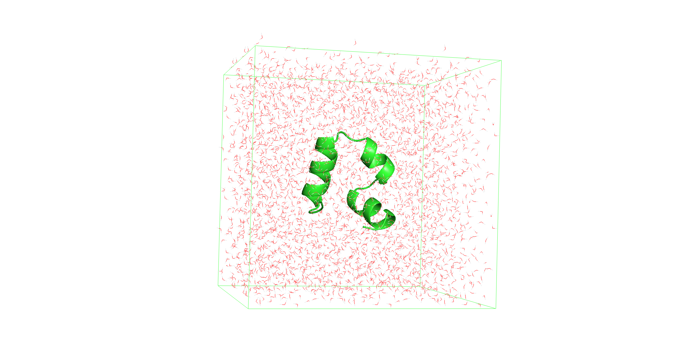
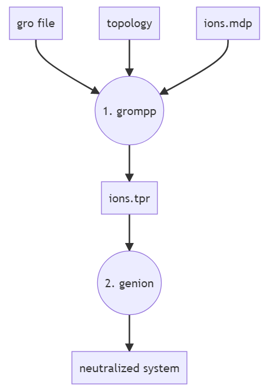
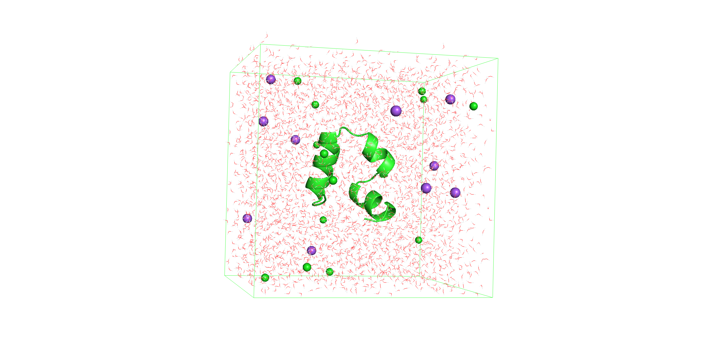
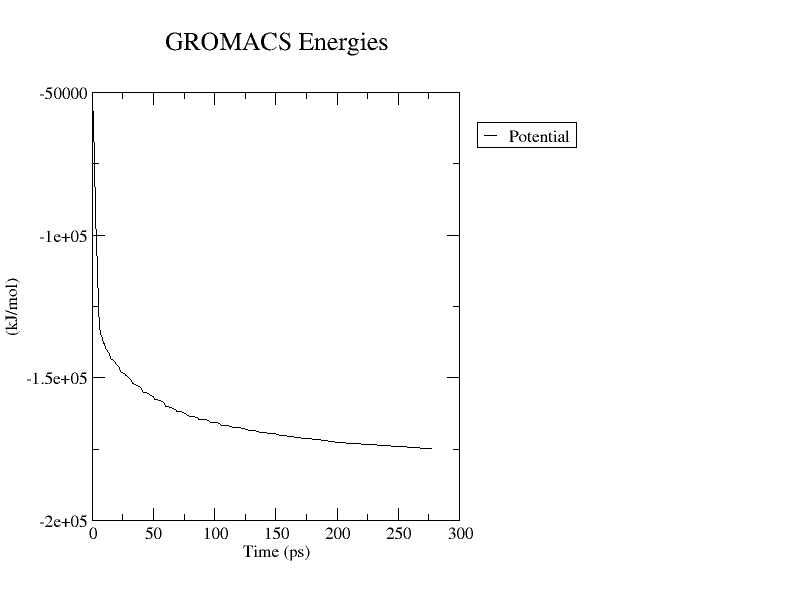
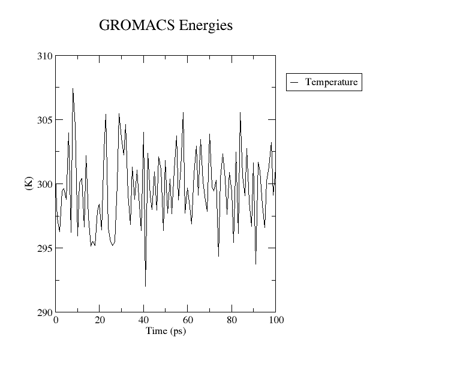
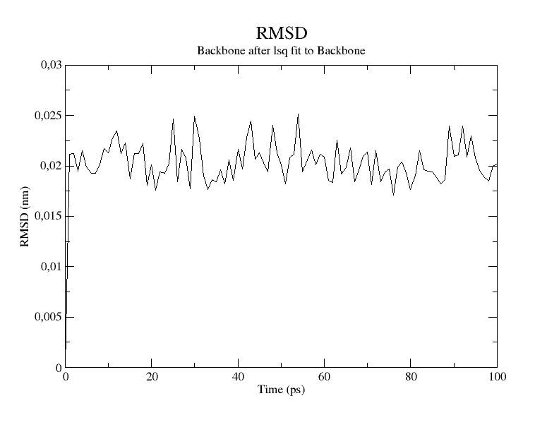
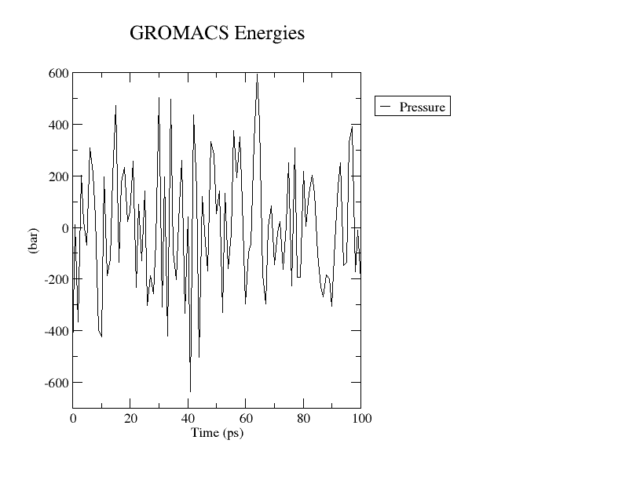
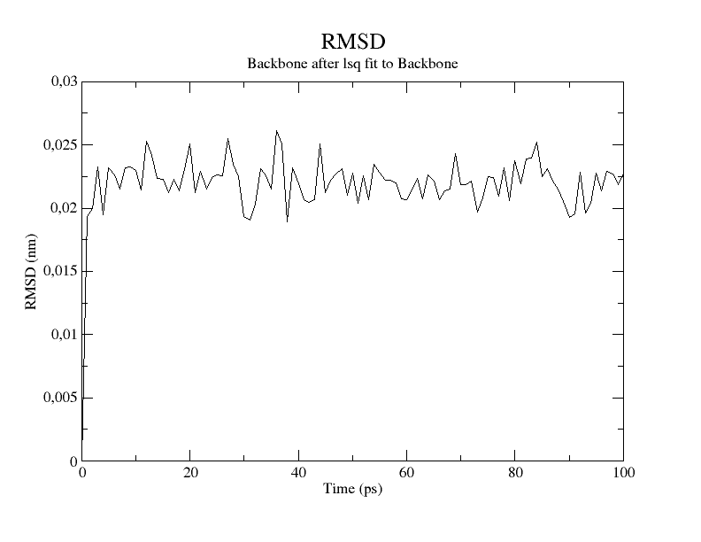

# 模拟水中的蛋白质

- [模拟水中的蛋白质](#模拟水中的蛋白质)
  - [简介](#简介)
  - [准备系统](#准备系统)
    - [准备蛋白质结构](#准备蛋白质结构)
    - [定义盒子](#定义盒子)
    - [溶剂化](#溶剂化)
    - [中和电荷](#中和电荷)
  - [模拟](#模拟)
    - [能量最小化](#能量最小化)
    - [NVT 平衡](#nvt-平衡)
    - [NPT 平衡](#npt-平衡)
    - [生成运行](#生成运行)
  - [建议](#建议)
  - [参考](#参考)

Last updated: 2022-11-24, 14:46
****

## 简介

下面使用 GROMACS 模拟水环境中的蛋白质。

## 准备系统

模拟的第一步，选择蛋白质，并为模拟准备系统。

### 准备蛋白质结构

为了便于演示，下面用一个不需要大量模型时间的小型蛋白结构，鸡绒毛蛋白结构域（PDB：1YRF）。下载地址：https://www.rcsb.org/structure/1YRF 。



首先，需要删除 PDB 文件里的水分子和配体。可以用文本编辑器，不过 grep 最常用：

```bash
grep -v HETATM 1yrf.pdb > 1yrf_clean.pdb
```

然后用 pdb2gmx 创建蛋白的拓扑：

```bash
gmx pdb2gmx -f 1yrf_clean.pdb -o 1yrf.gro -water tip3p -ignh
```

GROMACS 会提示选择力场：

```bash
Select the Force Field:
 1: AMBER03 protein, nucleic AMBER94 (Duan et al., J. Comp. Chem. 24, 1999-2012, 2003)
 2: AMBER94 force field (Cornell et al., JACS 117, 5179-5197, 1995)
 3: AMBER96 protein, nucleic AMBER94 (Kollman et al., Acc. Chem. Res. 29, 461-469, 1996)
 4: AMBER99 protein, nucleic AMBER94 (Wang et al., J. Comp. Chem. 21, 1049-1074, 2000)
 5: AMBER99SB protein, nucleic AMBER94 (Hornak et al., Proteins 65, 712-725, 2006)
 6: AMBER99SB-ILDN protein, nucleic AMBER94 (Lindorff-Larsen et al., Proteins 78, 1950-58, 2010)
 7: AMBERGS force field (Garcia & Sanbonmatsu, PNAS 99, 2782-2787, 2002)
 8: CHARMM27 all-atom force field (CHARM22 plus CMAP for proteins)
 9: GROMOS96 43a1 force field
10: GROMOS96 43a2 force field (improved alkane dihedrals)
11: GROMOS96 45a3 force field (Schuler JCC 2001 22 1205)
12: GROMOS96 53a5 force field (JCC 2004 vol 25 pag 1656)
13: GROMOS96 53a6 force field (JCC 2004 vol 25 pag 1656)
14: GROMOS96 54a7 force field (Eur. Biophys. J. (2011), 40,, 843-856, DOI: 10.1007/s00249-011-0700-9)
15: OPLS-AA/L all-atom force field (2001 aminoacid dihedrals)
```

本教程，选择 "6" (AMBER99SB-ILDN)。

运行命令，会生成三个文件：

- 结构文件 `1yrf.gro`
- 拓扑文件 `topol.top`
- 位置约束文件 `posre.itp`

### 定义盒子

使用 `editconf` 定义模拟盒子：

```bash
gmx editconf -f 1yrf.gro -o 1yrf_box.gro -c -d 1.0 -bt cubic
```

蛋白质与边缘距离不小于 1.0 nm `-d 1.0`，以确保 PBC 没有问题。

可以用 pymol 查看结构 `1yrf_box.gro`，并用 `show cell` 命令显示盒子。



### 溶剂化

使用 `solvate` 溶剂化系统，下面使用水作为溶剂。

```bash
gmx solvate -cp 1yrf_box.gro -cs spc216.gro -o 1yrf_solv.gro -p topol.top
```

生成的 `1yrf_solv.gro` 包含水分子。可以用 pymol 可视化该文件：



### 中和电荷

准备系统的最后一步是通过加入离子中和系统电荷，使系统净电荷为 0。

使用该命令，需要准备 tpr 文件。使用 `grompp` 模块生成 tpr 文件，同时需要 mdp 参数文件。如下：



`ions.mdp` 内容如下：

```mdp
; ions.mdp - used as input into grompp to generate ions.tpr
; Parameters describing what to do, when to stop and what to save
integrator  = steep         ; Algorithm (steep = steepest descent minimization)
emtol       = 1000.0        ; Stop minimization when the maximum force < 1000.0 kJ/mol/nm
emstep      = 0.01          ; Minimization step size
nsteps      = 50000         ; Maximum number of (minimization) steps to perform

; Parameters describing how to find the neighbors of each atom and how to calculate the interactions
nstlist         = 1         ; Frequency to update the neighbor list and long range forces
cutoff-scheme	= Verlet    ; Buffered neighbor searching 
ns_type         = grid      ; Method to determine neighbor list (simple, grid)
coulombtype     = cutoff    ; Treatment of long range electrostatic interactions
rcoulomb        = 1.0       ; Short-range electrostatic cut-off
rvdw            = 1.0       ; Short-range Van der Waals cut-off
pbc             = xyz       ; Periodic Boundary Conditions in all 3 dimensions
```

组装 `ions.tpr` 文件：

```bash
gmx grompp -f ions.mdp -c 1yrf_solv.gro -p topol.top -o ions.tpr
```

然后用 `genion` 添加离子：

```bash
gmx genion -s ions.tpr -o 1yrf_ions.gro -p topol.top -pname NA -nname CL -neutral -conc 0.15
```

`genion` 通过用离子替换系统中的分子来中和系统。GROMACS 会提示选择替换系统中的什么分子，这里肯定选择溶剂啦：

```bash
Will try to add 11 NA ions and 13 CL ions.
Select a continuous group of solvent molecules
Group     0 (         System) has 11595 elements
Group     1 (        Protein) has   582 elements
Group     2 (      Protein-H) has   289 elements
Group     3 (        C-alpha) has    35 elements
Group     4 (       Backbone) has   105 elements
Group     5 (      MainChain) has   141 elements
Group     6 (   MainChain+Cb) has   174 elements
Group     7 (    MainChain+H) has   177 elements
Group     8 (      SideChain) has   405 elements
Group     9 (    SideChain-H) has   148 elements
Group    10 (    Prot-Masses) has   582 elements
Group    11 (    non-Protein) has 11013 elements
Group    12 (          Water) has 11013 elements
Group    13 (            SOL) has 11013 elements
Group    14 (      non-Water) has   582 elements
```

选择 13 (SOL)。生成的 `1yrf_ions.gro` 用于下一步模拟：



## 模拟

下一步就是模拟了。模拟包括如下步骤：

1. 能量最小化
2. NVT 平衡
3. NPT 平衡
4. 生产运行

它们都基于两个模块：

1. grompp
2. mdrun

*grompp* 用来组装 tpr 输入文件，每次都需要一个 mdpp 参数文件定义模拟设置。

### 能量最小化

这一步通过调整原子坐标来使系统的势能最小化。稳定总体结构，避免空间冲突。

所用参数 `minim.mdp` 内容如下：

```mdp
; minim.mdp - used as input into grompp to generate em.tpr
; Parameters describing what to do, when to stop and what to save
integrator  = steep         ; Algorithm (steep = steepest descent minimization)
emtol       = 1000.0        ; Stop minimization when the maximum force < 1000.0 kJ/mol/nm
emstep      = 0.01          ; Minimization step size
nsteps      = 50000         ; Maximum number of (minimization) steps to perform

; Parameters describing how to find the neighbors of each atom and how to calculate the interactions
nstlist         = 1         ; Frequency to update the neighbor list and long range forces
cutoff-scheme   = Verlet    ; Buffered neighbor searching
ns_type         = grid      ; Method to determine neighbor list (simple, grid)
coulombtype     = PME       ; Treatment of long range electrostatic interactions
rcoulomb        = 1.0       ; Short-range electrostatic cut-off
rvdw            = 1.0       ; Short-range Van der Waals cut-off
pbc             = xyz       ; Periodic Boundary Conditions in all 3 dimensions
```

使用 `grompp` 生成能量最小化所需 tpr 文件 `em.tpr`。

```bash
gmx grompp -f minim.mdp -c 1yrf_ions.gro -p topol.top -o em.tpr
```

然后用 `mdrun` 运行模拟：

```bash
gmx mdrun -v -deffnm em
```

根据算力大小，该步骤耗时几秒钟到几分钟。

mdrun 生成如下四个文件：

- `em.gro`，能量最小化后的最终结构
- `em.log`，运行日志信息
- `em.trr`，系统轨迹
- `em.edr`，模拟的能量信息

`em.edr` 文件可以用来查看系统变化的多种指标，例如：

```bash
gmx energy -f em.edr -o potential.xvg
```

提示符下输入：

```bash
10 0
```

选择势能。然后就可以使用生成的 `potential.xvg` 文件绘图，查看势能变化。用 grace 绘图：

```bash
xmgrace potential.xvg
```



也可以在 pymol 中载入初始结构 `1yrf_ions.gro` 和最新结构 `em.gro`，对比两者的差别。

### NVT 平衡

能量最小化确保了初始结构在几何结构与溶剂取向的合理性，在生产模拟前，还需要平衡蛋白质周围的离子和溶剂。

平衡分两步，首先在 NVT 中平衡，实现恒温器，使系统在恒定温度下平衡。

下面使用 `V-rescale` 恒温器运行 100ps 模拟。nvt.mdp 参数如下：

```mdp
define                  = -DPOSRES  ; position restrain the protein
; Run parameters
integrator              = md        ; leap-frog integrator
nsteps                  = 50000     ; 2 * 50000 = 100 ps
dt                      = 0.002     ; 2 fs
; Output control
nstxout                 = 500       ; save coordinates every 1.0 ps
nstvout                 = 500       ; save velocities every 1.0 ps
nstenergy               = 500       ; save energies every 1.0 ps
nstlog                  = 500       ; update log file every 1.0 ps
; Bond parameters
continuation            = no        ; first dynamics run
constraint_algorithm    = lincs     ; holonomic constraints 
constraints             = h-bonds   ; bonds involving H are constrained
lincs_iter              = 1         ; accuracy of LINCS
lincs_order             = 4         ; also related to accuracy
; Nonbonded settings 
cutoff-scheme           = Verlet    ; Buffered neighbor searching
ns_type                 = grid      ; search neighboring grid cells
nstlist                 = 10        ; 20 fs, largely irrelevant with Verlet
rcoulomb                = 1.0       ; short-range electrostatic cutoff (in nm)
rvdw                    = 1.0       ; short-range van der Waals cutoff (in nm)
DispCorr                = EnerPres  ; account for cut-off vdW scheme
; Electrostatics
coulombtype             = PME       ; Particle Mesh Ewald for long-range electrostatics
pme_order               = 4         ; cubic interpolation
fourierspacing          = 0.16      ; grid spacing for FFT
; Temperature coupling is on
tcoupl                  = V-rescale             ; modified Berendsen thermostat
tc-grps                 = Protein Non-Protein   ; two coupling groups - more accurate
tau_t                   = 0.1     0.1           ; time constant, in ps
ref_t                   = 300     300           ; reference temperature, one for each group, in K
; Pressure coupling is off
pcoupl                  = no        ; no pressure coupling in NVT
; Periodic boundary conditions
pbc                     = xyz       ; 3-D PBC
; Velocity generation
gen_vel                 = yes       ; assign velocities from Maxwell distribution
gen_temp                = 300       ; temperature for Maxwell distribution
gen_seed                = -1        ; generate a random seed
```

组装 tpr:

```bash
gmx grompp -f nvt.mdp -c em.gro -r em.gro -p topol.top -o nvt.tpr
```

> **WARNING**：这里通过 `-r` 选项指定了对蛋白质重原子的位置约束。要约束的原子在 `gmx pdb2gmx` 生成的 `posre.itp` 文件中。

可以开始模拟了：

```bash
gmx mdrun -v -deffnm nvt
```

接下来的模拟步骤就比较耗时了。模拟完成后，可以用 `gmx energy` 提取信息。

在 NVT 平衡中，系统的温度应该达到 mdp 文件中指定的值。下面查看温度多久稳定：

```bash
printf "16 0" | gmx energy -f nvt.edr -o nvt_temperature.xvg
```

绘图：

```bash
xmgrace nvt_temperature.xvg
```



可以看到，温度在设置的 300K 附近非常稳定，一般来说，如果温度尚未稳定，就需要继续模拟。

为了检查系统是否正常，可以用 `gmx rms` 查看 RMSD 变化：

```bash
printf "4 4" | gmx rms -f nvt.trr -s nvt.tpr -o nvt_rmsd.xvg
```

使用输出的 `nvt_rmsd.xvg` 绘图：

```bash
xmgrace nvt_rmsd.xvg
```



RMSD 迅速收敛到一个稳定的信号值，表明系统已经在所需温度达到平衡。

### NPT 平衡

在 `Parrinello-Rahman` 恒压器运行 100ps 模拟。模拟的 npt.mdp 参数如下：

```mdp
define                  = -DPOSRES  ; position restrain the protein
; Run parameters
integrator              = md        ; leap-frog integrator
nsteps                  = 50000     ; 2 * 50000 = 100 ps
dt                      = 0.002     ; 2 fs
; Output control
nstxout                 = 500       ; save coordinates every 1.0 ps
nstvout                 = 500       ; save velocities every 1.0 ps
nstenergy               = 500       ; save energies every 1.0 ps
nstlog                  = 500       ; update log file every 1.0 ps
; Bond parameters
continuation            = yes       ; Restarting after NVT 
constraint_algorithm    = lincs     ; holonomic constraints 
constraints             = h-bonds   ; bonds involving H are constrained
lincs_iter              = 1         ; accuracy of LINCS
lincs_order             = 4         ; also related to accuracy
; Nonbonded settings 
cutoff-scheme           = Verlet    ; Buffered neighbor searching
ns_type                 = grid      ; search neighboring grid cells
nstlist                 = 10        ; 20 fs, largely irrelevant with Verlet scheme
rcoulomb                = 1.0       ; short-range electrostatic cutoff (in nm)
rvdw                    = 1.0       ; short-range van der Waals cutoff (in nm)
DispCorr                = EnerPres  ; account for cut-off vdW scheme
; Electrostatics
coulombtype             = PME       ; Particle Mesh Ewald for long-range electrostatics
pme_order               = 4         ; cubic interpolation
fourierspacing          = 0.16      ; grid spacing for FFT
; Temperature coupling is on
tcoupl                  = V-rescale             ; modified Berendsen thermostat
tc-grps                 = Protein Non-Protein   ; two coupling groups - more accurate
tau_t                   = 0.1     0.1           ; time constant, in ps
ref_t                   = 300     300           ; reference temperature, one for each group, in K
; Pressure coupling is on
pcoupl                  = Parrinello-Rahman     ; Pressure coupling on in NPT
pcoupltype              = isotropic             ; uniform scaling of box vectors
tau_p                   = 2.0                   ; time constant, in ps
ref_p                   = 1.0                   ; reference pressure, in bar
compressibility         = 4.5e-5                ; isothermal compressibility of water, bar^-1
refcoord_scaling        = com
; Periodic boundary conditions
pbc                     = xyz       ; 3-D PBC
; Velocity generation
gen_vel                 = no        ; Velocity generation is off 
```

组装 tpr:

```bash
gmx grompp -f npt.mdp -c nvt.gro -r nvt.gro -p topol.top -o npt.tpr
```

模拟：

```bash
gmx mdrun -v -deffnm npt
```

查看压力变化：

```bash
printf "18 0" | gmx_mpi energy -f npt.edr -o npt_pressure.xvg;
xmgrace npt_pressure.xvg
```



蛋白质在 mdp 中设置的压力（1 bar）附近波动，不过对纳米尺度的水溶液体系这种波动完成正常。

查看 RMSD 值，看看系统在恒压系统下是否正常平衡：

```bash
printf "4 4" | gmx rms -f npt.trr -s npt.tpr -o npt_rmsd.xvg
xmgrace npt_rmsd.xvg
```



可以看到，RMSD 值非常稳定，表明系统在所需压力下平衡良好。

### 生成运行

系统终于在所需温度和压力下达到平衡。要开始真正的模拟了，即生成运行工。

这一步不约束重原子位置，观察系统随时间的变化，并根据需求收集相关数据。

生成运行依然在 NPT 系综进行，使用 `V-rescale` 恒温器和 `Parrinello-Rahman` 恒压器。

这里只是演示，因此只执行 1ns 的模拟。在真实模拟实验中，一般模拟上百 ns。

模拟参数 md.mdp 如下：

```mdp
; Run parameters
integrator              = md        ; leap-frog integrator
nsteps                  = 500000    ; 2 * 500000 = 1000 ps (1 ns)
dt                      = 0.002     ; 2 fs
; Output control
nstxout                 = 0         ; suppress bulky .trr file by specifying 
nstvout                 = 0         ; 0 for output frequency of nstxout,
nstfout                 = 0         ; nstvout, and nstfout
nstenergy               = 5000      ; save energies every 10.0 ps
nstlog                  = 5000      ; update log file every 10.0 ps
nstxout-compressed      = 5000      ; save compressed coordinates every 10.0 ps
compressed-x-grps       = System    ; save the whole system
; Bond parameters
continuation            = yes       ; Restarting after NPT 
constraint_algorithm    = lincs     ; holonomic constraints 
constraints             = h-bonds   ; bonds involving H are constrained
lincs_iter              = 1         ; accuracy of LINCS
lincs_order             = 4         ; also related to accuracy
; Neighborsearching
cutoff-scheme           = Verlet    ; Buffered neighbor searching
ns_type                 = grid      ; search neighboring grid cells
nstlist                 = 10        ; 20 fs, largely irrelevant with Verlet scheme
rcoulomb                = 1.0       ; short-range electrostatic cutoff (in nm)
rvdw                    = 1.0       ; short-range van der Waals cutoff (in nm)
; Electrostatics
coulombtype             = PME       ; Particle Mesh Ewald for long-range electrostatics
pme_order               = 4         ; cubic interpolation
fourierspacing          = 0.16      ; grid spacing for FFT
; Temperature coupling is on
tcoupl                  = V-rescale             ; modified Berendsen thermostat
tc-grps                 = Protein Non-Protein   ; two coupling groups - more accurate
tau_t                   = 0.1     0.1           ; time constant, in ps
ref_t                   = 300     300           ; reference temperature, one for each group, in K
; Pressure coupling is on
pcoupl                  = Parrinello-Rahman     ; Pressure coupling on in NPT
pcoupltype              = isotropic             ; uniform scaling of box vectors
tau_p                   = 2.0                   ; time constant, in ps
ref_p                   = 1.0                   ; reference pressure, in bar
compressibility         = 4.5e-5                ; isothermal compressibility of water, bar^-1
; Periodic boundary conditions
pbc                     = xyz       ; 3-D PBC
; Dispersion correction
DispCorr                = EnerPres  ; account for cut-off vdW scheme
; Velocity generation
gen_vel                 = no        ; Velocity generation is off 
```

```bash
gmx grompp -f md.mdp -c npt.gro -r npt.gro -p topol.top -o md.tpr
```

```bash
gmx mdrun -v -deffnm md
```

生产运行所需时间更长。可以后台运行：

```bash
nohup gmx mdrun -v -deffnm md &
```

这样输出会写入临时文件 `nohup.out`。

使用如下命令查看进度：

```bash
tail -f nohup.out
```

模拟结束后，可以看到相关文件 md.edr, md.log, md.xtc。

## 建议

在这里，可以看到用于执行模拟的一系列文件，可以将命令放入文件，然后直接复制到终端中运行。

**准备系统**

```bash
gmx pdb2gmx -f (protein.pdb) -o protein.gro -water tip3p  
gmx editconf -f protein.gro -o protein_box.gro -c -d 1.0 -bt cubic
gmx solvate -cp protein_box.gro -cs spc216.gro -o protein_solv.gro -p topol.top 
gmx grompp -f ions.mdp -c protein_solv.gro -p topol.top -o ions.tpr 
gmx genion -s ions.tpr -o system.gro -p topol.top -pname NA -nname CL -neutral -conc 0.15
```

**模拟**

```bash
gmx grompp -f minim.mdp -c system.gro -p topol.top -o em.tpr
gmx mdrun -v -deffnm em 
gmx grompp -f nvt.mdp -c em.gro -r em.gro -p topol.top -o nvt.tpr
gmx mdrun -deffnm nvt 
gmx grompp -f npt.mdp -c nvt.gro -r nvt.gro -t nvt.cpt -p topol.top -o npt.tpr
gmx mdrun -deffnm npt 
gmx grompp -f md.mdp -c npt.gro -t npt.cpt -p topol.top -o md.tpr
gmx mdrun -deffnm md
```

## 参考

- https://www.compchems.com/gromacs-tutorial-molecular-dynamics-simulation-of-a-protein-in-water-environment/
