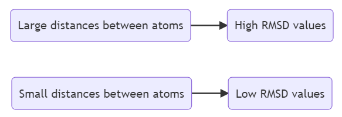
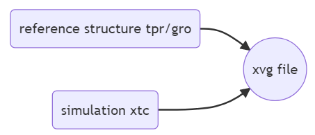
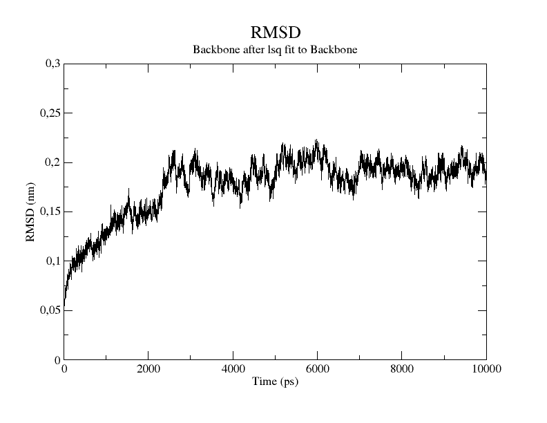
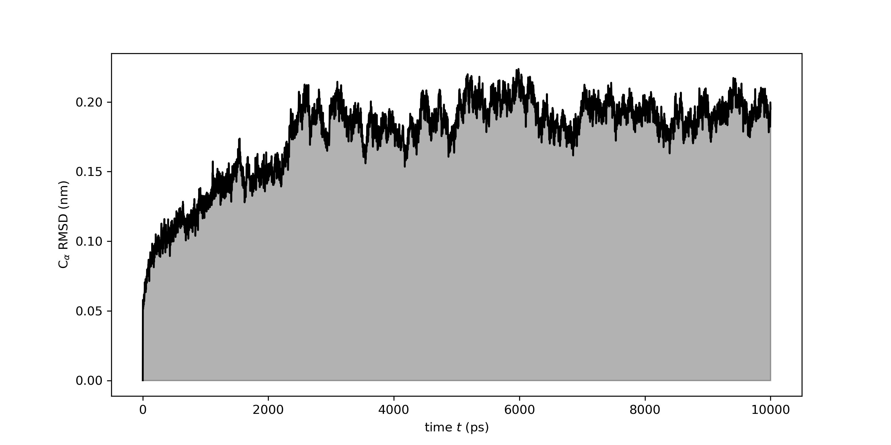

# RMSD

- [RMSD](#rmsd)
  - [简介](#简介)
  - [RMSD 方程](#rmsd-方程)
  - [gmx rms](#gmx-rms)
  - [轨迹的 RMSD](#轨迹的-rmsd)
  - [系统特定部分的 RMSD](#系统特定部分的-rmsd)
  - [特定时间窗口的 RMSD](#特定时间窗口的-rmsd)
  - [参考](#参考)

Last updated: 2022-11-23, 16:55
****

## 简介

均方根偏差（RMSD）是分子建模中一个重要的结构特征，用于衡量分子结构偏离参考结构的程度。

绘制 RMSD 随时间的变化有两个作用：

- 识别结构有重大变化的模拟部分。例如，如果一个蛋白质在模拟过程中发生较大的构象变化，在 RMSD-时间图中会出现峰值；
- RMSD 通常用作结构向平衡态收敛的指标。RMSD 曲线趋向平稳表明蛋白质已经平衡，可以进行下一步。

因此，RMSD 在 MD 模拟的不同步骤都起着关键作用。

## RMSD 方程

对包含 N 个原子的分子结构，使用如下公式计算指定构型 $r$ 与参考构象 $r^{ref}$ 之间的 RMSD：

$$RMSD=\sqrt{\frac{1}{N}\sum_{i=1}^N(r_i-r_i^{ref})^2}$$

其中 $r_i^{ref}$ 表示参考结构的第 $i$ 个原子的坐标，$r_i$ 为相同原子不同构象中的坐标。

总的来说，RMSD 是原子间距离平方的均值的平方根。



## gmx rms

`gmx rms` 用来计算两个结构之间的 RMSD。

计算只需要两个文件：

- tpr 或 gro 格式的参考构型
- 和参考构型对比的轨迹文件（xtc 文件）



GROMACS 会输出 xvg 格式文件，用 grace 或 matplotlib 绘图即可。

## 轨迹的 RMSD

下面用 `gmx rms` 命令计算系统在模拟过程中的 RMSD 波动。

即观察系统的结构与初始结构的偏差有多少。

在 GROMACS 中，通过比较轨迹文件的每一帧与初始结构来实现。

```bash
gmx rms -f simulation.xtc -s reference.tpr -o rmsd.xvg (-tu ns)
```

提示选择两个 group:

1. The group for least square fits: structure under `-f` flag

```bash
Select group for least squares fit
Group     0 (         System) has 235551 elements
Group     1 (        Protein) has  4386 elements
Group     2 (      Protein-H) has  2147 elements
Group     3 (        C-alpha) has   268 elements
Group     4 (       Backbone) has   804 elements
Group     5 (      MainChain) has  1071 elements
Group     6 (   MainChain+Cb) has  1334 elements
Group     7 (    MainChain+H) has  1330 elements
Group     8 (      SideChain) has  3056 elements
Group     9 (    SideChain-H) has  1076 elements
Group    10 (    Prot-Masses) has  4386 elements
Group    11 (    non-Protein) has 231165 elements
Group    12 (          Other) has 231165 elements
```

2. The group for RMSD calculation: structure under `-s` flag

```bash
Select group for RMSD calculation
Group     0 (         System) has 235551 elements
Group     1 (        Protein) has  4386 elements
Group     2 (      Protein-H) has  2147 elements
Group     3 (        C-alpha) has   268 elements
Group     4 (       Backbone) has   804 elements
Group     5 (      MainChain) has  1071 elements
Group     6 (   MainChain+Cb) has  1334 elements
Group     7 (    MainChain+H) has  1330 elements
Group     8 (      SideChain) has  3056 elements
Group     9 (    SideChain-H) has  1076 elements
Group    10 (    Prot-Masses) has  4386 elements
Group    11 (    non-Protein) has 231165 elements
Group    12 (          Other) has 231165 elements
```

对蛋白模拟，一般使用骨架计算 RMSD，所以两个 group 都选择 4 (Backbone)。

可以用如下命令提前设置：

```bash
printf "4 4" | gmx_mpi rms -f md.xtc -s md.tpr -o rmsd.xvg
```

生成的 rmsd.xvg 文件可以用 grace 绘图：

```bash
xmgrace rmsd.xvg
```



或者用 Matplotlib 绘图：

```python
import matplotlib.pyplot as plt
import numpy
t,rmsd = numpy.loadtxt("rmsd.xvg", comments=["@", "#"], unpack=True)

fig = plt.figure(figsize=(10,5))
ax = fig.add_subplot(111)
ax.fill_between(t,rmsd, color="black", linestyle="-", alpha=0.3)

ax.plot(t,rmsd, color="black", linestyle="-")
ax.set_xlabel("time $t$ (ps)")
ax.set_ylabel(r"C$_\alpha$ RMSD (nm)")

plt.savefig("rmsd.png", format="png", dpi=300)
plt.show()
```



## 系统特定部分的 RMSD

如果系统的特定部分不是 GROMACS 的默认 group，就需要先用 `gmx make_ndx` 创建索引。

然后在调用 `gmx rms` 时传入索引：

```bash
gmx rms -f simulation.xtc -s reference.tpr -o rmsd_index.xvg -n index.ndx
```

## 特定时间窗口的 RMSD

通过 `-b` 和 `-e` 指定轨迹的特定时间段，就能计算轨迹特定时间窗口的 RMSD。

例如，计算 1000 ps 到 2000 ps 之间的 RMSD：

```bash
gmx rms -f simulation.xtc -s reference.tpr -o rmsd_time.xvg -b 1000 -e 2000
```

如果 `-b` 和 `-e` 的值相同，则得到参考结构与所选时间对应帧之间的 RMSD 值。

## 参考

- https://www.compchems.com/what-is-the-rmsd-and-how-to-compute-it-with-gromacs/
- https://manual.gromacs.org/current/onlinehelp/gmx-rms.html
