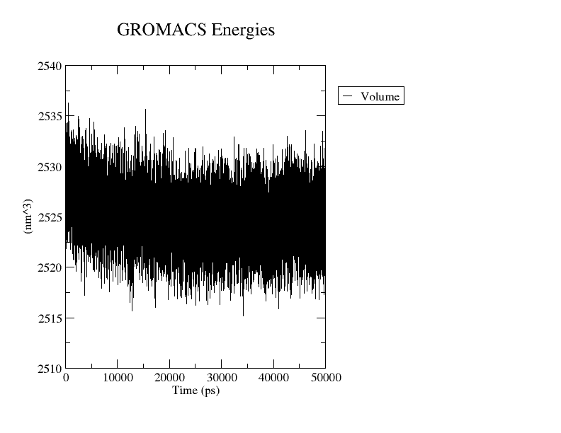
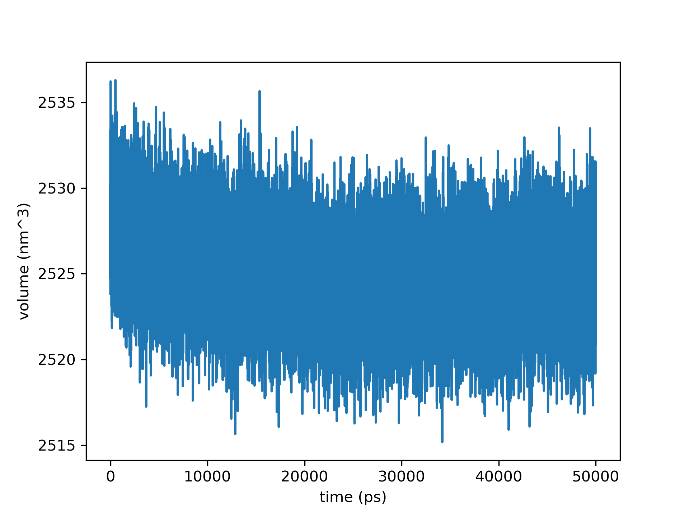

# 提取并绘制热力学性质

- [提取并绘制热力学性质](#提取并绘制热力学性质)
  - [gmx energy](#gmx-energy)
  - [绘制 xvg 格式数据](#绘制-xvg-格式数据)
    - [Xmgrace](#xmgrace)
    - [Python](#python)
  - [示例](#示例)
  - [合并 edr 文件](#合并-edr-文件)
  - [参考](#参考)

Last updated: 2022-11-23, 15:58
****

## gmx energy

`gmx energy` 命令从 edr 能量文件提取热力学性质。

该命令以 edr 文件位输入，输出 xvg 格式文件，该文件可用来绘图。


语法很简单：

```bash
gmx energy -f simulation.edr -o property.xvg 
```

运行命令，会提示选择要获得的信息。如下：

```bash
Command line:
  gmx_mpi energy -f system.edr -o property.xvg

Opened system.edr as single precision energy file

Select the terms you want from the following list by
selecting either (part of) the name or the number or a combination.
End your selection with an empty line or a zero.
-------------------------------------------------------------------
  1  U-B              2  Proper-Dih.      3  Improper-Dih.    4  Improper-Dih.
  5  CMAP-Dih.        6  LJ-14            7  Coulomb-14       8  LJ-(SR)
  9  Disper.-corr.   10  Coulomb-(SR)    11  Coul.-recip.    12  Position-Rest.
 13  Dih.-Rest.      14  Potential       15  Kinetic-En.     16  Total-Energy
 17  Conserved-En.   18  Temperature     19  Pres.-DC        20  Pressure
 21  Constr.-rmsd    22  Vir-XX          23  Vir-XY          24  Vir-XZ
 25  Vir-YX          26  Vir-YY          27  Vir-YZ          28  Vir-ZX
 29  Vir-ZY          30  Vir-ZZ          31  Pres-XX         32  Pres-XY
 33  Pres-XZ         34  Pres-YX         35  Pres-YY         36  Pres-YZ
 37  Pres-ZX         38  Pres-ZY         39  Pres-ZZ         40  #Surf*SurfTen
 41  T-Protein_membrane                  42  T-solvent
 43  Lamb-Protein_membrane               44  Lamb-solvent
```

例如，提取温度信息：

```bash
18 0 
```

## 绘制 xvg 格式数据

### Xmgrace

Xmgrace 可以直接处理 xvg 格式，可用来快速绘图。

**安装 grace**

- Mac

```bash
brew install grace
```

- Linux

```bash
sudo apt-get install grace
```

假设安装好了 grace，并生成了 `volume.xvg` 文件。则可以使用如下命令绘图：

```bash
xmgrace volume.xvg
```



还可以导出为 png 图片：

```bash
xmgrace -nxy volume.xvg -hdevice PNG -hardcopy -printfile volume.png
```

### Python

使用 matplotlib 绘制 xvg 文件数据：

```python
import matplotlib.pyplot as plt
import numpy as np

x,y = np.loadtxt("volume.xvg",comments=["@", "#"],unpack=True)
plt.plot(x,y)
plt.xlabel("time (ps)")
plt.ylabel("volume (nm^3)")
plt.savefig("volume.png", format="png", dpi=300)
plt.show()
```



## 示例

假设刚完成 NPT 平衡，生成 `npt.edr` 文件后提取信息。常用的信息包括：

- 温度
- 体积
- 压力
- 动能
- 势能
- 总能量

对每个属性，都需要先生成对应的 .xvg 文件。如下；

```bash
gmx energy -f npt.edr -o temperature.xvg
gmx energy -f npt.edr -o volume.xvg
gmx energy -f npt.edr -o pressure.xvg
gmx energy -f npt.edr -o kinetic.xvg
gmx energy -f npt.edr -o potential.xvg
gmx energy -f npt.edr -o total.xvg
```

对每一行命令，都会提示选择输出的属性。

## 合并 edr 文件

在某些情况，你可能运行了一段时间的模拟，但没有得到想要的结果，于是决定将模拟延长一段时间。

这样就得到了两个不同的 edr 文件。可以使用 `gmx eneconv` 命令合并它们，生成的 edr 文件可用来提取整个模拟的属性。

```bash
gmx eneconv -f simulation_1.edr simulation_2.edr -o merged.edr (-settime)
```

## 参考

- https://www.compchems.com/how-to-extract-and-plot-thermodynamic-properties-from-a-gromacs-simulation/
