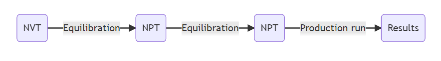

# 系综

- [系综](#系综)
  - [简介](#简介)
  - [微正则系综（NVE）](#微正则系综nve)
  - [正则系综（NVT）](#正则系综nvt)
  - [等温等压系综（NPT）](#等温等压系综npt)
  - [大正则系综（μVT）](#大正则系综μvt)
  - [MD 模拟中系综的选择](#md-模拟中系综的选择)
  - [参考](#参考)

Last updated: 2022-11-22, 13:57
****

## 简介

分子动力学模拟可以在不同条件下进行，这些条件通常称为系综（Ensemble），这是统计力学的一个概念。

不同的系综代表与周围环境分离程度不同的系统，从完全孤立（微正则系综）到完全开放（大正则系综）。

|系综|缩写|性质|
|----|---|---|
|微正则系综|NVE|摩尔（N）、体积（V）和能量（E）守恒|
|正则系综|NVT|摩尔（N）、体积（V）和温度（T）守恒|
|等温等压系综|NPT|摩尔（N）、压力（P）和温度（T）守恒|
|大正则系综|μVT|化学势（$\mu$）、体积（V）和温度（T）守恒|

## 微正则系综（NVE）

微正则系综（microcanonical）是最基本的系综，系综具有恒定的摩尔数（N）、体积（V）和能量（E）。因此，NVE 表示一个孤立的系统，不与外界环境交换热量或物质。

所以，NVE 是一个总能量守恒，势能和动能（$E_{tot}=K+V$）允许有一定波动的系统。

一个典型的 MD 模拟往往从一个不稳定的初始结构开始，其特征是具有需要最小化的高势能。因此，由于总能量守恒，$V$ 的减小对应动能 $K$ 的增加，系统温度升高。

温度的突然升高会导致一些问题，例如，温度升高可能导致蛋白质展开，从而导致模拟失败。

微正则系综 NVE 不怎么适合指定 MD 模拟。

## 正则系综（NVT）

正则系综的摩尔数（N）、体积（V）和温度（T）保持恒定。NVT 系统允许与外部交换热量，从而保持稳定恒定，可以将其想象成一个泡在恒温器中的系统。

实现温度恒定很容易，只需要调整系统的速度就能实现。温度太低就增加速度，反之亦然。

## 等温等压系综（NPT）

等温等压系综的摩尔数（N）、压强（P）和温度（T）保持恒定。这个系综更加灵活，可以与外界交换热量，也可以调节体积来保持压力恒定。

NPT 系综对模拟实验室中恒温、恒压的化学反应非常有用。

## 大正则系综（μVT）

大正则系综的化学势（$\mu$）、体积（V）和温度（T）保持恒定。与上述系综的主要差别在于，该系综允许分子数的波动。该系综假设系统是开发的，可以与一个非常大的热源交换热量和粒子，大多数分子动力学软件不支持这个系综。

大多数的实验实在 NPT、μVT 或 NVT 系综中进行。微正则系综很少在实际实验中使用，因此在 MD 中使用也很少。

## MD 模拟中系综的选择

指定 MD 模拟需要多个步骤，一个标准的 MD 过程不是在单个系综中完成的，而是不同阶段使用不同系综进行模拟。

典型操作流程如下：

首先在 NVT 系综中执行 MD 模拟，使系统达到所需温度，大多是哦户，即使目标使系统处于很定压力下，也需要这一步。

NVT 之后再 NPT 系综中模拟。NVT 和 NPT 两步用来平衡系统，一般称为平衡步骤。

系统平衡后，就可以在恒压下模拟实验室条件下真正的模拟。这个步骤称为生产阶段（**preduction run**），在该步骤收集所需数据。

## 参考

- https://www.compchems.com/molecular-dynamics-ensembles/
