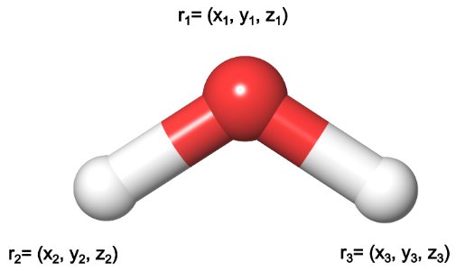
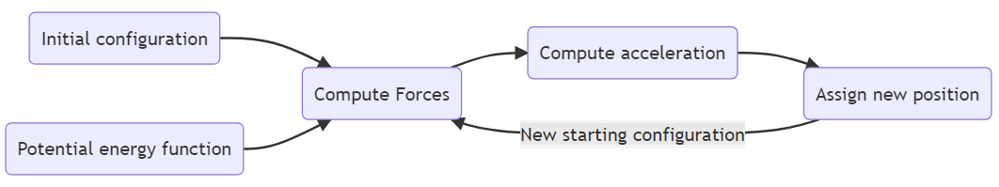
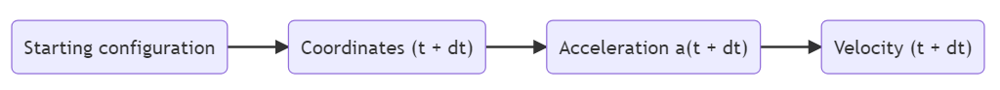
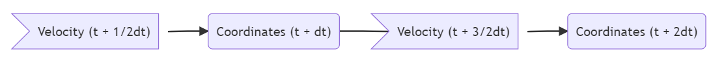

# 运动方程

- [运动方程](#运动方程)
  - [简介](#简介)
  - [运行方程积分](#运行方程积分)
  - [MD 算法总结](#md-算法总结)
  - [Verlet 算法](#verlet-算法)
  - [Velocity Verlet](#velocity-verlet)
  - [Leapfrog 算法](#leapfrog-算法)
  - [MD 模拟时更改积分方法](#md-模拟时更改积分方法)
  - [时间步长和约束条件](#时间步长和约束条件)
  - [参考](#参考)

Last updated: 2022-11-22, 10:25
****

## 简介

分子动力学（MD）是一种强大的计算技术，用于描述给定分子系统如何随着时间演化。

下面介绍如何通过牛顿运动定律获得分子的轨迹。

## 运行方程积分

分子由原子组成，在时刻 $t$，包含 $N$ 个原子的分子结构 $R$ 可以表示为 $N$ 个原子位置 $r_N$ 的函数。

$$R=(r_1,r_2,...,r_N)$$

例如，水分子的结构可以由三个原子的坐标描述：

对每个原子使用牛顿运动定律（$F=ma$），获得系统的连续构型。

**重点**

- 加速度 $a$ 是位置 $r$ 相对时间 $t$ 的二阶导数，即
  
$$F_i=m_i\frac{\partial^2r_i}{\partial t^2}$$

其中 $F_i$ 表示作用在第 $i$ 个原子上的力。

- 力是势能对位置的导数

$$F_i=-\frac{\partial V}{\partial r_i}$$

对由两个以上原子组成的系统，无法得到运动方程的解析解。因此，只能用数值方法有限差分解上述方程。

该方法的主要思想是，将整个过程划分为许多小的时间步 $\delta t$。时间步必须足够小，才能正确描述感兴趣的过程。由于分子运动一般在 $10^{-14}$ 秒量级，所以 $\delta t$ 一般选择飞秒（$10^{-15}$） 秒量级。

在每个时间步 $t$，对 $N$ 个方程同时求解，并确定作用于每个原子的力 $(F_1,...,F_N)$。根据力，计算加速度：

$$a_i=\frac{F_i}{m_i}=-\frac{1}{m_i}\frac{\partial V}{\partial r_i}$$

最后，感觉分子在 $t$ 时刻的位置、速度和加速度，能够预测下一个时间步（$t+\delta t$）的位置和速度。该步骤重复很多次，生成一个轨迹，轨迹包含指定粒子的位置和速度随时间的变化。

轨迹并不连续，而是不同时间步上的一系列构型。

## MD 算法总结

1. **初始条件**

提供系统的初始配置，包括原子在时间 $t$ 时的位置 $r_i$、速度 $v_i$，计算相互作用产生的势能 $V$。

2. **计算力**

作用在每个原子上的力从 $V$ 计算。这是最耗时的步骤，力产生于原子间的相互作用，并依赖于各种[参数](mm.md)。

$$F_i=-\frac{\partial V}{\partial r_i}$$

3. **计算新的配置**

通过求解牛顿运行方程，得到原子在下一个时间步 $t+\delta t$ 的位置：

$$a_i=\frac{F_i}{m_i}$$

4. **迭代**

根据需要，重复以上过程。

## Verlet 算法

要获得分子的运动轨迹，就必须能够对运动方程进行积分。那么，如何对实现对运动方程进行积分？

**核心算法**：分子在 $t+\delta t$ 时刻的位置和动力学性质可以通过 $t$ 时刻的泰勒展开来近似。

$$r(t+\delta t)=r(t)+\delta tv(t)+\frac{1}{2}\delta t^2a(t)+\frac{1}{6}\delta t^3b(t)+\cdots$$

$$v(t+\delta t)=v(t)+\delta ta(t)+\frac{1}{2}\delta t^2b(t)+\cdots$$

$$a(t+\delta t)=a(t)+\delta tb(t)+\cdots$$

其中 $v$ 是速度，$a$ 是加速度，$b$ 是位置对时间的三阶导数，以此类推。$t$ 越小，这种近似效果更好。

有许多整合牛顿方程的算法，提供对分子运动的模拟。其中 Verlet 算法是应用最广泛的数值算法。

根据当前位置 $r(t)$ 和加速度 $a(t)$，以及上一步的位置 $r(t-\delta t)$，计算下一步的位置 $r(t+\delta t)$。即泰勒展开：

$$r(t+\delta t)=r(t)+\delta tv(t)+\frac{1}{2}\delta t^2a(t)+\cdots$$

$$r(t-\delta t)=r(t)-\delta tv(t)+\frac{1}{2}\delta t^2a(t)+\cdots$$

两个式子相加：

$$r(t+\delta t)=2r(t)-r(t-\delta t)+\delta t^2a(t)$$

这就是 Verlet 算法的基本形式。

根据该原理，如果想知道一个原子在 $r(t+\delta t)$ 的位置，只需要知道该原子当前位置 $r(t)$、上一个时刻的位置 $r(t-\delta t)$ 以及当前加速度 $a(t)$。

Verlet 算法有两个缺点：

1. 方程中没有明确包含速度 $v(t)$，需要通过额外计算获得。

描述分子的轨迹并不需要速度，但有时计算系统的一些物理性质（如动能）需要速度。估计速度的最基本方法是使用中值定理。计算 $v=\Delta r/\Delta T$。

$$v(t)=\frac{r(t+\delta t)-r(t-\delta t)}{2\delta t}$$

$$v(t+\delta t)=\frac{r(t+\delta t)-r(t)}{\delta t}$$

这种计算方法的误差较大。

2. 基本的 Verlet 算法需要上一步的位置，所以它不是一个自启动算法。

因此，在 $t=0$ 时，上个位置 $r(t-\delta t)$ 需要通过其他方法获得。

为了克服 Verlet 算法的不足，开发了几种变体。

## Velocity Verlet

Velocity Verlet 方法是 MD 模拟中应用最广泛的方法之一。它采用位置和速度的泰勒展开：

$$r(t + \delta t) = r(t) + \delta t v(t) + \frac{1}{2} \delta t^2 a(t)$$

$$v(t+ \delta t) = v(t) +  \frac{1}{2}\delta t\big[a(t) + a(t + \delta t)\big]$$

它可以使用当前位置 $r(t)$、速度 $v(t)$ 和加速度 $a(t)$ 来计算分子的运动。

整个过程分为三步：

1. 使用当前位置、速度和加速度获得下一个时间步的位置 $r(t+\delta t)$
2. 更新系统配置后，根据作用在原子上的新力计算加速度 $a(t+\delta t)$
3. 用 $a(t+\delta t)$ 计算速度 $v(t+\delta t)$

## Leapfrog 算法

Leap frog 是另一种常见用法，它基于当前位置和 $t+\frac{1}{2}t$ 的速度计算：

$$v\left(t+ \frac{1}{2}\delta t\right) = v\left(t- \frac{1}{2}\delta t\right) +\delta ta(t)$$

$$r(t + \delta t) = r(t) + \delta t v  \left(t + \frac{1}{2}\delta t \right)$$

和 Verlet 算法的主要区别在于，其坐标和速度的更新不同步。首先计算 $t+\frac{1}{2}\delta t$ 时刻的速度，然后使用这个信息计算下一个时间步 $t+\delta t$ 的位置。

然后，速度在位置上再次跳跃，计算 $t+\frac{3}{2}\delta t$ 的速度，并以此计算位置 $r(t+2\delta t)$。

重复该步骤，获得分子轨迹。由于速度和位置互相跳过，因此得名“跳蛙”。

## MD 模拟时更改积分方法

MD 模拟实验包含许多步骤，在此过程中在不同系综中进行模拟。

需要注意的是，在模拟过程中不能在 Verlet 和 Leap Frog 之间进行切换。

其原因在于，两个积分器在每个时间步上存储的速度是不同的。

|积分器|坐标和速度|
|---|---|
|Velocity Verlet|$[r_{t=0}, v_{t=0}], [r_{t=1}, v_{t=1}], [r_{t=2}, v_{t=2}],[r_{t=3}, v_{t=3}]$|
|Leap Frog|$[r_{t=0}, v_{t=0,5}], [r_{t=1}, v_{t=1,5}], [r_{t=2}, v_{t=2,5}],[r_{t=3}, v_{t=3,5}]$|

可以看到，在每个时间步上两个积分器存储的位置相同，但是速度不同。

这将导致模拟中的不连续，相当于给系统分配新的速度。换句话说，之前做的平衡步骤就失效了。

## 时间步长和约束条件

在分子动力学中，运动过程被划为成有限的时间步长。MD模拟的模拟时间 $T$ 是时间步长 $\delta T$ 和步数$N_t$的乘积:

$$T = N_t \delta t$$

要描述分子的运动，时间步长要足够小。即时间步长要能够描述分子内的最快运动。

在生物系统中，最快的运动是氢原子与重原子（如碳）连接键的振荡。$C-H$ 的振荡周期大概为 $10 fs$。因此，MD 要描述这种运动，其积分步长应该也在 $fs$ 级别。

时间步长的选择取决于所需的数值精度和积分算法。默认选择 1fs，足以避免严重的能量泄露，提供足够精度的轨迹。

如果对最快的键振荡不感兴趣，则可以采用更大的时间步长。有点类似于系统的粗粒化，更大的时间步长作为振荡运动的滤波器。将共价 H 原子的键长限制为平均键长在 MD 中是一种常见做法，此时可以采用 2fs 的时间步长。

为了在模拟中约束键长，需要修改运动方程。已有许多相关算法，常见的有：

- **SETTLE**：主要用来约束水分子，因为模拟盒子中水分子往往占大部分；
- **SHAKE**：将键长重置为约束值的迭代算法，也适用于大分子；
- **LINCS** (LINear Constraint Solver)：比 SHAKE 快，但不能限制键角。

## 参考

- https://www.compchems.com/molecular-dynamics-equations-of-motion/
- https://manual.gromacs.org/current/reference-manual/algorithms/constraint-algorithms.html
