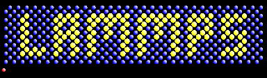

# 分子动力学

- [分子动力学](#分子动力学)
  - [简介](#简介)
  - [分子动力学的优缺点](#分子动力学的优缺点)
  - [计算原子运动](#计算原子运动)
  - [计算力](#计算力)
  - [模拟步骤](#模拟步骤)
  - [MD 模拟软件](#md-模拟软件)
    - [GROMACS](#gromacs)
    - [AMBER](#amber)
    - [NAMD](#namd)
    - [LAMMPS](#lammps)
    - [CHARMM](#charmm)
  - [参考](#参考)

Last updated: 2022-11-21, 13:53
****

## 简介

单纯的结构信息往往不足以预测复杂分子（如蛋白质）的功能。计算化学面临的挑战之一是描述分子系统随时间的演化，从而获得从静态三维结构无法获得的性质。

为了研究分子的动力学性质，使用一种称为分子动力学（Molecular Dynamics, MD）的技术。使用该技术可以观察特定分子系统（如蛋白质）如何在原子间的相互作用力下运动。

下面提供该技术的总体概览。

## 分子动力学的优缺点

MD 是一个非常强大的工具。

首先，相对现有实验技术，MD 可以在**更高程度上控制实验条件**。MD 能完全控制所有可能的参数，能使用不同的方式扰动系统。对一个蛋白质，我们可以选择它的初始构象、与它结合的配体，可以进行突变、改变质子化状态、调节温度等等。

MD 另一个优势是，可以在每个时间步记录下每个原子的位置，从而可以更详细地描述系统从一种构型演变到另一种构型的过程。从某种意义上说，MD 可以看作是一种 “计算显微镜”，使我们能够在原子水平上可视化分子行为。

因此，MD 模拟被用于在原子水平上分析分子系统性质，以获得使用标准实验无法获得的信息。

但是，MD 也存在一些缺陷。首先，MD 非常需要计算资源，受计算资源限制，MD 目前只能处理：

- 发生在微妙级 $10^{-6}$ s 的过程；
- 纳米级的小系统 $10^{-9}$ m。这意味着最多可以建立包含数千个分子的系统。

另外，这种通过计算获取信息的方式本质上是模型驱动的，其建模效果高度依赖于想要模拟的系统的可用模型的质量。

MD 模拟的结果并不总是那么有意义，最终还是需要通过实验验证。理想情况下，模拟应该与实验结合使用，将通过实验分析得到的宏观描述与 MD 模拟得到的原子描述结合分析。

**优点**：

- 实验条件高度可控
- 在原子水平上可视化分子行为

**缺点**：

- 只能对小时间尺度的小型系统进行分析
- 结果质量取决于模型的质量
- 通常需要实验验证

## 计算原子运动

MD 通过求解一组原子的经典运动方程获得分子的运动轨迹（trajectory），实现对原子运动的建模。

给定系统的初始条件，利用牛顿第二定律（$F=ma$）计算作用在每个原子上的加速度。然后在每个时间步计算原子的速度和当前位置，从而模拟分子的运动。

不过，解运行方程并不是一件容易的事。对包含成千上万个原子的系统，要找到运动方程的解析解基本不可能，只能找到数值解，其中 **Verlet** 和 **leap-frog** 是使用最广泛的两个算法。

为了避免数值问题，需要选择一个足够小的时间步长，通常使用 1 或 2 fs ($10^{-15}$ s)。即每解一次方程，模拟向前推进 1fs 或 2fs。这样 1ns 的模拟就需要解方程 100 万次运行方程。

## 计算力

MD 中分子的运动由原子间的相互作用力驱动。因此，MD 模拟的一个基本问题是如何计算这些力。

这些相互作用可以在不同理论层次获得，如何选择取决于要研究系统的大小和模拟的时间尺度。

基于量子力学的严格描述（从头计算），考虑了原子的量子力学特性，计算精度高，但是计算成本更高。

而分子力学忽略了分子的量子力学特性，使用简单的 "球-弹簧" 模型描述分子，这种经典力学描述可以大大加快计算过程。

在准确性和计算成本之间进行合理的折中，实现在 $ns$/$\mu s$ 尺度处理相当大的系统，这通常足以获得系统相关的一些有用信息。

如果对更大的系统或更长时间尺度的过程感兴趣，就需要使用粗粒度（Coarse-Grained, **CG**）力场，该方式进一步简化力的计算，计算速度更快，从而可以在合理的时间内获得有用的信息。

## 模拟步骤

模拟一个分子的真实行为需要多个不同的步骤。MD 模拟的步骤与实验分析类似。首先，要选择一个模型，并使其达到所需的条件，然后在系统平衡后继续实际的分析。

MD 模拟解运行方程直到系统收敛到一个稳定结构（势能最低），此时可以获得系统的一些信息。

所需属性往往是一定时间窗口获得结果的平均值。计算平均的时间窗口越长，获得的属性值越准确。

在传统 MD 模拟中，总能量和总动量是守恒的。因此，可以假设测量是在正则系综（NVE）中进行的，NVE 的粒子数（N）、体积（V）和总能量 (E)是恒定的。

正则系综并不总适合进行实验，在真实实验室中，绝大多数反应是在恒定压力（P）下进行的，所以还有等温等压系统（NPT）。

## MD 模拟软件

目前有许多 MD 模拟软件，一般都需要熟练掌握终端才能很好使用。另外，还需要可视化软件（如 VMD）来分析分子轨迹。

### [GROMACS](https://www.gromacs.org/)

GROMACS 免费开源，可用于 MD 模拟，以及从系统的轨迹中提取数据。

主要为蛋白质、核酸和脂类等大型生物分子系统设计，速度快。

### [AMBER](https://ambermd.org/)

Amber 有两个含义，有一个分子模拟软件叫作 Amber，还有一组用于生物分子模拟的力场也叫 Amber。

Amber 软件分为两部分：AmberTools 和 Amber。其中 AmberTools 可以免费使用，而 Amber 则需要 license。

### [NAMD](https://www.ks.uiuc.edu/Research/namd/)

NAMD 是一个专门为生物大分子系统设计的并行分子动力学软件。

它使用 VMD 建立分子模拟、并分析其轨迹。

### [LAMMPS](https://www.lammps.org/)

LAMMPS 是一种经典的分子动力学软件，用于模拟液体、固体或气体状态下的粒子集合。

LAMMPS 广泛用于各种各样系统的建模，包括聚合物、生物分子、固体和粗粒度系统。

### [CHARMM](https://www.charmm.org/)

CHARM 是一个应用于多粒子系统的分子建模程序，包含全面的能量函数、多种增强采用方法，并支持多尺度技术，包括 QM/MM、MM/CG 和一系列隐式溶剂模型。

## 参考

- https://www.compchems.com/molecular-dynamics-md/
