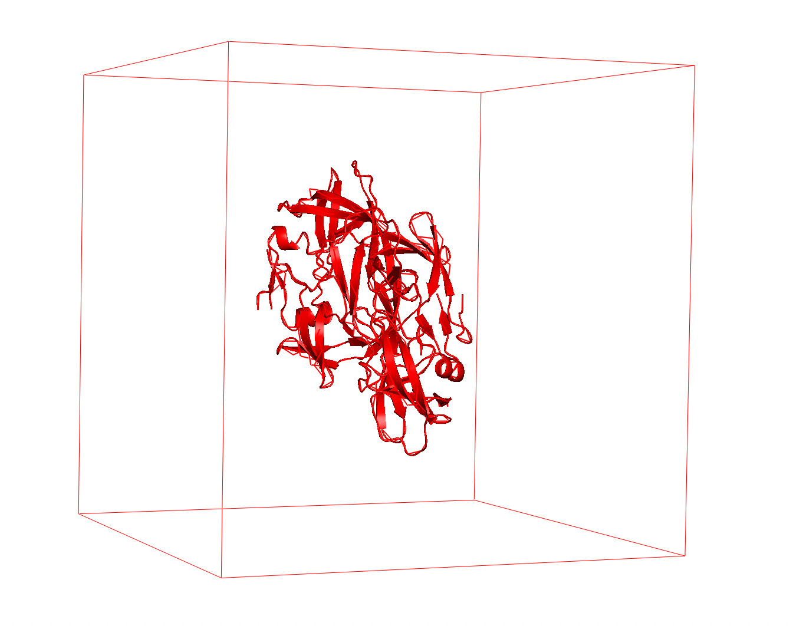
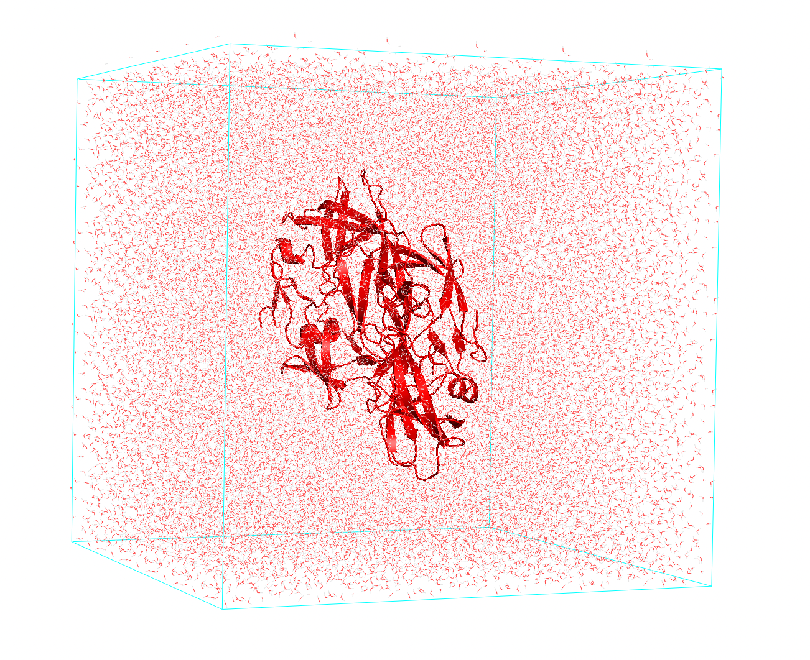
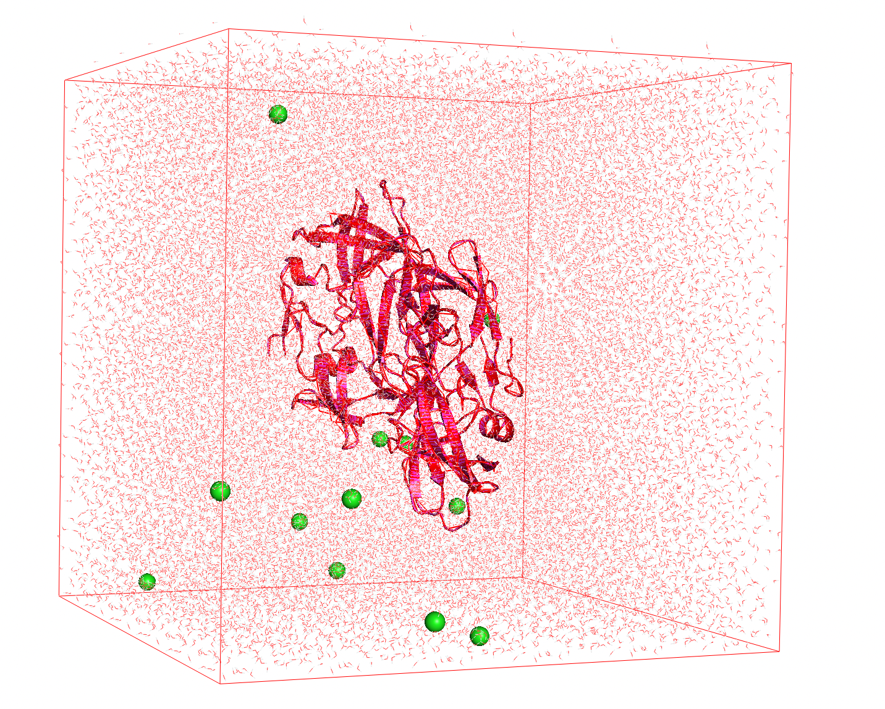
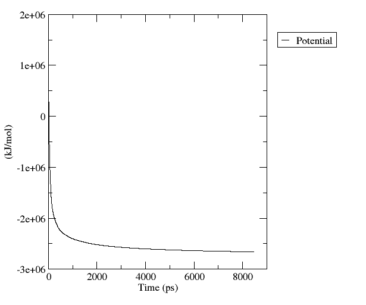
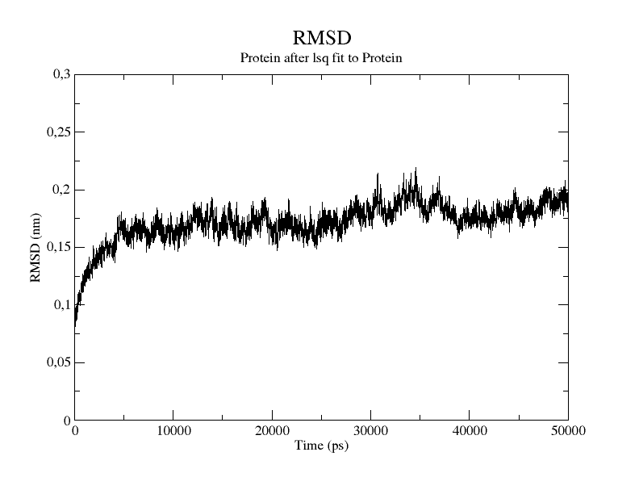

# 动力学模拟步骤

- [动力学模拟步骤](#动力学模拟步骤)
  - [简介](#简介)
  - [模拟前准备](#模拟前准备)
  - [模拟设置](#模拟设置)
  - [准备系统](#准备系统)
  - [最小化](#最小化)
  - [平衡](#平衡)
  - [生产运行](#生产运行)
  - [参考](#参考)

Last updated: 2022-11-22, 17:31
****

## 简介

下面介绍分子动力学模拟的典型步骤。需要谨记的是，MD 模拟策略依赖于待模拟系统的性质。

## 模拟前准备

在开始模拟前，要确定三点：

1. 选择能量模型
2. 选择软件
3. 选择力场

**1. 能量模型**

选择合适的能量模型描述原子间的相互作用，主要取决于系统的大小。

建模大分子，为了降低计算量，可以使用分子力学或粗粒度力场；对小分子，则可以选择基于量子力学的方法，即从头计算。

近年来，发展了一类混合方法，如 QM/MM、MM/CG，是一个有前途的模拟方法。

**2. 软件**

比较流行的有：

- GROMACS
- Amber
- NAMD
- LAMMPS
- CHARMM

功能大同小异，可根据个人喜好选择。

**3. 力场**

根据系统类型选择合适的力场。搜索文献，查看哪类力场适合你的领域。另外，要检查力场和分子模拟软件之间的兼容性。

## 模拟设置

分子动力学模拟主要分为四个步骤：

1. 准备系统
2. 最小化
3. 平衡
4. 生成

## 准备系统

MD 模拟的第一步是准备要分析的系统。系统的初始配置很重要，初始结构不精确可能导致后续步骤出错。

初始结构可以通过实验或计算技术获得，也可以结合这两种方法。理想情况下，有一个接近平衡构型的初始结构，这样可以减少平衡步骤稳定系统所需时间。

得到初始结构后，还需要一些额外步骤：

- **设置模拟盒子**：首先需要设置一个包含分子的虚拟盒子，实现 pbc 来模拟它的 bulk 属性。

- **溶剂化**：第二步，溶剂化系统，例如以 $H_2O$ 为溶剂

- **中和**：使系统电荷为零。通过适当的离子（$Na^+$, $Cl^-$）取代溶剂分子来平衡电荷

## 最小化

通过最陡下降法（steepest descent）最小化系统的能量。其目的是通过调整蛋白质的坐标来最小化能量，以避免原子之间的冲突（原子位置的冲突会提高系统能量）。最小化步骤的每一步对应一组不同的坐标，对应了一个蛋白势能：

最小化步骤只是优化的一个步骤，不考虑动能，直接最小化势能。因此还需要继续优化系统。

在生产运行前，要必须确定原子的初速度。初速度 $v_u$ 从麦克斯韦-玻尔兹曼分布中选取：

$$P(v_i) = \sqrt{\frac{m_i}{2\pi k_b T}} \exp \left(-\frac{m_i v_i^2}{2k_B T}\right)$$

其中 $P(v_i)$ 是质量为 $m_i$ 的原子 $i$ 在温度 T 速度为 $v_i$ 的概率。当然，调整速度要保证系统的总动量为零，防止模拟盒子跑了。

## 平衡

平衡阶段，从上一步的最小化构型开始，根据模拟选择的系统类型，检测特定参数，直到这些参数达到稳定的值。

出于稳定性的考虑，在开始生产模拟前，通常至少需要来一次温度平衡和压力平衡。第一步恒温平衡（NVT），即在恒定体积（V）和温度（T）下进行一次简短的模拟，而压力（P）会改变。

然后平衡压力（NPT 系综）。即保持压力和温度不变，确保生产运行系统的密度合适。

在平衡过程中，有许多其它的参数可以考虑，如温度、压力、体积、动能、势能和总能量。在模拟实验过程中，这些量允许波动，但不应该过分偏离初始结构。

**均方根偏差**（Root Mean Square Deviation, RMSD）是检查系统是否达到平衡的一个重要指标。绘制 RMSD 相对时间的函数，可以看到系统的结构偏离原始构型的程度。如果 RMSD 只是在固定值附近波动，说明系统处于平衡几何状态，就可以放心进入下一阶段。RMSD 曲线类似于下图：

> RMSD 先迅速增加，表明蛋白质在模拟开始时结构变化较大。在 5000 ps 后，蛋白质达到稳定结构，RMSD 基本不变。

## 生产运行

MD 模拟的最后一步是生产运行。这个过程仍然是在某个系综（NPT 或 NVT）内进行。因为实验室中的反应一般是在恒压下进行，因此首选 NPT 系综。

这一步与平衡步骤的主要区别在于，该阶段我们对平衡系统不感兴趣，而是收集分子的数据，生成一个描述分子运动的轨迹：

1. 用分子可视化软件观察结构变化；
2. 研究分子的行为和性质。

## 参考

- https://www.compchems.com/setting-up-a-molecular-dynamics-simulation/
