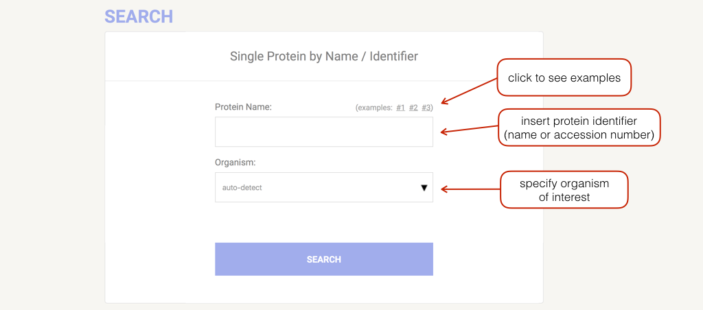

# STRING 入门

## 起点

在 STRING 首页使用输入表单指定分析起点，支持的输入包括：

- Protein by name
- Protein by sequence
- Multiple proteins
- Multiple sequences
- Organisms
- Protein families (COGs)
- Examples
- Random entry

可以使用单个蛋白质名称、多个名称或氨基酸序列搜索。系统还提供了一些输入示例和一个随机输入生成器，该生成器会随机挑选一个具有至少 4 个中等以上置信度预测链接的蛋白质。可以通过物种输入框来确认你感兴趣的物种是否可用。除了搜索单一物种的特定蛋白质，还可以通过搜索 COGs (**直系同源群**)来按蛋白质家族进行搜索。

一般只需要提供蛋白质名称或标识符。点击下拉箭头或在相应的输入框中直接输入名称来选择物种。此外，也可以使用涵盖多个物种的通用分类（例如哺乳动物（Mammals）或 "Chordata"）。

## Network

## 参考

- https://string-db.org/cgi/help?sessionId=b73g9j9Nw1lA