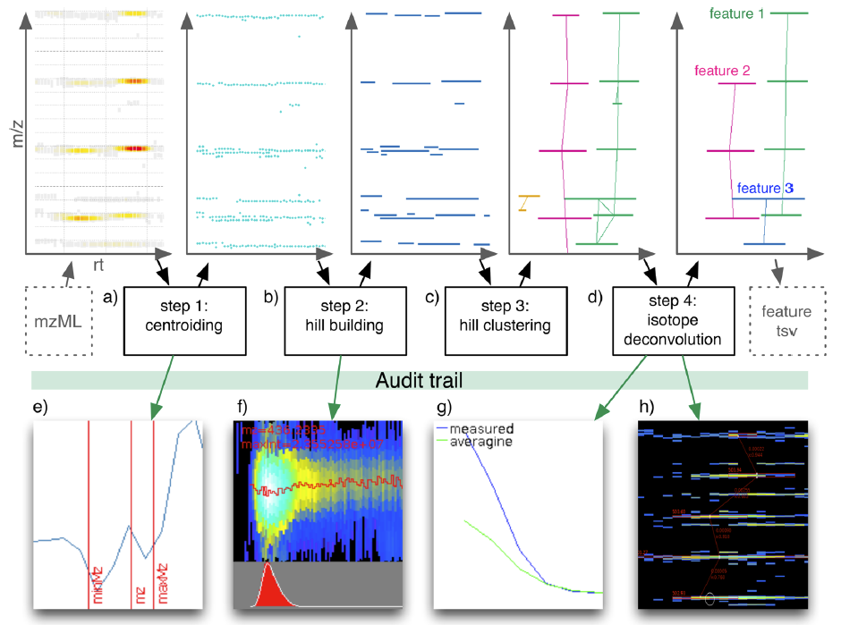

# Dinosaur: A Refined Open-Source Peptide MS Feature Detector

- [Dinosaur: A Refined Open-Source Peptide MS Feature Detector](#dinosaur-a-refined-open-source-peptide-ms-feature-detector)
  - [实验](#实验)
  - [结果](#结果)
    - [算法实现](#算法实现)
  - [参考](#参考)

***

## 实验

## 结果

### 算法实现

> Figure 1. Dinosaur 特征检测算法概览。特征检测包括(a) MS1 谱图质心化（centroiding）；(b) 将 centroid peaks 组合成

## 参考

- Teleman,J. et al. (2016) Dinosaur: A Refined Open-Source Peptide MS Feature Detector. J. Proteome Res., 15, 2143–2151.
