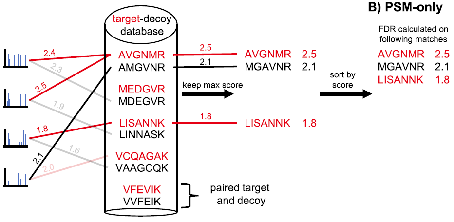
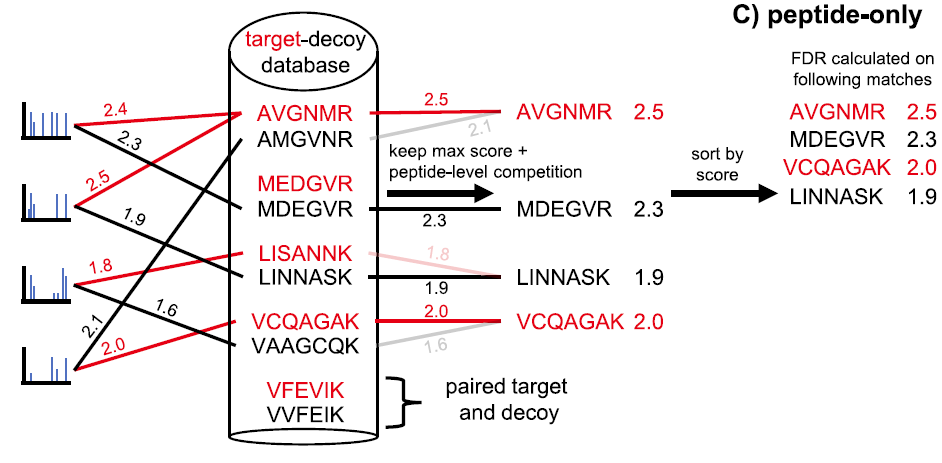
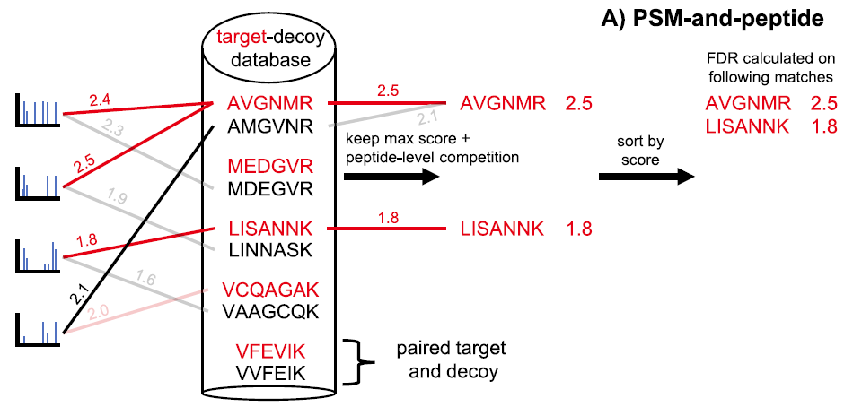

# Peptide FDR

- [Peptide FDR](#peptide-fdr)
  - [PSM-Level TDC](#psm-level-tdc)
  - [PSM Only](#psm-only)
  - [Peptide-Only](#peptide-only)
  - [PSM-and-Peptide](#psm-and-peptide)
  - [反库构建策略](#反库构建策略)
  - [Entrapment 实验](#entrapment-实验)
  - [参考](#参考)

## PSM-Level TDC

target-decoy competition (TDC)

|变量|说明|
|---|---|
|$S$|谱图|
|$n$|谱图数|
|$T$|target 数据库|
|$D$|decoy 数据库|
|$\alpha$|FDR 阈值|

对每张谱图，只保留 top 打分 PSM。

匹配 target 肽段的 PSM 的打分依次为 $t_1, t_2,...,t_{m_t}$；匹配 decoy 肽段的 PSM 的打分依次为 $d_1, d_2,...,d_{m_d}$。其中 $m_t+m_d=n$。

打分值大于 $\tau$ 的 PSM 的 FDR 计算公式如下（假设打分值越大越好）：

$$\widehat{FDR}(\tau)=min(1, \frac{\lvert {d_i \ge \tau; i=1,...,m_d}\rvert +1}{\lvert {t_i \ge \tau; i=1,...,m_t}\rvert}) \tag{1}$$

分母表示 target PSM 数，分子表示 decoy PSM 数。

在实践中，通常不提前指定打分阈值 $\tau$，而是指定所需的 FDR 阈值 $\alpha$，然后根据 $\alpha$ 计算最低的打分阈值 $\tau$ 使得 $FDR\le \alpha$：

$$\tau(\alpha)=min\{t_i: \widehat{FDR}(t_i)\le \alpha\} \tag{2}$$

公式 (1) 与 Gygi^[Elias,J.E. and Gygi,S.P. (2007) Target-decoy search strategy for increased confidence in large-scale protein identifications by mass spectrometry. Nature Methods, 4, 207–214.] 计算 FDR 的公式有三点不同：

1. Gygi 公式的分子是 2 倍 decoy PSM 数，分母是 target 和 decoy PSM 数的加和，这种方式控制 target 和 decoy PSM 并集的 FDR，但在实践中，通常只需要控制 target PSM FDR;
2. 公式 (1) 的分子多了一个 +1，该修正是为了有效计算 FDR。在实践中，这个 +1 的效果几乎可以忽略不计，除非获得的 PSM 很少，或需要非常严格的 FDR 阈值。
3. 公式 (1) 包含了一个 min 操作，以确保不会出现 FDR>1

## PSM Only

对每条肽段序列，只保留打分最高的 PSM。然后按照公式 (1) 和 (2) 计算 FDR，其中 $t_i$ 和 $d_i$ 替换为肽段打分。

## Peptide-Only

Peptide-Only 在肽段层次也引入了竞争机制，即对每个 target 肽段及其 decoy 肽段，只保留高打分的一个。

该方法与 PSM-and-Peptide 的差别在于，PSM-and-Peptide 对 concatenated target-decoy 数据库检索，每张谱图只保留最佳肽段。而 Peptide-Only 没有 PSM-level 竞争，即每张谱图单独对 target 和 decoy 数据库检索，对 target 和 decoy 各保留一个最佳 PSM。

两种方法都给肽段分配一个分数，即肽段打分最高 PSM 的打分。然后两个方法都对 target-decoy 肽段对进行肽段竞争。余下部分和 PSM-only 方法一样。

## PSM-and-Peptide

PSM-and-Peptide 对 concatenated target-decoy 数据库检索，每张谱图只保留最佳肽段。再给肽段分配一个分数，即肽段打分最高 PSM 的打分，然后对 target-decoy 肽段对进行肽段竞争。余下部分和 PSM-only 方法一样。

## 反库构建策略

对每条肽段序列，N-端和 C-端氨基酸保持不变，中间的残基洗牌。

## Entrapment 实验

在数据库检索时，数据库中除了样本中可能包含的蛋白序列，还额外包含一组样本中没有的蛋白序列。

即 target 数据库中加入了一组所谓的诱捕序列（entrapment），即被分析样品中不存在的序列。通常这些序列来自另一个物种的蛋白质组，且不与 decoy 序列混合，如果使用 TDC，则对整个 target 库（包括诱捕序列）生成 decoy 序列。

## 参考

- Lin,A. et al. (2022) Improving Peptide-Level Mass Spectrometry Analysis via Double Competition. J Proteome Res, 21, 2412–2420.
