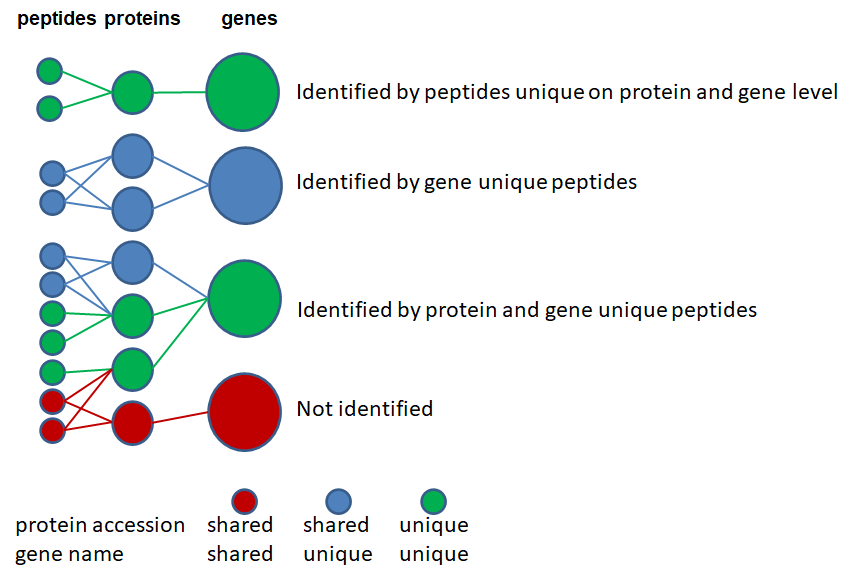

# Picked Protein FDR

- [Picked Protein FDR](#picked-protein-fdr)
  - [打分归一化](#打分归一化)
  - [PCM Q-value 计算](#pcm-q-value-计算)
  - [蛋白推断](#蛋白推断)
  - [计算蛋白打分](#计算蛋白打分)
  - [蛋白 Q-value](#蛋白-q-value)
  - [FDR 计算](#fdr-计算)
  - [Picked Protein FDR 方法](#picked-protein-fdr-方法)
  - [参考](#参考)

***

## 打分归一化

先将所有 PSM 按照长度分组，相同长度的分一组，然后根据打分值进行分组，一个打分点一组，并使用滑动平均进行平滑处理（窗口大小 5），以除去打分算法导致的波动。

对每个打分分组，计算局部 FDR，即用 decoy PSMs 数除以 target PSM 数，然后再对 FDR 进行滑动平均，窗口大小依然用 5.

所有分组中，局部 FDR 小于 0.05 对应的打分，定义为局部肽段长度依赖 cutoff。PSM 的归一化打分由 Mascot ion score 或 Andromeda score 除以对应的 cutoff 获得。

> 对 Percolator 计算得到的 PEP 或 Q-Value，可以不用这个归一化步骤。

## PCM Q-value 计算

Q-value 定义为 PSM、肽段或蛋白的最小 FDR，一般用来过滤数据，使数据集达到特定 FDR。

Picked Protein FDR 不使用所有 PSM，将唯一的价态和肽段（包括修饰）定义为 PCM，每个 PCM 只保留归一化打分最高的 PSM。PCM 根据归一化打分降序排列，然后从上到下计算 q-value 值。

然后，使用 q-value 小于 0.01 的最高和最低打分的 PCM 作为数据点，用线性回归建模 q-value 对数值与打分之间的关系。用模型的斜率和截距重新计算所有的 q-value 值。对 PCM 进行 1% FDR 过滤。

## 蛋白推断

> SFig 1. 归属于特定蛋白 isoform 的肽段称为 protein unique 肽段（绿色）；归属于特定基因的多个蛋白 isoform 的肽段称为 gene unique (蓝色)；这两种肽段都成为 unique 肽段。其它肽段，即归属到不同基因的多个蛋白 isoform 称为 shared 肽段。在蛋白推断时忽略 shared 肽段。

## 计算蛋白打分

对 unique 肽段（protein unique or gene unique），蛋白打分为所有 PCM 的 q-value score (q-value 的 -log10 转换)的加和。

使用给定蛋白的最佳 PCM 打分比 PCM 打分加和效果更好。

## 蛋白 Q-value

蛋白按照打分降序排列，从上到下、从下到上，计算两次 q-value，取最小值。

## FDR 计算

## Picked Protein FDR 方法

picked TDS 策略将相同蛋白的 target 和 decoy 序列看作一对，如果 target 的蛋白打分高于对应的 decoy 蛋白打分，就认为 target 蛋白为鉴定结果，丢弃 decoy 蛋白鉴定。相反，如果 decoy 蛋白序列打分高于 target 蛋白序列，则保留 decoy 蛋白鉴定，丢弃 target 蛋白鉴定。

这样，target 和 decoy 蛋白对蛋白 FDR 的贡献就没有偏差。然后直接用经典方法计算 FDR。

## 参考

- Savitski,M.M. et al. (2015) A Scalable Approach for Protein False Discovery Rate Estimation in Large Proteomic Data Sets[S]. Mol Cell Proteomics, 14, 2394–2404.
