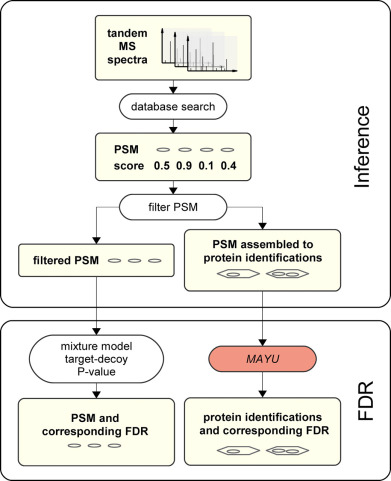
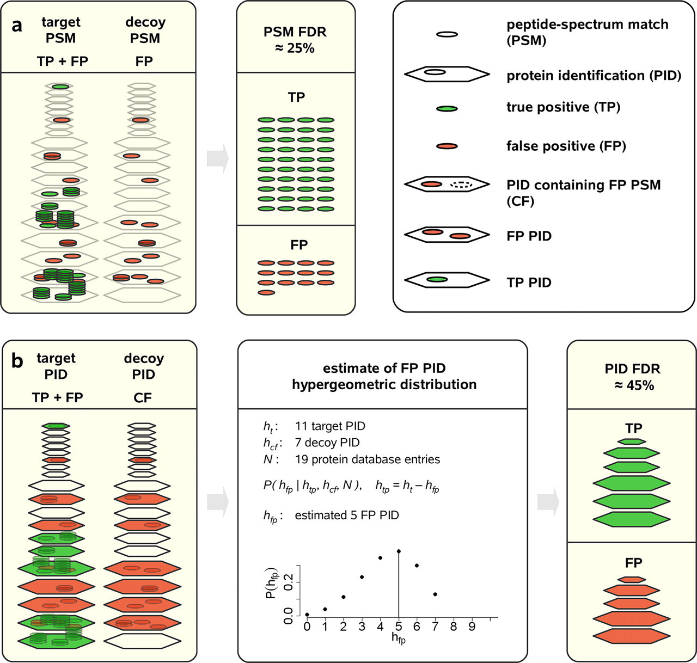

# Protein FDR

- [Protein FDR](#protein-fdr)
  - [简介](#简介)
  - [Mayu](#mayu)
    - [FDR 推导](#fdr-推导)
  - [Picked Protein FDR](#picked-protein-fdr)
    - [肽段长度相关打分归一化](#肽段长度相关打分归一化)
    - [Python 库](#python-库)
  - [参考](#参考)

## 简介

**零假设**（null hypothesis）通常表示观察结果是偶然事件。零假设一般与要推论的问题相反，例如，PSM 的一个常见问题是 “肽段与谱图匹配是否正确？”，零假设的表述为：谱图与肽段的匹配是随机匹配。

获得一组蛋白质的常用方法是从 FDR 过滤后的 PSM 或肽段推断蛋白质，并只报告肽段或 PSM 层次的 FDR。但是，PSM 和肽段水平的 FDR 要远低于蛋白质水平的 FDR。这是因为 target 蛋白的 PSM 和肽段要和 decoy 蛋白多。因此，应该先推断蛋白质，再评估蛋白质水平的 FDR。

## Mayu

> Fig 1. 蛋白推断和 FDR 计算。MS/MS 谱图通过数据库检索，分配得分最高的肽段。对得到的 PSM 根据 PSM FDR 进行过滤。

数据集大小对蛋白质 FDR 的影响较大。

True positive 蛋白标准：

- true positive 蛋白质至少包含一个 true positive PSM
- false positive 蛋白质只包含 false positive PSM

PSM FDR 使用来自 decoy 和 target 数据库的 PSM 比例计算。

> Fig 2. MAYU 蛋白鉴定 FDR 计算。(a) 使用 target-decoy 策略计算 PSM FDR；(b) MAYU 蛋白鉴定（PID） FDR。
> target 数据库鉴定的 PSM 可能是 FP 或 TP。PSM FDR（假阳性 target PSM 的期望比例）可以定义为 decoy PSM 的比例。蛋白质的 FDR 必须要考虑到包含 FP PSMs (CF)的蛋白，为了估计真阳性（$h_{tp}$）和假阳性（$h_{fp}$）蛋白数的期望值，MAYU 实现了一个超几何模型，将 target 蛋白数（$h_t$）、decoy 蛋白数（$h_{cf}$）和数据库中的蛋白总数作为输入。图中的示例表明，PSM FDR (25%) 和蛋白鉴定的 FDR (45%) 可能差别很大。

如果假设包含假阳性 PSM 的蛋白质鉴定在 target 数据库中是均匀分布的，那么假阳性蛋白鉴定为超几何分布（Fig 2b，中间）。

参数：

- target 蛋白鉴定数 $h_t=11$
- decoy 蛋白鉴定数 $h_{cf}=7$
- 数据库中蛋白总数 $N$

需计算值：

- 真阳性蛋白鉴定数的期望值 $h_{tp}$
- 假阳性蛋白鉴定数的期望值 $h_{fp}$

将蛋白质数据库看作一个装球的盒子，每个球代表一个蛋白。绿球代表 TP 蛋白鉴定，余下为白球。抽出 `k` 个白球对应 `k` 个 FP 蛋白鉴定。

将 FP 蛋白数的概率分布指定为超几何分布，然后将 FP 蛋白鉴定数的期望值设置加权平均值（期望值）。蛋白 FDR 为 FP 蛋白的期望值和映射到 target 数据库的蛋白总数的比值。

> single hit: 只有一个 PSM 的蛋白鉴定

根据贝叶斯定律，根据整个蛋白质鉴定的 FDR 来估计 single-hit 蛋白的 FDR。

### FDR 推导

变量：

- *H*：所有蛋白鉴定 
- $H_t$：映射到 target 数据库 $P_t$ 的蛋白
- $H_d$：映射到 decoy 数据库 $P_d$ 的蛋白
- $H_{tp}$：TP 鉴定，至少包含 1 个 TP PSM 的蛋白
- $H_{fp}$：映射到 $P_t$ 的 FP 蛋白，其补集为映射到 decoy 数据库 $P_d$ 的鉴定 $H_d$。FP 蛋白的所有 PSM 为 FP
- $H_{cf}$：映射到 $P_t$ 数据库的蛋白，且至少包含 1 个 FP PSM
- $h$：集合大小 

假设：

- FP PSM 映射到 target 与 decoy 数据库的概率相同。映射到 $P_t$ 的 FP PSM 的期望值可以用映射到 $P_d$ 的 PSM 数来估计
- $P(h_{tp}\vert h_{cf}, \theta_{exp})$ 和 $P(h_t\vert h_{cf},\theta_{exp})$ 一致
- $h_d=h_{cf}$

合理假设 FP PSM 映射到 target 数据库与 decoy 数据库的概率相等，因此直接使用映射到 $P_d$ 的 PSM 数来表示映射到 $P_t$ 的 FP PSM 数。根据 FDR 定义，PSM FDR 可以定义为映射到 $P_d$ 和 $P_t$ 的 PSM 数比例。

给定实验参数 $\theta_{exp}$ 和 $h_t$, $h_{cf}$，计算条件概率 $E[h_{fp}\vert h_t, h_d, \theta_{exp}]$。

$$
\begin{aligned}
E[h_{fp}\vert h_t, h_{cf}, \theta_{exp}] 
&= \sum_{h_{fp}}h_{fp}\cdot P(h_{fp}\vert h_t, h_{cf}, \theta_{exp}) \\
&=
\end{aligned}
$$

$$E[h_{fp}\vert h_t, h_d, \theta_{exp}]$$

## Picked Protein FDR

### 肽段长度相关打分归一化

所有 PSM，先按照长度进行分组，相同长度的 PSM 再按照打分进行分组（一个打分点一组），并使用滑动平均（窗口为 5）。

### Python 库

1. 使用 andromeda2pin 将 Andromeda evidence.txt 转换为 tab 格式 percolator 输入文件
2. 使用 Mokapot (Python 版本的 Percolator) 计算 PEP
3. 计算蛋白 FDR

## 参考

- The,M. et al. (2016) How to talk about protein-level false discovery rates in shotgun proteomics. PROTEOMICS, 16, 2461–2469.
- http://www.matrixscience.com/blog/does-protein-fdr-have-any-meaning.html
