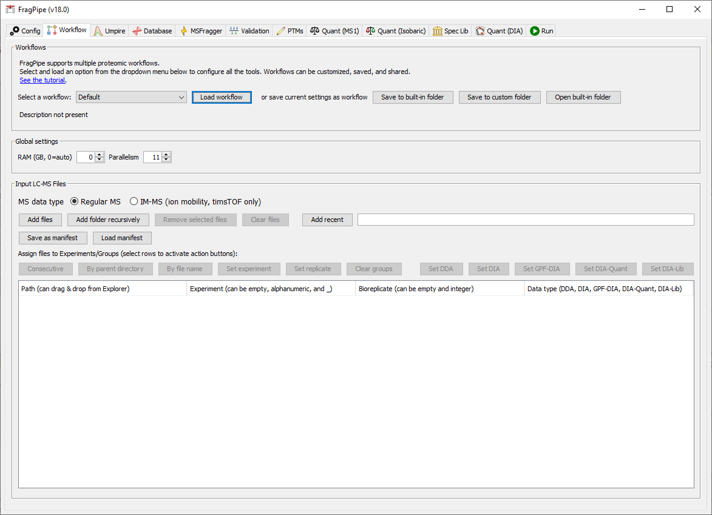

# FragPipe 使用教程

- [FragPipe 使用教程](#fragpipe-使用教程)
  - [简介](#简介)
  - [配置](#配置)
  - [选择工作流并添加谱图文件](#选择工作流并添加谱图文件)
    - [单实验报告](#单实验报告)
    - [多实验报告](#多实验报告)
    - [亲和纯化数据](#亲和纯化数据)
    - [TMT/iTRAQ 数据](#tmtitraq-数据)
  - [DIA-Umpire SE](#dia-umpire-se)
  - [选择数据库](#选择数据库)
  - [配置 MSFragger](#配置-msfragger)
  - [验证](#验证)
  - [PTMs](#ptms)
  - [无标定量](#无标定量)
  - [等重标价定量](#等重标价定量)
  - [生成谱图库](#生成谱图库)
  - 

***

## 简介

FragPipe 完整工作流程可用于各种实验类型，建议从内置工作流程开始分析，然后根据需要进行自定义。如果只使用部分功能，可以取消勾选相应的框来跳过。本教程详细介绍每个选项卡，配置好之后，使用就非常简单了。

在开始前，确保 LC-MS 文件格式与要执行的工作流兼容。支持的格式：

- 对 Thermo 数据，建议将其转换为 mzML 格式；
- DIA 数据使用 [demultiplexing 选项转换为 mzML](https://fragpipe.nesvilab.org/docs/tutorial_convert.html#convert-thermo-dia-raw-files-with-overlappingstaggered-windows)；
- ...

FragPipe 可以在 Windows 和 Linux 系统上运行。对简单的分析可能只需要 8GB RAM，大规模或复杂分析或 timsTOF 数据可能需要 24 GB 或更多 RAM。运行 FragPipe 需要磁盘空间保存分析结果，一般为谱图文件大小的 20-50%。timsTOF 数据的定量需要更多磁盘空间，如果 .d 文件未压缩，一般需要 60% 谱图文件大小，而 Bruker 的压缩文件，则需要 250% 的文件大小。

Linux 用户：需要安装 Mono 才能直接读取 Thermo .raw 文件。

## 配置

启动 FragPipe，第一个选项卡 'Config' 用于配置程序：

1. 配置 MSFragger.jar 程序。使用 "Browser" 设置 MSFragger.jar 路径，如果没有下载，点击 "Download/Update"。
2. 配置 IonQuant.jar 程序，操作同上。
3. 配置 Philosopher，同上
4. （可选）需要 Python 执行数据库拆分（复杂搜索或低内存时需要）和生成谱图库。

## 选择工作流并添加谱图文件

在 'Workflow' 选项卡：

1. 从下拉框选择工作流，然后点击 'Load workflow'。对简单的传统（closed）检索，使用 `Default` 工作流。提供了许多常见的工作流，包括 glyco 和 DIA。我们建议从 fragpipe 提供的工作流开始，然后根据需要进行自定义。自定义工作流可以保存（所有的工作流都保存在 FragPipe 的 `workflows` 目录）。
2. 设置内存和 CPU。RMA 设为 0 表示由 FragPipe 自动设置。注意：在一些高性能计算（HPC）设备上，RAM=0 可能就设置成了 0，建议手动设置。
3. 选择数据文件。可以直接拖进去，也可以点击 `Add files` 或 `Add Folder Recursively`。

> [!NOTE] timsTOF
> 建议使用 raw ddaPASEF 文件（.d 文件），其中 .d 目录为 raw 文件。如果已经使用 MSFragger 分析 .d 文件，将分析结果 .mzBIN 文件放在 .d 文件相同目录，可以加速分析。如果不需要定量，可以使用 mgf 文件。

加载谱图文件后，设置数据类型（DDA, DIA, GPF-DIA, DIA-Quant, DIA-Lib）。鼠标悬停在 'Data type' 上可以查看这些数据类型的简单说明，然后设置 Experiment 和 Bioreplicates, 这些信息会影响输出结果。

### 单实验报告

将 `Experiment` 和 `Bioreplicate` 字段留空，表示将所有输入一起分析，生成单个合并报告，例如，将所有输入数据合并为一个谱图库。

### 多实验报告

如下所示，为每个输入文件设置 `Experiment` 和 `Bioreplicate`，其中每个实验条件包含两个 fraction。相同样本的不同 fractions 应具有相同的 'Experiment'/'Bioreplicate' 名称。

|Path|Experiment|Bioreplicate
|---|---|---|
|run_name_1.mzML|Control|1|
|run_name_2.mzML|Control|1|
|run_name_3.mzML|Control|2|
|run_name_4.mzML|Control|2|
|run_name_5.mzML|Treatment|3|
|run_name_6.mzML|Treatment|3|
|run_name_7.mzML|Treatment|4|
|run_name_8.mzML|Treatment|4|

> [!NOTE]
> 如果需要使用 MSStats 对 FragPipe 结果进行下游统计分析，

### 亲和纯化数据

在分析 AP-MS 相关数据（如 BioID）时，为了与蛋白质相互作用网络评估资源兼容，需要按如下方式命名 `Experiment`：

- 阴性对照：设置为 `Control` 或 `CONTROL`，将生物学重复设置不同的 replicate 编号

### TMT/iTRAQ 数据

## DIA-Umpire SE

DIA-Umpire 的信号提取可用于 .raw 和 .mzML 文件。

## 选择数据库

点击 `Browser` 选择 FASTA 文件作为数据库。

## 配置 MSFragger

在 `MSFragger` 选项卡勾选搜库参数，设置好后可以保存下来，也可以直接保存整个 workflow。

**Calibration and Optimization**

`Calibration and Optimization` 默认设置为 `Mass Calibration, Parameter Optimization`，它会快速执行几个参数不同的简化的 MSFragger 检索，以找到最佳设置。一般来说，它以增加分析时间为代价，提高 5-10% 的 PSM 鉴定量。为了节省时间，可以选择 `Mass Calibration` 或 `None`，如果你很了解数据，可以合理调整 MSFraggeer 参数，则可以这么设置。

> [!NOTE]
> 对复杂检索，如非特异性检索，很多可变修饰的检索，建议使用 database splitting 选项。

**自定义酶切**

将 'Load rules' 设置为 `nonspecific`，自定义剪切规则，然后将 'Cleavage' 设置为 `ENZYMATIC`。

## 验证

## PTMs

## 无标定量

## 等重标价定量

## 生成谱图库

## 