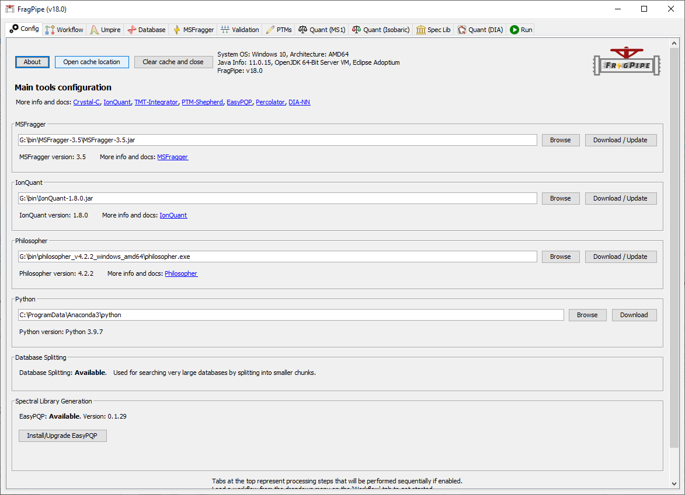
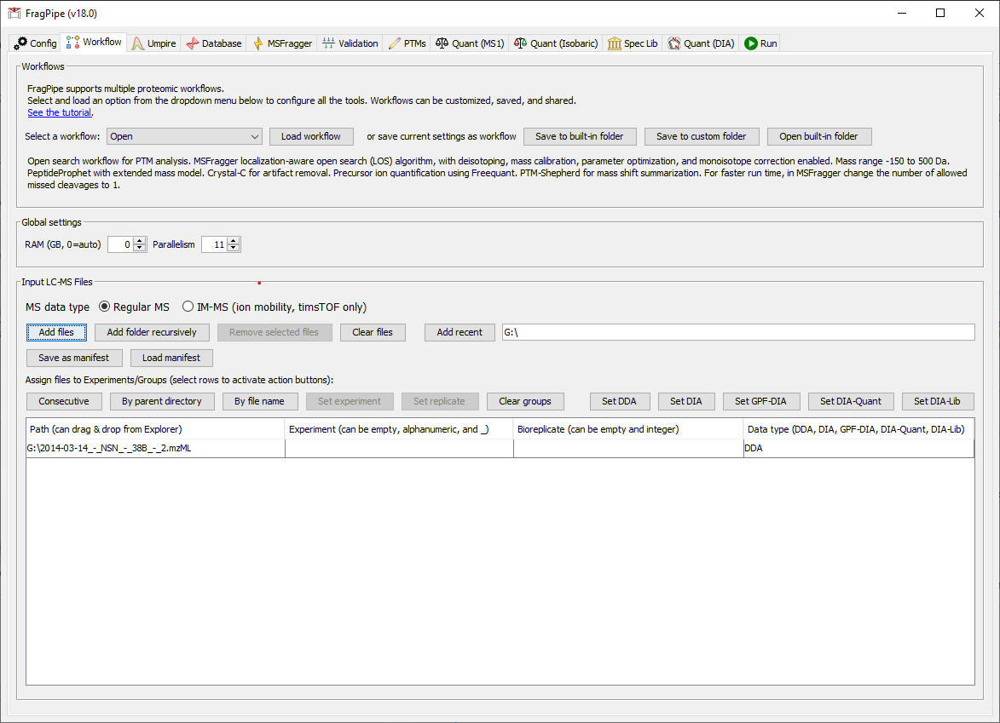
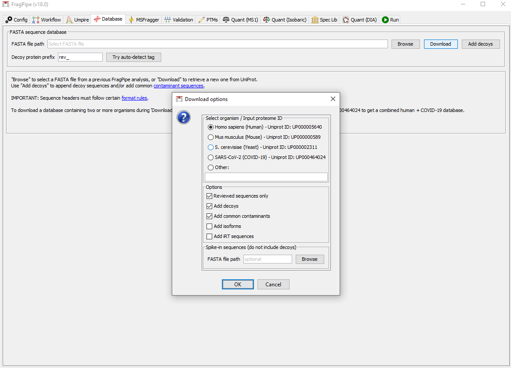
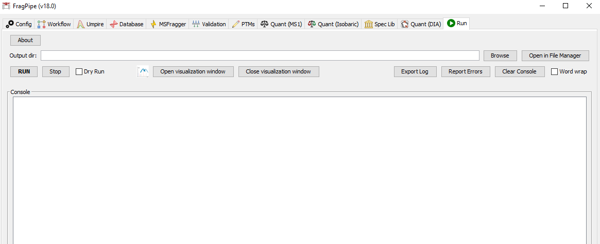

# Open Search

- [Open Search](#open-search)
  - [简介](#简介)
  - [打开 FragPipe](#打开-fragpipe)
  - [添加数据](#添加数据)
  - [加载 workflow](#加载-workflow)
  - [设置序列库](#设置序列库)
  - [检查搜库设置](#检查搜库设置)
  - [设置输出位置](#设置输出位置)
  - [查看结果](#查看结果)
  - [参考](#参考)

@author Jiawei Mao
***

## 简介

Open Search 检索策略允许未修饰肽段序列和实验观察到的母离子之间存在很大的质量差异，从而可以直接从数据发现翻译后修饰（PTM），无需提前指定可变修饰。许多样品处理方法会修饰肽段，从而降低它们在典型搜索中回收的可能性。例如福尔马林固定石蜡包埋（FFPE），一种广泛使用的组织保存方法。

下面演示 Open Search 流程。

## 打开 FragPipe

打开 FragPipe，检查 MSFragger, IonQuant 和 Philosopher 是否配置好。对 Open Search，不需要安装 Python.

## 添加数据

在 Workflow 选项卡，将文件拖入下面的文件框中。

## 加载 workflow

1. FragPipe 内置了许多常见的分析工作流。建议从默认工作流开始，然后根据需要进行修改。选择工作流 'Open'，点击 'Load' 载入工作流。

## 设置序列库

可以下载序列库，也可以选择已下载的 fasta 文件。点击 'Download' 下载数据库。

## 检查搜库设置

在 MSFragger 选项卡，检查搜库参数。注意，母离子的 mass tolerance 设置为 -150 Da 到 +500 Da.

## 设置输出位置

加载 workflow 后，其它选项卡也相应配置好了，可以执行基本的 open search 分析。直接跳到 'RUN' 选项卡，设置输出位置：

点击 'RUN' 开始运行。

## 查看结果

## 参考

- https://fragpipe.nesvilab.org/docs/tutorial_open.html
